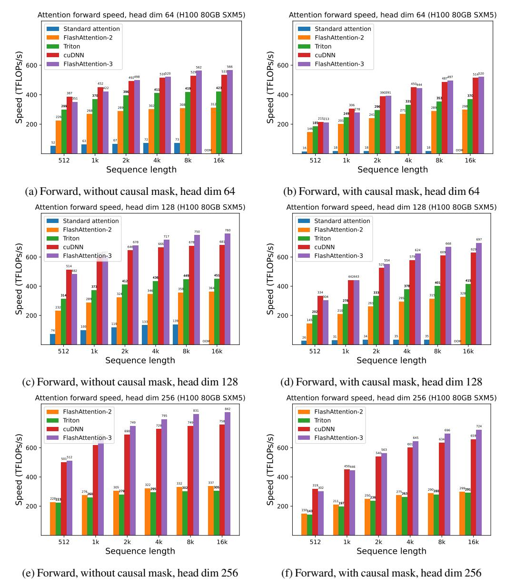
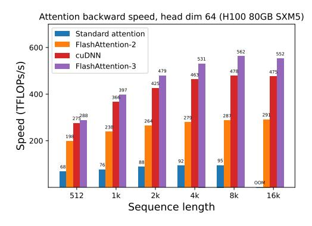
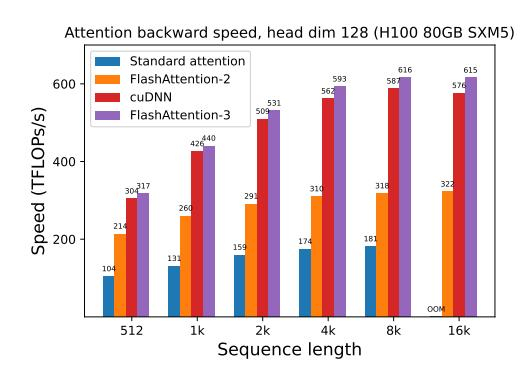
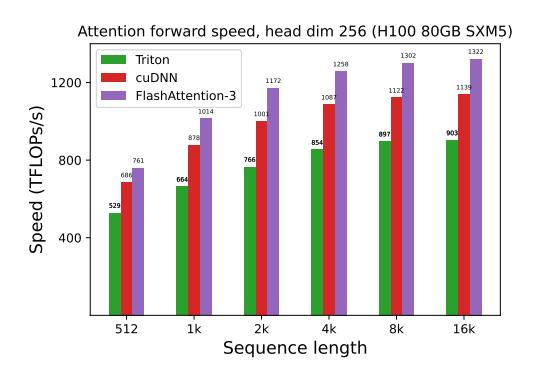
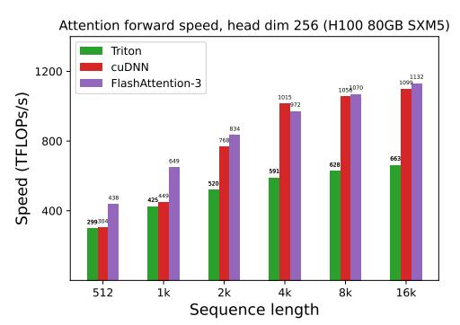

# 4 Empirical Validation

We use the primitives from CUTLASS [56] such as WGMMA and TMA abstractions to implement FLASHATTENTION-3 and evaluate its efficiency and accuracy.

- Benchmarking attention. We measure the runtime of FLASHATTENTION-3 across different sequence lengths and compare it to a standard implementation in PyTorch, FLASHATTENTION-2, FLASHATTENTION-2 in Triton (which uses H100-specific instructions), as well as a vendor's implementation of FLASHATTENTION-2 optimized for H100 GPUs from cuDNN. We confirm that FLASHATTENTION-3 is up to 2.0× faster than FLASHATTENTION-2 and 1.5× faster than FLASHATTENTION-2 in Triton. FLASHATTENTION-3 reaches up to 840 TFLOPs/s, 85% of the theoretical maximum TFLOPs/s on H100 GPUs.
- **Ablation study.** We confirm that our algorithmic improvements with warp-specialization and GEMM-softmax pipelining contribute to the speedup of FLASHATTENTION-3.
- Accuracy of FP8 attention. We validate that block quantization and incoherent processing reduces the numerical error of FP8 FLASHATTENTION-3 by 2.6×.

#### 4.1 Benchmarking Attention

We measure the runtime of different attention methods on an H100 80GB SXM5 GPU for different settings (without / with causal mask, head dimension 64 or 128) for BF16 inputs. We report the results in Fig. 5 and Fig. 6, showing that FLASHATTENTION-3 is around 1.5-2.0× faster than FLASHATTENTION-2 in the forward pass and 1.5-1.75× faster in the backward pass. Compared to a standard attention implementation, FLASHATTENTION-3 can be up to 3-16× faster. For medium and long sequences (1k and above), FLASHATTENTION-3 even surpasses the speed of a vendor's library (cuDNN – closed source) that has been optimized for H100 GPUs.

**Benchmark settings:** We vary the sequence length as 512, 1k, ..., 16k, and set batch size so that the total number of tokens is 16k. We set the hidden dimension to 2048, and head dimension to be either 64, 128, or 256 (i.e., 32 heads, 16 heads, or 8 heads). To calculate the FLOPs of the forward pass, we use:

4·seqlen2·head dimension·number of heads.

With causal masking, we divide this number by 2 to account for the fact that approximately only half of the entries are calculated. To get the FLOPs of the backward pass, we multiply the forward pass FLOPs by 2.5 (since there are 2 matmuls in the forward pass and 5 matmuls in the backward pass, due to recomputation).

We also measure the runtime for FP8 for the forward pass under similar settings. We report the results for headdim 256 in Fig. 7 and give the full results in Appendix C.2.

### 4.2 Ablation Study: 2-Stage Pipelining Experiments

We ablate both the 2-stage WGMMA-softmax pipelining and warp-specialization for non-causal FP16 FLASHATTENTION-3 with fixed parameters {batch, seqlen, nheads, hdim} = {4,8448,16,128}. The result in Table 2 confirms that our algorithmic improvements (asynchrony with warp-specialization and overlapping between GEMM and softmax) lead to significant speedup, from 570 to 661 TFLOPs.

#### 4.3 Numerical Error Validation

As there has been interest in the numerical error [21] of FLASHATTENTION, we compare FLASHATTENTION-2, FLASHATTENTION-3, and a standard implementation of attention against

Figure 5: Attention forward speed (BF16) on H100 GPU

Table 2: Pipelining ablation measurements

| Configuration                                   | Time     | TFLOPs/s |
|-------------------------------------------------|----------|----------|
| FLASHATTENTION-3                                | 3.538 ms | 661      |
| No GEMM-Softmax Pipelining, Warp-Specialization | 4.021 ms | 582      |
| GEMM-Softmax Pipelining, No Warp-Specialization | 4.105 ms | 570      |

a reference implementation in FP64. To simulate outlier features and activations in LLMs [20, 53], we generate the entries of **Q**,**K**,**V** with the following distribution:

$$\mathcal{N}(0,1) + \mathcal{N}(0,100) \cdot \text{Bernoulli}(0.001).$$

That is, each entry is normally distributed with zero mean and standard deviation 1, but for 0.1% of entries we add an independent term that's normally distributed with standard deviation 10. We then measure the root mean squared error (RMSE) in Table 3. In FP16, both FLASHATTENTION-2 and FLASHATTENTION-3 achieves 1.7× lower RMSE compared to the standard implementation since intermediate results (softmax) are kept in FP32. The baseline attention in FP8 uses per-tensor scaling, with

- (a) Backward, without causal mask, head dim 64
- (b) Backward, without causal mask, head dim 128

Figure 6: Attention backward speed (BF16) on H100 GPU

- (a) Forward, without causal mask, head dim 256
- (b) Forward, with causal mask, head dim 256

Figure 7: Attention forward speed (FP8) on H100 GPU

matmul accumulator in FP32 and intermediate softmax results kept in FP16. Thanks to block quantization and incoherent processing, FLASHATTENTION-3 in FP8 is 2.6× more accurate than this baseline.

Table 3: Numerical error comparisons in FP16 and FP8 (e4m3).

|    | Metr       | 10a | Basenne F  | PIO FLASHAITENTION-2 | FPIO FLASHA    | TTENTION-3 FP10    |         |
|----|------------|-----|------------|----------------------|----------------|--------------------|---------|
|    | RM         | SE  | 3.2e-4     | 1.9e-4               |                | 1.9e-4             |         |
| Me | thod       | Bas | seline FP8 | FLASHATTENTION-3 FP8 | No block quant | No incoherent prod | cessing |
| RN | <b>MSE</b> |     | 2.4e-2     | 9.1e-3               | 9.3e-3         | 2.4e-2             |         |

