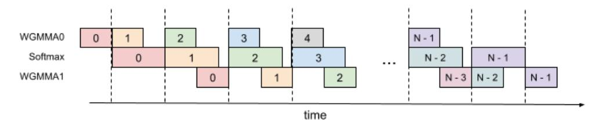

# B.3 3-Stage Pipelining Algorithm

We experiment with a 3-stage pipelining algorithm to parallelize the first WGMMA from iteration +2, softmax from iteration +1, and the secondWGMMA from iteration . We describe this algorithm in Algorithm [4.](#page-17-0) This algorithm behaves worse than the 2-stage pipelining algorithm due to the reasons below:

Figure 8: 3-Stage Pipelining

#### **Algorithm 4** FLASHATTENTION 3-stage pipelining consumer warpgroup forward pass

**Require:** Matrices  $\mathbf{Q}, \mathbf{K}, \mathbf{V} \in \mathbb{R}^{N \times d}$  in HBM, block sizes  $B_c$ ,  $B_r$ . Each warpgroup reads 1 block Qi of size  $B_r \times d$ ,  $T_c = \begin{bmatrix} \frac{N}{B_c} \end{bmatrix}$  blocks  $\mathbf{K}_1, ..., \mathbf{K}_{T_c}$  and  $\mathbf{V}_1, ..., \mathbf{V}_{T_c}$  of size  $B_c \times d$ . Each warpgroup writes 1 output block  $\mathbf{O}_i$  of size  $B_r \times d$ , and 1 logsumexp block  $L_i$  of size  $B_r$ .

- 1: Initialization. Load  $\mathbf{Q}_i$  from HBM to on-chip SRAM. Initialize  $\mathbf{O}_i$ ,  $\ell_i$ ,  $m_i$ ,  $scale\_o$ .
- 2: Wait for the producer warpgroup loading  $\mathbf{K}_0$  from HBM to on-chip SRAM.
- 3: Compute  $S = Q_i K_0^T$  using WGMMA. Commit and wait.
- 4: Compute  $m_i$ ,  $\tilde{\mathbf{P}}_i$ ,  $\ell_i$ ,  $scale\_o$  based on  $\mathbf{S}$ .
- 5: Wait for the producer warpgroup loading  $\mathbf{K}_1$  from HBM to on-chip SRAM.
- 6: Compute  $S = Q_i K_1^T$  using WGMMA. Commit and wait.
- 7: **for**  $2 \le j < T_c 2$  **do**
- 8: Wait for the producer warpgroup loading  $\mathbf{K}_j$  from HBM to on-chip SRAM.
- 9: Compute  $\mathbf{S}_{next} = \mathbf{Q}_i \mathbf{K}_i^T$  using WGMMA. Commit but do not wait.
- 10: Wait for the producer warpgroup loading  $V_{j-2}$  from HBM to on-chip SRAM.
- 11: Rescale  $\mathbf{O}_i$  based on  $scale\_o$ .
- 12: Compute  $\mathbf{O}_i = \mathbf{O}_i + \tilde{\mathbf{P}}_i \mathbf{V}_{j-2}$  using WGMMA. Commit but do not wait.
- 13: Compute  $m_i$ ,  $\tilde{\mathbf{P}}_{i\_next}$ ,  $\ell_i$ ,  $scale\_o$  based on  $\mathbf{S}$ .
- 14: Wait for all previous WGMMAs.
- 15: Copy  $S_next$  to S.
- 16: Copy  $\tilde{\mathbf{P}}_{i}$ \_next to  $\tilde{\mathbf{P}}_{i}$ .
- 17: **end for**
- 18: Wait for the producer warpgroup loading  $V_{T_c-2}$  from HBM to on-chip SRAM.
- 19: Rescale  $\mathbf{O}_i$  based on *scale\_o*.
- 20: Compute  $\mathbf{O}_i = \mathbf{O}_i + \tilde{\mathbf{P}}_i \mathbf{V}_{T_c-2}$  using WGMMA. Commit and wait.
- 21: Compute  $m_i$ ,  $\tilde{\mathbf{P}}_i$ ,  $\ell_i$ ,  $scale\_o$  based on  $\mathbf{S}$ .
- 22: Wait for the producer warpgroup loading  $V_{T_c-1}$  from HBM to on-chip SRAM.
- 23: Rescale  $O_i$  based on  $scale\_o$ .
- 24: Compute  $O_i = O_i + P_i V_{T_c-1}$  using WGMMA. Commit and wait.
- 25: Epilogue. Rescale  $O_i$  based on  $\ell_i$ . Compute  $L_i$  based on  $\ell_i$  and  $m_i$ . Write  $O_i$  and  $L_i$  to HBM as the i-th block of O and L.

**Overlapping.** We expected that softmax can be overlapped with (the first WGMMA + the second WGMMA). However, the compiler doesn't cooperate in this way. SASS code shows that only the first WGMMA is overlapped with softmax, while the second WGMMA is not. It's not clear why the compiler chooses to reorder instructions in this way.

**Register pressure.** This algorithm requires more registers compared to the 2-stage pipelining algorithm. In theory, it needs to store an extra  $\tilde{\mathbf{P}}_i$  and  $scale_o$ , which is of size  $B_r \times B_c \times sizeof(input_data_type) + B_r \times sizeof(float)$ . As a result, a smaller block size needs to be chosen.

### **B.4** Variable Sequence Length

Some optimizations mentioned above cannot be directly used for variable sequence lengths and require special handling.

**TMA** To enable TMA to handle variable sequence lengths directly, additional steps are required. These include modifying a tensormap using the PTX instruction 'tensormap.replace' and store the

tensormap in global memory, which adds overhead and complexity. To address this, during the forward pass when loading Q, we make TMA consistently loads tile\_size rows of data. For out-of-bound access, TMA sets zeros for rows beyond the original tensor, while S tensor masking masks out unused rows in a tile. When writing O, we leverage memory-coalesced writes directly, as this is the final step and does not require asynchrony. In the backward pass, a preprocess kernel pads each sequence in dQ, dPSum, and LSE tensors with an additional 128 (tile\_size) elements, allowing us to utilize TMA store for efficient data transfer.

Threadblock cluster and TMA multi-cast We utilize TMA multi-cast with a cluster size of 2 for fixed sequence length data loads, allowing every 2 threadblocks processing the same sequence to collaboratively read KV tensors. However, this approach is not well-suited for variable sequence lengths or cases like causal masking and window attention, where some threadblocks may exit earlier and cannot collaborate with other threadblocks in the same cluster. Not utilizing clustering for variable sequence lengths results in a performance drop of around 2% compared to fixed sequence lengths.

### B.5 Masks: causal, local attention, variable sequence length

We apply masks to the S tensor to handle causal and local attention, as well as out-of-bound access for variable sequence lengths. Since masking is expensive, we apply it only when necessary. For instance, in the forward pass, the minimum and maximum KV block indices are calculated and iterated over in the main loop. For causal or variable sequence lengths, masking is applied only to the maximum K block index. For local attention, masking is applied only to the first and last few K block indices based on local attention configurations. Masking is skipped for other K block indices.

### B.6 Persistent Kernel

During the execution of the attention kernel, there is a prologue (loading ) and epilogue (writing output) where the Tensor Cores are not running. To maximize efficiency, we implement a persistent kernel that can overlap the epilogue of one iteration with the prologue of the next iteration to reduce this overhead and keep the Tensor Cores busy. In particular, we launch as many thread blocks as there are streaming multiprocessors (e.g., 132 on the H100 SXM5) and implement a scheduler that assigns tiles to each of the thread block. Each thread block might perform attention for more than one tile.

