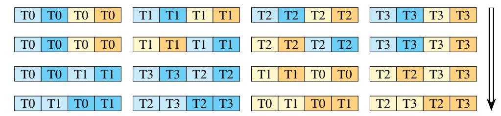

# <span id="page-18-0"></span>B.7 Register data exchange required for second WGMMA in FP8 FLASHATTENTION-3

<span id="page-18-1"></span>

Figure 9: Register data movement to satisfy layout conformance requirements of FP8 WGMMA.

In code, we can effect the register-to-register data exchange that transforms the register ownership pattern of Fig. [3](#page-6-1) into Fig. [4](#page-6-2) through invoking a combination of the following two CUDA intrinsics:

- byte\_perm: Given two 32-bit unsigned integers x and y and selector s, the byte permute instruction returns 4 bytes from the 8 input bytes as specified by s.
- shfl\_sync: The shuffle instruction exchanges register data from a source lane index j into its own destination register.

Our method is illustrated in Fig. [9.](#page-18-1) First, we can swap the order of data held within a thread's registers by using byte permute as follows. Referring to the top row of Fig. [9,](#page-18-1) for a given thread let upper be the first 4 bytes (those in light and dark blue) and let lower be the last 4 bytes (those in light and dark yellow). Then for the data held by threads 1 and 2, we do the swap by calling byte\_perm with the indicated selectors:

```
auto upper_mid = __byte_perm(upper, lower, 0x7654);
auto lower_mid = __byte_perm(upper, lower, 0x3210);
```

Now between the second and third rows, we exchange data among threads by using shuffle instructions. Observe that the upper and lower blocks of 4 bytes should be each exchanged among themselves. Moreover, the shuffling of the upper blocks differs from that of the lower blocks, and both shuffles depend on the thread index (mod 4). We account for this using two pre-defined arrays to call \_\_shfl\_sync with the correct srcLane parameter as follows:

```
int upper_map[4] = {0,3,1,2};
int lower_map[4] = {1,2,0,3};
upper_mid = __shfl_sync(uint32_t(-1), upper_mid, upper_map[threadIdx.x%4], 4);
lower_mid = __shfl_sync(uint32_t(-1), lower_mid, lower_map[threadIdx.x%4], 4);
```

Finally, between the third and fourth rows, we repeat the technique with byte\_perm, but now for all four threads and with the selector depending on the thread index (mod 4). For threads 0 and 3, we have:

```
upper_last = __byte_perm(upper_mid, lower_mid, 0x5410);
lower_last = __byte_perm(upper_mid, lower_mid, 0x7632);
whereas for threads 1 and 2, we have:
upper_last = __byte_perm(upper_mid, lower_mid, 0x1054);
lower_last = __byte_perm(upper_mid, lower_mid, 0x3276);
```

### <span id="page-19-0"></span>B.8 In-kernel transposition of V for FP8 FLASHATTENTION-3

We describe how to fuse the memory transpose of **V** needed for the second FP8 WGMMA into FLASHATTENTION-3. This is handled as an out-of-place SMEM to RMEM to SMEM transfer that is executed in the producer warpgroup.

Specifically, within the producer mainloop, after issuing the TMA load of a tile of **V**, the producer warpgroup waits for the load to complete. Then, producer warps effect the transpose by issuing LDSM (ldmatrix) and STSM (stmatrix) instructions, which involve a warp of threads collectively loading SMEM to RMEM and storing RMEM to SMEM at a granularity of 128 bytes. Finally, we have an additional pipeline object to manage synchronization between the producer warpgroup and consumers, since the producer pipeline for the TMA load of V now instead has the producer warpgroup as *its* consumer.

We choose LDSM/STSM instructions as they are both register efficient, allowing us to execute them in the producer warpgroup even after register deallocation, and capable of transposing layouts when doing memory copy. Note that as SMEM requirements are first reduced by the smaller memory footprint of the FP8 datatype, we find that we have enough SMEM for the separate buffer used to store the transpose.

There is a technical obstacle to using LDSM and STSM in the context of FP8 datatype that is worth mentioning. Note that in the PTX documentation, LDSM/STSM are described as copying 8 × 8 matrices with 16-bit entries [\[40,](#page-12-8) §9.7.13.4.15-16], but we can pack 8-bit entries two at a time to use LDSM/STSM in the context of FP8 precision. However, the transpose versions of LDSM/STSM cannot split packed 8-bit entries, which necessitates certain register movements in between LDSM and STSM to actually perform a tile-wise transpose. The use of byte permute to split and reorder packed 8-bit entries in between LDSM and STSM is depicted in the following code snippet:

```
cute::copy(tiled_copy_ldsm, tXsX, tXrX);
auto data = tXrX.data();
#pragma unroll
for (int n = 0; n < size(tXrX); n += 8) {
 uint32_t *data_32bit = reinterpret_cast<uint32_t *>(&data[n]);
 auto upper = data_32bit[0];
 auto lower = data_32bit[1];
 data_32bit[0] = __byte_perm(upper, lower, 0x6420);
 data_32bit[1] = __byte_perm(upper, lower, 0x7531);
}
cute::copy(tiled_copy_stsm, tXrX, tXsX_out);
```

Since this permutes the eventual rows of the transposed **V** tile, we also need to modify the register movements on the consumer side that transform accumulator to operand **P**. We exploit the mathematical fact that

$$\mathbf{P} \cdot \mathbf{V} = \operatorname{colperm}^{\sigma}(\mathbf{P}) \cdot \operatorname{rowperm}^{\sigma}(\mathbf{V})$$

for  $\sigma$  a permutation of the common inner dimension of **P** and **V**. Moreover, for the modified register exchange, we can eliminate the use of warp shuffles, but not byte permute, as each thread will already own all the entries it needs for WGMMA.

#### B.9 FLASHATTENTION-3 for inference

For decoding inference, the query sequence length is much shorter than the key/value sequence length, typically on the order of one or a few tokens compared to the thousands stored in the KV cache. In this situation, attention becomes a memory-bound workload, and the relevant metric is not tensor core utilization as measured by FLOPs/s, but loading the KV cache as fast as possible as measured by memory bandwidth. Furthermore, since the FLASHATTENTION-3 algorithm described in §3.1 parallelizes over the query sequence length, it can suffer from a lack of parallelism for decoding.

We make two modifications to FLASHATTENTION-3 to introduce more parallelism for decoding:

- 1. **Split KV** (or **Flash-Decoding**): We split the attention kernel along the key/value sequence length, with the number of splits determined by a heuristic at launch, and combine the resulting outputs using a separate post-processing reduction kernel. "Splitting" according to a parameter *n* means that *n* threadblocks load the same tile of **Q** and *n* different segments of the KV cache, computing *n* different output tiles **O**<sub>1</sub>,...,**O**<sub>n</sub> and lse vectors **lse**<sub>1</sub>,...,**lse**<sub>n</sub>, which we then use to compute **O** in the reduction kernel. We also allow for early exit of threadblocks whose given segment of the KV cache doesn't contribute to the final output, in which case the threadblock writes out −∞ as its **lse**. This amounts to essentially the same implementation as described in [18].
- 2. **GQA packing**: For multi-query attention or grouped-query attention, we can restructure the attention mainloop in order to pack multiple query heads per KV head, where each threadblock now loads its **Q** tile across different query heads. When query length is short, this achieves additional parallelism "for free" thanks to the large width of the first operand WGMMA tile, given as 64 per warpgroup. For example, we could have a model architecture with 16 query heads per KV head and a query sequence length of 8, in which case a threadblock can pack all 16 query heads into its **Q** tile without any change to Algorithm 2. In practice, this yields up to *N*x speedup over an implementation that doesn't do GQA packing, where *N* is the GQA ratio.

FLASHATTENTION-3 for inference also features an implementation of PagedAttention [29] that was contributed by Kai Londenberg. Recall that PagedAttention is a memory optimization technique for efficiently storing the KV cache in terms of fixed-size pages. This entails separating the logical position of KV blocks from their physical addresses, with a *block table* defining the address translation [29, §4.2].

Now, prior implementations of TMA load in CUTLASS construct the tensor map object such that TMA tensor coordinates are determined using the physical GMEM tensor. To use a block table with TMA, Londenberg defines a new SM90\_TMA\_LOAD\_PAGED\_OP class and a tensor map constructor that instead determines TMA tensor coordinates in terms of the virtual shape. The block table is then passed into the TMA copy method as an additional argument.

