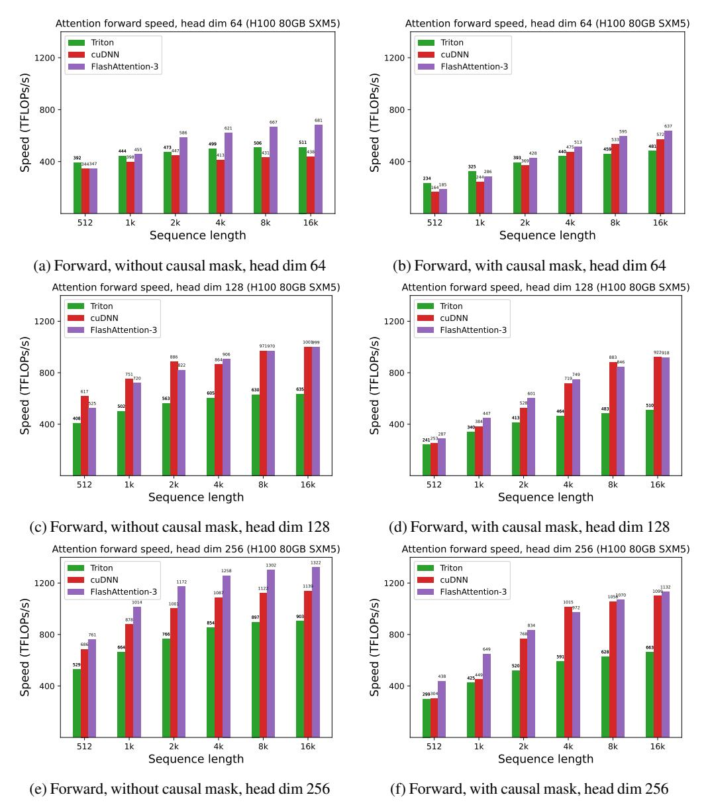

# C.1 System and libraries

We benchmark the speed on an H100 80GB SXM5 (700W). We generally use the latest versions of the libraries, at the time of writing (October 2024). Specifically, we use:

- CUDA 12.3
- cuDNN 9.5.0.50
- CUTLASS 3.6
- FLASHATTENTION 2.6.3
- Triton 3.1
- PyTorch 2.5.0

To reduce variability, we fix the GPU clock speed to 1830MHz (clock speed used to calculate the 989 TFLOPS FP16 theoretical max throughput). We repeat the benchmarks 10 times and take the average timing.

### C.2 FP8 Attention Full Results

We use following sequence lengths: 512, 1024, 2048, 4096, 8192, 16384.

Figure 10: Attention forward speed (FP8) on H100 GPU

