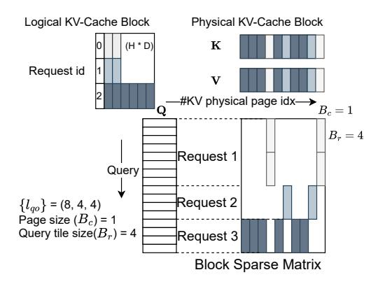
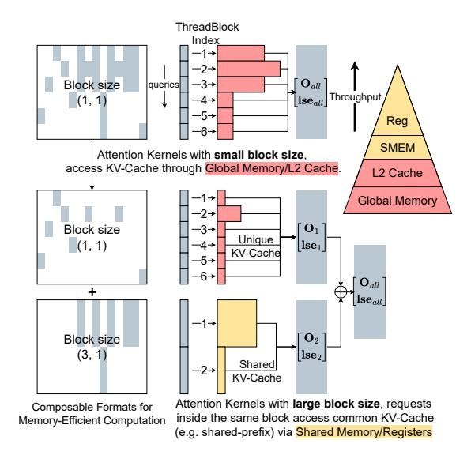
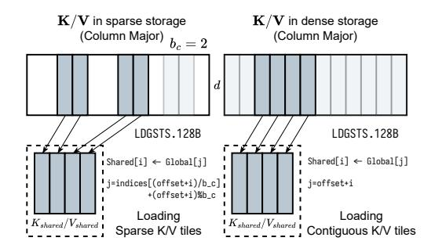
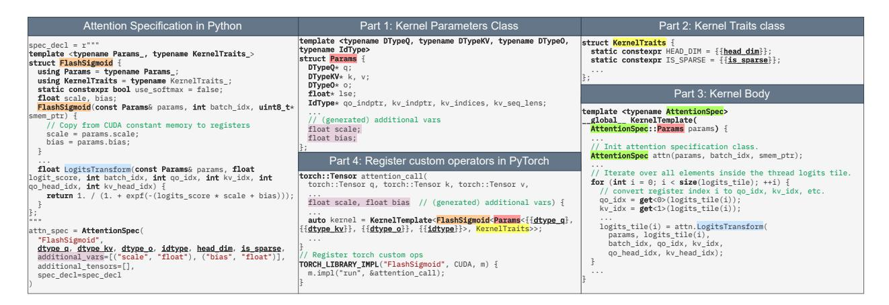
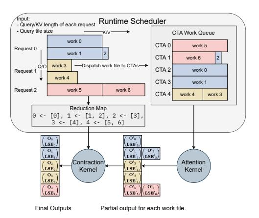
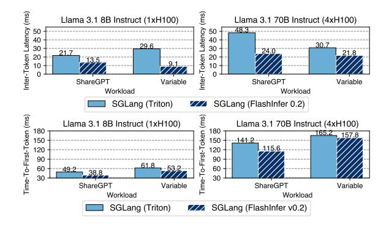
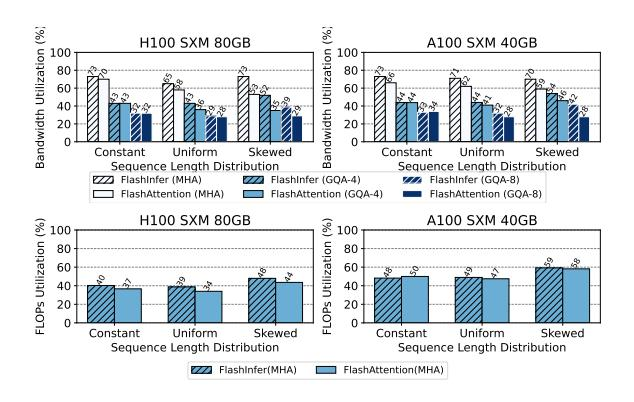
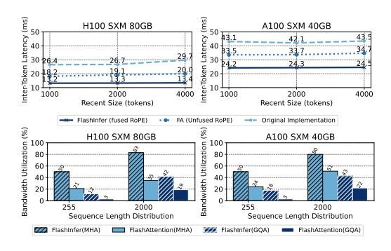
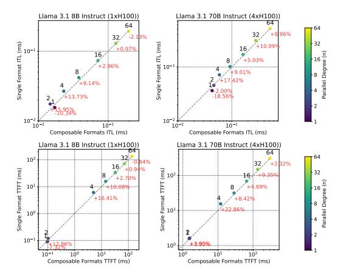

# 3.1 KV-Cache Storage

#### 3.1.1 Block-Sparse Matrix as Unified Format

Recent advancements in KV-Cache storage, such as PageAttention (Kwon et al., 2023) and RadixAttention (Zheng et al., 2023b), employ non-contiguous memory storage with a minimum granularity of a block (or token) of (H,D) tensors, where H represents the number of heads and D the hidden dimension. These structures are optimized to minimize memory fragmentation while enhancing memory reuse and cache hit rates. We demonstrate that these diverse data structures can be unified under a block sparse format, as illustrated in Figure 2.



Figure 2. Representation of Page Table in BSR ( $B_r = 4, B_c = 1$ ) format. The number of column blocks in the block sparse matrix corresponds to the total number of blocks allocated for the Page Table. Non-zero blocks represent KV-Cache pages accessed by queries.

The conceptual equivalence between page tables and sparse matrices has been previously explored in SPGrid (Setaluri et al., 2014), which leverages Translation Lookaside Buffer (TLB) hardware for efficient sparse structure indexing. Beyond page tables and radix trees, sparse matrices can also effectively represent various attention mechanisms, such as Tree Attentions used in speculative decoding (Cai et al.,

2024; Miao et al., 2024; Chen et al., 2024) and importance masks applied to KV-Cache (Tang et al., 2024).

In FlashInfer, we implement a unified strategy for data representation. Query and output matrices are efficiently stored as ragged tensors (also known as jagged arrays) (Tensorflow Developers, 2018) without padding, which facilitates the compact packing of queries and outputs from diverse requests into a single tensor. Initially, keys and values are maintained in ragged tensors using the same index pointers as queries, as they originate from the projection matrices  $W_q, W_k, W_v$  applied to the same input. These keys and values are subsequently incorporated into the KV-Cache with newly updated entries. The KV-Cache employs a blocksparse row (BSR) format, where block sizes are defined by application requirements:  $B_r$  corresponds to the query tile size, details of which will be discussed in later sections, and  $B_c$  is specified by KV-Cache management algorithms. FlashInfer kernel implementations supports arbitrary  $(B_r, B_c)$  values.



Figure 3. Composable formats for shared-prefix decomposition in attention computation. The queries corresponding to the first 6 rows have a shared prefix, as do the queries in the last 6 rows. We store the KV cache corresponding to the shared prefix in a block sparse matrix with a block size of (3,1), while storing the remaining unique KV cache in another block sparse matrix with a block size of (1,1). For block size (3,1), 3 queries can share the same KV cache in high-bandwidth shared memory, while for block size (1,1), each query access KV-Cache within its own threadblock, which can only go through low-bandwidth global memory or L2 cache.

#### 3.1.2 Composable Formats for Memory Efficiency

Inspired by SparseTIR (Ye et al., 2023), we enhance attention computation efficiency through composable formats.

<span id="page-4-0"></span>This approach leverages multiple block sparse formats instead of a single format to store the sparse matrix, offering greater flexibility and memory efficiency. Single blocksparse formats are constrained by a fixed block size, limiting memory efficiency based on the number of rows in the block  $(B_r)$ . While larger  $B_r$  values improve shared memory and register reuse for requests within the same block, they also increase fragmentation. Conversely, requests in different blocks cannot access each other's shared memory.

Our composable format design allows for the decomposition of the KV cache sparse matrix based on prior knowledge. For instance, if certain requests share a prefix, the corresponding rows and columns in the KV cache form a dense submatrix. We can then use a block sparse matrix with a larger  $B_r$  to store these submatrices efficiently. Figure 3 illustrates this concept, showing how shared prefixes can be optimized using composable formats. This approach doesn't require data movement in the KV cache; instead, we compute the indices and index pointer arrays for the sparse submatrices. Attention computations on larger block sizes can access shared KV cache entries using fast shared memory and registers, significantly improving memory efficiency.

#### 3.2 Compute Abstraction

We developed CUDA/CUTLASS (Thakkar et al., 2023) templates for FlashAttention, designed specifically for both dense and block-sparse matrices and compatible with NVIDIA GPU architectures from Turing to Hopper (sm75 to sm90a). Our implementations utilize the FlashAttention2 (FA2 for short) algorithm (Dao, 2023) for architectures up to Ada(sm89), and the FlashAttention3 (FA3 for short) algorithm (Shah et al., 2024) for Hopper. Key improvements include enhanced loading of sparse tiles into shared memory, expanded tile-size configurations, optimized memory access patterns for grouped query attention, and customizable attention variants.

#### 3.2.1 Global to Shared Memory Data Movement

The FlashInfer attention template supports any block size, requiring a specialized data loading approach since blocks may not align with tensor core shapes. As discussed in Section 2.3, we address these challenges by transferring tiles from scattered global memory to contiguous shared memory for dense tensor core operations. Tensor core inputs for a single MMA instruction can originate from different blocks within a block-sparse matrix. Figure 4 illustrates how FlashInfer loads tiles from sparse/dense KV-Cache into shared memory; sparse KV-Cache addresses are computed using the indices arrays of the BSR matrix, while dense ones use row index affine transformations.

The last dimension of the KV-Cache remains contiguous

(with size of head dimension *d*, commonly 128 or 256), maintaining coalesced memory access that fits GPU cache line sizes. We use asynchronous copy instructions LDGSTS with a 128B width to maximize memory bandwidth. Although the Tensor Memory Accelerator (TMA) in Hopper architecture can further accelerate data movement, it doesn't support non-affine memory access patterns. Consequently, we only use TMA for contiguous KV-Cache on Hopper GPUs and fall back to Ampere-style asynchronous copies for other settings where TMA isn't suitable.



Figure 4. Data transfer from global to shared memory for sparse/dense KV-Cache in FlashInfer. Left: Sparse KV-Cache with  $b_c=2$ ; Right: Dense KV-Cache. Head dimension d.

Post-transfer to shared memory, the sparse and dense FlashAttention implementations converge, allowing consistent kernel usage with variations only in data loading modules.

#### 3.2.2 Microkernel with Different Tile Sizes

To adapt to the varying operational intensities of LLM applications, FlashInfer implements the FA2 algorithm across multiple sizes. Traditional FA2 uses limited number of tile sizes (e.g., (128, 64)), optimal for prefill on A100 but inefficient for shorter-query-length decoding. One architecture's ideal tile size may not suit others; for instance, Ada(sm89) has limited shared memory, affecting SM occupancy with large tiles.

FlashInfer offers FA2 kernels with tile sizes  $(1,16,32,64,128) \times (32,64,128)$  and selects using heuristics based on hardware resources and workload intensity:

- 1. Determine average query length (for Grouped-Query Attention, the query length are fused with head group dimension, see Appendix A) per batch, choosing the minimal query tile size meeting or exceeding it.
- Formulate register and shared memory constraints as functions of K/V tile size, maximizing SM resource occupancy.



Figure 5. JIT compiler for attention variants in FlashInfer, featuring CUDA code strings defining variant functors, additional variables/tensors, and data types, used to populate kernel templates. Corresponding codes share highlighting.

#### *3.2.3 JIT Compiler for Attention Variants*

For query tile size 1, we use CUDA Cores template since tensor core instruction m (minimum rows) is 16, and use Tensor Cores for other query tile sizes. For FA3 we provides row tile sizes that are multiples of 64, aligning with Hopper's WGMMA requirements. Tile sizes resolve at compile-time considering task specifics (decoding, prefill, etc.) and hardware capabilities. The block row size B<sup>r</sup> is block-sparse matrix is aligned with the query tile size Tq.

Recent LLM models use variants to standard attention algorithms. Supporting various attention variants in CUDA library is not sustainable because the we specialize the kernel for each variant for maximum performance, and the number of variants is growing rapidly. However, most attention variants have similar structure to the vanilla attention so we can use the same skeleton of FlashAttention kernels with small modifications. Inspired by FlexAttention [\(He et al.,](#page-12-0) [2024\)](#page-12-0), we designed a customizable CUDA template and a JIT compiler that takes the attention variant specification as input and generates the optimized kernel code. The variant specification includes the following functors:

- QueryTransform, KeyTransform, ValueTransform: The transformation applied to the query/key/value tensor before the attention computation.
- OutputTransform: The transformation applied to the attention output tensor before returning.
- LogitsTransform, LogitsMask: The transformation applied to the logits tensor before the softmax computation, and the mask applied to the logits tensor.

Each functor has a fixed signature that takes the kernel parameters, input and current query/key/head index as input, and returns the output. Those variant functions are specified as member of a user-defined variant class which creates a closure for the variant functors. Functors such as LogitsTransform and LogitsMask are inspired by FlexAttention [\(He et al.,](#page-12-0) [2024\)](#page-12-0) and can be used to implement the attention variants with customized logits postprocessing such as custom mask, logits soft-cap [\(Rivière et al.,](#page-14-0) [2024;](#page-14-0) [xAI,](#page-15-0) [2023\)](#page-15-0) and sliding window attention [\(Beltagy](#page-11-0) [et al.,](#page-11-0) [2020\)](#page-11-0). FlashInfer has an option of using softmax or not in the attention variant specification, which makes it capable of supporting attention variants that don't use softmax, such as FlashSigmoid [\(Ramapuram et al.,](#page-14-0) [2024\)](#page-14-0). FlashInfer's query and key transformation functors making it possible to fuse normalization, RoPE [\(Su et al.,](#page-15-0) [2024\)](#page-15-0) and projection [\(DeepSeek-AI et al.,](#page-12-0) [2024\)](#page-12-0) into the attention kernel.

Figure 5 shows how FlashInfer maps FlashSigmoid's [\(Ramapuram et al.,](#page-14-0) [2024\)](#page-14-0) attention specification to different parts of FlashInfer's CUDA templates. Attention specificiation accepts a piece of CUDA code to define the variant functors, such design also enables user to use advanced PTX instructions <sup>1</sup> or even their own libraries. The JIT compiler generates the CUDA code by inserting the variant class and other information into the template, and the generated CUDA code is compiled with PyTorch's JIT compiler <sup>2</sup> and registered as a custom operator <sup>3</sup> . We also support compiling to other runtime systems through a framework agnostic DLPack <sup>4</sup> interface.

<sup>1</sup>[https://docs.nvidia.com/cuda/parallel](https://docs.nvidia.com/cuda/parallel-thread-execution/)[thread-execution/](https://docs.nvidia.com/cuda/parallel-thread-execution/)

<sup>2</sup>[https://pytorch.org/tutorials/advanced/](https://pytorch.org/tutorials/advanced/cpp_extension.html#jit-compiling-extensions) [cpp\\_extension.html#jit-compiling-extensions](https://pytorch.org/tutorials/advanced/cpp_extension.html#jit-compiling-extensions) <sup>3</sup>[https://pytorch.org/tutorials/advanced/](https://pytorch.org/tutorials/advanced/custom_ops_landing_page.html) [custom\\_ops\\_landing\\_page.html](https://pytorch.org/tutorials/advanced/custom_ops_landing_page.html)

<sup>4</sup><https://github.com/dmlc/dlpack>

#### <span id="page-6-0"></span>**Algorithm 1** FlashInfer's balanced scheduling algorithm

- 1: Input:  $\{l_{qo}(i), l_{kv}(i)\}_i$ , query tile size  $T_q$ .
- 2: Define the cost of a tile  $l_q$ ,  $l_{kv}$  as  $(\alpha, \beta)$  are hyperparameters):

$$cost(l_q, l_{kv}) = \alpha l_q + \beta l_{kv}$$

3: Compute the maximum KV chunk size  $L_{kv}$  by

$$L_{kv} \leftarrow \frac{\sum_{i} \lceil \frac{l_{qo}(i)}{T_q} \rceil \cdot l_{kv}(i)}{\# \text{CTA}}$$

- 4: Split each query tile's KV into chunks, with maximum size  $L_{kv}$ , we assign each chunk a work index w, and the length of the chunk is  $l_{kv}(w)$ .
- 5: Let  $W = \{(w, l_{kv}(w))\}$  and sort the entries in descending order of length.
- 6:  $Q \leftarrow \text{PriorityQueue}(\{(c,0)\})$  where c is the CTA index.
- 7: while  $W \neq \emptyset$  do
- 8: c, current\_cost  $\leftarrow Q.pop_{min}()$
- 9:  $w, l_{kv}(w) \leftarrow W.pop()$
- 10:  $\text{new\_cost} \leftarrow \text{current\_cost} + \text{cost}(T_q, l_{kv}(w))$
- 11: Assign chunk w to CTA c
- 12:  $Q.push((c, new\_cost))$
- 13: end while

#### 3.3 Dynamism-Aware Runtime

In this section we introduce the runtime design of FlashInfer, including the dynamic scheduling framework, and the composable formats for memory efficient attention.

#### 3.3.1 Load-balanced Scheduling

In FlashInfer, the load-balanced scheduling algorithm aims to minimize SM idle time by distributing the workload evenly across all SMs. It takes the sequence length information of the query/output and key/value dimensions as input, and produces both the mapping between the workload and Cooperative Thread Arrays (CTAs) and the index mapping for partial and final outputs. The algorithm is presented in Algorithm 1 (the head dimension is omitted for simplicity). Our approach is inspired by Stream-K (Osama et al., 2023); however, because LLM serving requires deterministic outputs, we did not incorporate atomic aggregation in Stream-K implementation to avoid non-deterministic behavior. The scheduling algorithm generates deterministic aggregation order when provided with identical sequence length information.

Figure 6 shows the workflow of FlashInfer's runtime scheduler. The attention kernel do not produce the final output directly because some long KV are split into multiple chunks, and the final output is the contraction (using the attention composition operator mentioned in section 2.2) of all chunks' partial outputs. The partial outputs are stored in a workspace buffer provided by the user (see section 3.4). FlashInfer implements efficient attention composition operator that can deal with variable length aggregation. The work queue of each CTA, and the mapping between partial and final outputs need to be planned by the scheduler. Once plan information is computed on CPU, FlashInfer asynchronously copy the plan information to a specific region of

the workspace buffer on GPU, and the plan information is used as inputs for persistent attention/contraction kernels. The scheduler runs per generation step to produce plan information as the sequence length changes for each generation step on CPU, and overhead can be amortized over multiple layers because the same plan information can be reused for all layers.



Figure 6. FlashInfer's load-balanced runtime scheduler, sequence length information (both on query/output and key/value dimension) are provided to the scheduler to compute the plan information: (1) Work queue of each CTA (2) Index mapping between partial and final outputs. These plan information are cached at GPU-side and used as inputs for persistent attention/contraction kernels.

FlashInfer guarantees both attention and contraction stage are compatible with CUDAGraphs (Gray, 2019; Nguyen et al., 2021). Both attention and contraction stage use persistent kernel and the grid size is fixed once compiled, which means the kernel is launched with the same grid size for each generation step. We set the fixed offset for each section of the workspace buffer to store partial outputs and plan information to make sure the pointers passed to the kernel are the same for each generation step, meeting the requirement of CUDAGraphs (see Appendix D.1 for details). We merge the two stages into one persistent kernel, eliminating intra-kernel overhead.

#### 3.4 Programming Interface

FlashInfer offers a programming interface designed for seamless integration with existing LLM serving frameworks such as vLLM(Kwon et al., 2023), MLC-Engine(MLC Community, 2024), and SGLang (Zheng et al., 2023b).

```
# Create workspace buffer
workspace = torch.empty(...)
seqlen_info.init()

# Compile: create CUDAGraphs
graphs = []
for task_info in task_infos:
    # Init: compile kernels according to spec
attn = AttentionWrapper(attn_spec, task_info, workspace)
```

```
g = torch.cuda.CUDAGraph()
  # Dummy plan
  attn.plan(seglen info)
  # Capture CUDA graphs
  with torch.cuda.graph(g):
    for i, layer in enumerate(layers):
      attn.run(...)
  graphs.append(g)
# Runtime: select the best CUDAGraph
g = select_graph(graphs)
finished = False
  Text generation loop
while not finished:
  seqlen_info.update()
  # Plan per generation step
  attn.plan(seqlen_info)
  # Replay CUDA-Graph
  g.replay()
```

Listing 1. FlashInfer PyTorch Programming Interface

Listing 1 shows the PyTorch programming interface of FlashInfer. The user initializes the wrapper by providing the attention variant specification, task information, and a userallocated workspace buffer (see Appendix D for details) to store partial output and plan information for FlashInfer dynamic scheduling. Kernel are JIT-compiled at init time and cached for reuse. For composable formats (section 3.1.2), FlashInfer creates multiple attention wrappers, each with distinct block sizes. Kernels with different average query length and composable format configurations are compiled and captured in different CUDAGraphs. At runtime, the serving framework selects the most appropriate CUDAGraph based on the current KV-Cache configuration, ensuring optimal performance for varying workload characteristics.

The plan function activates the dynamic scheduler by processing sequence length data to generate load-balanced scheduling plans. These plans are cacheable, allowing reuse across operators with matching sequence length specs, such as all decode attentions in a generation step. The run function executes the attention computation using inputs of query, key, value, and cached plan data, outputting the attention results. CUDAGraph can capture calls to run functions and compile the entire attention generation step into a single graph. However, plan function is not captured by CUDAGraph because it's on CPU. The plan and run division is inspired by the Inspector-Executor (IE) model (Mirchandaney et al., 1988; Saltz & Mirchandaney, 1991; Ponnusamy et al., 1993), which is widely used for parallelizing irregular workloads.

#### 4 EVALUATION

In this section, we evaluate FlashInfer v0.2 on kernel-level and end-to-end performance showing how FlashInfer's design address the challenges of LLM serving. We achieve

29-69% inter-token-latency reduction compared to Triton backend for LLM serving benchmark, 28-30% latency reduction for long-context inference, and 13-17% speedup for LLM serving with parallel generation. We conduct experiments on NVIDIA A100 40GB SXM and H100 80GB SXM GPUs, using CUDA 12.4 and PyTorch 2.4.0 and f16 precision for storage and computation.

#### 4.1 End-to-end LLM serving performance

We evaluate FlashInfer with SGLang v0.3.4 (Zheng et al., 2023b) and compare its performance against two settings: SGLang with Triton v3.0 (Tillet et al., 2019). The latter is a leading LLM serving engine optimized for NVIDIA GPUs; however, its attention kernels are closed-source, which limits transparency and potential for community-driven improvements. To ensure a comprehensive evaluation, we employ two datasets: the widely-used ShareGPT dataset <sup>5</sup> and a synthetic workload (Variable) with sequence lengths uniformly distributed between 512 and 2048 tokens. We measure the TTFT(time-to-first-token) and ITL(inter-token-latency) under latency-sensitive online serving settings, the request rate is adjusted to maintain P99 TTFT below 200ms.



Figure 7. Medium Inter-Token-Latency (ITL) and medium Time-To-First-Token (TTFT) of SGLang integrated with FlashInfer and Triton.

Figure 7 shows the ITL and TTFT measured on both Llama 3.1 (Dubey et al., 2024) 8B (on 1xH100) and Llama 3.1 70B (on 4xH100) models. Compared to SGLang with Triton backend, FlashInfer backend shows consistent speedup in all settings.

## 4.2 Kernel Performance for Input Dynamism

In this section we measure FlashInfer's generated kernel performance against state-of-the-art open-source FlashAttention library under different sequence length distributions,

<sup>5</sup>https://huggingface.co/datasets/
anon8231489123/ShareGPT\_Vicuna\_unfiltered/
resolve/main/ShareGPT\_V3\_unfiltered\_
cleaned\_split.json

we use the latest main branch <sup>6</sup> which includes both FlashAttention2 and FlashAttention3 kernels. We fix the batch size to 16 and select three different sequence length distributions: constant (1024), uniform (512 to 1024) and skewed (Zipf distribution with average length 1024). For prefill kernels, we enabled causal masking because it's a common setting in LLM serving.



Figure 8. Achieved bandwidth and FLOPs utilizations (the higher the better) for decode (top) and prefill (down) kernels.

Figure 8 show the achieved bandwidth and FLOPs utilization for decode and prefill kernels. FlashInfer's kernel significant outperforms FlashAttention kernels in uniform and skewed sequence length distributions because of our load-balanced dynamic scheduler (section 3.3.1). FlashInfer's decode attention outperforms FlashAttention kernels because our versatile tile size selection (section 3.2.2) and FlashAttention use suboptimal tile size for decoding.

#### 4.3 Customizability for Long-Context Inference

In this section, we demonstrate how FlashInfer's customized attention kernels significantly accelerate LLM inference. We focus on Streaming-LLM (Xiao et al., 2023), a recent algorithm capable of million-token inference with constant GPU memory usage. While Streaming-LLM requires specialized attention kernels for optimal performance, particularly a fused kernel combining RoPE (Su et al., 2024) with attention, FlashInfer can generate such fused kernels with merely 20 additional lines of code for query/key transformations. We compare the performance of FlashInfer-generated fused kernels against un-fused kernels (both FlashInfer's and FlashAttention's) and quantify the end-to-end latency reduction achieved by integrating FlashInfer kernels into StreamingLLM.

For end-to-end performance, we run Vicuna-13B (Chiang et al., 2023) inference on MT-Bench (Zheng et al., 2023a) dataset and measure the inter-token-latency (ITL) of Streaming-LLM with and without FlashInfer kernels. Fig-



Figure 9. Top: End-to-end latency of Streaming-LLM with Flash-Infer fused and FlashAttention's unfused kernels, original implementation is included. Down: bandwidth utilization of FlashInfer fused RoPE kernel compared to FlashAttention's unfused kernel.

ure 9 show the ITL of Streaming-LLM with and without FlashInfer fused kernels on our optimized implementation of Streaming-LLM (we noticed that the original implementation is sub-optimal and have unnecessary overheads). FlashInfer's fused kernel can yield 28-30% latency reduction under different settings (by changing the recent window size of Streaming-LLM). Original implementation is included as a baseline reference. We also show the kernel-level performance comparison between FlashInfer's fused RoPE kernel and the combination of FlashAttention's RoPE kernel and FlashAttention's attention kernel. FlashInfer's fused RoPE kernel achieves 1.6-3.7x higher bandwidth utilization compared to not fusing attention with RoPE, which necessitate the importance of customizability of attention kernels.

#### 4.4 Parallel-Generation Performance

In this section, we illustrate how the composable formats of FlashInfer can enhance parallel decoding. With parallel generation emerging as a significant task in LLM serving, it offers great utility in LLM agents. The OpenAI API provides an "n" parameter<sup>7</sup> to facilitate the generation of multiple tokens simultaneously. As shared prefixes often exist, prefix-caching can significantly boost the efficiency of parallel generation. The composable formats found in FlashInfer (see Section 3.1.2) allow for the decoupling of attention computation between the shared prefix and the subsequent suffix, which can be leveraged to expedite parallel decoding.

We implemented composable formats within MLC-Engine(MLC Community, 2024) under a prefix-caching configuration and assessed the performance during parallel generation. Evaluations were conducted on the Llama 3.1 models with 8B and 70B parameters(Dubey et al., 2024) using the ShareGPT dataset. With a fixed request rate of

<sup>&</sup>lt;sup>6</sup>Commit: c1d146c

https://platform.openai.com/docs/apireference/chat/create



Figure 10. ITL and TTFT of MLC-Engine with and without composable formats during parallel generation, the x-axis refers to composable formats performance, and the y-axis refers to single format performance, if a point is above the diagonal line, it means composable formats outperform single format. Different parallel generation n are shown in different colors.

16, we varied the number of parallel tokens over the set 1,2,4,8,16,32,64, comparing these results against MLC-Engine configurations where composable formats were disabled. Figure 10 presents the ITL (Inference Time Latency) and TTFT (Time To First Token) results for MLC-Engine both with and without composable formats.

For moderate levels of parallel generation ( $4 \le n \le 32$ ), FlashInfer's composable formats yield consistent speedups for both ITL and TTFT. Peak speedups occur at n=4, where ITL decreases by 13.73% for the 8B model and 17.42% for the 70B model, while TTFT is reduced by 16.41% for the 8B model and 22.86% for the 70B model. Smaller values of n do not benefit from composable formats due to insufficient increase in block size. For larger n, the computation ceases to be dominated by attention processes (especially in the case of ShareGPT with its short sequence length), causing the advantage of composable formats to plateau.

