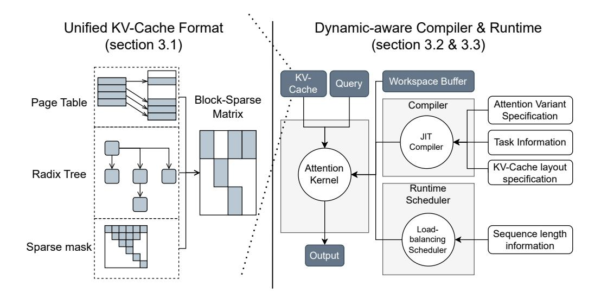

# FLASHINFER: EFFICIENT AND CUSTOMIZABLE ATTENTION ENGINE FOR LLM INFERENCE SERVING

Zihao Ye\*12 Lequn Chen3 Ruihang Lai4 Wuwei Lin2 Yineng Zhang5 Stephanie Wang1 Tianqi Chen24 Baris Kasikci1 Vinod Grover2 Arvind Krishnamurthy1 Luis Ceze12

#### ABSTRACT

Transformers, driven by attention mechanisms, form the foundation of large language models (LLMs). As these models scale up, efficient GPU attention kernels become essential for high-throughput and low-latency inference. Diverse LLM applications demand flexible and high-performance attention solutions. We present FlashInfer: a customizable and efficient attention engine for LLM serving. FlashInfer tackles KV-cache storage heterogeneity using block-sparse format and composable formats to optimize memory access and reduce redundancy. It also offers a customizable attention template, enabling adaptation to various settings through Just-In-Time (JIT) compilation. Additionally, FlashInfer's load-balanced scheduling algorithm adjusts to dynamism of user requests while maintaining compatibility with CUDAGraph which requires static configuration. FlashInfer have been integrated into leading LLM serving frameworks like SGLang, vLLM and MLC-Engine. Comprehensive kernel-level and end-to-end evaluations demonstrate FlashInfer's ability to significantly boost kernel performance across diverse inference scenarios: compared to state-of-the-art LLM serving solutions, FlashInfer achieve 29-69% inter-token-latency reduction compared to compiler backends for LLM serving benchmark, 28-30% latency reduction for long-context inference, and 13-17% speedup for LLM serving with parallel generation.

Project page: http://flashinfer.ai

## 1 Introduction

The Transformer architecture has become the primary backbone for large language models (LLMs), prominently featuring attention mechanism (Vaswani et al., 2017) as its most salient component. As LLMs rapidly evolve and find applications in diverse fields, the demand for efficient GPU attention kernels grows, with the goal of enabling scalable and responsive model inference. At the heart of LLM inference lies the attention computation, which plays a crucial role in processing historical context and generating outputs based on query vectors. In LLM serving, the attention mechanism reads from the KV cache, which stores historical context, and computes outputs based on the current query. The efficiency of this attention operator is paramount to the overall performance of an LLM inference systems. However, creating high-performance attention kernels tailored for LLM serving introduces challenges not typically encountered in

Proceedings of the 8th MLSys Conference, Santa Clara, CA, USA, 2025. Copyright 2025 by the author(s).

traditional training environments.

Two major challenges arise when building efficient attention support for LLM systems:

LLM applications exhibit diverse workload patterns and input dynamics. LLM serving involves various attention computation patterns, from prefill computation for context processing to batched decoding during serving (Yu et al., 2022). As multiple requests are processed, opportunities for *prefix-reuse* emerge, and the introduction of tree decoding in speculative scenarios creates additional attention patterns (Cai et al., 2024; Miao et al., 2024; Chen et al., 2024). Moreover, query lengths and KV caches vary within batches and over time, naive implementation might suffer load-imbalance issue, optimal scheduling requiring kernel to adapt dynamically for optimal performance.

Modern hardware implementations necessitate the customization of attention operators. On the memory side, efficient storage formats, such as paged attention (Kwon et al., 2023) and radix trees (Zheng et al., 2023b), are critical for managing the growing KV cache sizes and diverse storage patterns. On the compute side, crafting hardware-specific pipelines and templates is indispensable to fully exploit the performance potential of each GPU architecture (Dao, 2023;

\*Part of the work was done while Zihao Ye was interning at NVIDIA. ¹Paul G. Allen School of Computer Science & Engineering, University of Washington ²NVIDIA ³Perplexity AI ⁴Carnegie Mellon University ⁵Independent Researcher. Correspondence to: Zihao Ye <zhye@cs.washington.edu>.

Figure 1. Overview of the FlashInfer system design: Attention variant specifications, task information and KV-cache layout specifics are provided at compile time for JIT compilation, while sequence length information is input at runtime for dynamic scheduling.

[Shah et al.,](#page-15-0) [2024\)](#page-15-0). Furthermore, the design must accommodate the increasing variety of attention mechanisms in modern LLMs, such as grouped attention heads [\(Ainslie et al.,](#page-11-0) [2023;](#page-11-0) [Shazeer,](#page-15-0) [2019\)](#page-15-0), specialized masks [\(Beltagy et al.,](#page-11-0) [2020\)](#page-11-0), and customized attention score computations [\(Riv](#page-14-0)[ière et al.,](#page-14-0) [2024;](#page-14-0) [xAI,](#page-15-0) [2023;](#page-15-0) [Ramapuram et al.,](#page-14-0) [2024\)](#page-14-0), necessitating flexible and scalable implementation strategies.

The combined complexity of workload diversity and hardware heterogeneity complicates the development of a comprehensive attention solution. Currently, each system implements a specialized attention solution based on a subset of these characteristics, leading to high maintenance overhead and potential inefficiencies. To address these challenges, we introduce FlashInfer, a code-generation based attention engine designed to accelerate attention computation in LLMs. Our approach incorporates several key designs:

FlashInfer utilizes a block-sparse format to tackle KV-Cache storage heterogeneity. This format serves as a unified data structure for various KV-Cache configurations, with adjustable block sizes allowing fine-grained sparsity, such as vector-level sparsity [\(Chen et al.,](#page-11-0) [2021;](#page-11-0) [Li et al.,](#page-13-0) [2022\)](#page-13-0). This approach unifies diverse KV-Cache patterns and enhances memory access efficiency.

A customizable attention template supports different attention variants in FlashInfer. FlashInfer provides a customizable programming interface for users to implement their attention variants. FlashInfer uses Just-In-Time (JIT) compilation to translate these variants into highly optimized block-sparse implementations, ensuring rapid adaptation to varying attention configurations.

