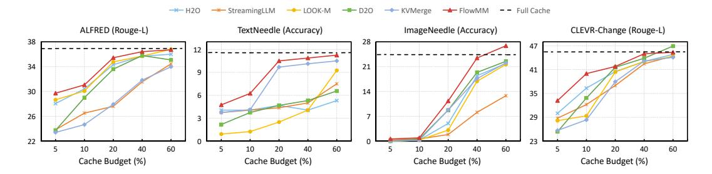

# 4 EXPERIMENTS

## 4.1 EXPERIMENTAL SETTINGS

We sample seven tasks from the MileBench benchmark [\(Song et al., 2024\)](#page-11-4), which is the first benchmark specifically designed to test the long-context multimodal capabilities of MLLMs. MileBench covers a wide range of general scenarios, including temporal multi-image tasks, semantic multiimage tasks, needle-in-a-haystack tasks, and image retrieval tasks. On average, each sample in MileBench contains 15.2 images and 422.3 words.

To comprehensively evaluate FlowMM, we conduct experiments on several widely-adopted MLLMs: Qwen2.5-VL-7B [\(Bai et al., 2025\)](#page-9-2), InternVL2.5-8B [\(Chen et al., 2024b\)](#page-9-0), and MobileVLM-V2-3B [\(Chu et al., 2024\)](#page-9-3). These models represent diverse architectures, enabling a robust assessment of FlowMM's effectiveness across different model designs. We compare FlowMM against five KV cache compression baselines. StreamingLLM [\(Xiao et al., 2023b\)](#page-11-2) and H2O [\(Zhang](#page-12-8) [et al., 2023b\)](#page-12-8) employ eviction-based strategies, while D2O [\(Wan et al., 2024a\)](#page-11-11) and KVMerge [\(Wang](#page-11-12) [et al., 2024c\)](#page-11-12) utilize merging-based approaches. All four are text-based KV cache compression methods. Additionally, we compare against LOOK-M [\(Wan et al., 2024b\)](#page-11-13), a multimodal-specific KV cache merging method.

### 4.2 MAIN RESULT

In Table [1,](#page-6-0) we present a comparative evaluation of FlowMM against prominent KV cache compression methods in multimodal long-context scenarios. The results highlight FlowMM's efficacy

Figure 4: Evaluation results of FlowMM and other KV cache compression methods with varied cache budgets.

in managing KV cache under strict memory constraints while maintaining competitive task performance. Notably, FlowMM achieves a substantial 80% reduction in memory usage with only a minimal 0.12% average accuracy degradation on InternVL-2.5-8B compared to full cache retention.

Furthermore, FlowMM consistently surpasses eviction-based baselines across most datasets. This advantage is particularly evident in the challenging TextNeedle task, where FlowMM delivers a significant 5.31% accuracy improvement on Qwen2.5-VL-7B. This performance gap underscores a key limitation of eviction methods: their discarding of KV entries inherently leads to context loss, directly contributing to suboptimal model responses. FlowMM also outperforms merging-based approaches. We attribute this superiority to FlowMM's layer-adaptive merging strategy, which dynamically adjusts merging decisions by identifying cross-modal attention flows. This mechanism effectively prevents modality confusion during merging while fostering deeper semantic relationships across modalities, thereby enhancing the model's capability to comprehend complex multimodal contexts.

#### 4.3 INFLUENCE OF VARIOUS CACHE COMPRESSION RATIOS

To validate the effectiveness of FlowMM under varying cache budgets, we conduct experiments on the Qwen2.5-VL-7B model with cache budgets ranging from 5% to 60%. We select four tasks for evaluation: ALFRED, Text Needle In A Haystack, Image Needle In A Haystack, and CLEVR-Change. The results are presented in Figure 4. FlowMM consistently outperform the baseline across all budgets. Notably, in the Text Needle In A Haystack task, FlowMM achieve significantly better performance with a 20% cache budget than the eviction-based method with a 60% cache budget. When the cache budget is below 10%, FlowMM demonstrates a substantial advantage over the baseline, indicating that cross-modal information flow alignment approach effectively retains crucial multimodal contextual information. Moreover, FlowMM achieves performance comparable to full caching with a 40% cache budget and even surpasses full caching in the Image Needle In A Haystack task with a 60% cache budget. We attribute this to FlowMM's dynamic identification of token sensitivity during the merging process, which effectively prevents the dilution of task-specific key contexts and minimizes the excessive merging of task-irrelevant information.

### 4.4 EFFICIENCY ANALYSIS

As shown in Table 2, we evaluate the efficiency of our proposed method. Specifically, we measure decoding speed and GPU memory consumption during inference, comparing configurations with and without our approach. To ensure reliable and robust findings, all tests are conducted using 20 randomly sampled data entries on a single NVIDIA A100 Tensor Core GPU.

Table 2: Model Speed and KV Cache GPU Memory Usage. The best results are highlighted in **bold**.

| Method     | Budget | Decoding Latency | GPU Memory |
|------------|--------|------------------|------------|
| Full Cache | 100%   | 29.08 ms/token   | 2.06 GiB   |
|            | 50%    | 23.04 ms/token   | 1.05 GiB   |
| FlowMM     | 35%    | 19.18 ms/token   | 0.74 GiB   |
|            | 20%    | 17.35 ms/token   | 0.44 GiB   |
|            | 5%     | 15.81 ms/token   | 0.13 GiB   |

FlowMM demonstrates substantially reduced decoding latency compared to the full-cache model. This advantage is particularly pronounced in long-context tasks, where the efficiency of our method

is further enhanced. We further analyze GPU memory utilization under varying KV cache budgets, with results averaged across inference runs on 20 randomly selected data points. Our findings indicate that the average GPU memory consumption is nearly proportional to the cache budget. Specifically, with a 20% KV cache budget, the memory usage during the decoding phase is reduced by approximately 80% compared to the full cache scenario. This highlights the effectiveness of FlowMM for KV cache compression.

#### 4.5 ABLATION STUDY

#### 4.5.1 Cross-Modal Merging Threshold $\theta$ .

The cross-modal merging threshold  $\theta$  dynamically controls the merging strategy applied at specific layers. To assess its impact, we conduct experiments on Qwen2.5-VL-7B. As presented in Table 3, we observe peak model performance across diverse datasets when the threshold

Table 3: Performance under different cross-modal merging threshold  $\theta$ .

|            | 0.1   | 0.2                | 0.3          | 0.4   | 0.5   | 0.6   |
|------------|-------|--------------------|--------------|-------|-------|-------|
| TextNeedle | 8.36  | <b>10.00</b> 35.11 | 9.51         | 8.47  | 7.38  | 7.09  |
| ALFRED     | 34.69 |                    | <b>35.43</b> | 34.78 | 34.92 | 33.61 |

 $\theta$  is set between 0.2 and 0.3. Overly low  $\theta$  values trigger cross-modal merging too early in the network. This premature fusion occurs before tokens from different modalities have sufficiently interacted, leading to confusion of information and consequently, performance deterioration. Conversely, an excessively high  $\theta$  value restricts merging predominantly to within individual modalities throughout most layers. This limitation prevents adequate cross-modal fusion, hindering the model's ability to effectively integrate heterogeneous information and resulting in suboptimal performance.

#### 4.5.2 EFFECTIVENESS OF EACH COMPONENT.

We conduct ablations to validate the necessity of core components in our FlowMM. We evaluate Qwen2.5-VL-7B on three benchmark datasets: TextNeedle, STD, and ALFRED. As shown in Table 4, both crossmodal information flow guidance and sensitivity-adaptive token preservation are critical for performance.

Table 4: Ablation study of the effect of individual module.

| Method                                                                                      | TextNeedle                    | STD                              | ALFRED                         |
|---------------------------------------------------------------------------------------------|-------------------------------|----------------------------------|--------------------------------|
| Full Cache                                                                                  | 11.56                         | 28.13                            | 36.92                          |
| FlowMM w.o. Information Flow Guidance w.o. Sensitivity-Adaptive Matching w.o. both | 10.00 5.67 6.32 3.61 | 28.08 26.32 27.14 25.24 | <b>35.43</b> 33.58 33.75 31.01 |

Cross-modal information flow quantifies the interaction intensity between heterogeneous modalities. This metric enables adaptive KV cache merging strategies tailored to each layer's specific interaction pattern. As demonstrated in Table 4, removing this adaptive guidance incurs significant performance degradation. The removal of this strategy results in a performance drop, which underscores its efficacy in multimodal long contexts. This finding corroborates our earlier assertion that there are significant differences in cross-modal interaction intensity across different layers of MLLMs. Neglecting these layer-wise differences risks suboptimal multimodal information integration. By allowing the model to dynamically adjust the merging strategy based on the interaction pattern of each layer, cross-modal information flow guidance enables the model to maximize context integration while preserving its inherent cross-modal processing characteristics.

As shown in Table 4, disabling token sensitivity preservation consistently degrades performance across all tasks. This effect is particularly pronounced in the TextNeedle task, where performance drops by 3.68%, thus establishing the effectiveness of our approach. These results underscore the necessity of preserving highly sensitive, task-relevant tokens within multimodal long-context scenarios. Our merging strategy incorporates both token similarity and sensitivity. This dual-pronged approach not only facilitates effective context integration but also safeguards against performance degradation caused by misalignment and dilution of critical information during the merging process.

