# **4 Fine-tuning with FoundationMotion for State-of-the-Art Motion Understanding**

### **4.1 Experimental Setup**

**Training data.** For training, we take videos from InternVid [\(Wang et al., 2023\)](#page-12-11), randomly extract 5-second clips from each video, and use the proposed auto-labeling pipeline to obtain captioning and QA data for each video clip. This results in a total of 467K caption/QA-video pairs.

**Evaluation data.** We evaluate our model on both public benchmarks and self-labeled benchmarks. The public benchmarks include MotionBench [\(Hong et al., 2025\)](#page-11-5) and VLM4D [\(Zhou et al., 2025\)](#page-13-1), two common benchmarks that evaluate motion understanding in videos. Concretely, MotionBench is a benchmark for fine-grained motion understanding covering six motion tasks, built from internet videos, public datasets, and Unity-simulated data, and containing 5,385 videos with 8,052 carefully human-annotated QA pairs. VLM4D is a benchmark that is specifically designed to test the spatiotemporal reasoning capability of VLMs and contains 1800 QA pairs over 1000 videos that are either from the real world or simulated.

The self-labeled benchmarks ("how" motion benchmark), on the other hand, are curated to test the model's zero-shot generalizability to out-of-distribution videos. Specifically, we evaluate motion understanding in daily scenes, autonomous vehicles (AV) and robotic scenarios, which are

Table 1: Comparison on motion benchmarks. Accuracy gains/losses are marked green/red. The highest and second highest value marked with **bold** / underline. Results are percentages (%). Our **FoundationMotion** dataset consistently boosts performance across benchmarks and yields larger gains than PLM when fine-tuned with the same number of examples. Training with FoundationMotion data brings signiciant improvement on various motion tasks.

| Model                  | MotionBench | VLM4D     | AV-Car    | AV-Hand   | Daily      | Robotics   |
|------------------------|-------------|-----------|-----------|-----------|------------|------------|
| Gemini-2.5-Flash       | 55.6        | 54.7      | 84.1      | 72.7      | 75.4       | 36.1       |
| Qwen-2.5-VL-72B        | 61.4        | 50.5      | 83.3      | 56.5      | 80.2       | 36.7       |
| NVILA-Video-15B        | 45.7        | 51.8      | 84.4      | 58.1      | 76.2       | 21.4       |
| FT w/ FoundationMotion | 46.7+1.0↑   | 51.9+0.1↑ | 91.5+7.1↑ | 58.7+0.6↑ | 78.6+2.4↑  | 36.3+14.9↑ |
| FT w/ PLM 467k         | 47.5+1.8↑   | 52.9+1.1↑ | 79.4−5.0↓ | 55.6−2.5↓ | 77.1+0.9↑  | 27.4+6.0↑  |
| NVILA-Video-8B         | 42.3        | 49.0      | 88.9      | 54.6      | 79.1       | 20.4       |
| FT w/ FoundationMotion | 42.9+0.6↑   | 52.4+3.4↑ | 90.6+1.7↑ | 61.4+6.8↑ | 81.1+2.0↑  | 38.2+17.8↑ |
| FT w/ PLM 467k         | 43.6+1.3↑   | 49.1+0.1↑ | 87.9−1.0↓ | 56.0+1.4↑ | 75.0−4.1↓  | 26.5+6.1↑  |
| Qwen-2.5-VL-7B         | 39.1        | 41.7      | 80.3      | 47.2      | 61.4       | 28.3       |
| FT w/ FoundationMotion | 41.3+2.1↑   | 44.9+3.2↑ | 82.1+1.8↑ | 52.8+5.6↑ | 73.1+11.7↑ | 32.5+4.2↑  |

different from the training videos. For daily scenes, we source videos from 100 Days of Hands [\(Shan](#page-12-12) [et al., 2020\)](#page-12-12) and manually label 832 QA pairs that are focused on hand motions and hand-object interactions, referring to this benchmark as *Daily*. Similarly, we collect robotic videos from YouTube and manually label 102 QA pairs on robot motions (*Robotics*), primarily on the robot's hands. We also collect videos from the widely used Nuscenes dataset [\(Caesar et al., 2020\)](#page-10-2) and turn the official manually annotated motion captions [\(Li et al., 2025\)](#page-11-11) into 1,968 QA pairs that focus on cars' motion (*AV-Car*) and 108 QA pairs that focus on hands' motion (*AV-Hand*). Therefore, we establish four zero-shot motion benchmarks: AV-car, AV-hand, Daily, and Robotics, with examples from each benchmark shown in Figure [3.](#page-6-1) We emphasize that there is no overlap between the FoundationMotion dataset and the evaluation benchmarks, which means the results are fully zero-shot.

### **Baselines.**

**Implementation Details.** Our experiments are conducted on 8 A100 GPUs for both training and testing. For Qwen-related training, we use llamafactory [\(Zheng et al., 2024\)](#page-13-2) and follow the recommended settings with a learning rate of 10−5 . For NVILA-related training, we follow the official settings [\(Liu et al., 2025\)](#page-11-0) and set the learning rate to 1.5 × 10−5 . We apply a cosine annealing schedule and choose Adam as the optimizer. No weight decay is applied.

### **4.2 Main Results**

**Using FoundationMotion data for fine-tuning yields clear gains across benchmarks and datasets.** With *NVILA-Video-15B*, FoundationMotion lifts MotionBench by *+1.0%*, AV-Car by +7.1%, and Robotics by *+14.9%*, while also providing smaller but consistent gains on VLM4D (+0.1%), AV-Hand (+0.6%), and Daily *(+2.4%)*. For *NVILA-Video-8B*, FoundationMotion data improves MotionBench by *+0.6%*, AV-Car by *+6.8%*, and Robotics by *+17.8%*. Similarly, for *Qwen-2.5-VL-7B*, FoundationMotion delivers broad gains across MotionBench *(+2.1%)*, VLM4D *(+3.2%)*, AV-Car *(+1.8%)*, AV-Hand *(+5.6%)*, Daily *(+11.7%)*, and Robotics *(+4.2%)*. These results demonstrate consistent improvements across diverse motion and spatial reasoning tasks.

**Compared with PLM data, fine-tuning on our data with the same budget gives bigger improvements and avoids performance drops.** Compared with PLM, our dataset yields larger and more consistent gains with the same number of examples. On *NVILA-Video-15B* (FoundationMotion vs PLM ), FoundationMotion surpasses PLM on AV-Car *(+7.1% vs. -5.0%)*, AV-Hand *(+0.6% vs. -2.5%)*, Daily *(+2.4% vs. +0.9%)*, and Robotics *(+14.9% vs. +6.0%)*, with PLM slightly better only on MotionBench *(+1.0% vs. +1.8%)* and VLM4D *(+0.1% vs. +1.1%)*. On *NVILA-Video-8B*, our dataset again dominates: VLM4D *(+3.4% vs. +0.1%)*, AV-Car *(+1.7% vs. -1.0%)*, AV-Hand *(+6.8% vs. +1.4%)*, Daily *(+2.0% vs. -4.1%)*, and Robotics *(+17.8% vs. +6.1%)*, while slightly unperforming on MotionBench *(+0.6% vs. +1.3%)*. These results demonstrate that the FoundationMotion dataset provides higher-quality supervision than an equal amount of PLM data.

**With FoundationMotion data, 15B and 7B models surpass Gemini-2.5-Flash and Qwen-2.5-VL-72B on several motion tasks.** FoundationMotion-tuned models can even outperform much larger models like *Gemini-2.5-Flash* and *Qwen-2.5-VL-72B* on several tasks. With *NVILA-Video-15B + FoundationMotion*, AV-Car reaches *91.5%*, surpassing *Gemini-2.5-Flash (84.1%)* and *Qwen-2.5-VL-72B (83.3%)*. The same model also exceeds *Qwen-72B* on VLM4D *(51.9% vs. 50.5%)* and AV-Hand *(58.7% vs. 56.5%)*. These results show that mid-sized open models, when fine-tuned with FoundationMotion, can surpass much larger closed-source and open-source models on motion benchmarks.

## **5 Analysis**

The experimental results in the previous section demonstrate the high quality of our dataset; finetuning models with only *46.7k* videos (*467k* QAs) already leads to substantial improvements in motion understanding. In this section, we analyze the dataset, including ablation studies on the data curation process (Sec. [5.1\)](#page-8-0) as well as the data distribution and overall statistics (Sec. [5.2\)](#page-9-0).

### **5.1 Data Curation Related Analysis**

Our data curation pipeline rests on two key factors. (i) By leveraging object detection and trajectory tracking, we extract precise spatial relations and motion trajectories of all objects in the videos and feed them into LLMs to generate detailed captions and QA pairs. (ii) We design five complementary QA types that jointly capture diverse aspects of spatial relationships and motion understanding. In the following sections, we evaluate the contribution of each factor.

Table 2: Comparison of QA quality from video-only vs. video+bounding box JSONs, evaluated by GPT-4. Scores are normalized to 0–10 (higher is better) and averaged over three runs.

| Evaluation Dimension          | Video Only | Video + BBox JSONs | Gain |
|-------------------------------|------------|--------------------|------|
| Fine-grained Action Accuracy  | 5.8        | 8.4                | +2.6 |
| Motion Detail and Specificity | 6.1        | 8.7                | +2.6 |
| Temporal Coherence            | 6.5        | 8.9                | +2.4 |
| Question Relevance            | 6.9        | 8.5                | +1.6 |
| Overall QA Quality            | 6.3        | 8.6                | +2.3 |

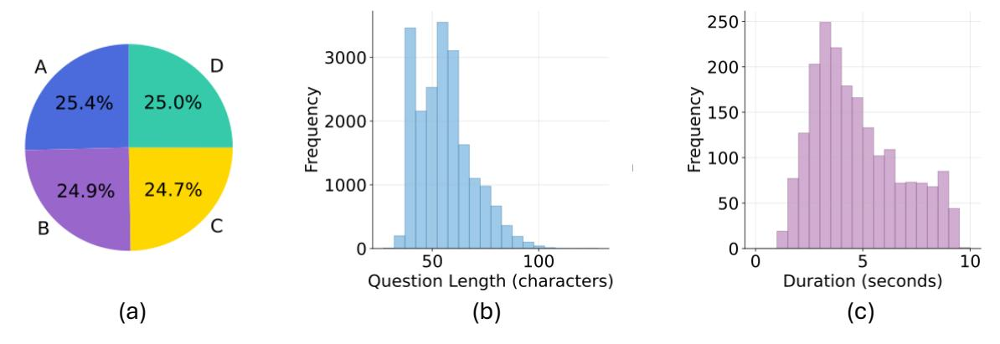

Figure 5: Dataset statistics. (a) correct answer distribution across options, (b) question length distribution measured in characters, and (c) video duration distribution in seconds.

Bounding Box JSONs Improve Caption and QA Generation. To assess the effect of structured object annotations, we compare QA generation with two input settings for LLMs: (i) video-only input and (ii) video with bounding box JSONs. We use GPT-4 as the evaluator (see prompts in Appendix A.4). As shown in Table 2, setting (ii) achieves higher scores across all dimensions, yielding substantial gains, particularly in fine-grained action accuracy (+2.6), motion detail and specificity (+2.6), and temporal coherence (+2.4). These improvements highlight the role of bounding boxes in providing structured spatial signals that help disambiguate subtle motions (e.g., hand reaching, object sliding) and support richer, temporally coherent QA generation. In contrast, video-only input often produces generic and less precise descriptions.

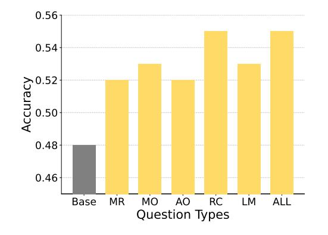

Figure 4: Impact of different question types on model performance.

**Different QA Pair Types Provide Complementary Benefits.** We have five different question types, and in this section we study their impact on model performance. We take Qwen2.5-7B as the base model and fine-tune it with 2,000 data samples for each experiment. As shown in Figure 4, every motion-focused question type outperforms the baseline (Base = 48%). Motion Recognition (MR) and Action Order (AO) each reach 52% (+8.3% over Base), Motion-related Objects (MO) and Location-related Motion (LM) both achieve 53% (+10.4%), and Repetition Count (RC) delivers the largest gain at approximately 55% (+14.6%).

The aggregated setting (ALL) also attains 55%, indicating that combining types matches the best single-type improvement and stabilizes performance. The ranking is  $RC \approx ALL > MO \approx LM > MR \approx AO \gg Base$ , suggesting that categories demanding explicit temporal integration and counting (RC) add the most, while object/spatial grounding (MO/LM) and coarse motion recognition/ordering (MR/AO) contribute complementary, mid-sized gains. Overall, the diverse QA types target distinct error modes—temporal precision, object—motion association, and spatial grounding—whose combined coverage yields consistent improvements over the baseline.

### **5.2 Data Distribution of the FoundationMotion Dataset**

The FoundationMotion Dataset consists of *46.7k* videos and *467k* QAs, where each QA pair consists of a question, four options, an answer, and a category. The task distribution is displayed in Fig. [5.](#page-9-2) Fig. [5\(](#page-9-2)a) shows that the correct answers are evenly distributed across the four options, indicating no annotation bias. Fig. [5](#page-9-2) (b) illustrates the distribution of question lengths measured in characters, where most questions fall between *30* and *80* characters. Fig. [5](#page-9-2) (c) reports the distribution of video durations, which are mostly concentrated within *3–7* seconds, ensuring that the dataset emphasizes short but motion-rich clips. Together, these statistics highlight that FoundationMotion provides a balanced QA design, concise yet informative questions, and temporally compact videos well-suited for motion-centric video understanding.

## **6 Conclusion**

In this paper, we propose FoundationMotion, an automated motion labeling pipeline for generalized spatial detection, tracking, and understanding of object behaviors. We demonstrate that fine-tuning with the FoundationMotion Dataset on various "how" motion benchmarks enables existing open-source VLMs to outperform larger models, and even compete with or surpass some closed-source models such as Gemini-2.5-Flash.

**Limitations and Future Work.** While FoundationMotion has achieved significantly strong results as demonstrated, its current spatial understanding is primarily limited to 2D space. Understanding "how" objects move in 3D remains a challenging but essential step toward a more comprehensive understanding of the real world. For example, while we demonstrate hand movement in this paper, understanding how each joint moves to form dexterous hand motions in 3D space would greatly benefit robotics and related applications. We will continue to explore this direction and promise to release all our code, data, and benchmarks to support further development in this field.

## **References**

Sergio Arnaud, Paul McVay, Ada Martin, Arjun Majumdar, Krishna Murthy Jatavallabhula, Phillip Thomas, Ruslan Partsey, Daniel Dugas, Abha Gejji, Alexander Sax, Vincent-Pierre Berges, Mikael Henaff, Ayush Jain, Ang Cao, Ishita Prasad, Mrinal Kalakrishnan, Michael Rabbat, Nicolas Ballas, Mido Assran, Oleksandr Maksymets, Aravind Rajeswaran, and Franziska Meier. Locate 3d: Real-world object localization via self-supervised learning in 3d, 2025. URL [https://arxiv.](https://arxiv.org/abs/2504.14151) [org/abs/2504.14151](https://arxiv.org/abs/2504.14151).

Shuai Bai, Keqin Chen, Xuejing Liu, Jialin Wang, Wenbin Ge, Sibo Song, Kai Dang, Peng Wang, Shijie Wang, Jun Tang, Humen Zhong, Yuanzhi Zhu, Mingkun Yang, Zhaohai Li, Jianqiang Wan, Pengfei Wang, Wei Ding, Zheren Fu, Yiheng Xu, Jiabo Ye, Xi Zhang, Tianbao Xie, Zesen Cheng, Hang Zhang, Zhibo Yang, Haiyang Xu, and Junyang Lin. Qwen2.5-vl technical report, 2025. URL <https://arxiv.org/abs/2502.13923>.

Holger Caesar, Varun Bankiti, Alex H Lang, Sourabh Vora, Venice Erin Liong, Qiang Xu, Anush Krishnan, Yu Pan, Giancarlo Baldan, and Oscar Beijbom. nuscenes: A multimodal dataset for autonomous driving. In *Proceedings of the IEEE/CVF conference on computer vision and pattern recognition*, pp. 11621–11631, 2020.

- Guo Chen, Zhiqi Li, Shihao Wang, Jindong Jiang, Yicheng Liu, Lidong Lu, De-An Huang, Wonmin Byeon, Matthieu Le, Tuomas Rintamaki, et al. Eagle 2.5: Boosting long-context post-training for frontier vision-language models. *arXiv preprint arXiv:2504.15271*, 2025.
- Yukang Chen, Fuzhao Xue, Dacheng Li, Qinghao Hu, Ligeng Zhu, Xiuyu Li, Yunhao Fang, Haotian Tang, Shang Yang, Zhijian Liu, Ethan He, Hongxu Yin, Pavlo Molchanov, Jan Kautz, Linxi Fan, Yuke Zhu, Yao Lu, and Song Han. Longvila: Scaling long-context visual language models for long videos, 2024. URL <https://arxiv.org/abs/2408.10188>.
- Tianyi Cheng, Dandan Shan, Ayda Hassen, Richard Higgins, and David Fouhey. Towards a richer 2d understanding of hands at scale. *Advances in Neural Information Processing Systems*, 36: 30453–30465, 2023.
- Jang Hyun Cho, Andrea Madotto, Effrosyni Mavroudi, Triantafyllos Afouras, Tushar Nagarajan, Muhammad Maaz, Yale Song, Tengyu Ma, Shuming Hu, Suyog Jain, Miguel Martin, Huiyu Wang, Hanoona Rasheed, Peize Sun, Po-Yao Huang, Daniel Bolya, Nikhila Ravi, Shashank Jain, Tammy Stark, Shane Moon, Babak Damavandi, Vivian Lee, Andrew Westbury, Salman Khan, Philipp Krähenbühl, Piotr Dollár, Lorenzo Torresani, Kristen Grauman, and Christoph Feichtenhofer. Perceptionlm: Open-access data and models for detailed visual understanding, 2025. URL <https://arxiv.org/abs/2504.13180>.
- Gheorghe Comanici, Eric Bieber, Mike Schaekermann, et al. Gemini 2.5: Pushing the frontier with advanced reasoning, multimodality, long context, and next generation agentic capabilities, 2025. URL <https://arxiv.org/abs/2507.06261>.
- Songhao Han, Wei Huang, Hairong Shi, Le Zhuo, Xiu Su, Shifeng Zhang, Xu Zhou, Xiaojuan Qi, Yue Liao, and Si Liu. Videoespresso: A large-scale chain-of-thought dataset for fine-grained video reasoning via core frame selection. In *Proceedings of the Computer Vision and Pattern Recognition Conference (CVPR)*, pp. 26181–26191, June 2025.
- Wenyi Hong, Yean Cheng, Zhuoyi Yang, Weihan Wang, Lefan Wang, Xiaotao Gu, Shiyu Huang, Yuxiao Dong, and Jie Tang. Motionbench: Benchmarking and improving fine-grained video motion understanding for vision language models. In *Proceedings of the Computer Vision and Pattern Recognition Conference*, pp. 8450–8460, 2025.
- Aaron Hurst, Adam Lerer, Adam P Goucher, Adam Perelman, Aditya Ramesh, Aidan Clark, AJ Ostrow, Akila Welihinda, Alan Hayes, Alec Radford, et al. Gpt-4o system card. *arXiv preprint arXiv:2410.21276*, 2024.
- Boyi Li, Ligeng Zhu, Ran Tian, Shuhan Tan, Yuxiao Chen, Yao Lu, Yin Cui, Sushant Veer, Max Ehrlich, Jonah Philion, et al. Wolf: Dense video captioning with a world summarization framework. *Transactions on Machine Learning Research*, 2025.
- Yanghao Li, Hanzi Mao, Ross Girshick, and Kaiming He. Exploring plain vision transformer backbones for object detection, 2022. URL <https://arxiv.org/abs/2203.16527>.
- Shilong Liu, Zhaoyang Zeng, Tianhe Ren, Feng Li, Hao Zhang, Jie Yang, Chunyuan Li, Jianwei Yang, Hang Su, Jun Zhu, et al. Grounding dino: Marrying dino with grounded pre-training for open-set object detection. *arXiv preprint arXiv:2303.05499*, 2023.
- Zhijian Liu, Ligeng Zhu, Baifeng Shi, Zhuoyang Zhang, Yuming Lou, Shang Yang, Haocheng Xi, Shiyi Cao, Yuxian Gu, Dacheng Li, et al. Nvila: Efficient frontier visual language models. In *Proceedings of the Computer Vision and Pattern Recognition Conference*, pp. 4122–4134, 2025.

- Nikhila Ravi, Valentin Gabeur, Yuan-Ting Hu, Ronghang Hu, Chaitanya Ryali, Tengyu Ma, Haitham Khedr, Roman Rädle, Chloe Rolland, Laura Gustafson, Eric Mintun, Junting Pan, Kalyan Vasudev Alwala, Nicolas Carion, Chao-Yuan Wu, Ross Girshick, Piotr Dollár, and Christoph Feichtenhofer. Sam 2: Segment anything in images and videos, 2024. URL [https://arxiv.org/abs/2408.](https://arxiv.org/abs/2408.00714) [00714](https://arxiv.org/abs/2408.00714).
- Ruchit Rawal, Khalid Saifullah, Miquel Farré, Ronen Basri, David Jacobs, Gowthami Somepalli, and Tom Goldstein. Cinepile: A long video question answering dataset and benchmark, 2024. URL <https://arxiv.org/abs/2405.08813>.
- Dandan Shan, Jiaqi Geng, Michelle Shu, and David F Fouhey. Understanding human hands in contact at internet scale. In *Proceedings of the IEEE/CVF conference on computer vision and pattern recognition*, pp. 9869–9878, 2020.
- Chongjun Tu, Lin Zhang, Pengtao Chen, Peng Ye, Xianfang Zeng, Wei Cheng, Gang Yu, and Tao Chen. Favor-bench: A comprehensive benchmark for fine-grained video motion understanding. *arXiv preprint arXiv:2503.14935*, 2025.
- Barbara Tversky. *Mind in motion: How action shapes thought*. Basic Books, 2019.
- Jasper Uijlings, Xingyi Zhou, Xiuye Gu, Arsha Nagrani, Anurag Arnab, Alireza Fathi, David Ross, and Cordelia Schmid. Vocap: Video object captioning and segmentation from any prompt, 2025. URL <https://arxiv.org/abs/2508.21809>.
- Jianyuan Wang, Minghao Chen, Nikita Karaev, Andrea Vedaldi, Christian Rupprecht, and David Novotny. Vggt: Visual geometry grounded transformer, 2025. URL [https://arxiv.org/](https://arxiv.org/abs/2503.11651) [abs/2503.11651](https://arxiv.org/abs/2503.11651).
- Peng Wang, Shuai Bai, Sinan Tan, Shijie Wang, Zhihao Fan, Jinze Bai, Keqin Chen, Xuejing Liu, Jialin Wang, Wenbin Ge, et al. Qwen2-vl: Enhancing vision-language model's perception of the world at any resolution. *arXiv preprint arXiv:2409.12191*, 2024.
- Yi Wang, Kunchang Li, Yizhuo Li, Yinan He, Bingkun Huang, Zhiyu Zhao, Hongjie Zhang, Jilan Xu, Yi Liu, Zun Wang, et al. Internvideo: General video foundation models via generative and discriminative learning. *arXiv preprint arXiv:2212.03191*, 2022.
- Yi Wang, Yinan He, Yizhuo Li, Kunchang Li, Jiashuo Yu, Xin Ma, Xinhao Li, Guo Chen, Xinyuan Chen, Yaohui Wang, et al. Internvid: A large-scale video-text dataset for multimodal understanding and generation. *arXiv preprint arXiv:2307.06942*, 2023.
- Yuetian Weng, Mingfei Han, Haoyu He, Xiaojun Chang, and Bohan Zhuang. Longvlm: Efficient long video understanding via large language models. In *European Conference on Computer Vision*, pp. 453–470. Springer, 2024.
- Yufei Xu, Jing Zhang, Qiming Zhang, and Dacheng Tao. Vitpose: Simple vision transformer baselines for human pose estimation. *Advances in neural information processing systems*, 35:38571– 38584, 2022.
- Zhucun Xue, Jiangning Zhang, Teng Hu, Haoyang He, Yinan Chen, Yuxuan Cai, Yabiao Wang, Chengjie Wang, Yong Liu, Xiangtai Li, and Dacheng Tao. Ultravideo: High-quality uhd video dataset with comprehensive captions, 2025. URL <https://arxiv.org/abs/2506.13691>.

- Hang Zhang, Xin Li, and Lidong Bing. Video-llama: An instruction-tuned audio-visual language model for video understanding. *arXiv preprint arXiv:2306.02858*, 2023.
- Yaowei Zheng, Richong Zhang, Junhao Zhang, Yanhan Ye, Zheyan Luo, Zhangchi Feng, and Yongqiang Ma. Llamafactory: Unified efficient fine-tuning of 100+ language models. In *Proceedings of the 62nd Annual Meeting of the Association for Computational Linguistics (Volume 3: System Demonstrations)*, Bangkok, Thailand, 2024. Association for Computational Linguistics. URL <http://arxiv.org/abs/2403.13372>.

Shijie Zhou, Alexander Vilesov, Xuehai He, Ziyu Wan, Shuwang Zhang, Aditya Nagachandra, Di Chang, Dongdong Chen, Xin Eric Wang, and Achuta Kadambi. Vlm4d: Towards spatiotemporal awareness in vision language models. *arXiv preprint arXiv:2508.02095*, 2025.

## **A Appendix**

### **A.1 Basic Statistics of FoundationMotion Dataset**

Table [3](#page-14-0) summarizes the overall statistics of the FoundationMotion dataset. On average, each video lasts 17.51 seconds and is paired with about 10 questions. This corresponds to an annotation density of 1.671 questions per second, indicating a high level of temporal granularity in QA annotations. The average question length is 55.9 characters, showing that the questions are concise yet sufficiently descriptive. Together, these statistics highlight that FoundationMotion provides dense and informative annotations over relatively short video clips, making it well-suited for evaluating motion-level understanding in video-language models.

**Metric Value** Average video duration 17.51 seconds

Average annotation density 1.671 questions/second Average question length 55.9 characters

Average questions per video 10.04

Table 3: Overall statistics of the FoundationMotion dataset.

### **A.2 Prompts used for Caption Generation**

### Background

You are a detailed video caption generation tool focusing on object motion analysis and spatial relationships. You generate comprehensive captions for videos based on the video itself and the provided object motion information drawn on the video and in JSON.

#### Motion label

The motion information for the video in JSON format is as follows {motion\_info}. It captures bounding box locations for various objects and their interactions in each frame of the video.

In the JSON format, it starts with object id, e.g., "object\_00", "object\_01", "object\_02", etc. Under each object id, there are "bbox", "object\_type" and "interactions" keys for the object. The "bbox" key contains a list of bounding boxes of the object in each frame throughout the video. The "object\_type" key specifies the category of the object (e.g., "person", "cup", "ball", "car", etc.).

Under "interactions", there are lists of other objects that this object is interacting with or spatially related to in each frame. The bounding boxes are in the format of [left, top, right, bottom] where the values are normalized to [0, 1] according to video width and height as in [left/width, top/height, right/width, bottom/height]. If the object is not detected in the frame, the bounding box value will be None in the list at the corresponding frame index. If objects are not interacting with any other objects in the frame,

then "interactions" will be None at the corresponding frame index.

The detected bounding boxes are also drawn on each frame of the video: different object types with labels on top of colored bounding boxes for easy identification.

## **A.3 Prompts used for QA Generation**

#### Background and task

You are provided with a video and a video caption that describes object motions and spatial relationships. Your task is to generate a list of concise questions and corresponding answers that evaluate a viewer's understanding of object motion analysis and spatial relationships.

### Requirements

Question coverage should focus on five main categories:

- \*\*1. Motion Recognition Questions:\*\* \*\*Action description\*\*: What action is [object/person] performing? (e.g., raising hand, skiing, cooking, walking, etc.) - \*\*Activity identification\*\*: Describe the specific motion or gesture being performed - \*\*Behavior characterization\*\*: What type of movement pattern is observed?
- \*\*2. Action Order Questions:\*\* \*\*Temporal sequence\*\*: Which action happens first/second/last? - \*\*Action timing\*\*: What action occurs before/after [specific action]? - \*\*Sequential events\*\*: In what order do the actions unfold?
- \*\*3. Motion-related Object Questions:\*\* \*\*Actor identification\*\*: Which object/person performs [specific action]? - \*\*Object-action association\*\*: What does [object] do in the video? - \*\*Agent-activity linking\*\*: Who or what is responsible for [specific motion]?
- \*\*4. Location-related Motion Questions:\*\* \*\*Spatial motion context\*\*: Where does [action] take place in the scene? - \*\*Position-based activity\*\*: What motion happens in the [left/right/ center/upper/lower] part of the scene? - \*\*Spatial properties\*\*: How does the location affect or relate to the motion?
- \*\*5. Repetition Count Questions:\*\* \*\*Frequency counting\*\*: How many times does [action] occur? - \*\*Repetitive patterns\*\*: How often is [motion] repeated? - \*\*Cyclical behaviors\*\*: What is the count of [repeated action]?
- \*\*6. Traditional Motion Analysis Questions:\*\* \*\*Direction\*\*: Which direction does [object] move? (left, right, up, down, diagonal directions) - \*\*Distance\*\*: How far does [object] move? (specific measurements, relative distances) - \*\*Velocity\*\*: How fast does [object] move? (speed characteristics, acceleration patterns) - \*\*Trajectory\*\*: What path does [object] follow? (straight, curved, circular, zigzag patterns)
- \*\*7. Spatial Relationship Questions:\*\* \*\*Relative positions\*\*: Where is [object A] positioned relative to [object B]? (left/right/up/down/front/back) - \*\*Distance relationships\*\*: How far apart are [object A] and [object B]? - \*\*Positional changes\*\*: How does the spatial relationship between [object A] and [object B] change?

#### Answer requirements

- Answers must be concise and directly address the question. - Include specific directional terms, distance measurements, and spatial descriptors when available. - Do not include extra explanations or thought processes in the answers.

### Task

First, generate a list of questions and answers as below, with an empty line between each question and answer pair. Do not include any other texts in the output. Q1: ... A1: ...

Here are example questions and answers: Q1: What action is the person performing with their right hand? A1: The person is raising their right hand above their head.

Q2: Which action happens first in the video? A2: The person picks up the cup before stirring. Q3: What object performs the cutting motion? A3: The knife performs the cutting motion on the vegetables.

Q4: Where in the scene does the stirring action take place? A4: The stirring action takes place in the upper-left area of the kitchen counter.

Then, for each question and answer, turn the single answer into 4 multiple choices with reasonable choices generated from the caption but distinctive from the correct answer. Please make sure each choice in the four choices is distinctive and do not have ambiguity with any other choice. Check the video content to make sure to never generate ambiguous multiple choices for the same question. Always put the correct answer at the first choice.

### Output format

The output format: output a list of strings and each string contains a question and its corresponding multiple choices as below. The number of questions equal to the number of items in the list. Each question must have 4 choices listed, after A, B, C, D. [ 'Q1: ... A: ... B: ... C: ... D: ...',

... ]

The correct answer is always at A. Do not include any other texts in the output. with an empty line between each question and answer pair.

Focus on generating questions that test understanding of: - Motion recognition and action identification (raising hand, cooking, walking, etc.) - Action temporal sequences and ordering - Object-action associations and actor identification - Location-based motion analysis and spatial context - Repetition counting and frequency analysis - Object movement directions (left, right, up, down, diagonal) - Movement distances and trajectories - Movement speeds and velocity patterns - Spatial positioning (left/right/up/down relationships) - Changes in spatial arrangements - Object proximity and distance relationships

Please generate your questions and answers accordingly, focusing on motion analysis and spatial relationships described in the caption.

## **A.4 Prompts used for evaluate QA quality**

You are an expert evaluator of video-based question–answer generation.

Given two sets of QAs for the same video (Set A: generated with video only; Set B: generated with video + bounding box JSONs), rate each set independently on a scale of 0–10 for the following dimensions:

- 1. Fine-grained action accuracy (does the QA capture detailed actions precisely?)
- 2. Motion detail and specificity (does it describe how objects move, not just that they move?)
- 3. Temporal coherence (are the actions ordered and consistent over time?)
- 4. Question relevance (are the QAs relevant and informative about the video?)

## **A.5 Question-Answer Examples**

#### QA type 1: Motion Recognition

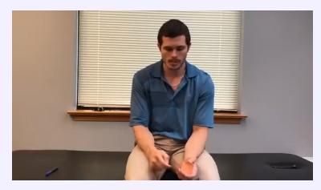

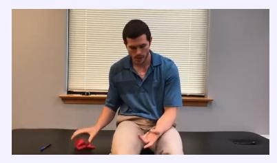

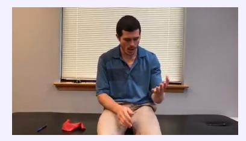

**What action is the person performing with their right hand?**

- A. The person is raising their left hand.
- B. The person is writing with a pen using their left hand.
- C. **The person is manipulating the red object with their right hand.**
- D. The person is resting both hands on their lap.

### QA type 2: Motion-related Objects

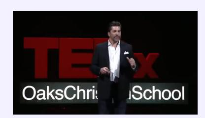

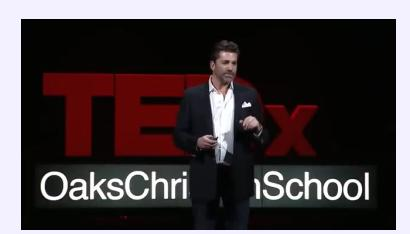

**What object performs the action of holding during the presentation?**

- A. **The speaker's right hand holds an object, likely a microphone or remote.**
- B. The speaker's right hand holds a glass of water.
- C. The speaker's left hand holds a phone.
- D. The speaker's left hand holds a notepad.

### QA type 3: Action Order

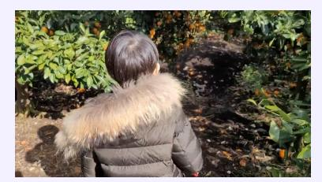

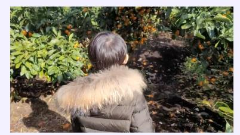

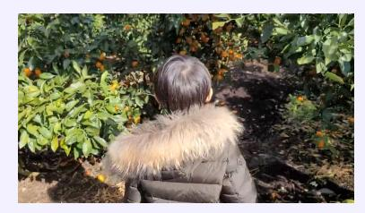

**Which action happens first in the video?**

- A. The child picks an orange before standing still.
- B. **The child stands still before reaching for the oranges.**
- C. The child looks around before reaching for the oranges.
- D. The child walks towards the oranges before reaching.

### QA type 4: Repetition Count

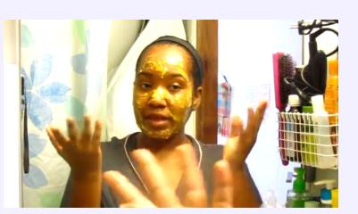

- **5. How many times does the person gesture with their hands?**
- A. The person gestures with their hands three times.
- B. The person gestures with their hands only once.
- C. The person does not gesture with their hands at all.
- D. **The person gestures with their hands multiple times throughout the video.**

### QA type 5: Location-related Motion

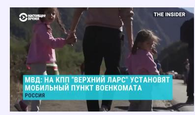

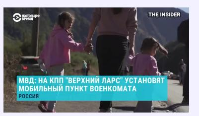

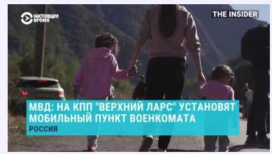

**Where in the scene does the walking action take place?**

- A. **The walking action takes place along a path in the center of the frame.**
- B. The walking action takes place on the left side of the frame.
- C. The walking action takes place indoors.
- D. The walking action takes place in a park.