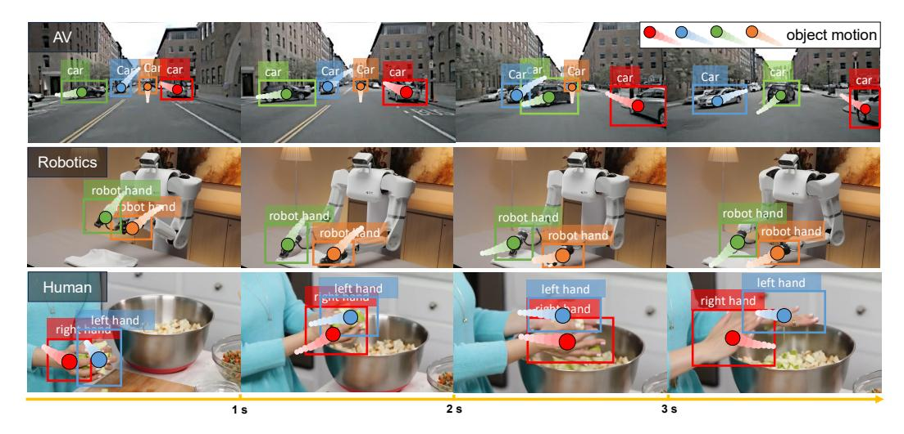
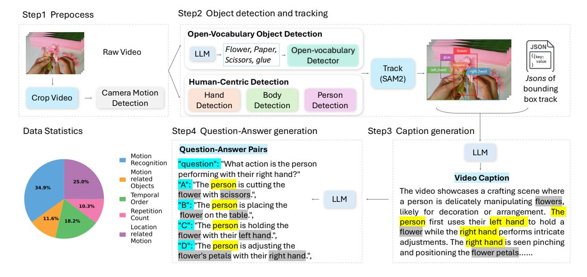
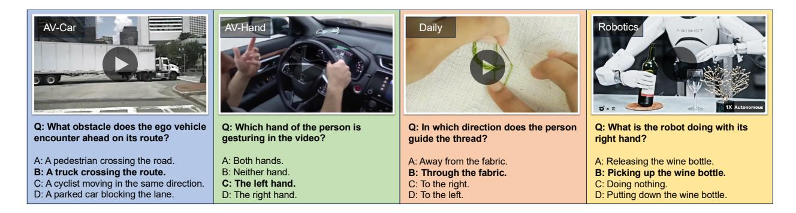

# **FoundationMotion: Auto-Labeling and Reasoning about Spatial Movement in Videos**

Yulu Gan1†∗ Ligeng Zhu2∗ Dandan Shan3∗ Baifeng Shi2,4 Hongxu Yin2 Boris Ivanovic2 Song Han1,2 Trevor Darrell4 Jitendra Malik4 Marco Pavone2,5‡ Boyi Li2,4†‡ 1MIT 2NVIDIA 3UMich 4UC Berkeley 5Stanford University † Project Lead ∗ Equal Contribution ‡ Corresponding author

#### **Abstract**

Motion understanding is fundamental to physical reasoning, enabling models to infer dynamics and predict future states. However, state-of-the-art models still struggle on recent motion benchmarks, primarily due to the scarcity of large-scale, fine-grained motion datasets. Existing motion datasets are often constructed from costly manual annotation, severely limiting scalability. To address this challenge, we introduce FoundationMotion, a fully automated data curation pipeline that constructs large-scale motion datasets. Our approach first detects and tracks objects in videos to extract their trajectories, then leverages these trajectories and video frames with Large Language Models (LLMs) to generate fine-grained captions and diverse question–answer pairs about motion and spatial reasoning. Using datasets produced by this pipeline, we fine-tune open-source models including NVILA-Video-15B and Qwen2.5-7B, achieving substantial improvements in motion understanding without compromising performance on other tasks. Notably, our models outperform strong closed-source baselines like Gemini-2.5 Flash and large open-source models such as Qwen2.5-VL-72B across diverse motion understanding datasets and benchmarks. FoundationMotion thus provides a scalable solution for curating fine-grained motion datasets that enable effective fine-tuning of diverse models to enhance motion understanding and spatial reasoning capabilities.

**Code:** [wolfv0/FoundationMotion](https://github.com/Wolfv0/FoundationMotion/tree/main) **Dataset:** [huggingface.co/datasets/WoWolf/v2-dev](https://huggingface.co/datasets/WoWolf/v2-dev/tree/main) **Model:** [huggingface.co/WoWolf](https://huggingface.co/WoWolf/models) **Website:** [projects/FoundationMotion.html](https://yulugan.com/projects/FoundationMotion.html)

## **1 Introduction**

*"Spatial thinking is the foundation of thought."*

— Barbara Tversky, *Mind in Motion: How Action Shapes Thought*

In *Mind in Motion* [\(Tversky, 2019\)](#page-12-0), psychologist Barbara Tversky argues that spatial cognition is not a secondary aspect of thought but a foundational one. It enables us to make sense of the world through our physical actions and interactions. These real-world movements become internalized as mental operations, often expressed spontaneously through gestures. Moreover, spatial thinking supports a wide range of everyday and expert activities, from using maps and assembling furniture to designing systems and understanding flows of people, traffic, or information. Whether estimating how to parallel park, imagining how to fold a piece of paper into a shape, mentally rotating an object, or figuring out how to carry multiple items through a narrow doorway, we rely on a powerful yet often overlooked capacity: spatial thinking. Motivated by this insight, our goal is to enable machines to effectively describe and reason about object motion, allowing them to understand and reason in the physical world as humans do through the development of robust

Figure 1: **Illustration of motion automatically labeled using FoundationMotion**. Our proposed FoundationMotion automatically detects and tracks moving objects, annotating their spatial movement (motion) in videos. We demonstrate the auto-labeled motion trajectories on diverse video domains, including autonomous driving, robotics, and human daily activities.

Vision-Language Models (VLMs). To ground this effort, we focus on learning from videos, where motion and spatial interactions unfold over time.

Reflecting on the rapid advancement of VLMs, significant progress has been made in learning from videos (Liu et al., 2025; Weng et al., 2024; Chen et al., 2024, 2025). State-of-the-art models such as Gemini (Comanici et al., 2025) and Qwen-VL (Bai et al., 2025; Wang et al., 2024) demonstrate impressive capabilities in identifying objects and interpreting complex environments and events. However, despite these advances, current VLMs still face considerable challenges in fully understanding the nuanced spatial and motion dynamics inherent in many real-world videos. Addressing these challenges is crucial for enabling machines to reason about the physical world as effectively as humans do. For instance, while Gemini models achieve remarkable results in understanding objects, scenes, and events in videos, they sometimes fail to recognize basic object motion, such as "the car is turning right," which is a relatively simple task for humans. These limitations pose serious threats when deploying these foundation models in real-world embodied applications such as robotics and autonomous driving. This is because we need machines to understand not only "what is this motion" (e.g., pouring water) but also "how this motion happens" (e.g., pouring water from a bottle into a glass). Recent state-of-the-art methods such as PerceptionLM (Cho et al., 2025) and NVILA (Liu et al., 2025) have excelled at understanding "what" but still face challenges in understanding "how." We attribute this primarily to the lack of "how" motion data.

However, creating "how" motion data is quite challenging. Building a robust VLM that can generalize understanding spatial movement and object motion requires accurate training data in object detection, tracking, and linking behaviors to specific motions. This means an annotator might need several minutes to label just a 3-second video, and it would take a team of 10 people approximately 100 days to complete annotations for 100,000 videos (Hong et al., 2025). When videos may vary in length from a few seconds to several minutes or even hours, the cost and time required increase significantly, not to mention the challenge of ensuring annotation quality. To address this challenge, we propose **FoundationMotion** 0, a fully automated and unified data curation

&lt;sup>0FoundationMotion is also referred to as Wolf V2, the second chapter in the Wolf series: https://wolfv0.github.io/.

pipeline for large-scale object motion understanding. FoundationMotion leverages state-of-the-art recognition and segmentation models (e.g., Qwen2.5-VL and Segment Anything V2) and LLMbased reasoning to detect, track, and annotate object motion across diverse videos (see Figure [1](#page-1-1) for examples of our auto-labeled visualizations). It focuses on motion-centric video cropping, object detection (e.g., vehicles, hands, bodies), and multi-object tracking, generating structured motion data. These annotations are then aggregated and distilled into descriptive motion summaries and question-answer pairs using LLMs, enabling both motion understanding and question-answering over dynamic scenes.

In summary, our main contributions are as follows:

- 1. We propose **FoundationMotion**, a fully automated, unified data curation pipeline that constructs large-scale motion datasets for accurate detection, tracking, and understanding of object behavior. Based on this auto-labeling pipeline, we generate approximately 500K question-answering pairs (QAs) and captions, collectively referred to as the **FoundationMotion Dataset**.
- 2. To address the lack of "how" motion benchmarks, we manually collect videos of varying lengths and annotate QAs across multiple domains, including hand motion in human daily activities and driving, robot motion during manipulation tasks, and car motion in autonomous driving.
- 3. We fine-tune several open-source VLMs with our FoundationMotion Dataset and evaluate the results on public, widely-used benchmark (primarily focusing on "what" behavior) and our manually annotated "how" motion benchmark . Our results demonstrate that models fine-tuned on the FoundationMotion dataset achieve superior performance compared to larger open-source models and even closed-source models such as Gemini-2.5-Flash.
- 4. We will release all our code, data, and benchmarks. We hope that FoundationMotion will raise awareness about the importance of motion understanding, establish a standard for the field, and foster community development. Continuous efforts and improvements will be made to refine the FoundationMotion codebase and dataset.

## **2 Related Work**

### **2.1 Motion-Focused Video Understanding Benchmarks**

Recent work has introduced benchmarks for fine-grained motion understanding in videos. MotionBench [\(Hong et al., 2025\)](#page-11-5) evaluates basic motion-level perception through granular movement questions, revealing that state-of-the-art video VLMs score below 60%, highlighting a significant deficiency in motion reasoning. FAVOR-Bench [\(Tu et al., 2025\)](#page-12-3) further expands this evaluation with 1,776 curated videos and thousands of Q&A pairs across categories such as sequential actions and camera motions, alongside a training set (FAVOR-Train). However, evaluations across 21 multimodal LLMs demonstrated performance far below human levels.

MotionBench and FAVOR-Bench emphasize fine-grained motion recognition (what moves, when, and how detailed) but overlook spatial reasoning (how motions interact, relative trajectories, geometric constraints). We fill these gaps by enabling models to capture spatial relations and by addressing data scarcity: instead of relying on limited or manually curated data, we construct a large-scale dataset with a fully automated pipeline. Training on it produces foundation models with state-of-the-art motion reasoning, serving as both a benchmark and training resource for advancing fine-grained motion understanding.

### **2.2 Automated Video Dataset Construction and Annotation**

Manual video annotation for captioning or QA is costly, so recent work has shifted to automated pipelines. VideoEspresso [\(Han et al., 2025\)](#page-11-6) used LLMs to generate a large-scale VideoQA dataset, scaling beyond crowdsourcing. CinePile [\(Rawal et al., 2024\)](#page-12-4) produced 305k QA pairs for long movies via LLM prompting with audio descriptions, enabling complex temporal and narrative queries. VoCap [\(Uijlings et al., 2025\)](#page-12-5) auto-captioned objects using segmentation masks and visionlanguage models, improving object-centric captioning. UltraVideo [\(Xue et al., 2025\)](#page-12-6) applied motion-based filters to retain only informative clips.

Our data generation pipeline extends this paradigm with a focus on fine-grained object motions. Unlike prior work, it applies multi-object tracking and automatically generates detailed captions and QA pairs about object trajectories. This yields a dataset tailored to spatial object behavior, filling the gap left by earlier QA- or captioning-focused efforts and enabling models to acquire motion-centric knowledge at a scale and granularity that would be infeasible with manual labeling.

### **2.3 Vision-Language Video Foundation Models**

Recent advances in vision-language video models extend LLMs to video understanding, enabling captioning, QA, and retrieval; yet they struggle with fine-grained motion and spatio-temporal reasoning. MotionBench [\(Hong et al., 2025\)](#page-11-5) shows that leading models (e.g., InternVideo [\(Wang](#page-12-7) [et al., 2022\)](#page-12-7), Video-LLaMA [\(Zhang et al., 2023\)](#page-13-0)) remain weak in motion understanding. Meanwhile, PerceptionLM [\(Cho et al., 2025\)](#page-11-4) stresses perceptual grounding with open-access data, and Locate3D [\(Arnaud et al., 2025\)](#page-10-1) improves object-centric spatial reasoning via self-supervised 3D localization but still fails to capture how motion occurs.

We address this gap by introducing a motion-aware vision-language model explicitly trained with our new fine-grained motion dataset. Infusing such data enables strong performance in motion recognition, localization, and reasoning while preserving broad video-language capabilities. Unlike prior models that lacked targeted motion training, our approach demonstrates that motion-focused learning can improve motion understanding and enhance overall versatility.

## **3 FoundationMotion Data Curation Pipeline**

**Overview.** Training a high-capability video motion model requires large-scale data; yet manually annotating fine-grained motion in videos is costly and time-consuming. This motivates the need for an automated data curation pipeline. While LLMs have shown remarkable progress in building automated pipelines across several domains, their ability is constrained when given only raw video input: they can handle simple object and action recognition but struggle to capture spatial relations and complex motions. In parallel, recent advances in vision models have demonstrated strong capabilities in detection, tracking, and summarization. Building on these complementary strengths, we design a fully automated data curation pipeline that produces detailed motion annotations and corresponding question–answer (QA) pairs from videos, as illustrated in Figure [2.](#page-4-0) In the following, we describe its four stages in detail: video preprocessing (Sec. [3.1\)](#page-3-0), object detection and tracking (Sec. [3.2\)](#page-4-1), caption generation (Sec. [3.3\)](#page-5-0), and QA generation (Sec. [3.4\)](#page-6-0).

### **3.1 Video Preprocessing**

The preprocessing stage prepares raw videos for downstream analysis by performing temporal cropping and frame extraction. Given an input video V with duration tv, we extract a temporal

Figure 2: **FoundationMotion Data Curation Pipeline**. FoundationMotion is a fully automated pipeline for constructing large-scale motion datasets, enabling accurate detection, tracking, and understanding of object behavior. It leverages recognition models (e.g., Segment Anything) and understanding models (e.g., LLMs). Videos are first cropped to focus on motion, then objects such as cars and human-centric items (hands, bodies, persons) are detected and tracked. Their location changes are annotated into JSON files, which are summarized into captions. Finally, we design specific prompts for the LLM to generate questions and answers.

segment of 5-10 seconds. If tv ≤ 5 seconds, the entire video is retained. For longer videos, we sample a segment with duration ts ∼ U(5, min(10, tv)), centered approximately at the midpoint of the video:

$$t_{\text{start}} = \max (0, \min(t_v - t_s, t_{\text{mid}} + \epsilon)),$$

where tmid = tv 2 − ts 2 denotes the centered position and ϵ ∼ U(−0.2tv, 0.2tv) introduces temporal variation. This strategy yields representative segments while controlling computational costs.

When the camera moves together with the object, even humans find it difficult to describe the object's motion. To ensure the model can learn clear spatial relations, we employ VGGT [\(Wang](#page-12-8) [et al., 2025\)](#page-12-8) to detect and filter videos with significant camera motion. The model predicts camera poses across sampled frames, computing motion scores based on translation and rotation changes between consecutive frames. We compute the motion score as sm = α · ∆t + β · ∆r + γ · max(∆t) + δ · max(∆r), where ∆t and ∆r represent average translation and rotation changes, respectively. Videos exceeding a motion threshold τmotion = 0.3 are excluded from further processing, as camera motion significantly degrades tracking quality and annotation accuracy.

## **3.2 Object Detection and Tracking**

Our object detection is divided into two components: open-vocabulary object detection (Sec [3.2.1\)](#page-4-2) and human-centric detection (Sec [3.2.2\)](#page-5-1). We first design an open-vocabulary detection pipeline to identify all general objects in the images. We also introduce a custom human-centric detector specialized for detecting humans, left hands, right hands, and objects held in hands, since distinguishing between left and right hands is particularly challenging for standard detectors.

#### 3.2.1 Open-Vocabulary Object Detection

We leverage the Qwen2.5-VL-7B model (Bai et al., 2025) to analyze the first frame and identify salient objects within the scene. Specifically, the model produces a set of object categories  $\mathcal{O} = \{o_1, o_2, \ldots, o_n\}$  in the video via natural language generation, providing high-level semantic coverage of the scene content. Given these object categories, we employ Grounded-DINO (Liu et al., 2023) to localize objects precisely, yielding  $\mathcal{B}_{obj} = \text{GroundedDINO}(I_0, \mathcal{O})$ , where  $I_0$  denotes the first frame and  $\mathcal{B}_{obj}$  corresponds to the detected bounding boxes with class labels. We query Grounded-DINO with individual object classes rather than concatenating all classes into a single prompt. This enforces a one-to-one alignment between detected boxes and semantic labels, thereby improving detection quality.

#### 3.2.2 Human-Centric Detection

For human motion understanding, we adopt a hierarchical pipeline that refines detection from person to hand level. Person detection uses Cascade Mask R-CNN with a ViTDet-H backbone (Li et al., 2022), ensuring robust localization with high confidence ( $\tau_{person}=0.8$ ). Each detected person is then processed by ViTPose+ (Xu et al., 2022) to extract whole-body keypoints, including 42 hand keypoints that define initial hand regions, later expanded by  $1.5\times$  to cover pose variations. The Hands23 model (Cheng et al., 2023) performs hand detection with contact-state and hand-object interaction analysis. For each hand  $h_i$ , it predicts  $(b_h^i, s_h^i, c_h^i, b_o^i)$ , where  $b_h^i \in \mathbb{R}^4$  is the bounding box,  $s_h^i \in \{\text{left}, \text{right}\}$  the hand side,  $c_h^i \in \{\text{no\_contact}, \text{self\_contact}, \text{object\_contact}, \text{other\_contact}\}$  the contact state, and  $b_o^i$  the object box if  $c_h^i = \text{object\_contact}$ . Hand-person associations are established via IoU matching between ViTPose regions and Hands23 detections, requiring IoU > 0.3.

#### 3.2.3 Temporal Tracking

Temporal coherence is maintained through SAM2 (Ravi et al., 2024), which propagates detections across video frames using a two-stage tracking strategy. In the initial tracking stage, person and object bounding boxes from the first frame initialize SAM2's video predictor. Each entity receives a unique identifier following a hierarchical scheme: persons are assigned IDs in the range [0,99] with sub-IDs for associated body parts (ID  $\times 10$  for person, ID  $\times 10 + 1$  for left hand, ID  $\times 10 + 4$  for right hand), while objects receive IDs starting from 1000. This ID allocation enables consistent tracking while maintaining semantic relationships between entities.

The refined tracking stage incorporates hand and hand-object detections at keyframes (every 5th frame) to maintain tracking accuracy throughout the video. The propagation follows:  $\mathcal{M}_t = \mathtt{SAM2.propagate}(\mathcal{M}_{t-1}, \mathcal{B}_{new})$ , where  $\mathcal{M}_t$  represents segmentation masks at frame t and  $\mathcal{B}_{new}$  contains newly detected bounding boxes. This iterative refinement prevents tracking drift while maintaining temporal consistency across extended sequences.

### 3.3 Caption Generation

The caption generation module uses GPT-4o-mini (Hurst et al., 2024) to transform tracking outputs into natural language. Inputs to GPT-4o-mini include (i) video frames sampled at 2 fps, (ii) structured motion data in JSON containing normalized bounding box trajectories, and (iii) visual overlays with color-coded bounding boxes. The structured data encodes explicit spatial and temporal information, enabling fine-grained cross-frame reasoning. Caption generation is guided by a prompt covering seven dimensions of motion: (1) action and gesture recognition, (2) temporal sequencing, (3) object—action associations, (4) spatial context, (5) repetition patterns, (6) motion

Figure 3: Examples of four zero-shot FoundationMotion evaluation benchmark.

dynamics (direction, distance, velocity, trajectory), and (7) evolving spatial relationships. This structured prompting yields comprehensive and consistent captions capturing both fine-grained motion and high-level semantics.

### **3.4 Question-Answer Generation**

The QA generation stage creates evaluation questions from captions to assess motion and spatial understanding. GPT-4o-mini is prompted with both captions and video frames to produce multichoice questions targeting specific skills within a structured framework. We design five categories: (1) motion recognition, identifying entity actions; (2) temporal ordering, capturing event sequences; (3) action–object association, linking actors and actions; (4) location-based motion, grounding actions spatially; and (5) repetition counting, recognizing action frequency and patterns. Each question has four options, with distractors drawn from video content, and correct answers randomly distributed to avoid position bias.

