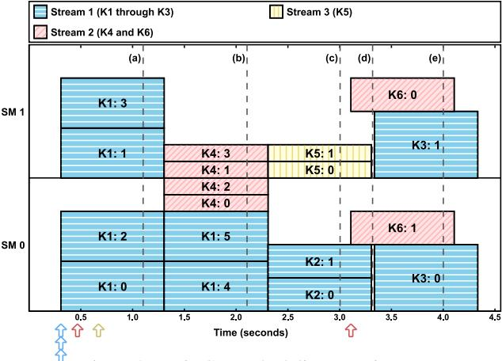
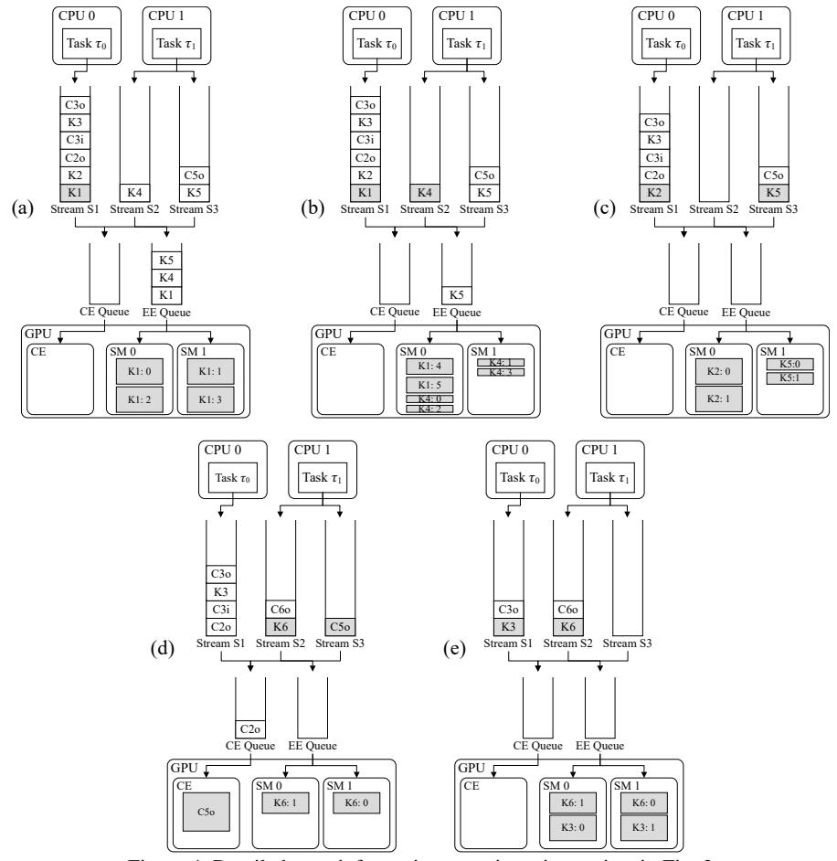

# 3 Basic GPU Scheduling Rules

In this section, we present GPU scheduling rules for the TX2 assuming the GPU is accessed only by CPU tasks that share an address space, using only user-specified streams. (We consider the NULL stream later. Unless stated otherwise, "stream" should henceforth be taken to mean a user-specified stream.) We inferred the scheduling rules given here by conducting extensive experiments using CUDA 8.0.62. We begin by discussing one of these experiments in Sec. 3.1. We use this experiment as a continuing example to explain various nuances of the rules, which are covered in full in Sec. 3.2. Before continuing, we note that all code, scripts, and visualization tools developed for this paper are available online.5

#### 3.1 Motivating Experiment

The experiment considered here involved running instances of a synthetic benchmark that launches several kernels. Our synthetic workload allows flexibility in configuring block resource requirements, kernel durations, and copy operations.

4For example, this is how streams are described in Sec. 9.1.2 of the *Best Practices Guide* for CUDA version 8.0.61 [18].

5https://github.com/yalue/cuda\_scheduling\_ examiner\_mirror

Figure 3: Basic GPU scheduling experiment.

We have also experimented with a variety of real-world GPU workloads involving image-processing functions common in autonomous-driving use cases, and to our knowledge, the scheduling rules presented in this paper are valid for such workloads as well.

In the experiment considered here, we configured each block of each benchmark kernel to spin for one second. As detailed in Table 1, three kernels, K1, K2, and K3, were launched by a single task to a single stream, and three additional kernels, K4, K5, and K6, were launched by a second task to two separate streams. The kernels are numbered by launch time. Copy operations occurred after K2 and K5, before and after K3, and after K6, in their respective streams.

Fig. 3 depicts the GPU timeline produced by this experiment. Each rectangle represents a block: the j th block of kernel Kk is labeled "Kk:j." The left and right boundaries of each rectangle correspond to that block's start and end times, as measured on the GPU using the globaltimer register. The height of each rectangle is the number of threads used by the block. The y-position of each rectangle indicates the SM upon which it executed. Arrows below the x-axis indicate kernel launch times. Dashed lines correspond to time points used in the continuing example covered in Sec. 3.2.

## 3.2 Scheduling Rules

With respect to kernels, blocks are the schedulable entities: the basic job of the GPU scheduler is to determine which thread blocks can be scheduled at any given time. These scheduling decisions are impacted by the availability of limited GPU *resources* that blocks utilize such as GPU shared memory, registers, and threads. Required resources are determined for the entire kernel when it is *launched*. All blocks in a given kernel have the same resource requirements.

We say that a block is *assigned* to an SM when that block has been scheduled for execution on the SM. A kernel is *dispatched* when at least one of its blocks is assigned, and is *fully dispatched* once all of its blocks have been assigned. Similarly, we say that a copy operation is *assigned* to a CE once it has been selected to be performed by the CE.

*Example.* Fig. 4 provides additional details regarding the kernel launches in Fig. 3. In Fig. 4, we use additional notation to depict copies: Cki denotes an input copy operation of kernel Kk, and Cko denotes an output copy operation of kernel Kk. Each inset in Fig. 4 corresponds to the time point in Fig. 3 with the same designation (*e.g.*, inset (a) corresponds to the time point labeled "(a)"). We will repeatedly revisit Fig. 4 to illustrate individual scheduling rules as they are stated, and then consider the entire example in full once all rules have been stated.

General scheduling rules. To our knowledge, the actual data structures used by the TX2 to schedule copy operations and kernels are undocumented. From our experiments, we hypothesize that several queues are used: one FIFO *EE queue* per address space, one FIFO *CE queue* that is used to order copy operations for assignment to the GPU's CE, and one FIFO queue per CUDA stream (including the NULL stream, which we consider later). We refer to the latter as *stream queues*. We begin by listing general rules that specify how copy operations and kernels are moved between queues:

- G1 A copy operation or kernel is enqueued on the stream queue for its stream when the associated CUDA API function (memory transfer or kernel launch) is invoked.
- G2 A kernel is enqueued on the EE queue when it reaches the head of its stream queue.
- G3 A kernel at the head of the EE queue is dequeued from that queue once it becomes fully dispatched.
- G4 A kernel is dequeued from its stream queue once all of its blocks complete execution.

*Example (cont'd).* In Fig. 4, there are two CUDA programs executing as CPU tasks τ0 and τ1 on CPUs 0 and 1, respectively, that share an address space. τ0 uses a single stream, S1, and τ1 uses two streams, S2 and S3. The various queues, two SMs, and single CE are depicted in each inset of Fig. 4. The start times in Table 1 give the time the kernel, or its input copy operation if one exists, was issued. Output copy operations, when present, immediately followed kernel completions.

In inset (a), τ0 has issued kernels K1, K2, and K3 and copy operations C2o, C3i, and C3o to stream S1. τ1 has issued kernels K4 and K5 to streams S2 and S3, respectively, and copy operation C5o to stream S3. The operations in streams S1 and S3 were enqueued in the order the CUDA commands were executed (Rule G1). Kernels K1, K4, and K5 are at the heads of their respective stream queues, and have been placed in the EE queue (Rule G2). K1 is dispatched to the GPU, so it is shaded in its stream queue. Each SM has two blocks of K1 assigned to it. In inset (b), the remaining blocks of K1 and K4 have been assigned to the GPU, so both K1 and K4 have been removed from the EE queue (Rule G3), but remain in their respective stream queues (Rule G4).

Figure 4: Detailed state information at various time points in Fig. 3.

|        | Launch           | Start    |          | # Thread  | Shared Memory |         |          |
|--------|------------------|----------|----------|-----------|---------------|---------|----------|
| Kernel | Info             | Time (s) | # Blocks | per Block | per Block     | Copy In | Copy Out |
| K1     | CPU 0, Stream S1 | 0.0      | 6        | 768       | 0             | -       | -        |
| K2     | CPU 0, Stream S1 | 0.0      | 2        | 512       | 0             | -       | 256MB    |
| К3     | CPU 0, Stream S1 | 0.0      | 2        | 1,024     | 0             | 256MB   | 256MB    |
| K4     | CPU 1, Stream S2 | 0.2      | 4        | 256       | 32KB          | -       | -        |
| K5     | CPU 1, Stream S3 | 0.4      | 2        | 256       | 32KB          | -       | 256MB    |
| K6     | CPU 1, Stream S2 | 2.8      | 2        | 512       | 0             | -       | 256MB    |

Table 1: Details of kernels used in the experiment in Fig. 3. (Note that "start times" are defined relative to the end of benchmark initialization.)

**Non-preemptive execution.** Ignoring complications considered later in Sec. 4, the kernel at the head of the EE queue will non-preemptively block later-queued kernels:

**X1** Only blocks of the kernel at the head of the EE queue are eligible to be assigned.

Example (cont'd). In Fig. 4(a), two blocks of K1 have been assigned to each SM. As explained in detail below, on each SM, there are enough resources available that two blocks from K4 could execute concurrently with the two blocks from K1. However, K4 is not at the head of the EE queue, so its blocks are not eligible to be assigned (Rule X1).

**Rules governing thread resources.** On the TX2, the total thread count of all blocks assigned to an SM is limited to

2,048 per SM,6 and the total number of threads each block can use is limited to 1,024. These resource limits can delay the kernel at the head of the EE queue:

- **R1** A block of the kernel at the head of the EE queue is eligible to be assigned only if its resource constraints are met.
- **R2** A block of the kernel at the head of the EE queue is eligible to be assigned only if there are sufficient thread resources available on some SM.

&lt;sup>6Recall from Sec. 2.1 that on the TX2, each SM has 128 hardware cores available. The (up to) 2,048 threads assigned to blocks currently executing on that SM are multiprogrammed on those cores.

*Example (cont'd).* In Fig. 4(a), K1 is at the head of the EE queue, so its blocks are eligible to be assigned (Rule R1). However, only four blocks of K1 have been assigned. This is because, as seen in Table 1, each block of K1 requires 768 threads, and on the TX2, each SM is limited to allocate at most 2,048 threads at once. Thus, only four blocks of K1's six can be scheduled together, so the remaining two must wait (Rule R2). In inset (b), these remaining two blocks have been scheduled. K4, next in the EE queue, requires four blocks of only 256 threads each, so all of its blocks fit on the GPU simultaneously with the remaining two blocks of K1, and all four blocks of K4 are assigned.

Rules governing shared-memory resources. Another constrained resource is the amount of GPU memory shared by threads in a block. On the TX2, shared memory usage is limited to 64KB per SM and 48KB per block. Similar to threads, a block being considered for assignment will not be assigned until all of the shared memory it requires is available.

R3 A block of the kernel at the head of the EE queue is eligible to be assigned only if there are sufficient shared-memory resources available on some SM.

*Example (cont'd).* Each block of K4 or K5 requires 32KB of shared memory, so at most two of these blocks can be assigned concurrently on an SM. In Fig. 4(b), two blocks of K4 are assigned to each SM. Even though there are available threads for K5 to be assigned and it is the head of the EE queue at that time, no block of K5 is assigned until the blocks of K4 complete (Rule R3), as shown in inset (c).

Register resources. Another resource constraint is the size of the register file. On the TX2, each thread can use up to 255 registers, and a block can use up to 32,768 registers (regardless of its thread count). Additionally, there is a limit of 65,536 registers in total on each SM. Unfortunately, using synthetic kernels makes it difficult to demonstrate limits on registers because the NVIDIA compiler optimizes register usage. However, based upon available documentation [19], we expect limits on register usage to have exactly the same impact as the limits on thread and shared-memory resources demonstrated above. Note also that the number of registers can be limited at compile-time using the maxregcount compiler option. Decreasing the number of registers used by a kernel makes its blocks easier to schedule at the expense of potentially greater execution time.

Copy operations. As noted earlier, the TX2 has one CE to process both host-to-device and device-to-host copies. Such copies are governed by rules similar to those above:

- C1 A copy operation is enqueued on the CE queue when it reaches the head of its stream queue.
- C2 A copy operation at the head of the CE queue is eligible to be assigned to the CE.
- C3 A copy operation at the head of the CE queue is dequeued from the CE queue once the copy is assigned to the CE on the GPU.

C4 A copy operation is dequeued from its stream queue once the CE has completed the copy.

*Example (cont'd).* As shown in Fig. 4(d), once K2 and K5 complete execution and are dequeued from S1 and S3, the copies C2o and C5o become the heads of S1 and S3, respectively. C5o and C2o are thus enqueued on the CE queue (Rule C1). C5o is immediately assigned to the CE (Rule C2), so it is dequeued from the CE queue (Rule C3). The CE can perform only one copy operation at a time, so C2o remains at the head of the CE queue until C5o completes.

Full example. Inset (a) of Fig. 4 corresponds to time t = 1.1s in Fig. 3. The first five kernels have been launched, and the kernels at the heads of each stream, K1, K4, and K5, have also been added to the EE queue, in issue order. K1 remains in the EE queue as it is not yet fully dispatched, so no blocks of K4 are eligible to be assigned.

Inset (b) corresponds to time t = 2.1s. The first four blocks of K1 have finished executing. Both K1 and K4 are now fully dispatched, so they have been removed from the EE queue, but remain at the heads of their stream queues. No blocks of K5 are able to be dispatched because their required shared-memory resources are not available.

Inset (c) corresponds to time t = 3.0s. Upon completion of K1 and K4, both of K5's blocks are assigned, and K2 is added to the EE queue and immediately becomes fully dispatched. C2o remains blocked by K2 in its stream queue due to FIFO stream ordering. C5o is similarly blocked.

Inset (d) corresponds to time t = 3.32s. K2 and K5 both complete execution, enabling C2o and C5o to be enqueued on the CE queue. C5o is enqueued first, so it is assigned to the CE and removed from the CE queue. Due to FIFO stream ordering, both C3i and K3 are delayed behind C2o. Upon being issued, K6 immediately moved unhindered through the queues, as K2 and K5 were fully dispatched; the copies execute concurrently with the blocks of K6.

Inset (e) corresponds to time t = 4.0s. K3 and K6 are both fully dispatched. C3o an C6o are blocked in their stream queues until K3 and K6 complete, respectively. As a result, the CE and EE queues are empty.

Summary. The basic scheduling rules above define a variant of hierarchical FIFO scheduling where work may sometimes be subject to blocking delays. Given that FIFO CPU scheduling has analyzable response-time bounds on multiprocessors [13], there is some hope that the scheduler defined by these rules might be amenable to real-time schedulability analysis, but this is a topic for future work.

