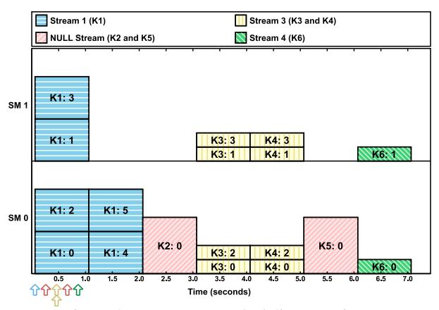
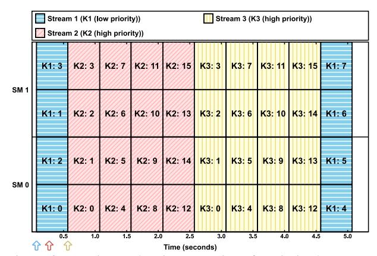

# 4 Additional Complexities

Unfortunately, the basic rules in Sec. 3 are not the end of the story. In this section, we consider additional features available to CUDA programmers that can impact scheduling. These include usage of the default (NULL) stream, stream priorities, and streams in independent process address spaces.

Figure 5: NULL stream scheduling experiment.

We also comment on other less commonly used features that can influence scheduling that we do not examine in detail.

## 4.1 The NULL Stream

Available documentation makes clear that two kernels cannot run concurrently if, between their issuances, any operations are submitted to the NULL stream [19]. However, this documentation does not explain how kernel execution order is affected. In an attempt to elucidate this behavior, we conducted experiments in which interactions between (user-specified) streams and the NULL stream were observed. We found that these interactions are governed by the following rules, which reduce to rule G2 if the NULL stream is not used:

- N1 A kernel Kk at the head of the NULL stream queue is enqueued on the EE queue when, for each other stream queue, either that queue is empty or the kernel at its head was launched after Kk.
- N2 A kernel Kk at the head of a non-NULL stream queue cannot be enqueued on the EE queue unless the NULL stream queue is either empty or the kernel at its head was launched after Kk.

The result of an experiment demonstrating these rules is given in Fig. 5. The kernels launched in this experiment are fully specified in Table 2 in Appendix B. K2 and K5 were submitted to the NULL stream. K2 did not move to the EE queue until K1 completed (Rule N1); likewise, K5 did not move to the EE queue until both K3 and K4 had completed. No other kernel could move to the EE queue while K2 was at the head of the NULL stream queue, as all but K1 were launched after K2 (Rule N2). Because of the NULL-stream kernels, K6 was unnecessarily blocked and could not execute concurrently with K1, K3, or K4, so much capacity was lost. This result demonstrates that usage of the NULL stream is problematic if real-time predictability and efficient platform utilization are desired.

## 4.2 Stream Priorities

We now consider how the usage of prioritized streams impacts the rules defined in Sec. 3.2. CUDA programmers can prioritize some streams over others and

Figure 6: Experiment showing starvation of a priority-low stream.

can determine the allowable priority settings by the API call cudaDeviceGetStreamPriorityRange. On the TX2, this call returns only two priority values: −1 (*priority-high*) and 0 (*priority-low*). As we show below, a stream with no priority specified (*priority-none*) is treated as priority-low.

Experiments. In the rest of this subsection, we present the results of several experiments we conducted to evaluate the effects of using stream priorities. These experiments use the same synthetic benchmarking techniques applied in Sec. 3.2. Relevant kernel properties are given in per-experiment tables in Appendix B. After discussing these experiments, we postulate new scheduling rules that specify how stream priorities affect scheduling.

Scheduling of priority-low streams vs. priority-high streams. Given that blocks are schedulable entities, the handling of prioritized streams as described in the available CUDA documentation [19] is exactly as one might expect. In particular, stream priorities are considered each time a block finishes execution and a new block can be assigned, with blocks from priority-high streams always being favored for assignment if their resource requirements are met. Note that this assignment behavior can potentially lead to the starvation of priority-low streams.

We conducted an experiment to illustrate this behavior using the kernels defined in Table 3. Fig. 6 shows the GPU timeline that resulted from this experiment. As seen, K1 was launched first in a priority-low stream and four of its eight blocks had already been assigned when K2 and K3 were later launched in two priority-high streams. When the four initially assigned blocks of K1 completed execution, freeing all SM threads, K2 (launched second) effectively preempted K1, preventing K1's remaining four blocks from being assigned. K3 was later dispatched when K2 completed, continuing the "starvation" of K1 until K3 completed.

Scheduling of priority-none streams vs. prioritized streams. The available CUDA documentation lacks clarity with respect to how scheduling is done when both prioritynone and prioritized streams are used. We experimentally

Figure 7: Experiment demonstrating two actual priority levels.

investigated this issue and found that priority-none streams have the same priority as priority-low streams on the TX2.

Evidence of this can be seen in an experiment we conducted using the kernels defined in Table 4. Fig. 7 shows the resulting GPU timeline. In this experiment, K2 was launched in a priority-none stream, K1 and K4 were launched in priority-low streams, and K3 was launched in a priority-high stream. K1 was launched first and four of its eight blocks were immediately assigned to the GPU. Once these four blocks completed execution, K3 effectively preempted K1 because K3 was at the head of a priority-high stream. After K3 executed to completion, K1 resumed execution because K2 and K4 had equal priority and could not preempt it. When K1 completed, K2 and K4 were dispatched in launch-time order. If priority-none were higher than priority-low, then K2 would have preempted K1; if priority-none were lower than priority-low, then K4 would have run before K2, despite being released later.

The scheduling of prioritized streams when resource blocking can occur. We wondered whether it was possible for kernels in priority-high streams experiencing resource blocking to be indefinitely delayed by kernels in priority-low streams that "cut ahead" and consume available resources. Our experimental results suggest this is not possible.

Evidence of this claim can be seen in an experiment we conducted using the kernels defined in Table 5, which yielded the resulting GPU timeline in Fig. 8. K1–K7 were launched in quick succession to seven distinct priority-low streams. Once all had been dispatched, 512 threads were available on one SM. Then K8, with one block of 1,024 threads, was launched to a priority-high stream, followed by K9, with one block of 512 threads, launched to another priority-low stream. At this time, none of the initial seven kernels had completed execution, so the priority-high K8 could not be dispatched due to a lack of available threads. When K1 ultimately completed, 512 threads were then available on each SM, but K8 still could not be dispatched because a block can run on only one SM. Note that even though K9 required only 512 threads, it could not be dispatched because K8 was of higher priority. Finally, when K2 completed, K8 was

Figure 8: Experiment with both priorities and resource blocking.

dispatched because 1,024 threads became available on one SM, and K9 was dispatched because 512 other threads were available and the priority-high K8 no longer blocked it.

Additional scheduling rules. Based on these experiments, we hypothesize that the TX2's GPU scheduler includes one additional EE queue, for priority-high kernels. The original EE queue described in Sec. 3.2 is for priority-low (and thus priority-none). These queues are subject to these rules:

- A1 A kernel can only be enqueued on the EE queue matching the priority of its stream.
- A2 A block of a kernel at the head of any EE queue is eligible to be assigned only if all higher-priority EE queues (priority-high over priority-low) are empty.

## 4.3 Multiple Processes and Other Complications

We also conducted experiments in which CUDA programs were invoked by CPU processes (instead of tasks) that have distinct addresses spaces. These experiments are discussed in Appendix A. As seen there, the usage of separate address spaces results in higher overheads and less predictable execution times for GPU operations.

We conclude Sec. 4 by noting several less commonly used features that may potentially impact scheduling. These include: (i) the nvcc compilation option, which enables pertask NULL streams; (ii) the CUDA API that enables kernels from user-specified streams to execute concurrently with the NULL stream; (iii) a mechanism introduced with the Pascal GPU architecture that allows an executing kernel to be preempted at the instruction level; and (iv) a feature called *dynamic parallelism* that allows kernels to dynamically submit extra work by calling other kernel functions inside the GPU. We conjecture that these features are detrimental to use if real-time predictability is a requirement.

