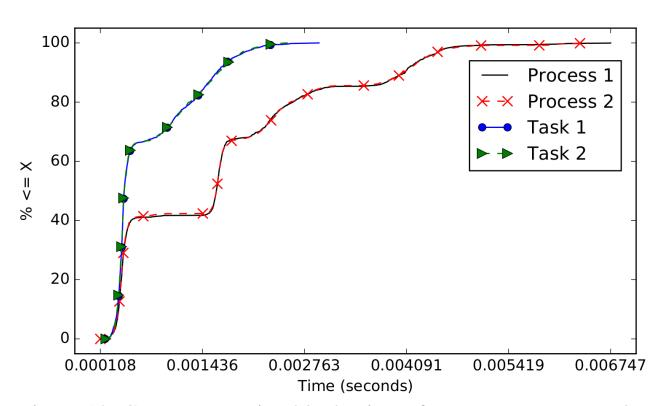

# Appendix A: Process-Based GPU Access

In this appendix, we describe a few complications that arise when processes (instead of tasks) invoke GPU operations.

Multiprogramming on the TX2. In previous work involving the NVIDIA TX1, a less-capable predecessor of the TX2 with a similar basic layout, we found that kernels issued by multiple GPU-using processes were scheduled on the GPU using multiprogramming [23]. On the TX1, this meant that the GPU scheduler would switch between processes at the granularity of thread blocks, with kernels from different processes never actually executing at the same time. While studying the TX2, we observed that kernels issued by different processes are still multiprogrammed, but multiprogramming is implemented using GPU preemption features introduced in NVIDIA's Pascal GPU architecture.

This observation is supported by Fig. 9, which gives the results of two experiments we ran in which two instances of a compute-heavy Mandelbrot-Set kernel were run together. In the first experiment, the two kernel instances were issued by two separate processes, while in the second, they were issued by two separate tasks. In these experiments, we recorded for each kernel the start and end times of each thread block on the GPU and then used these times to deduce the total number of threads that appeared to have been assigned to the kernel through its execution. These thread counts are plotted on the vertical axes of the four timelines in Fig. 9. The top two timelines are from the first experiment, where processes were considered, and the bottom two timelines are from the second experiment, where tasks were considered.

The bottom two timelines indicate that, in the experiment involving tasks, scheduling was in accordance with the rules discussed in Sec. 3: all blocks from one kernel were fully dispatched before the second kernel began execution. In contrast, the top two timelines indicate that, in the experiment involving processes, the GPU scheduler's behavior is very different: 4,096 threads from each kernel appear to be fairly consistently running together at the same time. On the surface, this should appear to be impossible because the TX2 is only capable of running 4,096 threads across both of its SMs at any point in time (recall Footnote 6).

Figure 9: Timelines contrasting kernels issued from processes (different address spaces) vs. tasks (shared address space).

Figure 10: CDFs contrasting blocks times from processes vs. tasks.

This behavior, however, is easily explained if we assume that CUDA thread blocks can be preempted. Recall that we used block-time measurements, which are recorded on the GPU itself, to calculate the number of running threads. Our GPU kernel code cannot detect being preempted itself, so the start and end times for each block can actually encompass intervals in which the block was preempted.

We therefore conclude that benchmarks from separate processes were being multiprogrammed on the TX2 using preemptions, as this explains the apparent over-provisioning of GPU resources. Additionally, we provide Fig. 10 to further support the conclusion that concurrent kernels from different address spaces preempt one another.

In Fig. 10, the curves labeled "Process 1" and "Process 2" show the cumulative distribution function (CDF) of block times (see Fig. 2) for Mandelbrot-Set kernels issued concurrently from separate processes. Likewise, the "Task 1" and "Task 2" curves show the same data for kernels issued from separate tasks. Consistent with Fig. 9, the worst-case block times for the "Process" curves is over twice that of the "Task" curves. This is in direct contrast to our prior work using the previous-generation TX1, where we found that block

times remained nearly identical regardless of the number of concurrent processes [23].

memory or large copy-in or copy-out operations, so these columns are left out of the tables.

Stream priorities in multiple processes. We also experimentally examined the effects of using stream priorities when processes submit GPU operations instead of tasks. We found that assigning priorities to the streams of different processes had *no effect* on how the operations in these streams were scheduled. Thus, the usage of stream priorities has impact only in the context of task-based computing, not process-based computing.

