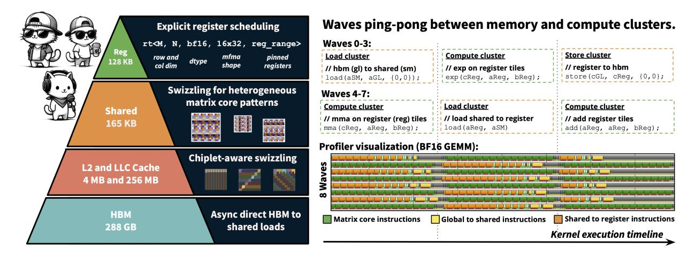
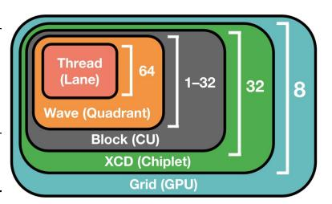

# 1 Introduction

While AI has largely used a single hardware vendor in the past [\[2,](#page-12-0) [16,](#page-13-0) [26\]](#page-14-0), AMD GPU hardware now offers state-of-the-art peak compute and memory bandwidth (Table [2\)](#page-2-0). However, the lack of mature software support creates a hardware lottery ("CUDA moat") [\[29,](#page-14-1) [30\]](#page-14-2). Peak-performance AMD kernels are written in raw assembly by a handful of experts (i.e., the AITER library [\[3\]](#page-12-1)), which is slow to scale to the breadth of AI workloads. For instance, AITER and PyTorch Llama GQA backwards achieve just 30% and 24% of SoTA performance respectively on AMD MI355X GPUs (Section [4\)](#page-10-0).

Developing NVIDIA kernels also required painstaking effort a few years ago. For instance, using low level CUDA/CUTLASS, it took two years between the H100 GPU's release and the release of peak performance open-source attention kernels [\[31\]](#page-14-3). Compilers like Triton [\[34\]](#page-15-0) are simpler to use, but sacrifice performance and struggle to quickly support new hardware features [\[33,](#page-14-4) [35\]](#page-15-1). AI-designed kernels are showing early promise [\[9,](#page-13-1) [17\]](#page-13-2), but current models also struggle to use new hardware features [\[27\]](#page-14-5) and are susceptible to reward hacking [\[9\]](#page-13-1). Recently, lightweight C++ embedded DSLs like ThunderKittens (TK) (and successors like CuTe DSL [\[24\]](#page-14-6) and Gluon [\[38\]](#page-15-2)) consider simplifying development by encoding kernel design in terms of a small set of opinionated primitives that give the developer full control:

1. Tiles. The basic data type is a tile with optimized memory access patterns. TK exposes lightweight PyTorch-inspired bulk compute operators (mma, exp, etc.) over tiles, wrapping PTX. Tiles help developers explicitly manage data at each level of the GPU memory hierarchy.

Figure 1: We study whether existing tile based programming primitives suffice for AMD kernels, or whether entirely new primitives are needed. Our study led to HIPKITTENS: a minimal and opinionated set of primitives for fast and *furious* AMD kernels. HK introduces a general 8-WAVE PING-PONG SCHEDULE to overlap compute and memory, programmer controlled register allocation, and efficient shared memory and chiplet-aware swizzling algorithms to enable a suite of high performance AMD AI kernels.

- 2. **Overlapping.** A few basic kernel patterns help developers achieve high occupancy, or schedule workers (waves on AMD, warps on NVIDIA) onto the different hardware execution units. Modern NVIDIA kernels have consolidated around wave specialization (producer-consumer) scheduling patterns [31, 32, 33, 36, 37].
- 3. **Grid scheduling.** By assigning work to thread blocks in the appropriate order, a developer can maximize the reuse of non-programmable cache memory.

Our work asks whether entirely new programming primitives are needed to simplify AMD kernel development, or whether existing primitives suffice. Ideally, we would have a simple framework that helps developers write a breadth of high performance kernels. Our exploration led to HIPKITTENS (HK), a minimal collection of C++ embedded programming primitives for AMD:

- 1. Optimized access patterns for programmable GPU memory. Careful register memory management is critical for peak performance kernels. HK retains the tile data structures of prior DSLs to help developers manage memory [33]. However, optimizing the tiles for AMD introduces new challenges.
  - Compilers such as Triton and HIPCC routinely impact the kernel developer's ability to carefully schedule register allocations and lifetimes (Sec. 3.2). For instance, HIPCC prevents the HIP developer from using certain types of registers (AGPRs) as input operands to matrix instructions. We thus introduce a way for the developer to bypass the compiler altogether, and explicitly pin the registers belonging to each tile. As for memory access patterns, different NVIDIA matrix instruction shapes are all built from the same underlying core matrix structure, which makes it easy to use a single tile swizzle strategy for all shapes as in TK and Linear Layouts [38]. AMD matrix instructions lack this compositional structure, leading to an explosion in the number of tile layouts. Further, the shared memory bank structure and order in which threads in a wave run, differs based on the memory instruction on AMD (Sec. 3.2). HK handles this complexity for the developer when tiles are created.
- 2. Schedules to overlap compute and memory. Ideally we would have simple, reusable patterns for scheduling the compute and memory within kernels that generalize across AI workloads. The wave specialization pattern dominates NVIDIA kernels and DSLs; producer waves handle memory operations while consumers execute bulk compute operations over large tiles. However, we find that this pattern underperforms on AMD CDNA3 and CDNA4 GPUs due to architectural differences—AMD's static register allocation means that producer waves consume registers without contributing to computation, which limits the output tile size that gets computed per thread block and thus the kernel's arithmetic intensity. On the MI355X, wave specialization achieves just 80% of peak BF16 GEMM performance (Tab. 2).

&lt;sup>1AMD CDNA includes 512 registers per SIMD, which are evenly partitioned across waves co-located on the SIMD. For kernels with a single SIMD per wave, the hardware splits the registers into 256 vector general-purpose registers (VGPRs) and 256 accumulator registers (AGPRs).

| Spec                  | NVIDIA B200 SXM5 | AMD MI355X OAM |
|-----------------------|------------------|----------------|
| BF16 MATRIX / TENSOR  | 2.2 PFLOPs       | 2.5 PFLOPs     |
| MXFP8 MATRIX / TENSOR | 4.5 PFLOPs       | 5.0 PFLOPs     |
| MXFP6 MATRIX / TENSOR | 4.5 PFLOPs       | 10.1 PFLOPs    |
| MXFP4 MATRIX / TENSOR | 9.0 PFLOPs       | 10.1 PFLOPs    |
| MEMORY CAPACITY       | 180 GB           | 288 GB         |
| MEMORY BANDWIDTH      | 8.0 TB/s         | 8.0 TB/s       |

Figure 2: **Hardware overview.** (Left) Peak memory and compute speeds for the latest generation GPU platforms [7, 23]. (Right) Diagram of the AMD GPU software and hardware hierarchy.

We identify two alternate scheduling patterns that consistently achieve peak AMD performance: 8-WAVE PING-PONG and 4-WAVE INTERLEAVE, which tradeoff programmability with performance (Tab. 3). The 8-WAVE pattern employs two waves per SIMD that alternate between compute and memory roles, each executing large bulk tile operations (Fig. 1), while the 4-WAVE pattern employs one wave per SIMD and finely interleaves instructions over small tile sizes. Remarkably, the simple 8-WAVE pattern is sufficient to match AMD's hand-optimized assembly kernels across BF16 GEMM, FP8 GEMM, and attention forward, and outperforms baselines by 1.8× on GQA non-causal backward.

3. Optimized access patterns for non-programmable GPU memory. Chiplet architectures are becoming the dominant path to GPU scaling—NVIDIA Blackwell uses 2 chips, AMD MI355X uses 8—but existing frameworks ignore their hierarchical cache structures, leaving performance untapped. Each AMD CDNA4 chiplet contains 32 processors with private L2 cache, while all chiplets share a last-level cache (LLC) between L2 and global memory. These hierarchical caches have orthogonal preferences for how work is parallelized across thread blocks. Table 4 demonstrates an instance where a naive row-major ordering for allocating work to thread blocks achieves only a 36% L2 hit rate for BF16 GEMMs. We show that optimizing solely for L2 reuse (e.g., to 79% hit rate) degrades LLC performance and overall bandwidth. HK introduces an algorithm that models both cache levels when scheduling thread blocks. This improves performance by 19% over the naive row-major baseline (Tab. 4).

Evaluation. We validate Hipkittens on AMD CDNA3 MI325X and CDNA4 MI355X GPUs. On the most widely used and optimized workloads in AI, HK competes with or outperforms all AMD baselines (BF16 FP8 GEMM, GQA/MHA Attention forward and backward, RoPE, LayerNorm). HK outperforms all available AMD baselines on average, including AMD's hand-optimized kernels that have been written in raw assembly. However, assembly is not a scalable method for kernel development and leaves many important AI workloads unsupported — in such settings (e.g., some attention shapes, GQA backwards, memory bound kernels), HK outperforms the available AMD baselines by  $1.2-10\times$ . Furthermore, HK consistently outperforms compilers approaches (e.g., by up to  $3\times$  the Triton BF16 GEMM and  $2\times$  the Mojo MHA forwards).

We contribute (1) principles for writing high performance AMD kernels, (2) HK, a collection of opinionated C++ programming primitives for the AI community, and (3) a suite of performant AMD kernels. We further show that the tile primitives proposed in the TK DSL transfer to AMD, providing evidence that one unified and performant programming model is possible across AI accelerators. Scaling kernel support across multiple silicon platforms is key to unlocking the "compute capacity needed to achieve AI's full potential" [25]. We hope this work helps open AI's hardware landscape.

