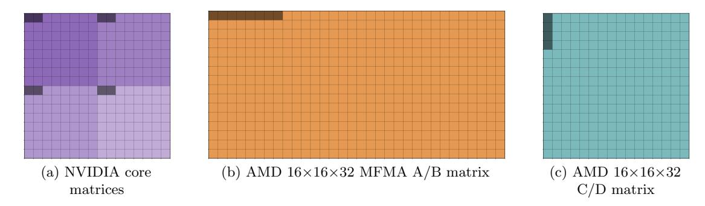
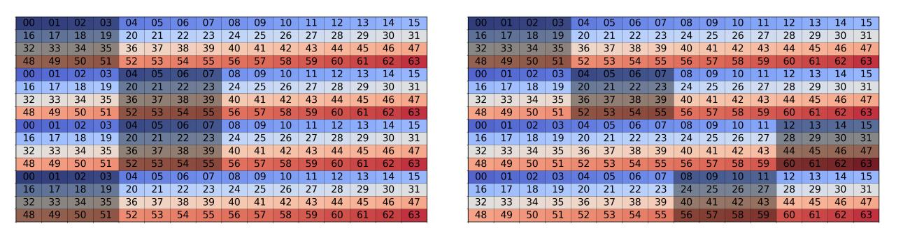
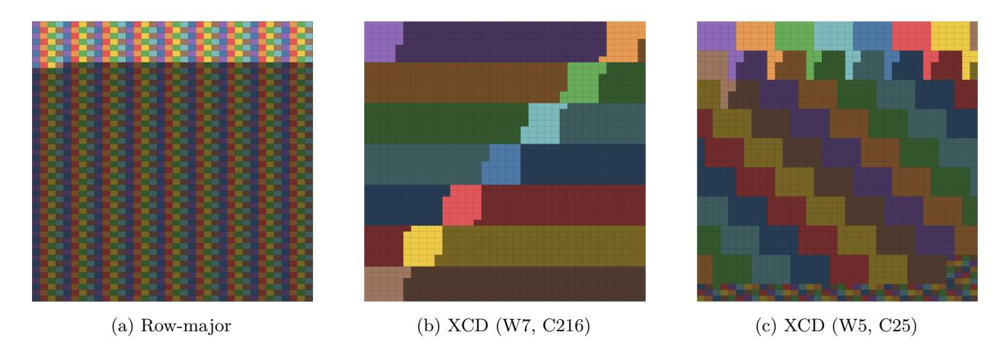
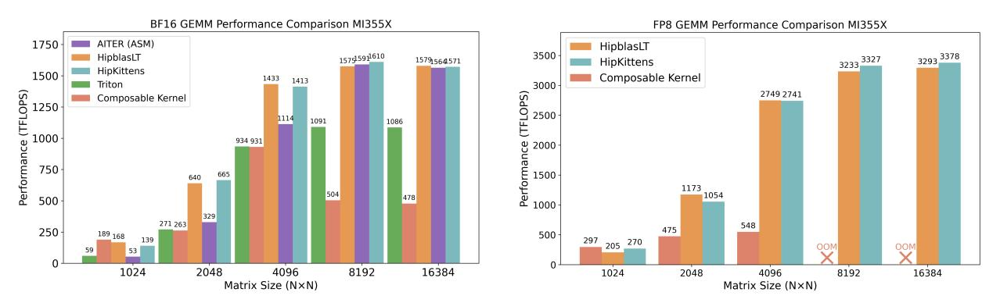
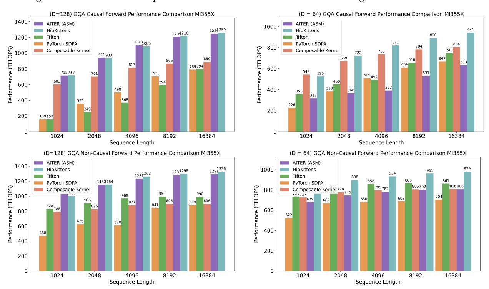

# 3 HipKittens

This section describes HIPKITTENS (HK), a framework for programming AI kernels on AMD GPUs. HK builds on the ThunderKittens framework [33], which uses C++ embedded tile-based programming primitives to simplify high-performance and flexible AI kernel development (discussed in Section 3.1). We describe HK's principles for optimizing the access patterns of programmable GPU memory in Section 3.2, maximizing occupancy in Section 3.3, and optimizing the access patterns of non-programmable cache memory in Section 3.4.

#### <span id="page-3-5"></span>3.1 Tile programming interface

Like existing kernel frameworks, HK adopts tiles as the basic data structure and provides a suite of optimized operators over tiles. The tile design and suite of operators is heavily inspired by PyTorch and NumPy [14, 28],

<span id="page-3-1"></span><sup>&</sup>lt;sup>2</sup>https://github.com/HazyResearch/ThunderKittens (May 2024)

<span id="page-3-2"></span><sup>&</sup>lt;sup>3</sup>https://docs.nvidia.com/cutlass/media/docs/pythonDSL/cute\_dsl.html (Sept 2025)

<span id="page-3-4"></span><span id="page-3-3"></span><sup>&</sup>lt;sup>4</sup>https://github.com/triton-lang/triton/tree/main/python/tutorials/gluon (June 2025)

<sup>&</sup>lt;sup>5</sup>Measured using rocprofv3 --pmc SQLDS\_BANK\_CONFLICT,SQ\_INSTS\_LDS --output-format csv --output-file profiles\_3 -d out -- mojo bench\_mha.mojo at https://github.com/modular/modular/tree/main/max/kernels/benchmarks/gpu in the nightly Modular build on a MI355X GPU on 11/06/2025.

| Метнор                   | SEQ. LENGTH | TFLOPS      |
|--------------------------|-------------|-------------|
| HK                       | 4096        | 855         |
| HK WITH PINNED REGISTERS | 4096        | <b>1024</b> |
| AMD ASSEMBLY (AITER)     | 4096        | 1018        |
| HK                       | 8192        | 909         |
| HK WITH PINNED REGISTERS | 8192        | 1091        |
| AMD ASSEMBLY (AITER)     | 8192        | <b>1169</b> |

<span id="page-4-1"></span>Table 1: Explicit register scheduling enables increased developer control. A 4-wave MHA non-causal backwards kernel implemented in HIP underperforms AMD's raw assembly kernel (AITER) due to compiler limitations. We match AITER by bypassing the compiler and pinning register tiles to explicit registers. We use batch size 16, heads 16 and head dim 128.

given their familiarity to the AI community.

- Memory. The developer can initialize tiles in register or shared memory. A tile is parametrized by a dtype (FP32, BF16, FP16, FP8, FP6), rows, columns and a layout (row or column major). Tile rows and columns are restricted to be a multiple of the matrix core shape. HK provides operators to load and store tiles across different levels of the GPU memory hierarchy.
- Compute. HK provides a suite of bulk compute operators over tiles, inspired by the set of operators in PyTorch (e.g., mma, exp, add). The functions are lightweight and do not add overhead as they directly wrap raw AMD CDNA assembly/HIP (NVIDIA PTX/CUDA for TK).

Given these familiar programming primitives, HK automatically optimizes the memory access patterns for tiles. Memory management on AMD GPUs raises key challenges at each level of the hierarchy, discussed next.

#### <span id="page-4-0"></span>3.2 Optimizing programmable memory access

We now discuss the specifics of HIPKITTENS tiles.

#### 3.2.1 Developer-controlled register scheduling

Careful register management is critical for high performance. However, compilers either prevent (e.g., Triton) or impede (e.g., in the HIPCC compiler) the developer's ability to maximally control register allocations.

For instance, in kernels with a single wave per SIMD, the AMD hardware splits the SIMD's 512 registers into 256 vector general-purpose registers (VGPRs) and 256 accumulator registers (AGPRs). However, while the hardware does support using AGPRs as input to matrix core instructions, HIPCC does not. For workloads that involve both matrix and vector operations (e.g., attention backwards), kernels compiled via HIPCC would need to generate redundant v\_accvgpr\_read instructions that move data from AGPRs to VGPRs prior to issuing matrix instructions.

**Explicit register scheduling.** The compiler constraints motivate a feature in HK that gives developers the ability to fully control register scheduling. The developer pins the registers belonging to each tile, rather than letting HIPCC manage the registers. By bypassing the compiler, the developer can use AGPRs as inputs to matrix instructions, resulting in our SoTA-level backwards attention kernel (Tab. 1). The interface for programming with pinned register tiles exactly matches that of using standard compiler-managed register tiles. We leave both options so developers can choose the level of control they want.

#### 3.2.2 Tiles for heterogeneous matrix core shapes

AI kernels use different matrix core instruction shapes (MxNxK), depending on the workload properties, in order to carefully manage register pressure. However, it is challenging to use multiple shapes on AMD GPUs.

Matrix layout complexity. Recall that GPU matrix instructions impose rules as to which thread owns each data element in its registers. Further, shared memory accesses result in bank conflicts if multiple threads in a wave attempt to access the same bank simultaneously. Waves (and NVIDIA warps) execute shared memory accesses in *phases*; i.e., a *subset* of threads in a wave accesses shared memory concurrently [13].

The complexity of AMD matrix layouts relative to NVIDIA layouts impacts the access patterns at each level of the GPU memory hierarchy. First, NVIDIA matrix instructions use a regular pattern (Fig. 3a); all

<span id="page-5-0"></span>

Figure 3: Matrix layouts on NVIDIA and AMD GPUs. The shaded cells in each matrix represent elements owned by thread 0.

shapes are composed from an underlying 16 × 16 core matrix building block that is stamped out multiple times depending on the overall matrix instruction shape. Thus, prior frameworks like TK [\[33\]](#page-14-4) and Linear layouts [\[38\]](#page-15-2), can use a unified swizzling strategy that generalizes across matrix shapes. Meanwhile, each AMD matrix instruction uses an entirely different layout without a similar underlying structure. Second, NVIDIA instructions sequentially assign threads to phases (e.g., threads 0-7 in phase one, 8-15 in phase two). Meanwhile on AMD, the phases are non-sequential and differ based on the memory instruction.[6](#page-5-1)

<span id="page-5-2"></span>

Figure 4: Swizzle pattern for a 16x32 tile of BF16s. Shared memory on AMD CDNA4 GPUs have different banking behavior depending on the instruction. ds read b128 accesses shared memory through 64 banks, each 32-bits wide, and correspond the individual cells and numbers in the figure. The shaded cells represent banks that are accessed by the first phase of a ds read b128 instruction for a 16x32 row layout register tile. On the left is an unswizzled layout suffering from 2-way bank conflicts. On the right is a swizzled layout with no bank conflicts. The swizzle applied here swaps the first 8 columns with the last 8 starting from the 8th row. This swizzling strategy simultaneously enables bank-conflict free accesses from column-major reads using ds read b64 tr b16. Details can be found in [D.1.](#page-27-0)

Optimized tile memory. We discuss how HK abstracts away this complexity from kernel developers:

- 1. Register. By default, register tiles in HK use the smallest MFMA instruction since this provides maximal scheduling control as highlighted in Section [3.3.](#page-6-1) However, for the edge case kernels that use alternate sizes, HK lets the developer parameterize the desired register tile by the MFMA instruction shape.
- 2. Shared. On AMD GPUs, it is not possible to use a single swizzle pattern for all layouts (a simple counter-example is provided in Appendix [D.1\)](#page-27-1). While we could implement unique swizzle patterns for every matrix layout, this adds code complexity. Instead, we identify the layouts that commonly co-occur and support swizzle patterns that are bank conflict free for these instances. Figure [4](#page-5-2) shows one such swizzle that is bank conflict free for both the 16 × 32 row layout and column layout load.
- 3. Global. AMD GPUs support direct asynchronous HBM to shared memory loads. Like TMA, these loads bypass the register file. The instruction takes as input per-thread addresses in HBM from which each

<span id="page-5-1"></span><sup>6</sup>For e.g., the threads in a wave execute the ds read b128 instruction in 4 phases and load data from 64 shared memory banks, each 4-bytes wide, while a ds read b96 executes over 8 phases and loads from 32 banks. The phases are undocumented in the CDNA ISA so we create a solver to determine them, and document the phases in Tab. [5.](#page-28-0)

<span id="page-6-0"></span>

| # P / # C | MFMA Shape     | Output    | TFLOPS |
|-----------|----------------|-----------|--------|
| HK 4 / 8  | 16 × 16 × 32   | 128 × 256 | 893    |
| HK 4 / 12 | 16 × 16 × 32   | 192 × 256 | 1278   |
| HK 0 / 8  | 16 × 16 × 32   | 192 × 256 | 1281   |
| HK 0 / 8  | 16 × 16 × 32   | 256 × 256 | 1610   |
| TK        | 256 × 256 × 16 | 256 × 256 | 1538   |
| CUTLASS   | 256 × 256 × 16 | 256 × 256 | 1570   |

Table 2: Producer consumer comparisons. We report results for a series of producer consumer BF16 GEMM kernels of shape M = N = K = 8192. We denote the number of producers and consumers as P and C respectively. We denote the underlying matrix instruction size, output tile size computed per thread block, and TFLOPS measured (500 iterations of warmup, 100 iterations of measurement on inputs from N (0, 1)). AMD kernels run on an MI355X and NVIDIA kernels (TK, CUTLASS) on a B200.

thread will read data. While DSLs like TK directly swizzle the shared memory addresses, swizzling shared memory on AMD is instead accomplished by swizzling on the HBM addresses.

## <span id="page-6-1"></span>3.3 Overlapping compute and memory utilization

We study the principles for scheduling instructions within AMD AI kernels and identify two high-performance patterns that lead to peak utilization across diverse workloads.

Current approaches and their limitations. State-of-the-art AI kernels and DSLs have consolidated around wave specialization—a pattern where specialized producer waves handle memory movement while consumer waves handle computation. This approach dominates in NVIDIA implementations including FlashAttention-3 [\[31\]](#page-14-3), COMET for MoE [\[37\]](#page-15-4), and GEMMs [\[10\]](#page-13-10), and kernel DSLs like TK [\[33\]](#page-14-4) and TileLang [\[36\]](#page-15-3). In this paradigm, waves occupy specific hardware units for long periods of time, so they can issue bulk operations over large tile primitives. This tile-based programming makes the code size compact and readable.

However, wave specialization struggles to generalize to modern AMD devices due to fundamental architectural differences. Instead, state-of-the-art AMD kernels (AITER [\[3\]](#page-12-1), CK [\[4\]](#page-12-2)) resort to raw assembly to finely interleave instruction issues—an approach orthogonal to tile-based programming. While it might seem that AMD requires bespoke schedules for each AI workload, we identify simple general principles that achieve high performance across diverse applications.

#### 3.3.1 Wave specialization underperforms on AMD

NVIDIA kernels implement wave specialization using dedicated memory access hardware (tma), asynchronous matrix multiplies which accept operands directly from shared or tensor memory (wgmma, tcgnen05 ), deep pipelines enabled by large shared memory per processor (B200 has 40% larger SRAM than AMD MI355X per processor), register reallocation (where the register-efficiency of TMA lets producers give their registers to consumers), and hardware synchronization primitives (mbarriers). AMD lacks these architectural features, changing the kernel design space.

To evaluate how these differences impact performance, we vary the synchronization mechanism, pipeline depth, and producer-consumer ratios (Tab. [2\)](#page-6-0). Our experiments reveal two principles. We need to maximize the output tile size computed per thread block to increase the arithmetic intensity (operations per byte moved), and we need to maximize the pipeline depth to hide the latency of memory loads.

Peak performance open-source TK and CUTLASS profiler-selected GEMMs use wave specialization and an output tile size of 256 × 256 on the B200. [7](#page-6-2) i

Our best AMD GEMM achieves comparable performance when computing a 256 × 256 output tile per thread block only when using no wave specialization (i.e., zero producers) and degrades as the number of producers increases (Tab. [2\)](#page-6-0). This is because AMD hardware statically divides registers across all waves [\[5\]](#page-12-3), meaning producers consume registers without contributing to output computation. This limits the usable output tile size when using wave specialization.

<span id="page-6-2"></span><sup>7</sup>The profiler sweeps and tunes the suite of CUTLASS GEMMs, selecting the best one for the shape and dtype.

| KERNEL                      | PATTERN | LoC | TFLOPS         |
|-----------------------------|---------|-----|----------------|
| FP8 GEMM                    | 8-wave  | 48  | $3222 \\ 3327$ |
| FP8 GEMM                    | 4-wave  | 183 |                |
| MHA BACKWARDS MHA BACKWARDS | 8-WAVE  | 331 | 894            |
|                             | 4-WAVE  | 989 | 1091           |

<span id="page-7-0"></span>Table 3: **Scheduling patterns for AMD.** We identify two primary paradigms—8-WAVE and 4-WAVE—that generalize across workloads. Both patterns can leverage HK's tile primitives. We report the hot loop code size and TFLOPs, showing how these patterns trade off programmability and performance.

**Tradeoffs.** NVIDIA's larger shared memory enables the use of deep pipelines while using large matrix instruction shapes (e.g.,  $256 \times 256 \times 16$ ). However, AMD's smaller tensor core shapes (e.g.,  $16 \times 16 \times 32$ ) provide an alternative path to establish deep pipelines by using finer-granularity load and compute stages.

NVIDIA's matrix multiply instructions, which accept operands from shared or tensor memory, helps alleviate register pressure, and it may be surprising that AMD can match performance without this. However, AMD devices have a  $2 \times$  larger register file to compensate.

We also validate that using shared memory atomics instead of *mbarriers* adds negligible overhead; we find the  $192 \times 256$  producer consumer kernel, which uses atomics, performs similarly to our non-wave-specialized kernel emphasizing that the output tile shape is the dominant factor impacting performance (Tab. 2).

#### 3.3.2 Performant scheduling patterns for AMD AI kernels

AMD GPUs have four SIMD units per CU, and waves scheduled on the same SIMD can overlap compute and memory instructions. We identify two scheduling patterns that consistently achieve peak performance across AI workloads by exploiting this parallelism differently:

- 1. **8-wave ping-pong (balanced workloads).** This pattern employs eight waves per thread block—two resident per SIMD. The waves are split into two groups of four, with each group containing one wave per SIMD. Within each SIMD, the two waves alternate the type of work each does: one issues only compute instructions while the other issues only memory instructions, and then they swap roles, flipping back and forth between compute and memory as shown in Figure 1. A conditional barrier controls the alternation. This pattern excels when compute and memory durations are roughly balanced. A SIMD's compute wave executes matrix fused multiply add (MFMA) instructions while its paired memory wave prefetches the next data, hiding memory effectively.
- 2. **4-wave interleave (imbalanced workloads).** This pattern places exactly one wave on each of the processor's four SIMDs. Each wave issues both compute and memory instructions in a carefully staggered sequence to maximize occupancy of the hardware units.

This fine-grained pattern better saturates both MFMA and LDS pipelines when workloads are imbalanced (either compute-heavy or memory-heavy). The wave per SIMD can adapt its instruction mix dynamically.

These schedules tradeoff programmability and performance. HK lets developers use tile-based primitives to implement either of these patterns, albeit at different tile granularities. 8-WAVE PING-PONG allows for large tile primitives similar to the ones used in wave specialization. On the other hand, 4-WAVE INTERLEAVE requires developers to program with small base tile primitives, extending the code size due to finer grained instruction issues. This tradeoff is captured in Table 3. Surprisingly, we find that 8-WAVE is sufficient to match or outperform AMD's raw assembly kernels across BF16 GEMM, FP8 GEMM, and attention forwards workloads. On GQA non-causal attention backwards, our 8-WAVE kernel outperforms the baselines (PyTorch SDPA, CK, and AITER) by 1.8×, and our 4-WAVE kernel delivers an even larger 2.3× speedup.

#### <span id="page-7-1"></span>3.4 Optimizing the access patterns of non-programmable GPU memory

Modern GPUs—AMD and NVIDIA—are moving towards chiplet, rather than monolithic, architectures (e.g., Blackwell is comprised of two chips). This results in a disaggregated cache hierarchy, where distinct *clusters* of processors are attached to distinct slices of the GPU cache (see Figure 2). Here, we explore principles for disaggregated cache scheduling and introduce HK's algorithm for cache reuse.

<span id="page-8-1"></span>

<span id="page-8-0"></span>

| Block Order                                  | L2 % | LLC % | Mem. BW   | TFLOPS |
|----------------------------------------------|------|-------|-----------|--------|
|                                              |      |       |           |        |
| Matrix Multiply (M=N=K=9216, MT 192x256x64)  |      |       |           |        |
| Row-major                                    | 55%  | 95%   | 15.1 TB/s | 1113   |
| XCD (W7/C216)                                | 79%  | 24%   | 14.9 TB/s | 991    |
| XCD (W5/C25)                                 | 75%  | 93%   | 18.3 TB/s | 1145   |
| Matrix Multiply (M=N=K=14592, MT 192x256x64) |      |       |           |        |
| Row-major                                    | 36%  | 76%   | 10.7 TB/s | 900    |
| XCD (W8/C542)                                | 79%  | 7%    | 13.9 TB/s | 980    |
| XCD<br>W8/C64                                | 78%  | 55%   | 16.6 TB/s | 1068   |

Table 4: Chiplet swizzling for cache reuse. Visualization of three different grid schedules for the output matrix of a M = N = K = 9216 BF16 GEMM. The color represents the XCD assignment for the first set of thread blocks scheduled across the GPU (256 CUs). Schedule [5a](#page-8-1) (Table Row 1) assigns blocks to the grid according to block ID. Schedules [5b](#page-8-1) (Table Row 2) and [5c](#page-8-1) (Table Row 3) apply Algorithm [1](#page-9-0) with different window and chunk size parameters. Table [4](#page-8-0) shows how these schedules trade off L2 and LLC reuse to gain performance. Figure [18a](#page-25-0) provides the corresponding visualization for for the 14592 shape.

Cost model. AMD devices use two types of caches – L2 and LLC – where cache misses have a worst case miss penalty of 300ns for the L2 cache and 500ns for the LLC cache. AMD devices assign clusters of 32 (CDNA4) or 38 (CDNA3) compute units to a cluster (accelerated complex die, or XCD), and include 8 clusters per GPU. The hardware scheduler assigns thread blocks to XCDs in round-robin order. The grid schedule, or order of work assigned to thread blocks, impacts the cache reuse and achieved bandwidth:

$$\begin{aligned} \text{Bandwidth} &= \text{LLC Bandwidth} \times \text{LLC Hit \%} \\ &+ \text{L2 Bandwidth} \times \text{L2 Hit \%} \end{aligned} \tag{1}$$

In a GEMM kernel (D = AB + C), each thread block computes a distinct tile of the output matrix D. When thread blocks are scheduled in na¨ıve row-major order, cache reuse is suboptimal (≈55%) because blocks that share the same L2 cache often load different, non-overlapping tiles of A and B. Thus, their memory accesses fail to exploit spatial locality, leading to redundant data movement. This behavior is illustrated in Fig. [5a](#page-8-1) and Tab. [4](#page-8-0) (Row 1). To mitigate this, we use two key principles to improve cache reuse:

- 1. L2 Reuse. Thread blocks mapped to the same XCD (and thus sharing an L2 cache) should cover a rectangular region of the output matrix—an "L2 tile." This layout ensures that consecutive blocks reuse both the same rows of A and the same columns of B. However, optimizing purely for L2 locality can cause each XCD to fetch disjoint portions of A and B, leading to redundant loads at the next cache level.
- 2. LLC Reuse. To further improve reuse at the last-level cache (LLC), we must coordinate accesses across XCDs. Ideally, the combined access footprint of all XCDs—the "LLC tile"—should overlap in both A and

#### <span id="page-9-0"></span> $\overline{\mathbf{Algorithm}\ \mathbf{1}}$ XCD swizzle for cache reuse on GEMMs

Input: grid block indices (b.x, b.y, b.z); grid dimensions (g.x, g.y, g.z); number of XCDs nXCD; problem sizes M, N with tile sizes BLOCK<sub>M</sub>, BLOCK<sub>N</sub>; window height W, chunk size C

```
Output: remapped block indices (b.x', b.y', b.z)
                                                                                                     \triangleright blocks per batch (a single b.z slice)
 1: blocks \leftarrow g.x \times g.y
 2: xy \leftarrow b.x + g.x \times b.y
                                                                                                        \triangleright flatten (b.x, b.y) within the batch
 3: blocks_per_cycle \leftarrow nXCD \times C
                    \left. \frac{\texttt{blocks}}{\texttt{blocks\_per\_cycle}} \right| \times \texttt{blocks\_per\_cycle}
                                                                                                   \triangleright largest full (nXCD\timesC)-aligned prefix
 5: if xy > limit then
          xy \leftarrow xy

    ▶ tail region: leave order unchanged

 6:
 7: else
                                                                                   ▶ which XCD this block belongs to (round-robin)
          xcd \leftarrow xy \mod nXCD
 8:
                                                                                             ▷ local index after de-interleaving by XCD
 g.
10:
          pos \leftarrow local \ \overline{mod} \ C
11:
          xy \leftarrow \mathtt{chunk\_idx} \times \mathtt{blocks\_per\_cycle} + \mathtt{xcd} \times C + \mathtt{pos}
13: \texttt{num\_rows} \leftarrow \frac{M}{\texttt{BLOCK}_M}
                                                                                                                              \triangleright tile rows along M
14: \; \texttt{num\_cols} \leftarrow \frac{N}{\texttt{BLOCK}_N}
                                                                                                                               \triangleright tile cols along N
15: \mathsf{tid\_per\_group} \leftarrow W \times \mathsf{num\_cols}
                                                                                          \triangleright one window (height W) across all columns
16: group_id \leftarrow \frac{xy}{tid_per_group}
                                                                                                                        ▶ which window of rows
17: first\_row \leftarrow group\_id \times W
18: win_h \leftarrow min(num_rows - first_row, W)

    b tail-safe window height

19: \ell \leftarrow xy \mod \mathtt{tid\_per\_group}
                                                                                                            ▷ local index within the window
20: row \leftarrow first\_row + (\ell \mod win\_h)
                                                                                               \triangleright fast index: go down within the column
21: col \leftarrow \frac{\ell}{win\_h}
                                                                               ▷ slow index: move to next column after win_h rows
22: return (row, col, b.z)
                                                                                                        ▷ logical tile coordinates (+ batch)
```

B. In other words, multiple XCDs should work on nearby or identical regions of the input matrices, so that shared data remains resident in the LLC.

By jointly optimizing these two principles, we can raise both L2 and LLC hit rates, leading to higher effective bandwidth (Figure 5c, Table 4, Row 3). For instance, Table 4 shows that an L2/LLC-aware schedule achieves up to 15% higher performance than the default grid order. The benefit is particularly pronounced when the output matrix width (in tiles) is coprime with the number of XCDs—for example, 57 tiles across 8 XCDs on an AMD MI355X—since the default schedule causes worst case reuse patterns (Tab. 4).

**HipKittens chiplet swizzling algorithm.** To make cache-aware scheduling accessible to developers, HIPKITTENS provides a simple and tunable strategy for maximizing cache reuse across a wide range of GEMM problem sizes. Algorithm 1 implements this strategy in two steps:

- 1. **XCD grouping.** Flatten the 2D-grid into a linear sequence and remap block ID's such that chunks of C consecutive IDs are resident on the same XCD. This reduces cross-chiplet traffic.
- 2. **Hierarchical windowed traversal.** Instead of processing the grid row by row, we process it in vertical windows of height W. This has the effect of "folding" the input block ID space into rectangular tiles, optimizing L2 cache reuse.

The two parameters, W and C, control the trade-off between L2 and LLC reuse. Since L2 bandwidth is roughly  $3\times$  higher than LLC bandwidth, W should be chosen to maximize L2 hit rate. On AMD MI355X, each XCD contains 32 CUs, and empirical results show that L2 tiles of shape  $8\times 4$  or  $4\times 8$  achieve the best hardware utilization. Tuning the chunk size C further improves LLC efficiency by coordinating access patterns across XCDs so that they operate on similar rows of the input matrix.



Figure 6: GEMM. We compare HK BF16 and FP8 GEMMs to the strongest available baselines.

<span id="page-10-1"></span>

Figure 7: Attention forwards. We compare HipKittens GQA and MHA (Figure [16\)](#page-23-0) to the strongest available baselines. We use batch 16, query heads 64, key value heads 8, head dim 64 and 128.

