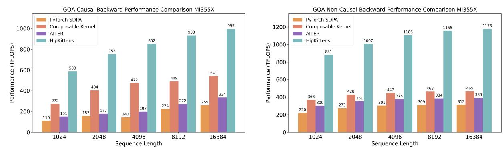
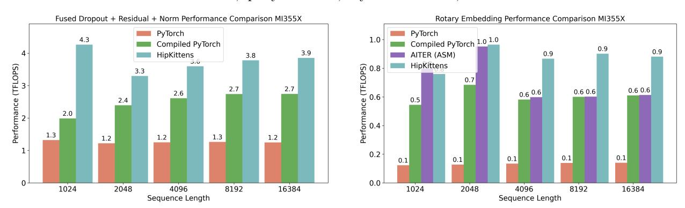

# 4 Experiments

In this section, we validate that HK enables peak performance kernels, using simple and reusable tile-based primitives, across a breadth of AI operations.

Baselines. We compare to the best performing baseline kernels across PyTorch (compiled and SDPA), AITER [\[3\]](#page-12-1), Composable Kernel [\[4\]](#page-12-2), ROCm Libary Triton [\[8\]](#page-13-11), and HipBLASLT [\[8\]](#page-13-11). We evaluate on both MI325 CDNA3 and MI355 CDNA4. We benchmark HK kernels in Python scripts using Python bindings (ecept FP8 where AMD PyTorch support remains experimental). For each kernel, we use 500 warmup runs and report the average TFLOPs/s performance over 100 runs over randomly generated input tensors from the standard normal distribution. All kernels are benchmarked in AMD's recently released beta Docker using ROCm 7.0 ([rocm/7.0-preview:rocm7.0\\_preview\\_pytorch\\_training\\_mi35x\\_beta](rocm/7.0-preview:rocm7.0_preview_pytorch_training_mi35x_beta)).

HK provides a comprehensive suite of peak-performance AMD AI kernels, written using reusable tile-based abstractions. We also include code listings in Appendix [E](#page-31-0) and additional results in Appendix [C:](#page-19-0)

1. BF16 and FP8 GEMM. HK competes with the AMD baseline kernels that are written in assembly

Figure 8: Attention backwards. We compare HipKittens GQA and MHA (Figure [15\)](#page-22-0) to the strongest available baselines. We use batch 16, query heads 64, key value heads 8, and head dim 128.

Figure 9: Memory bound. We compare HipKittens fused dropout-residual-layernorm and rotary kernels to the strongest available baselines at batch 16, heads 16, and head dim 128.

(AITER, HipBLASLTt/PyTorch). HK outperforms the Triton compiler by 1.3 − 3.0×. Further, we obtain these results using a single 8-wave kernel schedule that generalizes across the evaluated problem shapes.

2. Attention forwards. We evaluate multi-head attention (MHA) and group-query attention (GQA) kernels in causal and non-causal settings, and for head dimensions 64 and 128. HK outperforms all available AMD baselines on average, including the AITER kernels, which are written in hand-optimized raw assembly by AMD engineers. HK is 1.0 − 2.1× faster than AITER, 1.3 − 4.5× faster than PyTorch (SDPA), 1.0 − 1.4× CK, and 1.2 − 4.5× Triton kernels in Figure [7.](#page-10-1)

HK's attention forward kernel uses an 8-wave ping-pong. Within compute clusters, each wavefront interleaves online-softmax vector ops (max/subtract/exp2/accumulate) with MFMA instructions. Despite substantial scheduling and hardware differences between MI355X and NVIDIA B200, the kernel is competitive with FlashAttention-3 under comparable settings [\[31\]](#page-14-3).

3. Attention backwards. Our GQA causal and non-causal backwards attention kernels outperform the baselines by 1.8 − 2.5× across settings (Fig. [8\)](#page-11-0). Our MHA kernels compete with the strongest available baselines, which are written in assembly (Fig. [15\)](#page-22-0).

Attention backwards is a notoriously register heavy workload. Our efficient HK kernel uses multiple MFMA instruction shapes (16 × 16 × 32 and 32 × 32 × 16), different shared memory access patterns (e.g., both row and column layout loads to registers from the same shared tile), and explicit register pinning.

4. Memory bound results. We consider a fused dropout-residual-layernorm kernel (from prenorm Transformer architectures) and a rotary positional encoding kernel in Figure [9.](#page-11-1) HK outperforms both AITER and PyTorch compiled kernels by 1.1 − 2.2× across settings.

The inconsistent performance of AMD libraries and the difficulty of scaling assembly-engineered kernels (e.g., reinforced by head dim. 64 attention and GQA non-causal backwards) reflects the value of having a simple set of kernel programming abstractions to accelerate AMD kernel development. Finally, to validate kernel stability, we use our kernels to pretrain Llama 1B [\[2\]](#page-12-0) and BERT 110M [\[12\]](#page-13-12) on the Slim Pajama corpus, matching the perplexity of models trained using PyTorch and AITER after 10B tokens of training.

