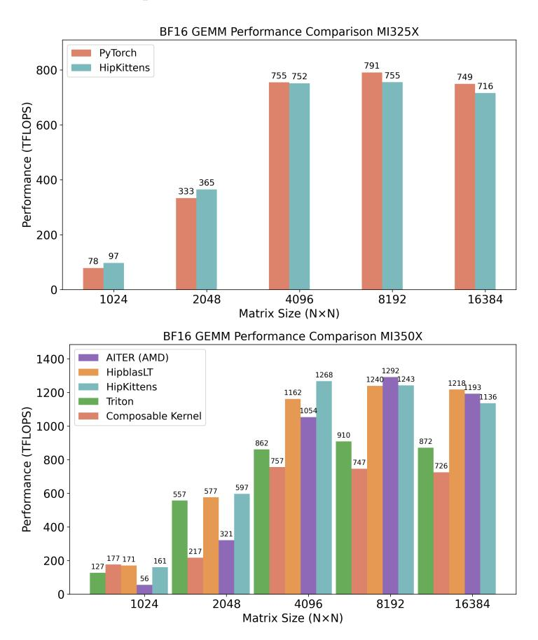
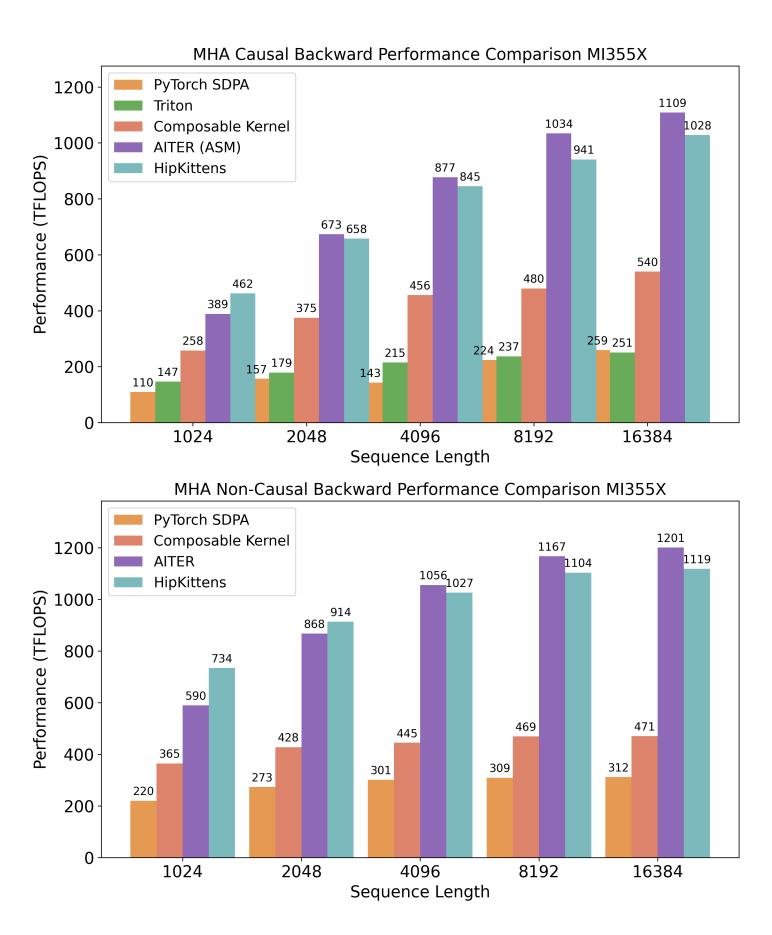
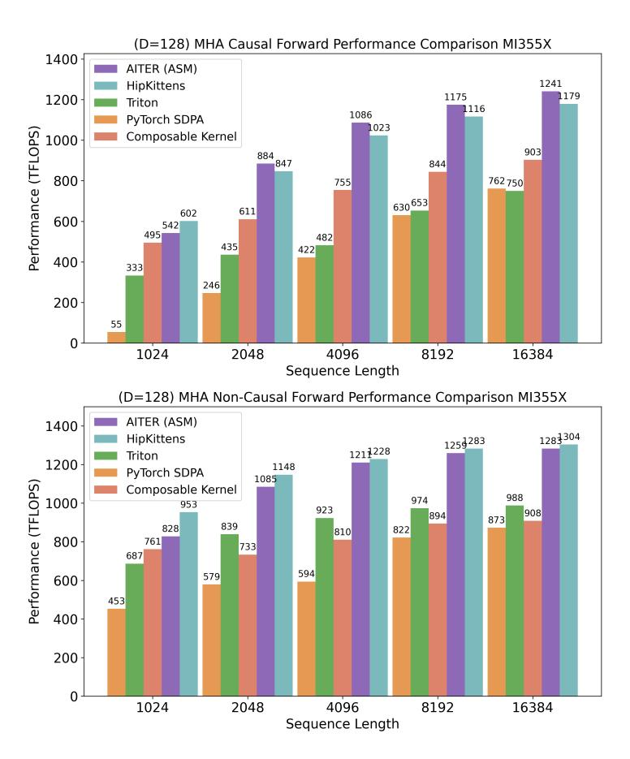
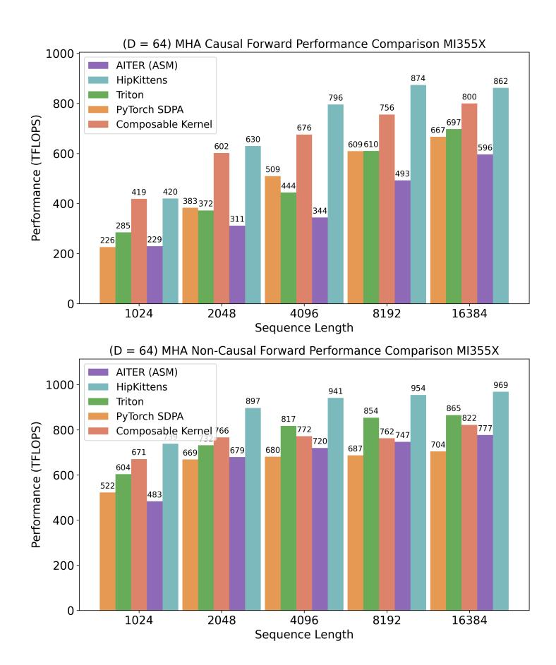
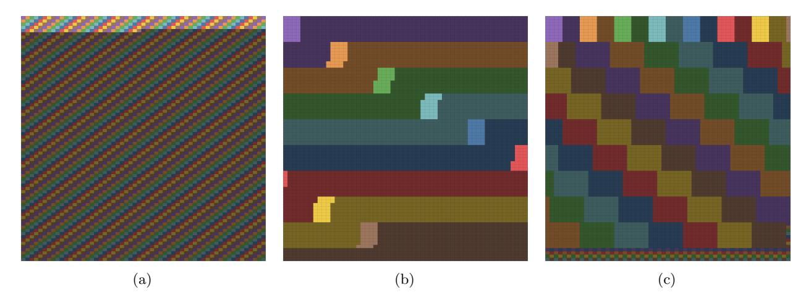
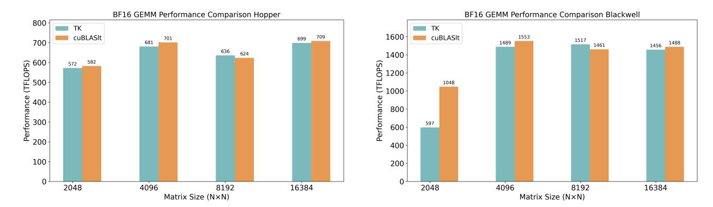

# <span id="page-19-0"></span>C Extended analysis

This section provides details on our setup and supplemental results.

Setup details. AMD provides multiple docker containers at https://hub.docker.com/u/rocm. We use the recent AMD provided Docker containers to benchmark kernels: docker.io/rocm/7.0-preview: rocm7.0-preview\_pytorch\_training\_mi35x\_beta on MI350X/MI355X and docker.io/rocm/pytorch on the MI300X/MI325X. A sample command to launch the container is provided below:

```
podman run -it \
2
        --ipc=host \
3
        --network=host \
4
        --privileged \
        --cap-add=CAP_SYS_ADMIN
6
        --cap-add=SYS_PTRACE \
        --security-opt seccomp=unconfined \
        --device=/dev/kfd \
9
        --device=/dev/dri \
10
        -v $(pwd):/workdir/ \
        -e USE_FASTSAFETENSOR=1 \
11
        -e SAFETENSORS_FAST_GPU=1 \
13
        rocm/7.0-preview:rocm7.0_preview_pytorch_training_mi35x_beta \
```

**Baselines.** For the AITER baselines, we use Figure 10. If AITER does not automatically come with the Docker, we install from source. For the Composable Kernel baselines, we use the installation process and kernels indicated in Figure 12. For the PyTorch baselines, we use Figure 11. For the HipBLASLT baselines, we use the command from Figure 13 within the AMD provided Dockers.

```
// Attention\nimport aiter
out_aiter, softmax_lse = aiter.flash_attn_func(Q_aiter, K_aiter, V_aiter, causal=causal, return_lse=True,
```

Figure 10: AITER benchmarking.

```
out_pt = torch.nn.functional.scaled_dot_product_attention(q_pt, k_pt, v_pt, attn_mask=None, dropout_p
```

Figure 11: PyTorch benchmarking.

```
// Build
                [~] git clone https://github.com/rocm/composable_kernel
  3
                [~] cd composable_kernel
   4
                 [~/composable_kernel] mkdir build && cd build
   5
                [~/composable_kernel/build] ../script/cmake-ck-dev.sh .. gfx950 -G Ninja
   6
                [~/composable_kernel/build] ninja tile_example_gemm_basic
                [~/composable_kernel/build] ninja tile_example_fmha_fwd
                [~/composable_kernel/build] ninja tile_example_fmha_bwd
10
               ./bin/tile_example_gemm_basic -prec=fp8 -m=1024 -n=1024 -k=1024 -warmup=500 -repeat=100 -v=1
12
                ./bin/tile_example_fmha_fwd -prec=bf16 -b=16 -h=16 -d=128 -s=1024 -mask=1 -warmup=500 -repeat=100 -kname

                ./bin/tile\_example\_fmha\_bwd - prec=bf16 - b=16 - h=16 - d=128 - s=1024 - mask=1 - warmup=500 - repeat=100 - kname=100 - kname=100 - kname=100 - kname=100 - kname=100 - kname=100 - kname=100 - kname=100 - kname=100 - kname=100 - kname=100 - kname=100 - kname=100 - kname=100 - kname=100 - kname=100 - kname=100 - kname=100 - kname=100 - kname=100 - kname=100 - kname=100 - kname=100 - kname=100 - kname=100 - kname=100 - kname=100 - kname=100 - kname=100 - kname=100 - kname=100 - kname=100 - kname=100 - kname=100 - kname=100 - kname=100 - kname=100 - kname=100 - kname=100 - kname=100 - kname=100 - kname=100 - kname=100 - kname=100 - kname=100 - kname=100 - kname=100 - kname=100 - kname=100 - kname=100 - kname=100 - kname=100 - kname=100 - kname=100 - kname=100 - kname=100 - kname=100 - kname=100 - kname=100 - kname=100 - kname=100 - kname=100 - kname=100 - kname=100 - kname=100 - kname=100 - kname=100 - kname=100 - kname=100 - kname=100 - kname=100 - kname=100 - kname=100 - kname=100 - kname=100 - kname=100 - kname=100 - kname=100 - kname=100 - kname=100 - kname=100 - kname=100 - kname=100 - kname=100 - kname=100 - kname=100 - kname=100 - kname=100 - kname=100 - kname=100 - kname=100 - kname=100 - kname=100 - kname=100 - kname=100 - kname=100 - kname=100 - kname=100 - kname=100 - kname=100 - kname=100 - kname=100 - kname=100 - kname=100 - kname=100 - kname=100 - kname=100 - kname=100 - kname=100 - kname=100 - kname=100 - kname=100 - kname=100 - kname=100 - kname=100 - kname=100 - kname=100 - kname=100 - kname=100 - kname=100 - kname=100 - kname=100 - kname=100 - kname=100 - kname=100 - kname=100 - kname=100 - kname=100 - kname=100 - kname=100 - kname=100 - kname=100 - kname=100 - kname=100 - kname=100 - kname=100 - kname=100 - kname=100 - kname=100 - kname=100 - kname=100 - kname=100 - kname=100 - kname=100 - kname=100 - kname=100 - kname=100 - kname=100 - kname=100 - kname=100 - kname=100 - kname=100 - kname=100 - kname=100 - kname=100 - kname=100 - kname=100 - kname=100 - kname=100 - kname=100 - kname=100 - knam
```

Figure 12: CK benchmarking. For each dimension of the GEMM, we report the best performance across the CK tile example streamk gemm basic, tile example gemm basic, and tile example gemm universal.

```
// bf16
    hipblaslt-bench --batch_count 1 --a_type bf16_r --b_type bf16_r --c_type bf16_r --d_type bf16_r --

→ rotating 512 --iters 100 --cold_iters 500 -m 1024 -n 1024 -k 1024
2
3
4
5
    // fp8
    hipblasht-bench --api_method c --stride_a 0 --stride_b 0 --stride_c 0 --stride_d 0 --alpha 1.000000 --
         ⇔ beta 0.000000 --transA T --transB N --batch_count 1 --scaleA 1 --scaleB 1 --a_type f8_r --b_type
         → f8_r --c_type bf16_r --d_type bf16_r --scale_type f32_r --bias_type f32_r --compute_type f32_r
         → rotating 4 --iters 100 --cold_iters 500 -m 8192 -n 8192 -k 8192 --lda 8192 --ldb 8192 --ldc 8192
         → --ldd 8192 --initialization norm_dist
Q
    // fp6. after insstalling from source
10
    ./clients/hipblaslt-bench --api_method c -m 1024 -n 1024 -k 1024 --alpha 1 --beta 0 --transA T --transB N
         ↔ --batch_count 1 --scaleA 3 --scaleB 3 --a_type f6_r --b_type f6_r --c_type f16_r --d_type f16_r
        → --compute_type f32_r --rotating 0 --cold_iters 500 --iters 100
```

Figure 13: HipBLASLT benchmarking.

### C.1 HipKittens kernels

<span id="page-21-0"></span>We include the remaining kernel plots from Section [4.](#page-10-0) We include BF16 GEMM results for the MI325X and MI350X GPUs in Figure [14.](#page-21-0) We include MHA results on the MI355X GPUs in Figure [16](#page-23-0) for the forwards pass and Figure [15](#page-22-0) for the backwards pass.



Figure 14: BF16 GEMM. We compare HipKittens to the strongest available baselines on the MI325X and MI350X. For these kernels, we use dimensions M = N = K.

<span id="page-22-0"></span>

Figure 15: Attention backwards. MI355X results for causal and non-causal attention. We use batch size 16, heads 16, head dim 128.

<span id="page-23-0"></span>

Figure 16: Attention forwards. MI355X results for causal and non-causal attention. We use batch size 16, heads 16, head dim 128.



Figure 17: Attention forwards. MI355X results for causal and non-causal attention. We use batch size 16, heads 16, head dim 64.

## C.2 Grid schedules.

In Section [3.4,](#page-7-1) we include Table [4](#page-8-0) to discuss the chiplet swizzling strategy to optimize L2 and LLC reuse. In Figure [18](#page-25-0) we provide the corresponding grid order visualization for the 14592 dimension GEMM.

<span id="page-25-0"></span>

Figure 18: Visualization of three different grid schedules for the output D matrix of a M=N=K=14592 BF16 GEMM. Color represents XCD assignment. Highlighted is the first timestep of thread blocks scheduled across the device (256 CUs). Schedule [18a](#page-25-0) assigns blocks to the grid according to block ID. Schedules [18b](#page-25-0) and [18c](#page-25-0) apply algorithm [1](#page-9-0) with different chunk sizes and the same window size. Table [4](#page-8-0) showcases the performance for each of these schedules. This GEMM setting is especially sensitive to these optimizations due to the default schedule resulting in worst case L2 reuse and the large memory footprint making LLC reuse even more important.

### C.3 ThunderKittens performance

We benchmark TK [\[33\]](#page-14-4) and CuBLASLT kernels on inputs drawn from N (0, 1) with 500 iterations of warmup and 100 iterations of measured runs, remaining consistent with our protocol on the AMD GPUs. Results are shown in Figure [19.](#page-26-0) [8](#page-26-1) We include this to highlight how the TK philosophy, which we extend in this work, leads to performant NVIDIA kernels.

<span id="page-26-0"></span>

Figure 19: ThunderKittens performance. We compare TK to NVIDIA CublasLT BF16 GEMM performance, finding that TK kernels offer competitive performance, despite the TK kernels being released ≈ 8-12 months ago.

<span id="page-26-1"></span><sup>8</sup>We evaluate both on NVIDIA H100 and NVIDIA B200 GPUs. We generally observe that the NVIDIA kernel performance degrades as the number of iterations increases and we note that Spector et al. [\[33\]](#page-14-4) reports using fewer iterations.

