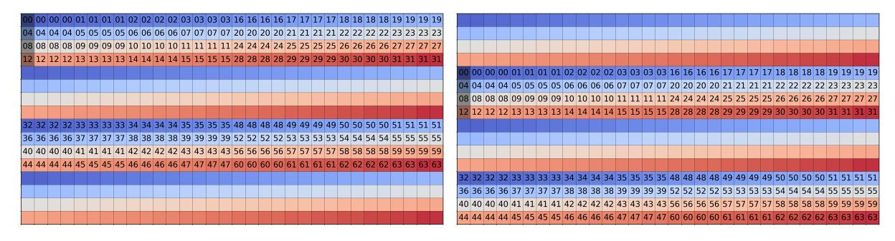

# <span id="page-27-2"></span>D Library implementation details

### <span id="page-27-0"></span>D.1 Shared and Register Memory

Register Layouts. The layout of a register tile dictates whether threads hold elements in a row-major or column-major order. [9](#page-27-3) Since threads hold consecutive elements in the reduction dimension of MFMA instructions, the register layout decides whether we are reducing over rows or columns of memory. When loading data from shared memory to registers, we typically use two different types of instructions for BF16:

- Row layouts (ds read b128): ds\_read\* instructions take in 3 arguments: 1) vector registers to serve as the destination of the data, 2) a shared memory address, and 3) a constant offset from the shared memory address to read data. The ds\_read\_b128 instruction is carried out in 4 phases where subsets of the 64 threads execute in each phase (Tab. [5\)](#page-28-0). As a result, ensuring that no two threads belonging to the same phase access the same shared memory bank eliminates bank conflicts for this instruction. With 16 threads participating in each phase, each thread accessing 128 bits or 4 banks, all 64 banks should be read and we maximize shared memory throughput.
- Column layouts (ds read b64 tr b16): Normally, reading data in a column-major format involves issuing multiple loads for each individual row we access. Using the ds\_read\_b64\_tr\_b16 instruction allows us to perform these column-major loads much more efficiently by having threads access shared memory at a greater granularity. Take the 16x32 register tile for example in Figure [20\)](#page-27-4).

In a 16x32 column layout register tile where each thread holds 8 contiguous elements in the reduction dimension (i.e., stride 8), thread 0 holds the first element in rows 0-7. They are shaded in the two tables too. The ds\_read\_b64\_tr\_b16 instruction accomplishes this load by having different threads read data that is placed in another thread's vector register lane. For example, thread 4 technically reads the first element in the second row, but instead of placing it in its own register lane, it puts it into thread 0's register. This instruction executes in two phases where the first 32 threads read during the first phase and the remaining ones read during the second phase. If this SMEM tile only needed to support reads from column-major 16x32 register tiles, an unswizzled pattern would be sufficient to eliminating bank conflicts. However, shown in Figure [4,](#page-5-2) a swizzle is necessary to support reads from a row-major 16x32 register tile.

<span id="page-27-4"></span>

Figure 20: Shared memory access pattern for ds read b64 tr b16 for reading in a 16x32 column layout register tile. Each cell represents a single 16 bit values and the numbers represent threads. Different colors represent different shared memory banks (note that a bank spans two cells).

<span id="page-27-1"></span>Shared Memory and Register Tile Shapes. While the previous subsection focused on loads from a 16x32 shared memory tile shape to a 16x32 register tile, different workloads could warrant other shared memory and register tile shapes mapping to different MFMA instructions. HK supports loads and stores between shared memory and register tile shapes as long as one is a multiple of the other. For example, loading from a 16x32 shared memory tile into a 32x16 register tile is not supported, but loading from a 16x16 shared memory tile into a 32x16 register tile is permitted. Each shared memory tile shape is also equipped with a default swizzling pattern that is a best-effort attempt to eliminate bank conflicts for common access patterns.

<span id="page-27-3"></span><sup>9</sup>[https://github.com/ROCm/amd\\_matrix\\_instruction\\_calculator](https://github.com/ROCm/amd_matrix_instruction_calculator). This is a useful resource to learn more about the register tile layouts and shapes.

A single swizzle is not possible. To show why a single swizzling pattern is insufficient across different register tile shapes and layouts on AMD GPUs, consider the following two access patterns that surface in attention backwards:

- 1. A row-layout 16x16 bf16 tile is written to shared memory. For this tile configuration, each thread holds 4 contiguous bf16 values - 64 bits in memory - and the most optimal instruction to issue this write is ds\_write\_b64. Avoiding bank conflicts for this access requires a swizzle pattern that respects the phase ordering and bank behavior as listed in Table [5.](#page-28-0) In this case, a swizzle that abides by these constraints is offset ^= ((offset % 512) >> 7) << 3, where 64-bit chunks of memory is shifted around memory using an XOR swizzle.
- 2. A row-layout 16x32 bf16 tile is read from shared memory. For this tile, each thread holds 8 contiguous bf16 values - 128 bits in memory - and the most optimal instruction to issue this read is ds\_read\_b128.

Regardless of the swizzling pattern required for ds\_read\_b128, the granularities of these two instructions are in conflict with each other. ds\_read\_b128 requires at least 128 bits of memory to be contiguous in shared memory, and the swizzle pattern for ds\_write\_b64 breaks apart memory into 64-bit chunks. As a result, different swizzling patterns need to be used for each.

### D.2 Phases and Banks

Since per-instruction phase and bank behavior is not well documented, we create simple solvers for both. The phase solver iterates over every pair of threads in a wave and performs the shared memory instruction on the same bank. If a shared memory bank occurs, the two threads belong to the same phase. The bank solver takes two threads belonging to the same phase, fixes one thread to access bank zero, and accesses other banks using the other thread. The number of banks between bank zero and the first bank where a bank conflict occurs represents the number of banks accessible by the shared memory instruction.

<span id="page-28-0"></span>

| Instr.             | Banks | Phase | Active threads      |
|--------------------|-------|-------|---------------------|
| ds<br>read<br>b128 |       | 0     | 0-3, 12-15, 20-27   |
|                    | 64    | 1     | 4-11, 16-19, 28-31  |
|                    |       | 2     | 32-35, 44-47, 52-59 |
|                    |       | 3     | 36-43, 48-51, 60-63 |
|                    | 32    | 0     | 0-3, 20-23          |
|                    |       | 1     | 4-7, 16-19          |
|                    |       | 2     | 8-11, 28-31         |
| ds<br>read<br>b96  |       | 3     | 12-15, 24-27        |
|                    |       | 4     | 32-35, 52-55        |
|                    |       | 5     | 36-39, 48-51        |
|                    |       | 6     | 40-43, 60-63        |
|                    |       | 7     | 44-47, 56-59        |
| ds<br>write<br>b64 | 32    | 0     | 0-15                |
|                    |       | 1     | 16-31               |
|                    |       | 2     | 32-47               |
|                    |       | 3     | 48-63               |
| ds<br>read<br>b64  |       | 0     | 0-31                |
|                    | 64    | 1     | 32-63               |

Table 5: Phase-bank table. The number of banks available to each shared memory instruction and the number of phases (and participating threads per phase) each instruction requires.

### D.3 Pinned register tiles

HK lets developers control the registers assigned to different register tiles through the concept of register ranges. For example:

```
1 using Q_ranges =
2 split_many_t < type_list < range <24 , 39 > > , 4 >;
```

This defines a list of register ranges where each range contains exactly 4 registers. The register ranges here are v[24:27], v[28:31], v[32:35], and v[36:39]. Each register range corresponds to the registers required to hold a single base tile in a register tile, and we specify a list of register ranges when defining a register tile like:

```
1 rt < bf16 , 16 , 128 , row_l ,
2 rt_16x32_s , Q_ranges > Q_i ;
```

Developers can call the same functions in HK, but now have them operate on specific registers instead. As mentioned in Section [3.2,](#page-4-0) this allowed us to pin AGPRs as the A or B matrix inputs to MFMA instructions when writing our attention backwards kernel.

## D.4 Compiler hints

The LLVM compiler accepts developer-provided hints to guide instruction scheduling on AMD GPUs.[10](#page-29-0) We use these some of these hints in our kernels to augment the scheduling that we apply at the HIP level. There are three sets of intrinsics that we find useful.

- 1. The llvm.amdgcn.sched.barrier intrinsic accepts a mask, which tells the compiler which types of instructions can cross the intrinsic in the compiled schedule. Masks exist for all instructions, VALU (vector ALU) instructions, SALU (scalar ALU) instructions, VMEM (global memory) instructions, MFMA (matrix) instructions, and so on, as described in the documentation. This intrinsic is used to establish hard boundaries between clusters of instructions in our clusters. For instance, see \_\_builtin\_amdgcn\_sched\_barrier(0) in our Appendix [E](#page-31-0) kernel listings.
- 2. The llvm.amdgcn.sched.group.barrier intrinsic is used to establish scheduling pipelines. The developer considers a group of instructions and specifies to the compiler precisely how to order them. A call of the builtin accepts a mask that specifies the instruction type, size indicating the number of instructions of this type that calls the builtin applies to, and a sync id serves as an identifier.

This builtin creates a "super group" of "instruction groups". The sync id identifies the super group; order is enforced between instruction groups with the same sync id, and instruction groups are only scheduled relative to other groups with the same sync id.

The mask is a bitmask. Here are some frequently used ones:

```
1 # define MFMA_MASK 0x08
2 # define VMEM_MASK 0x20
3 # define DS_MASK 0 x100
```

Each call of this intrinsic looks backward and finds the most recent of the corresponding type of instruction which are not already part of a group created by a previous \_\_builtin\_amdgcn\_sched\_group\_barrier

For example:

```
1 __builtin_amdgcn_sched_group_barrier ( VMEM_MASK , 4, 0) ;
2 __builtin_amdgcn_sched_group_barrier ( MFMA_MASK , 4, 0) ;
3 __builtin_amdgcn_sched_group_barrier ( DS_MASK , 8, 0) ;
4 __builtin_amdgcn_sched_group_barrier ( MFMA_MASK , 4, 0) ;
```

<span id="page-29-0"></span><sup>10</sup><https://llvm.org/docs/AMDGPUUsage.html>

This finds the last 4 global memory (VMEM) loads and schedules those first, then finds the last 4 matrix (MFMA) instructions and schedules those after the global memory loads, then finds the last 8 shared to register (DS READ) loads and schedules those after the 4 MFMAs, then finds the previous 4 MFMAs before the last 4 and schedules those last.

3. The \_\_builtin\_amdgcn\_s\_setprio intrinsic lets us specify the priority (0-3) for a wave relative to other waves that are competing for hardware resources. We use this around compute clusters in the 8-wave ping-pong schedule as shown in our GEMM and attention forwards kernels.

The limitation of using these hints for scheduling is that any code wrapped in asm volatile is black-box to the compiler, and for some instructions (e.g., v\_cvt\_pk\_bf16\_f32 to convert from BF16 to FP32), LLVM builtins are missing.

It is worth noting that the current Modular AI GEMM kernels (as of October 2025) rely on compiler hints (sched\_group\_barrier). This approach could work since Modular is replacing the compiler as well; however, it requires the developer to think about every single instruction issue rather than providing the option to think about bulk tile primitives. Our opinion is that using scheduling hints at the cluster scope and tile primitives to form the top level kernel schedule (as in our attention forwards kernel) may help simplify programmability and maintain performance.

### D.5 Synchronization

Loads Similar to asynchronous tensor memory acceleration (TMA), AMD CDNA3 and CDNA4 GPUs have direct global memory to LDS (shared memory) load instructions called buffer\_load\_dword. These instructions can load one dword (4 bytes, one bank), three dwordx3 (12 bytes), or four dwordx4 (16 bytes). The instructions skip the register file and accept constant offsets that also help mitigate address calculation overheads. Once the load is issued, the instruction vmcnt(x) specifies to wait until only x global memory load instructions remain in flight, and vmcnt(0) indicates to wait on all outstanding loads. Ideally, we can separate the distance between load issues and these waits (as shown in our GEMM and attention kernels (Sec. [E\)](#page-31-0)).

Similarly, there are asynchronous shared to register memory loads called ds\_read\_b32 (or b64 for 8 bytes, b96 for 12 bytes, b128 for 16 bytes). The instruction lgmkcnt(x) specifies to wait until x shared to register instructions remain in flight, and lgmkcnt(0) indicates to wait on all outstanding shared to register loads.

Execution An \_\_builtin\_amdgcn\_s\_barrier() functionally matches syncthreads. Note that AMD has a SIMD model and NVIDIA follows SIMT, so we do not need to sync the threads within the warp on AMD. As a result, there is no equivalent of syncwarp on AMD.

