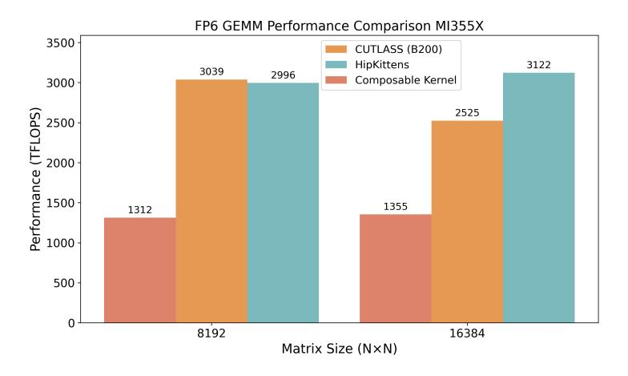

# F Case study: Preliminary findings for the FP6 GEMM

We discuss our initial empirical observations of FP6 hardware behavior on AMD's MI350X and MI355X GPUs. The goal is to characterize how FP6 memory movement and matrix-core operations behave in practice. AMD's own CK library baselines are unoptimized at the time of writing, and our results should be interpreted as preliminary. FP6 is exciting because AMD matrix cores achieve twice the peak FLOPS for FP6 as NVIDIA devices. However, in practice, we incur challenges in loading FP6 values to and from memory, which impact our ability to achieve high utilization.

Memory Loads. Our FP6 GEMM kernel uses 4 waves to cooperatively load a 128×128 tile from global memory in each memory cluster. With the FP6 datatype, that tile is 128 × 128 × 6/8 = 12,288 bytes, or 48 bytes per thread. We consider the following CDNA4 instructions as options to load from global memory:

• buffer\_load\_dwordx4 minimizes the number of instructions issued per thread (at 3 per tile). However, naively using this instruction to load to shared memory and then using ds\_read\_b128 followed by ds\_read\_b64 to read the 24 consecutive bytes owned by each thread from shared memory into registers causes shared memory alignment issues, because ds\_read\_b128 must be 16-byte aligned for maximum performance. For example, the second thread on each row of the tile performs a ds\_read\_b128 at an offset of 24 bytes into the row. Our kernel becomes shared-memory bound in this configuration.

One solution is for every second thread (laneid % 2 == 1) to flip the two shared memory load instructions, so ds\_read\_b64 loads the first 8 bytes of the thread's data, and ds\_read\_b128 loads the next 16 bytes. We find that loading into a register destination that depends on the thread ID requires the use of slow scratch storage. Instead, for threads with flipped ds\_read\_\* instructions, we continue reading ds\_read\_b128 into the first four registers and ds\_read\_b64 into the second two registers, regardless of thread. This approach then requires a shuffle, where we conditionally swap the two regions in registers based on thread ID. This "breaks the wave," resulting in two jump instructions in addition to the VALU instructions required to move the memory. We find that the incurred jump + VALU from shuffling comprises 49% of the cycles in the kernel's hot loop, resulting in a kernel that achieves only 2430 TFLOPs.

Alternatively, we can use two ds\_read\_b96 instructions. This approach causes misalignment between the 16-byte chunks read by buffer\_load\_dwordx4 from global to shared memory and the 12-byte chunks read by ds\_read\_b96. As a result, we are unable to swizzle the data in shared memory, resulting in 4-way bank conflicts. Given these issues with buffer\_load\_dwordx4, we look at other options for loading FP6 values from global to shared memory.

- buffer\_load\_dwordx3 is appealing for FP6 because it allows a warp to exactly load an 8×128 tile from global memory. It also supports swizzling. Unfortunately, this instruction for FP6 does not outperform FP8 in instruction issue count: each thread issues 4 instructions to load a 128×128 tile, which is the same number used in our FP8 GEMM kernel. This instruction also loads each thread's 12 bytes of data at a stride of 16 bytes, wasting 25% of the resulting shared memory tile and rendering 8 of the 32 banks available to ds\_read\_b96 (Table [5\)](#page-28-0) unused. Despite these drawbacks, we find this is likely the most compelling global-to-shared load instruction for our FP6 GEMM use case. ds\_read\_b96 is the natural LDS-to-register load instruction for data loaded to shared memory using buffer\_load\_dwordx3. We find that ds\_read\_b96 works well on 16-byte aligned shared memory addresses.
- buffer\_load\_dwordx1 avoids shared memory waste, alignment issues, and swizzling limitations, but the kernel becomes bottlenecked by the number of instructions issued, resulting in a slower kernel than the one built with buffer\_load\_dwordx3.

Matrix Core Operation. With the BF16 and FP8 GEMMs, we found the fastest MFMA instruction is the smaller one available for the given dtype (Figure [3\)](#page-7-0), which in this case is v\_mfma\_f32\_16x16x128\_f8f6f4. In this instruction, each thread owns 32 consecutive elements, or 24 consecutive bytes, of each FP6 operand matrix. In our kernel, each thread issues two ds\_read\_b96 instructions: one for the first 12 bytes, and one for the latter 12 bytes. ds\_read\_b96 constrains the destination base address in the register file to a 16 byte aligned

Figure 24: FP6 GEMM. We compare performance of FP6 GEMM on square shapes 8192 and 16384 across AMD's CK library, NVIDIA's CUTLASS on B200, and HipKittens. We use 500 iterations of warmup and 100 iterations of measurement.

address, so in order to achieve continuity between the 24 bytes of data, we must issue three v\_mov\_b32\_e32 instructions to shuffle each of the three registers written to by the second v\_mov\_b32\_e32 down one register. Note that this shuffle is not as expensive as the shuffle required when using buffer\_load\_dwordx4 with ds\_read\_b128 and ds\_read\_b64 because fewer data are shuffled and no waves break due to this shuffle. We note that HIPCC does not handle this shuffle requirement well, and this kernel at size 16384x16384x16384 spills 54 registers to scratch memory, resulting in a slow and incorrect kernel. To remedy this, we rewrote our FP6 GEMM while explicitly scheduling registers, allowing us to intelligently set which registers are used in this shuffle and completely removing register spills. This approach was not without hazards. We need to account for the instruction latency of v\_mov\_b32\_e32, so we manually ensure that at least 8 cycles of instructions are between the v\_mov\_b32\_e32 instructions and the dependent MFMA instruction. In some cases, this involves manually inserting v\_nop instructions.

Results. FP6 matrix core speed is a standout feature of MI350X and MI355X GPUs. Our FP6 GEMM kernel outperforms AMD's CK implementation and attains performance comparable to our own FP8 GEMM. These results reflect our initial observations of FP6 hardware behavior; we expect additional improvements in future work.