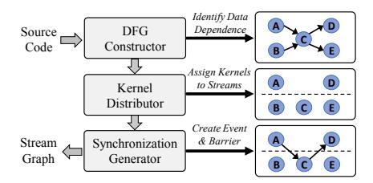
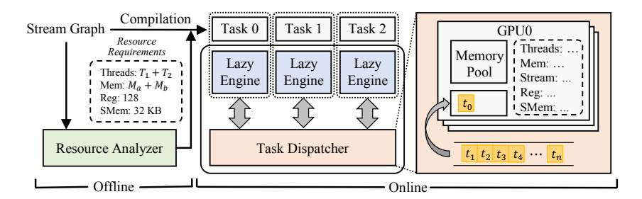

# 3 Related Work

### 3.1 Concurrent Kernel Execution

CKE has been widely studied in fne granularity. Elastic kernel [\[36\]](#page-24-0) slices kernels into multiple small ones and deploys them on diferent SM to speed up. Similarly, OpenMP [\[35\]](#page-24-10) is leveraged to decompose kernels into multiple tasks in Junggler [\[3\]](#page-23-11) and schedule tasks with dependencies via runtime mechanism. Also, Pagoda [\[59\]](#page-25-5) concurrently executes narrow tasks at warp-level by virtualizing GPU resources and issues kernels when required resources are available. ROSGM [\[22\]](#page-23-12) leverages stream priorities in the Robot Operating System to dynamically switch kernel scheduling strategies across diferent application scenarios. To reduce runtime profling overhead, a Fisher feature selection-based method [\[47\]](#page-24-11) is employed to classify kernels and collocate those with complementary characteristics. cCUDA [\[46\]](#page-24-12) performs online profling and ranking for kernels, and employs kernel slicing to maximize computation overlap. FlexSched [\[25\]](#page-24-13) further enables dynamic resource allocation and preemptive scheduling during CKE using persistent kernels. Specifcally, cCUDA and FlexSched assume that all kernels are ready before scheduling without data dependencies, focusing on selecting optimal subsets of concurrent kernels and devising strategies for resource allocation among them. Addressing concurrency among data-dependent kernels within an application, Taskfow [\[15\]](#page-23-1) wraps GPU programming model APIs and implements a static scheduler in the framework. A GrCUDA [\[29\]](#page-24-3)-based runtime scheduler [\[38\]](#page-24-4) eases the prototyping of parallel applications. Distinguished from those prior arts, our proposed HuntKTm aims to statically automate kernel scheduling in multi-kernel programs, achieving much beter performance with reduced programming burden.

### 3.2 Task Scheduling

A bunch of task schedulers have been proposed to optimize concurrent task execution. On the hardware level, new APIs are introduced in [\[41\]](#page-24-14) to heterogeneous system architecture (HSA) 161:6 W. Pan et al.

for applications specifying task priority. Chimera [\[37\]](#page-24-15) extends the SM scheduler to estimate the cost of kernel preemption to minimize the overhead. Similarly, the command bufer and status table are further embedded in the SM scheduler [\[50\]](#page-24-16) to minimize the overhead for prioritized tasks. On the sofware level, FLEP [\[55\]](#page-25-6) leverages a compiler-runtime system to control task preemption at the kernel level. EfSha [\[5\]](#page-23-13) schedules kernels at thread-block level dynamically with an online cost model. ElasticBatch[\[42\]](#page-24-17), gpulet[\[9\]](#page-23-14), and Paris&ELSA[\[19\]](#page-23-15) introduce innovative partitioning and scheduling algorithms designed for efciently distributing inference requests across GPUs with MIG enabled. SchedGPU [\[44\]](#page-24-7) co-locates applications on a device in a memory-safe manner through a dedicated runtime system. CASE [\[4\]](#page-23-6) introduces a novel compiler-based approach for scheduling uncooperative tasks over a multi-GPU system, which shares some similarities to HuntKTm regarding retrieving resource requirements in a lazy runtime. While prior arts consider resource requirements as static features, HuntKTm integrates with a memory management strategy for alleviating the memory botleneck in task co-execution scenarios.

### 3.3 GPU Memory Optimization

Te efcient utilization of limited GPU memory has been extensively studied across various scenarios. Techniques such as swapping [\[18,](#page-23-8) [23,](#page-23-10) [24,](#page-23-16) [58\]](#page-25-7), recomputation [\[7,](#page-23-17) [17,](#page-23-18) [49\]](#page-24-9), compression [\[16,](#page-23-19) [26,](#page-24-18) [45\]](#page-24-19), and reusing [\[21,](#page-23-9) [39,](#page-24-20) [48\]](#page-24-21) have been widely adopted for memory optimization. DeepUM [\[18\]](#page-23-8) proposes a correlation prefetch technique to hide signifcant overhead due to unifed memory page faults. DELTA [\[51\]](#page-24-22) and ATP [\[8\]](#page-23-20) combine both swapping and recomputation to achieve lower memory consumption and higher throughput in DNN training. SMC [\[26\]](#page-24-18) selectively compresses read-only pages to enable memory oversubscription while avoiding severe decompression cost. Targeting memory reusing, frameworks like PyTorch [\[39\]](#page-24-20) and TensorFlow XLA [\[48\]](#page-24-21) pre-allocate a memory pool before execution and adopt in-place operations to reuse memory spaces of input and output tensors. Occamy [\[21\]](#page-23-9) analyzes tensor liveness among DNN and applies kernel fusion to eliminate redundant intermediate tensors. However, these reuse methods focus on highly structured deep learning applications and cannot be adapted for general GPU programs.

### 4 Motivation

In this section, we provide intuitive examples to demonstrate the benefts of increasing kernel-level and task-level concurrency over GPU space-sharing scenarios. Ten we discuss how to achieve this goal through automatic stream and task scheduling, and further memory management.

## 4.1 Insuficiency of Only Kernel-level and Task-level Concurrency

As discussed in Section [2.1,](#page-3-1) space-sharing schemes are commonly applied to improve GPU hardware utilization. However, we observe that computing resources can remain underutilized even with GPU utilization sustained at 100% in some multi-task scenarios. Here we use SM occupancy, obtained through a lightweight GPU monitoring tool DCGM [\[32\]](#page-24-23), as a metric to evaluate the utilization of GPU computing resources during kernel execution. Figure [2](#page-6-0) illustrates the SM occupancy of running two memory-intensive applications M2, composed of several activation and reduction kernels from NVIDIA FasterTransformer [\[31\]](#page-24-24), under three diferent concurrency schemes. Multi-stream issues multiple kernels without data dependencies from an application through several hardware queues simultaneously, while two applications execute serially. Multi-task co-execute two tasks in the same device with MPS being enabled. Even with 100% GPU utilization during execution, both multi-stream and multi-task achieve less than 10% SM occupancy. Such low occupancy indicates that relying solely on CKE or task execution can not fully exploit GPU resources. By combining multi-stream and multi-task, hybrid allows for the simultaneous execution of more kernels from diferent tasks, enhancing resource utilization and accelerating computation. Terefore, hybrid achieves an SM


<span id="page-6-0"></span>Fig. 2. SM occupancy of co-running two memoryintensive applications with CKE (multi-stream), concurrent task execution (multi-task) and hybrid execution (hybrid).

Fig. 3. SM occupancy of running six applications, where hybrid launches two jobs in a batch and hybrid w/ mem. with reduced memory usage launches three jobs simultaneously.

occupancy of up to 22%, ofering a throughput improvement of 73.1% compared to multi-stream and 79.7% compared to multi-task. Te result reveals signifcant potential for combining concurrent kernel and task execution in multi-task scenarios.

### 4.2 Memory Capacity Botleneck in Concurrent Task Execution

With combined concurrent kernel and task execution, the memory usage becomes a primary constraint on task-level concurrency, as GPU out-of-memory (OOM) can cause program crashes. Figure [3](#page-6-0) shows the SM occupancy curves for six multi-stream applications running under MPS, both without memory management (hybrid) and with memory management (hybrid w/ mem.). Te peak memory consumption is defned as the maximum instantaneous GPU memory during execution. In hybrid w/ mem., we manually schedule the allocation and deallocation instructions in M2, decreasing M2's peak memory consumption from 17.6 GB to 11.2 GB by reusing non-overlapping memory objects. Without memory management, only two applications could share a GPU with 40 GB memory, requiring three separate launches to complete the computation. With reduced memory footprint, three applications could be launched altogether. Running more tasks concurrently on a single device allows additional kernels from diferent tasks to saturate idle computational resources. Moreover, the result reveals that even with an increased number of concurrent tasks, hybrid w/ mem. exhibits minimal growth in data initialization and transfer time before kernel execution. Tis can be atributed to the overlap of communication time for certain tasks with the computation of others, along with the parallel execution of host operations across tasks. As a result, the enhanced task concurrency enabled by efcient memory management leads to an 18.2% improvement in system throughput. Tis indicates that memory capacity becomes increasingly critical for collocating more tasks on a single device and improving system throughput under hybrid scheduling.

### 4.3 High Programming Burden in GPU Management

With no doubt, considerable eforts and expert knowledge are needed to write CKE codes, which signifcantly raises the programming barrier and is error-prone. Table [1](#page-7-0) summarizes the characteristics of various concurrency optimization schemes in terms of programming eforts. To reduce the programming complexity of CKE, approaches like Taskfow [\[15\]](#page-23-1) and a GrCUDA-based [\[29\]](#page-24-3) scheduler (aliased as GrSched for ease of reference) [\[38\]](#page-24-4) have been proposed to craf new programming frameworks by extending CUDA's API for stream management and synchronization. Taskfow demands explicitly specifying dependencies through its APIs, while GrSched introduces a DSL embedded in Python to support automatic analysis and scheduling. Both schedulers require thorough refactoring of source code, which becomes another programming burden for users. In particular, errors of manually specifying dependencies in Taskfow can lead to incorrect computation results

161:8 W. Pan et al.

<span id="page-7-0"></span>

| Scheme        | D.A.a        | C.M.b        | M.M.c        | T.S.d        | N.P.F.e      | Language |
|---------------|--------------|--------------|--------------|--------------|--------------|----------|
| Serial        | Х            | Х            | Х            | Х            | ✓            | C++      |
| Taskflow [15] | X            | $\checkmark$ | X            | X            | X            | C++      |
| GrSched [38]  | $\checkmark$ | $\checkmark$ | X            | X            | X            | Python   |
| PyTorch [39]  | $\checkmark$ | $\checkmark$ | $\checkmark$ | X            | X            | Python   |
| CASE [4]      | X            | X            | X            | $\checkmark$ | $\checkmark$ | C++      |
| HuntKTm       | $\checkmark$ | ✓            | ✓            | $\checkmark$ | $\checkmark$ | C++      |

Table 1. Summary of Various Concurrent Schemes

#### Notes:

- <sup>a</sup> Automatic Dependency Analysis
- <sup>b</sup> Automatic Concurrency Management
- <sup>c</sup> Automatic Memory Management
- <sup>d</sup> Automatic Task Scheduling
- <sup>e</sup> No New Programming Framework

that are often hard to detect and debug, further increasing the risk and effort in development. Similar to CKE, memory management is impractical for programmers, as it requires detailed knowledge of memory objects and precise control over allocation and deallocation. Empirically, misordered memory operations and missing synchronizations are common in manual memory management, often resulting in unpredictable and hard-to-reproduce errors. While frameworks like PyTorch [39] and Tensorflow [1] offer dynamic memory management support, they are designed for deep learning rather than general-purpose GPU computing and require additional efforts to program within the framework.

Problems become more sophisticated when concurrent execution extends to multi-GPU systems. Users must specify target devices for applications before running and carefully control execution timing and order to prevent crashes from OOM errors and performance degradation. CASE [4] introduces a runtime system that transparently schedules tasks to appropriate devices without requiring a new programming framework. However, CASE lacks in-depth program analysis and optimization, leaving the burden of kernel concurrency and memory management on programmers. Therefore, there remains the urgency for a method that enables efficient kernel execution and task scheduling in multi-GPU systems with lowered coding efforts.

### 5 Design

This section presents our proposed design HuntKTM, which incorporates hybrid scheduling and memory management for efficient task and kernel execution. We first give the overview and then elaborate on each module.

#### 5.1 System Overview

Huntkim is a GPU kernel scheduling framework that supports efficient kernel execution through a combination of kernel-level and task-level concurrency scheduling along with automatic memory management. As shown in Figure 4, Huntkim consists of three key components: *stream scheduler*, *task scheduler*, and *memory manager. Stream scheduler* focuses on intra-task kernel scheduling by distributing kernels with data dependencies to different streams at compile time. It takes the source code of multi-kernel programs as input, analyzes inter-kernel data dependencies, and generates high-performance multi-stream programs to enable CKE within a task. Then, *task scheduler* combines compile-time and runtime information to evaluate the resource requirements of the program and dynamically collocates tasks on appropriate devices based on the available resources in multi-GPU systems. Cooperating *stream scheduler* and *task scheduler* automates the hybrid concurrent execution of kernels and tasks.

To address the memory bottleneck in hybrid scheduling, *memory manager* performs memory lifetime management during compilation. It processes the stream graph from *stream scheduler*, applying a novel analysis algorithm to identify the live range of each memory object, which corresponds to the actively used periods. By scheduling allocation and deallocation instructions,

Task

Fig. 4. Overview of HuntKTm, which consists of three components: stream scheduler, task scheduler and memory manager. Stream scheduler assigns kernels from multi-kernel programs to concurrent queues. Task scheduler evaluates the resource requirements of transformed programs and dispatches them to appropriate devices. Memory manager optimizes memory allocation and deallocation to reduce the memory footprint of tasks.

Kernel Memory Alloc. Memory Free

Sync.

memory manager efectively shortens the lifetime of memory objects and reuses the objects with non-overlapping lifetimes, thereby reducing the peak memory usage. In summary, HuntKTm maximizes concurrency through hybrid scheduling and memory optimization, ultimately improving GPU resource utilization and system throughput.

### 5.2 Stream Scheduler

<span id="page-8-0"></span>**· · ·**

To achieve kernel-level concurrency, the stream scheduler relies on lightweight code modifcations to help construct the DFG of kernels, then schedules the kernels across multiple streams while ensuring correct execution order through inter-stream synchronization instructions. Figure [5](#page-9-0) shows the overall structure of the stream scheduler, which consists of three main components: DFG constructor, kernel distributor, and synchronization generator. Te input of stream scheduler is the source code of a task, containing a series of kernels coded in the form of sequential execution. Te DFG constructor analyzes each kernel's inputs and outputs to build a DFG based on data dependencies. Te kernel distributor assigns kernels to multiple streams based on the analyzed DFG, and then the synchronization generator creates synchronization instructions between kernels in diferent streams to ensure the program executes correctly. Te fnal output of the stream scheduler is a stream graph that contains information about the multi-stream execution, which can be further optimized by the following transform pass.

To construct the DFG accurately, DFG constructor frst distinguishes read-only and writable kernel parameters by introducing a lightweight code modifcation: a constant is inserted before each kernel's input parameters to indicate the number of following writable parameters. Tis modifcation enables the DFG constructor to identify potential write conficts without analyzing the kernel's source code. When building the DFG, we consider three types of data dependencies: Read-Afer-Write (RAW), Write-Afer-Read (WAR), and Write-Afer-Write (WAW), which are common in real-world HPC and AI applications. Directly constructing the kernels' dependency graph from the complex control fow incurs signifcant overhead. To reduce the computational cost, we build the DFG by leveraging the sequential order of kernel launch. Kernels are iterated in reverse order and a breadth-frst search algorithm is adopted to identify each kernel's direct predecessors until all kernels are traversed. We determine inter-kernel dependencies based on whether diferent kernels access the same data object, with the condition that at least one of these accesses involves a

161:10 W. Pan et al.

<span id="page-9-0"></span>


Fig. 5. Workflow of the stream scheduler, which transforms serial source code into a stream graph with eficient kernel-level parallelism.

Fig. 6. An example of stream scheduling for input DFG. (a) A DFG organized into three levels to schedule ten kernels onto three available streams. (b) Scheduling result of kernel distributor and synchronization generator for DFG.

write operation. For example, if kernel A precedes kernel B in the execution order, and both kernels mark a shared variable data as writable, then a WAW dependency is recorded from A to B. If data is read-only in both kernels, no dependency is added. Furthermore, pointer arguments derived from the same base address are treated to access the same data. Tis unifcation ensures that aliasing caused by pointer arithmetic does not result in missing dependencies.

When the DFG is constructed, kernel distributor assigns kernels to GPU streams to enable kernellevel concurrency. Te process begins by levelizing the DFG so that kernels in the same level have no mutual data dependencies. Ten, the kernels in the DFG are assigned to diferent streams level by level. We defne the preferred predecessor set (PP-Set) of an unscheduled kernel as the subset of its predecessors that are located at the end of streams. Kernels in the same level are frst sorted by the size of their PP-Set, and those with smaller PP-Set are scheduled frst to minimize cross-stream synchronization. When scheduling kernels to diferent streams, kernel distributor follows a set of rules: ∂ Kernels without any predecessor are evenly distributed across streams in a round-robin fashion. ∑ Kernels with a single predecessor are assigned to the same stream as that predecessor. ∏ Kernels with multiple predecessors are assigned to the stream of the predecessor in their PP-Set that has the fewest unscheduled successors. Tis heuristic algorithm ensures that kernels are scheduled as early as possible afer their predecessors while balancing stream workloads and reducing synchronization overhead.

Here we exemplify the above steps with regard to the given DFG in Figure [6\(](#page-9-0)a) and the corresponding kernel distribution strategy in Figure [6\(](#page-9-0)b). In Level 1, kernels are evenly assigned to diferent streams according to Rule ∂. In Level 2, kernel F, having the smallest PP-Set, is scheduled frst and placed afer kernel C in accordance with Rule ∑. Afer updating the PP-Sets, kernel E now has a smaller set than kernel D, as kernel C is no longer at the end of its stream, and is thus arranged afer kernel A by Rule ∏. Finally, kernel D is placed afer kernel B following Rule ∏. In Level 3, we repeat the process and schedule them in the order of kernel H, I, and J, which are all placed afer their preferred predecessor. Lastly, kernel G can choose from Stream 1 and 3, where its predecessors are seated, and are randomly inserted in Stream 3, as shown in Figure [6\(](#page-9-0)a).

Afer scheduling kernels in asynchronous streams, synchronization generator comes into play to ensure the correctness of the execution order. A naive approach creates barriers whenever data dependence exists. However, some barriers are redundant and may cause performance overhead. To tackle this issue, a pruning algorithm is proposed based on the implicit synchronizations brought by the transitivity of dependency and serial execution of kernels in the same stream. When fnished, the barriers are pruned to the minimum.

Te synchronization generator traverses the kernels in each stream and works in three steps, suppose it is working on kernel . In Step ∂, it creates barriers for each of 's predecessors that do not share the stream with . In Step ∑, it checks 's predecessors in each stream, and reserves

<span id="page-10-0"></span>

Fig. 7. Structure of *task scheduler* in HuntKTM, which operates in two phases: offline and online. *Resource analyzer* retrieves the resource requirements from the input stream graph and incorporates the results into the program during compilation. In the online phase, each task launches a *lazy engine* that delays the execution of GPU operations and communicates with *task scheduler*. *Task dispatcher* maintains information about each GPU and is responsible for dispatching tasks to devices that satisfy the resource requirements.

only the synchronization issued from the last predecessor in that stream. In Step 6, it enumerates kernels before K in the same stream, say T. If K and Ts predecessor share the same stream, and Ks predecessor is executed before Ts, K is then implicitly synchronized by T and Ts predecessor. Therefore, Ks barrier to that predecessor is safe to be removed. A full analysis of the complete DFG helps eliminate these redundant barriers correctly. In runtime analysis of GrSched, such elimination is infeasible due to the lack of a global view of the graph. The example of Figure 6(b) shows the barriers generated in solid lines and the removed barriers in dashed lines. Synchronization generator scans Stream 1 and creates kernel E and Es barriers by Step E0. The same is true for kernel E1 in Stream 2 and kernel E3 in 3. For kernel E4, Step E5 detects its implicit synchronization with kernel E6 by the execution order of E6 detects its implicit synchronization with kernel E6 by the execution order of E6 detects its implicit synchronization with kernel E6 by the execution order of E7 and E8 detects its implicit synchronization with kernel E6 by the execution order of E7 and E8 detects its implicit synchronization with kernel E8 by the execution order of E8 detects its implicit synchronization with kernel E8 by the execution order of E8 detects its implicit synchronization with kernel E8 by the execution order of E8 detects its implicit synchronization with kernel E8 by the execution order of E8 detects its implicit synchronization with kernel E8 by the execution order of E9 detects its implicit synchronization with kernel E9 by the execution order of E9 detects its implicit synchronization with kernel E9 by the execution order of E9 detects its implicit synchronization with kernel E9 by the execution order of E9 detects its implicit synchronization with kernel E9 by the execution order of E9 detects its implicit synchronization w

#### 5.3 Task Scheduler

As shown in Figure 7, *Task scheduler* comprises three components: *resource analyzer, lazy engine*, and *task dispatcher. Resource analyzer* operates during the compilation phase, analyzing each kernel's launch configuration and the size of memory objects. Then *resource analyzer* aggregates the computing and memory resource requirements for each task. *Lazy engine* collects the resource information that cannot be determined during static compilation at runtime. It defers GPU-related operations when necessary, ensuring flexibility and adaptability to dynamic resource conditions. *Task dispatcher* integrates the task requirements provided by the *lazy engine* with the realtime system resource usage to select suitable devices for tasks. Together, these components enable *task scheduler* to dynamically and efficiently co-execute multiple tasks among GPUs.

To facilitate resource-aware task scheduling during compilation, resource analyzer extracts resource requirements, such as memory usage and number of threads, from the source code. In addition, the analyzer leverages vendor-provided compiler (e.g., nvcc [27]) to obtain the number of registers and the amount of shared memory required by each kernel. Lazy engine estimates the computing resources needed for each stream by using the resource requirements of the first kernel launched within the stream. The total computing requirement of the task is then represented by aggregating the requirements of all streams. For memory resource, lazy engine employs defuse analysis for memory objects to identify objects associated with each kernel and determines their sizes from the memory allocation instructions. Notably, some resource requirements depend on input size and cannot be determined at compile time. In such cases, these requirements are captured during runtime by intercepting CUDA calls through lazy engine. Meanwhile, resource analyzer inserts cudaTaskSchedule at points where resource requirements are fully determined,

161:12 W. Pan et al.

### ALGORITHM 1: Resource-aware Task Scheduling Algorithm

```
Input: List of available GPUs  , queue of pending tasks , task to be scheduled

 Output: Scheduled target GPU 
1 Function TaskSchedule( , , ):
2  ←  ,  ← 0;
3 for  ∈   do
4 if . <  .    and   <  .   then
5   ℎ  ← ( .  ℎ  + .ℎ )/ .ℎ  ;
6   ← ( .  + . )/ .  ;
7    ← ( .   + .)/ . ;
8  ←  . − (  ℎ ,  ,   );
9 if  >  then
10  ← ;
11  ← ;
12 end
13 end
14 end
15 if  is not   then
16  .ℎ  ();
17 else
18 .ℎ();
19 end
20 return ;
21 end
```

enabling the calculation of maximum memory and computing resources required for task scheduling. However, static analysis cannot derive certain information due to function encapsulation or complex control fow. If resource requirements remain undefned before the frst kernel launch, cudaTaskScheduleLazy is inserted before each kernel launch to determine the execution device based on the currently requested resources instead of the total resource requirements.

Afer static resource analysis, task scheduler dynamically dispatches tasks to appropriate devices during runtime. Since the computing device remains undefned before task scheduling, lazy engine intercepts and delays GPU-related operations such as memory allocation, deallocation, and data transfers. When a program reaches the inserted scheduling instructions, lazy engine predicts the resource requirements based on the parameters of intercepted operations and the information provided by resource analyzer, then forwards the requirements to task dispatcher. And, task dispatcher schedules tasks based on resource requirements and returns the target device ID when scheduling fnishes. Once scheduled to a specifc device, lazy engine executes the intercepted operations in sequence and launches kernels only afer all operations are completed. Compared to ofine profling or static analysis, lazy execution allows HuntKTm to determine each task's resource requirements at runtime, providing accurate information for task scheduling without severe profling overhead.

To mitigate the overhead caused by frequent memory allocation and deallocation during execution, task scheduler initializes a memory pool before the frst allocation, with its size being determined by the predicted memory footprint. If the free memory in the pool is sufcient to satisfy the allocation request, the system directly returns the pre-allocated memory without invoking costly system calls. Upon deallocation, the runtime system retains the memory for reuse in subsequent allocation requests. Te memory in the pool is fully released only when the application exits.

Afer collecting resource requirements, task dispatcher schedules tasks to appropriate devices based on resource information. Te scheduling policy, detailed in Algorithm [1,](#page-11-0) takes as input the available GPUs, the pending task queue, and the task to be scheduled along with its resource requirements predicted by lazy engine. Te algorithm iterates over available GPUs and selects one with sufcient free memory and adequate hardware queues (Line 4 ∼ 5). Since each SM within a GPU functions as an independent computational unit with various resources, the number of available SMs is used to represent the GPU's computational capacity. Task dispatcher estimates available SMs from three perspectives: threads, registers, and shared memory, and prioritizes the GPU with the most available SMs (Line 6 ∼ 9). Tis approach prevents application failures due to memory shortages and alleviates resource conficts by distinguishing between various resource utilization types. As a result, computational load is more uniformly balanced across multiple GPUs. If no GPU meets both the memory and hardware queue requirements, task dispatcher suspends the task request in a queue and retries scheduling whenever resources get released.

### 5.4 Memory Manager

To address the memory capacity botleneck during hybrid scheduling, we design a memory lifetime management method for multi-stream programs and integrate the method into memory manager. Memory manager takes the stream graph generated by stream scheduler as input. It frst performs data fow analysis on each memory object to identify the live range of the objects. Based on the analysis results, memory manager schedules GPU memory allocation, deallocation, and other memory manipulation instructions to shorten memory objects' lifetimes to their live ranges during compilation, thus reusing memory regions among objects with non-overlapping lifetimes. Finally, the reduced peak memory usage is estimated at runtime using an approximate algorithm to provide necessary memory information for subsequent task scheduling.

In data fow analysis, memory manager begins by traversing all kernel calls in the program, examining GPU-related pointer variables within the kernel parameters. Since kernels can only access memory in GPU space, these pointers should refer to specifc GPU memory regions, each representing a distinct memory object. Notably, pointer aliasing can cause multiple pointers to reference the same memory region, so we trace allocation and deallocation instructions for each memory address by leveraging use-def chains. We treat any memory region allocated by the same allocation instruction as a memory object, and all kernels that use the pointers referencing this region are considered dependent on that object. Data fow analysis enables memory manager to establish the dependency relationships between kernels and associated memory objects.

Once the dependencies between kernels and memory objects are determined, memory manager analyzes the memory objects' live ranges and schedules memory allocation and deallocation instructions to minimize their lifetimes. Algorithm [2](#page-13-0) details the workfow of instruction scheduling to postpone GPU memory allocation. Te algorithm takes the stream graph as input, which is generated by the stream scheduler and processed through data fow analysis. We assume that each memory object requires at most a single data transfer between host and device, as handling multiple transfers would necessitate a more sophisticated analysis to determine the optimal instruction placement. Te algorithm begins by retrieving all memory objects within the program. For each memory object memObj, memory manager collects all allocation instructions and operations that may modify its content, such as data transfers or value assignments, and stores them in instrList in execution order for delayed allocation (Line 4). Next, memory manager identifes the list of kernel calls that depend on memObj, known as invokeList, representing the object's live range (Line 5). To determine the start of memObj's live range, invokeList is sorted based on the original sequential execution order. Te earliest kernel call is then identifed as the beginning of the live range and serves as the insertion point for the associated instructions (Line 6 ∼ 7). Memory 161:14 W. Pan et al.

