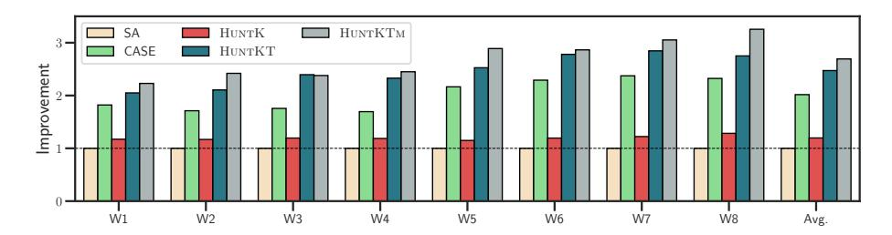
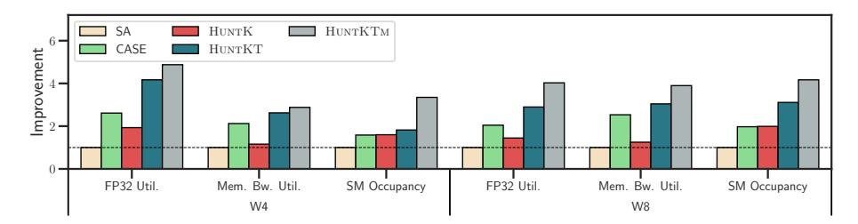
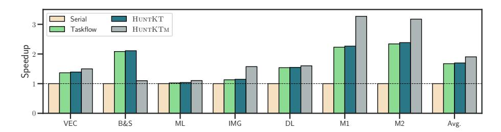
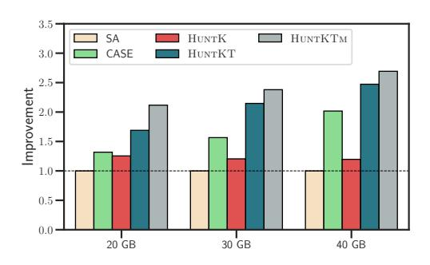
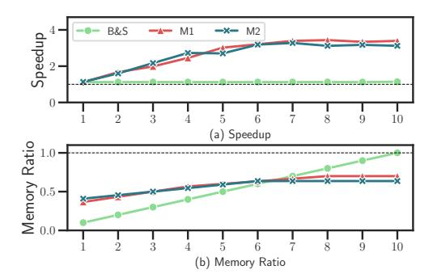
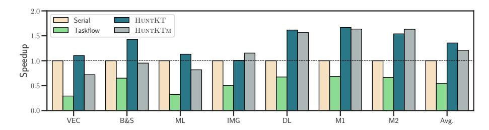

# ALGORITHM 2: Instruction Scheduling Algorithm for Memory Lifetime Management

```
Input: Stream graph before transformation graph,
   Output: Stream graph after transformation graph<sub>out</sub>
1 Function PostponeMalloc(graph):
       memObjList \leftarrow graph.getMemObjList();
       for memObj \in memObjList do
            instrList \leftarrow graph.getRelatedInstr(memObj);
4
            invokeList \leftarrow graph.getAssiciatedKernels(memObj);
5
            sortByExecutionOrder(invokeList);
6
            insertPoint \leftarrow invokeList[0];
            graph.moveBe fore(instrList, insertPoint);
            for i \leftarrow 1 \sim invokeList.size() - 1 do
               graph.insertSyncBetween(insertPoint, invokeList[i]);
10
       end
       graph.removeRedundantSync();
       return graph;
15 end
```

manager then moves instrList before the insertion point, and converts memory allocation and data transfer instructions to their asynchronous versions (e.g., cudaMalloc to cudaMallocAsync and cudaMemcpy to cudaMemcpyAsync) and assigns them to execute within the same stream as the insertion point (Line 8). To ensure that memObj is allocated prior to any kernel call that depends on it, synchronization instructions are added between the insertion point and subsequent kernel calls (Line 9  $\sim$  11). Finally, all redundant synchronization instructions within and across streams are removed, then returning the optimized stream graph (Line 13  $\sim$  14). The algorithm for preponing free operations is similar to this algorithm and is not elaborated here.

After memory management, the peak memory usage of a task cannot be simply obtained by summing the sizes of all memory objects. To address this, we design an efficient algorithm for *lazy engine* to predict the peak memory usage during runtime. Given a stream graph with recorded operations, *lazy engine* first retrieves the delta memory list from each stream, which logs memory changes of sequential memory allocation and deallocation. Then it accumulates these changes and takes the maximum value as the memory requirement for the stream. Summing these maximum values across all streams achieves peak memory usage of the stream graph. Note that our algorithm provides an upper bound of peak memory usage with O(N) time complexity, where N is the number of memory objects, since certain memory peaks may not occur due to inter-stream synchronization. Compared to our algorithm, accurate memory prediction would require enumerating numerous execution combinations and verifying inter-stream synchronization rules, which becomes computationally expensive as the number of memory objects increases.

#### 5.5 Implementation

As shown in Figure 8, we implemented HuntKTM on the basis of CUDA Runtime and LLVM Compiler Infrastructure [20]. Although targeting the CUDA platform, our design can be easily applied to other frameworks that support concurrent task queues and asynchronous memory management (e.g., HIP [2] and SYCL [11]). We pinpoint the pattern that kernels are always called by \_\_cudaPushCallConfiguration, to find the serially issued kernels in host IR and apply our optimizations to their caller functions. To distinguish writable parameters from read-only ones, developers necessitate adding a parameter at the beginning of the kernel function's parameter list,

<span id="page-14-0"></span>

Fig. 8. Implementation of HuntKTM. The compiler consists of several LLVM passes: *stream scheduler, memory manager, resource analyzer,* and *function wrapper*, which transform the input code into a memory-optimized multi-stream program. During running, *lazy engine* maintains a CUDA operation queue and analyzes the task's resource requirements. *Task dispatcher* manages a task queue and dispatches tasks to suitable devices. Each GPU has multiple concurrent streams for the parallel execution of kernels, along with dynamically sized memory pools for each task.

which indicates that the first  $N_{out}$  parameters are writable, and rearranging the writable parameters to the first  $N_{out}$  positions. This technique enables *DFG constructor* to analyze dependencies automatically, without involving any new programming framework.

To intercept CUDA runtime function calls and retrieve memory information, all memory-related function calls like cudaMallocAsync and cudaFreeAsync are wrapped by *function wrapper*. Similar transformations are applied to kernel launches for computational resource collection. During task execution, the program invokes wrapped functions to perform CUDA operations. *Lazy engine* analyzes and stores the call information in a queue, deferring execution until the task is dispatched to a specific device. When the program reaches cudaTaskSchedule or cudaTaskScheduleLazy, *lazy engine* sends the resource requirements to *task dispatcher* and waits for the device ID to be returned. The communication between *lazy engine* and *task dispatcher* is transferred over shared memory. A task is bound to the target device by calling cudaSetDevice after scheduling. For memory pool management in each task, HuntKTM calls cudaDeviceGetDefaultMemPool to obtain the default memory pool before executing the deferred operations and uses cudaMemPoolSetAttribute to set the memory release threshold to the predicted memory footprint. This attribute prevents memory from being released until usage exceeds the preset threshold.

#### 6 Evaluation

#### 6.1 Environment Setup

- 6.1.1 Platform. We conduct experiments on a server equipped with 4 NVIDIA A100 GPUs, 2 AMD EPYC 7742 64-Core Processors and 256 GB DDR4 memory. Each A100 GPU has 40 GB HBM and 6912 CUDA cores. The operating system is Debian 10.2.1 and the version of the NVIDIA driver is 555.42.06. We compile GPU programs using LLVM 14.0.6 and CUDA 12.4.0.
- 6.1.2 Benchmark. We use seven representative applications as listed in Table 2 to evaluate kernel-level parallelism. The two in-house micro-benchmarks are drawn from the kernels in NVIDIA FasterTransformer [31], and the rest of the benchmarks represent typical GPU workloads (image processing, machine learning, etc.), which are aligned with the benchmarks in GrSched [38]. Each

<span id="page-15-0"></span>161:16 W. Pan et al.

|  |  | Table 2. Evaluated Benchmarks |
|--|--|-------------------------------|
|--|--|-------------------------------|

Table 3. Workload Mixes

| Name             | Notation | DFG Width | Memory (GB) |
|------------------|----------|-----------|-------------|
| Vector Square    | VEC      | 2         | 4.80        |
| Black & Scholes  | B&S      | 10        | 12.8        |
| Machine Learning | ML       | 2         | 3.12        |
| Image Processing | IMG      | 3         | 11.6        |
| Deep Learning    | DL       | 2         | 7.06        |
| Micro-1          | M1       | 8         | 19.2        |
| Micro-2          | M2       | 6         | 17.6        |
|                  |          |           |             |

application maintains multiple dependent kernels, some of which can be optimized to execute concurrently and overlap computation and data transfer to achieve higher performance.

We mark applications with memory requirements between 3 GB and 8 GB as small benchmarks (VEC, ML, and DL) and requirements over 8 GB as large benchmarks (M1, M2, B&S, and IMG). Benchmarks with various memory footprints are mixed in our workloads W1 to W8 with four diferent "large:small" ratios: 1:1, 2:1, 3:1, and 5:1, similar to previous work [\[4\]](#page-23-6). Te detailed composition of each workload is summarized in Table [3.](#page-15-0) We prefer using larger benchmarks to emulate the execution traces of heavy and long-running tasks in real-world workloads. Each workload consists of 16 or 32 tasks, randomly selected in proportion from small and large benchmark sets. All tasks within a workload arrive simultaneously and are scheduled as a single batch. Te scheduler processes the batch by dequeuing one task and dispatching it to an appropriate device at a time, until the batch is empty or all devices are fully occupied.

6.1.3 Evaluated Schemes. In concurrent task execution scenarios, we compare HuntKTm with two task scheduling designs: single-assignment (SA) [\[44\]](#page-24-7), CASE [\[4\]](#page-23-6). SA assigns one job to each device at a time, and guarantees no device is idle when unhandled jobs exist. CASE automatically analyzes resource requirements of each task and schedules them according to available resources. For HuntK, we extend SA by performing static stream scheduling, enabling multiple kernels within an application to execute concurrently in a device. HuntKT incorporates stream scheduler and task scheduler to achieve hybrid scheduling, but lacks memory management. HuntKTm is the complete design by integrating both hybrid scheduling and memory management to maximize kernel concurrency. NVIDIA MPS is enabled in both single and multiple GPU systems so that kernels from diferent processes can co-execute on the same device. To avoid exceeding the device's concurrent capacity, HuntKTm limits the number of available hardware queues per GPU to 32 in task scheduling algorithm, matching the maximum number of connections that the CUDA runtime can handle. Meanwhile, NVIDIA persistence mode [\[34\]](#page-24-26) is enabled to reduce the GPU initialization overhead across applications.

For single task execution, we compare HuntKTm against the baseline (serial execution, named Serial below), and two prior arts, including a static scheduler Taskfow [\[15\]](#page-23-1) and a dynamic scheduler [\[38\]](#page-24-4) based on GrCUDA [\[29\]](#page-24-3) (denoted as GrSched). Te maximum number of streams is set to 10 for both HuntKT and HuntKTm, corresponding to the maximum DFG width among the benchmarks.

### 6.2 System Throughput

We frst evaluate the system throughput of diferent scheduling schemes in task-concurrent scenarios across various workloads. As shown in Figure [9,](#page-16-0) HuntKTm delivers performance improvements over other schemes in most workloads. Tis is mainly because HuntKTm enables more kernels to run concurrently on the same device while ensuring load balancing across devices, efectively utilizing

<span id="page-16-0"></span>

Fig. 9. The throughput improvements of diferent task scheduling schemes across various workloads. The y-axis represents the throughput improvement in the multi-GPU system compared to the serial execution baseline SA.

computational and memory resources. CASE exploits task-level concurrency to overlap computation and communication, yielding a 2.02x throughput gain over SA. HuntK improves computational resource utilization by allowing multiple kernels within a single application to run concurrently. However, due to the limited opportunities for intra-application kernel concurrency, it achieves only a 1.20x average throughput improvement compared to serial execution. HuntKT combines intra-task and inter-task kernel concurrency, while its task scheduler considers heterogeneous resource demands to enhance load balancing across devices, resulting in a 2.47x speedup. Based on HuntKT, the complete design HuntKTm further reduces the memory usage of applications, enabling more applications to run concurrently on the same device and efciently utilizing idle resources. Ultimately, HuntKTm achieves a 2.69x and 1.33x average performance improvement over SA and CASE, respectively.

As the proportion of large benchmarks increases and the number of tasks grows, memory becomes a botleneck for concurrent execution, where CASE and HuntKT are only able to run a limited number of benchmarks simultaneously. HuntKTm addresses this issue by reducing memory requirements, allowing more tasks to run under the same memory capacity and achieving signifcant performance gains. For workload W1, which includes 16 applications with a 1:1 memory ratio, HuntKTm and HuntKT show similar speedups since the benefts of HuntKTm are constrained by the number of benchmarks. In this case, all applications can be dispatched to devices by HuntKTm without exceeding memory constraints. Meanwhile, as the number of concurrent tasks increases, memory management provides higher scheduling fexibility, leading HuntKTm to deliver greater performance gains compared to CASE.

### 6.3 Hardware Resources Utilization

To analyze the impact of hybrid scheduling on system hardware resource utilization, we use DCGM [\[32\]](#page-24-23), a low-overhead GPU system monitoring tool, to periodically collect hardware metrics. Two workloads W4 and W8 are selected for analysis as they demonstrate the task scheduling efciency under GPU memory constraints, and the results are shown in Figure [10.](#page-17-0) Te results show that HuntKT is more efective than HuntK in utilizing idle resources. Tis is because the performance of HuntK is limited by the number of kernels that can execute concurrently within an application and the proportion of kernel execution time relative to overall task time. By parallelizing computation and data communication across multiple independent tasks, HuntKT achieves higher resource utilization than HuntK. Leveraging kernel-level concurrency within applications in a taskconcurrent environment, HuntKT improves FP32 utilization, memory bandwidth utilization, and SM occupancy by 3.54x, 2.83x, and 2.47x on average under W4 and W8 compared to SA, signifcantly outperforming HuntK and CASE, which rely solely on intra-application or inter-application CKE. With memory management enabled, HuntKTm achieves even greater improvements of 4.45x, 3.39x,

161:18 W. Pan et al.

<span id="page-17-0"></span>

Fig. 10. Hardware metrics improvement achieved by diferent scheduling schemes and optimizations over W4 and W8 workloads.

<span id="page-17-1"></span>Table 4. Memory Consumption (GB) w/o and w/ Memory Management for Mixed Workloads

Table 5. Memory Consumption (GB) w/o and w/ Memory Management for Applications

| Workload | HuntKT | HuntKTm | Reduction | Application | HuntKT | HuntKTm | Reduction |
|----------|--------|---------|-----------|-------------|--------|---------|-----------|
| W1       | 166.5  | 127.8   | 23.2%     | VEC         | 4.80   | 4.80    | 0%        |
| W2       | 189.2  | 143.0   | 24.4%     | B&S         | 12.8   | 12.8    | 0%        |
| W3       | 205.6  | 157.1   | 23.6%     | ML          | 3.12   | 3.08    | 1.3%      |
| W4       | 232.3  | 173.9   | 25.1%     | IMG         | 11.6   | 9.20    | 20.0%     |
| W5       | 333.0  | 255.6   | 23.2%     | DL          | 7.06   | 4.70    | 33.3%     |
| W6       | 378.4  | 286.0   | 24.4%     | M1          | 19.2   | 13.4    | 30.0%     |
| W7       | 411.2  | 314.2   | 23.6%     | M2          | 17.6   | 11.2    | 36.4%     |
| W8       | 464.6  | 347.8   | 25.1%     | Avg.        | 10.9   | 8.47    | 22.3%     |

and 3.76x, corresponding to utilization gains of 91.0%, 45.5%, and 111.2% over CASE, demonstrating its ability to further enhance resource utilization through memory optimization in highly concurrent environments. For workloads W4 and W8, HuntKTm signifcantly increases SM occupancy and FP32 utilization, leveraging more idle computing resources to improve the computational efciency of the system. Te improvement in bandwidth utilization highlights the ability of HuntKTm to overlap computation and communication when allowing more tasks to execute simultaneously, alleviating the inefciencies caused by serial execution of computation and data transfers within applications.

### 6.4 Memory Reduction

6.4.1 Mixed Workload. Table [4](#page-17-1) summarizes the cumulated memory requirements for each workload before and afer applying memory management in HuntKTm. By leveraging memory reuse based on liveness analysis, HuntKTm achieves a signifcant reduction in memory consumption, lowering the total memory usage by 23.2% to 25.1%. With reduced memory requirements, HuntKTm enables the simultaneous execution of all benchmarks in workloads W1 and W2, where the number of tasks in the workload becomes the limiting factor for further kernel concurrency. While the memory footprint of W3 is reduced to 157.1 GB afer memory optimization, which is slightly below the system GPU memory capacity, unavoidable memory fragmentation prevents the immediate execution of the fnal task in W3. In workload W8, which contains the largest number of benchmarks, HuntKTm is able to launch 14 tasks simultaneously, whereas HuntKT supports the concurrent execution of only 9 tasks. Concurrent execution of additional tasks maximizes hardware resource utilization while efectively overlapping computation and data transfer operations. Terefore, the kernel concurrency improvement achieved through memory management enhances system throughput, with these benefts being particularly pronounced in scenarios with high memory demands.

<span id="page-18-0"></span>

Fig. 11. Average speedup gained by diferent schemes in seven applications.

6.4.2 Single Benchmark. Table [5](#page-17-1) compares memory consumption before and afer applying memory management in HuntKTm. For most evaluated benchmarks, HuntKTm efectively reduces the peak memory usage by an average of 22.3%, which is calculated as a weighted average of individual reduction ratios, with each benchmark weighted by its original peak memory usage. Te ratio of memory reduction achieved by HuntKTm depends on the data dependencies between kernels within the application. We defne the kernel execution path as the number of kernels executed sequentially within a single stream. Generally, longer execution paths provide more opportunities for HuntKTm to optimize memory usage by shortening the lifetime of memory objects, as more allocation and deallocation operations can be scheduled within a single stream. Te execution path of M2, which includes several accumulation and activation kernels, achieves a memory reduction of 36.4% by releasing unused memory afer each kernel. However, HuntKTm does not always lead to memory savings. ML includes multiple in-place operators whose inputs cannot be released afer kernel execution, limiting HuntKTm to reusing smaller memory objects. Additionally, to maximize computational efciency, HuntKTm distributes independent kernels across multiple streams, which may shorten the execution paths. For example, VEC's three kernels are executed across two streams, and B&S's ten kernels are evenly distributed across ten streams, leaving no opportunities for memory reuse.

### 6.5 Task-level Performance Improvement

In this section, we evaluate the GPU operation execution time for the selected programs. Figure [11](#page-18-0) presents the speedup achieved by various kernel-level concurrency schemes. GrSched, which leverages unifed memory, sufers from substantial overhead during data transfers, leading to execution times an order of magnitude slower than Serial. Across the evaluated benchmarks, Taskfow, HuntKT, and HuntKTm achieve average speedups of 1.67x, 1.69x, and 1.90x, respectively. While both HuntKT and Taskfow allocate kernels to diferent streams, CUDA Graph construction and initialization overhead slightly hinder Taskfow's performance compared to HuntKT, particularly for applications with short kernel execution times. HuntKTm improves performance by introducing memory pools to minimize the overhead of frequent memory allocations and deallocations. It also schedules memory operations closer to kernel launches, enabling beter overlap of computation and communication. As a result, HuntKTm improves speedups to 3.27x and 3.17x for M1 and M2, respectively. However, in some cases (e.g., B&S), the computation time within each stream is shorter than the data transfer time. Te data transfer operations distributed around kernel launches revert concurrent kernels to serial execution, yielding a modest performance improvement of 1.10x.

We also compare the kernel execution time achieved by diferent schemes. Since HuntKTm interleaves memory-related instructions between kernels, it is excluded from the comparison. Similar to Figure [11,](#page-18-0) HuntKT and Taskfow achieve comparable speedups in most benchmarks, averaging 2.79x and 2.99x. For GrSched, the most signifcant performance penalty comes from

<span id="page-19-0"></span>161:20 W. Pan et al.

| Scheme  | VEC    | B&S       | ML        | IMG       | DL        | M1        | M2        | Avg.      |
|---------|--------|-----------|-----------|-----------|-----------|-----------|-----------|-----------|
| Async   | 19/137 | 40/349    | 30/209    | 45/394    | 29/267    | 67/588    | 51/443    | 40/341    |
| Taskfow | 11/136 | 18/363    | 28/414    | 26/445    | 33/421    | 39/651    | 34/569    | 27/428    |
| GrSched | 56/415 | 116/1,109 | 109/1,061 | 153/1,515 | 146/1,404 | 159/1,716 | 147/1,582 | 127/1,257 |
| CASE    | 0/0    | 0/0       | 0/0       | 0/0       | 0/0       | 0/0       | 0/0       | 0/0       |
| HuntKTm | 5/17   | 11/34     | 19/66     | 19/65     | 13/44     | 20/63     | 17/54     | 15/49     |

Table 6. Code Modification based on Serial Version (LoC / # Tokens)

dynamic scheduling, including runtime dependency analysis, kernel capture, and kernel issue. Furthermore, this overhead prevents GrSched from launching multiple kernels concurrently, limiting its ability to achieve optimal kernel-level concurrency. As a result, GrSched achieves an average speedup of 1.92x, signifcantly lower than HuntKT, which leverages static analysis and optimization.

### 6.6 Programming Eforts

Table [6](#page-19-0) lists the programming eforts required by diferent concurrent schemes based on serial version programs, in terms of the average modifed lines of code (LoC) and token count. Async means programming with expert concurrency optimization using CUDA's APIs. Compared with Serial, HuntKTm costs only 15 LoC and 49 tokens in addition to enabling CKE and automating both dependency analysis and memory management. Te extra code is sourced from the kernels' light-weight wrapper for writable parameter identifcation, and our compiler-based approach encompasses the rest of the transformation and optimization. In contrast, signifcant code modifcation is involved in other schemes. Async necessitates manually managing CUDA's asynchronous APIs, including stream initialization, synchronization and distributing kernels to streams, which require tremendous programming eforts and are error-prone. Taskfow lessened this burden and still requires explicit dependence specifcation. GrSched has the merit of automation but is limited to a dynamic programming language for runtime analysis. By automating dependency analysis and memory management, HuntKTm eliminates common errors such as incorrect stream synchronization and misordered memory operations, which are difcult to debug manually.

Unlike other schemes, CASE does not require source code modifcation as it only retrieves the program's resource requirements without considering dependencies between kernels and relies on the runtime system for task scheduling. In comparison to CASE, HuntKTm introduces lightweight code modifcations, primarily a one-line parameter addition for each kernel defnition and launch, while providing support for both dependency-aware kernel scheduling and memory optimization. Tis trade-of is especially valuable for large-scale or performance-critical applications where minor code adjustments are acceptable for substantial runtime gains.

### 6.7 Overhead

- 6.7.1 Compilation. Te static compilation overhead comprises three components: kernel scheduling, resource analysis, and memory management. All costs arise from code analysis and transformation without kernel profling. Te execution time of kernel scheduling and memory management depends on the number of kernel invocations and memory objects, respectively. Resource analysis overhead includes retrieving register and shared memory usage from nvcc [\[27\]](#page-24-25) and analyzing the arguments of kernel launches and memory allocations. Across seven benchmark applications, the average compilation time rose from 1.41 s to 2.40 s, which is an acceptable cost in compilation.
- 6.7.2 Runtime. At runtime, the overhead mainly consists of task scheduling and kernel launch preparation. Task scheduling involves traversing the stream graph to estimate peak memory usage

<span id="page-20-0"></span>



Fig. 12. Average throughput improvement of diferent task scheduling schemes when limiting GPUs' memory capacities to 20 GB, 30 GB, and 40,GB.

Fig. 13. Speedup and memory ratio achieved by HuntKTm when the number of streams ranges from 1 to 10.

and iterating over available devices, which takes around one millisecond and is thus negligible. Before launching kernels, several preparation steps are invoked to ensure concurrent execution, including CUDA APIs such as stream creation, event synchronization and the CUDA context initialization. Te primary runtime overhead stems from CUDA context initialization, whose average time increases from 81 ms to 118 ms due to multiple tasks sharing a single MPS server. However, context initialization can be overlapped with the computation and communication of other tasks, incurring no additional execution time.

### 6.8 Sensitivity Studies

6.8.1 Memory Capacity. In task-concurrent scenarios, memory capacity is a critical factor limiting the number of tasks that can run simultaneously on a device. To evaluate the schedulers' performance under diferent memory constraints, we constrain the memory capacity of each GPU in the multi-GPU system to 20 GB, 30 GB, and 40 GB. Figure [12](#page-20-0) presents the system throughput under various scheduling schemes, which are normalized to SA. As memory capacity decreases, many workloads fail to launch due to insufcient memory, causing a signifcant decline in throughput for CASE. HuntKT mitigates idle computational resources by issuing more kernels from a single application across multiple hardware queues. However, the performance gains of hybrid scheduling remain constrained by memory botlenecks. HuntKTm reduces the memory usage of most tasks by memory reusing, enabling more tasks to collocate in the same device with limited memory. As a result, HuntKTm achieves throughput improvements of 2.12x and 2.38x under 20 GB and 30 GB memory constraints, respectively, with only a slight decrease compared to the 2.69x speedup achieved with 40 GB memory. Compared to CASE, HuntKTm outperforms by 61.8%, 51.6% and 33.2% on average under three memory capacities, demonstrating that hybrid scheduling and memory management deliver signifcant performance gains under varying memory constraints.

6.8.2 Number of Streams. In the design of HuntKTm, the number of streams plays a critical role in determining program concurrency performance and memory usage. Figure [13\(](#page-20-0)a) shows the execution speedup of three programs under HuntKTm compared to serial execution as the number of streams increases from 1 to 10. We select B&S, M1, and M2 as the subjects of the experiment as they exhibit substantial kernel-level concurrency. When the number of streams is one, three applications achieve an average speedup of 1.12x due to the memory pool mechanism, which eliminates frequent allocation and deallocation operations. M1 and M2 achieve their peak speedups of 3.44x and 3.18x when the number of streams matches their DFG widths, enabling maximal kernel-level parallelism within each task. Beyond these points, increasing the number of streams 161:22 W. Pan et al.

<span id="page-21-0"></span>

Fig. 14. Average throughput improvement of diferent task scheduling schemes when the number of GPUs ranges from 1 to 4 on A100 or 4090 systems.

yields no further performance gains. Since data transfers without pinned memory cannot execute concurrently, frequent serialized transfers in B&S block nearly all operations within the application from executing concurrently, even when a sufcient number of streams are available.

Te impact of the number of streams on memory management is shown in Figure [13\(](#page-20-0)b). As the number of streams decreases, memory usage for the three benchmarks is reduced, with maximum memory savings of 90.0%, 63.3%, and 59.0% achieved under single stream execution. Similar to the acceleration from multi-stream concurrency, when the number of streams equals the DFG width, all independent kernels are assigned to separate streams. At this point, memory reuse within streams depends entirely on the execution paths of dependent kernels, resulting in memory reductions of 0%, 30%, and 36%, respectively. We observe that each stream in B&S contains only one kernel, and thus no memory reuse opportunities exist when using 10 streams. Terefore, users should choose an appropriate number of streams to balance execution efciency and memory usage for programs.

6.8.3 Number of GPUs. Figure [14\(](#page-21-0)a) illustrates the average throughput achieved by diferent task scheduling methods as the number of GPUs increases from 1 to 4 on the A100 system. When the number of available GPUs is limited, a few benchmarks with large memory footprints dominate the devices, restricting throughput gains by reducing task concurrency. CASE and HuntK employ naive kernel-level or task-level concurrency, allowing only a limited number of kernels to execute simultaneously, which fails to fully utilize GPU hardware resources. In contrast, HuntKTm leverages hybrid scheduling and memory management to signifcantly increase kernel concurrency, achieving throughput improvements of 4.42x, 3.68x, and 2.88x over SA when the number of GPUs ranges from 1 to 3, respectively. As GPUs increase, extensive data transfers between the host and devices emerge as a botleneck, limiting further performance gains. Te increased memory transfer time forces some potentially parallel kernels to execute sequentially, reducing the concurrency benefts of HuntKTm. In our future work, we will focus on incorporating memory bandwidth requirements of concurrent tasks into the task scheduler to address this limitation.

6.8.4 Hardware Platform. To evaluate the performance of HuntKTm across diferent hardware platforms, we conduct experiments on a system equipped with 4 NVIDIA RTX 4090 24 GB GPUs, 2 Intel Xeon Gold 6338N CPUs, and 1024 GB DRAM. Figure [14\(](#page-21-0)b) shows the throughput improvements of various workloads on the 4090 system. Similar to A100 system, the throughput improvement of HuntKTm over SA increases as the number of GPUs decreases, reaching 4.12x, 3.93x, 3.60x, and 3.42x for 1 to 4 GPUs, respectively. Since RTX 4090 has lower memory bandwidth compared to A100, longer data transfer times are overlapped with computation across tasks. In addition, the higher number of SMs and CUDA cores in the 4090 enables greater kernel-level concurrency. Tese factors contribute to the more pronounced performance gains of HuntKTm on the 4090 system. As previously discussed, HuntKTm demonstrates greater advantages under memory-constrained

<span id="page-22-2"></span>

Fig. 15. Average speedup gained by diferent schemes in seven applications when kernel execution times become extremely short.

conditions. On the 4090 system, which provides only 24 GB memory per GPU, HuntKTm achieves an average performance improvement of 52.5% over CASE across diferent GPU numbers.

6.8.5 Short Kernel Execution Times. To further analyze the impact of short kernel execution times on task-level performance under diferent kernel concurrency strategies, we reduce the input size of each application to one-thousandth of its original scale, and the results are shown in Figure [15.](#page-22-2) When kernel execution time is extremely short, HuntKT still achieves an average 1.35x speedup over the Serial, as it distributes kernels across streams without introducing additional overhead. In contrast, HuntKTm incurs overhead due to its memory pool mechanism, where asynchronous memory allocation and deallocation introduce additional costs. For example, in VEC, the memory allocation time increases from 250 us to 860 us. While this overhead is negligible in typical scenarios, it becomes signifcant with short-running kernels, leading to performance degradation in VEC, B&S, and ML. As a result, HuntKTm achieves an average 1.21x speedup across all benchmarks. On the other hand, Taskfow introduces substantial runtime overhead from thread creation, synchronization, and destruction, along with non-trivial CUDA graph creation costs, ultimately causing a severe deterioration in performance and yielding only a 0.54x speedup.

### 7 Conclusion

Tis article introduces HuntKTm, a hybrid scheduling and automatic management framework designed to optimize both kernel-level and task-level concurrency for efcient GPU execution. HuntKTm integrates three key components—a stream scheduler, a task scheduler, and a memory manager—to form a unifed execution stack. Te stream scheduler identifes kernel dependencies and distributes kernels across multiple concurrent streams. Te task scheduler analyzes resource requirements and dynamically dispatches tasks to appropriate devices. Evaluations show that HuntKTm achieves substantial performance gains in both task-concurrent and multi-kernel execution scenarios, delivering an average 33.2% speedup over CASE and 13.8% over Taskfow, respectively. Tese improvements highlight the efectiveness of HuntKTm's coordinated approach to scheduling and memory management. In the future, we plan to extend HuntKTm to support highly distributed, multi-node GPU systems, and further refne its scheduling and management strategies to scale across a broader range of complex applications.

### References

- <span id="page-22-1"></span>[1] Martín Abadi, Paul Barham, Jianmin Chen, Zhifeng Chen, Andy Davis, Jefrey Dean, Mathieu Devin, Sanjay Ghemawat, Geofrey Irving, Michael Isard, et al. 2016. TensorFlow: A system for large-scale machine learning. In Proceedings of the 12th USENIX Symposium on Operating Systems Design and Implementation. 265–283.
- <span id="page-22-0"></span>[2] AMD. 2016. HIP:Heterogeneous Interface for Portability. Retrieved from [https://github.com/ROCm-Developer-Tools/](https://github.com/ROCm-Developer-Tools/HIP) [HIP](https://github.com/ROCm-Developer-Tools/HIP)

161:24 W. Pan et al.

<span id="page-23-11"></span>[3] Mehmet E Belviranli, Seyong Lee, Jefrey S Veter, and Laxmi N Bhuyan. 2018. Juggler: A dependence-aware task-based execution framework for GPUs. In Proceedings of the 23rd ACM SIGPLAN Symposium on Principles and Practice of Parallel Programming. 54–67.

- <span id="page-23-6"></span>[4] Chao Chen, Chris Porter, and Santosh Pande. 2022. Case: A compiler-assisted scheduling framework for multi-gpu systems. In Proceedings of the 27th ACM SIGPLAN Symposium on Principles and Practice of Parallel Programming.
- <span id="page-23-13"></span>[5] Guoyang Chen, Yue Zhao, Xipeng Shen, and Huiyang Zhou. 2017. Efsha: A sofware framework for enabling effcient preemptive scheduling of gpu. In Proceedings of the 22nd ACM SIGPLAN Symposium on Principles and Practice of Parallel Programming. 3–16.
- <span id="page-23-2"></span>[6] Qan Chen, Hailong Yang, Minyi Guo, Ram Srivatsa Kannan, Jason Mars, and Lingjia Tang. 2017. Prophet: Precise qos prediction on non-preemptive accelerators to improve utilization in warehouse-scale computers. In Proceedings of the 22nd International Conference on Architectural Support for Programming Languages and Operating Systems. 17–32.
- <span id="page-23-17"></span>[7] Tianqi Chen, Bing Xu, Chiyuan Zhang, and Carlos Guestrin. 2016. Training deep nets with sublinear memory cost. arXiv:1604.06174. Retrieved from <https://arxiv.org/abs/1604.06174> (2016).
- <span id="page-23-20"></span>[8] Weiduo Chen, Xiaoshe Dong, Fan Zhang, Bowen Li, Yufei Wang, and Qiang Wang. 2024. ATP: Achieving throughput peak for DNN training via smart GPU memory management. ACM Transactions on Architecture and Code Optimization 22, 1 (2024), 1–27.
- <span id="page-23-14"></span>[9] Seungbeom Choi, Sunho Lee, Yeonjae Kim, Jongse Park, Youngjin Kwon, and Jaehyuk Huh. 2022. Serving heterogeneous machine learning models on multi-GPU servers with spatio-temporal sharing. In Proceedings of the 2022 USENIX Annual Technical Conference. 199–216.
- <span id="page-23-5"></span>[10] Aditya Dhakal, Sameer G Kulkarni, and KK Ramakrishnan. 2020. Gslice: Controlled spatial sharing of gpus for a scalable inference platform. In Proceedings of the 11th ACM Symposium on Cloud Computing. 492–506.
- <span id="page-23-7"></span>[11] Te Khronos SYCL Working Group. 2020. SYCL 2020 Specifcation. Retrieved from [https://registry.khronos.org/SYCL/](https://registry.khronos.org/SYCL/specs/sycl-2020/pdf/sycl-2020.pdf) [specs/sycl-2020/pdf/sycl-2020.pdf](https://registry.khronos.org/SYCL/specs/sycl-2020/pdf/sycl-2020.pdf)
- <span id="page-23-0"></span>[12] Vishakha Gupta, Karsten Schwan, Niraj Tolia, and Vanish Talwar. 2011. Pegasus: Coordinated scheduling for virtualized accelerator-based systems. In Proceedings of the USENIX Annual Technical Conference. Portland, OR, USA.
- <span id="page-23-3"></span>[13] Mingcong Han, Hanze Zhang, Rong Chen, and Haibo Chen. 2022. Microsecond-scale preemption for concurrent GPU-accelerated DNN inferences. In Proceedings of the 16th USENIX Symposium on Operating Systems Design and Implementation. 539–558.
- <span id="page-23-4"></span>[14] Qingda Hu, Jiwu Shu, Jie Fan, and Youyou Lu. 2016. Run-time performance estimation and fairness-oriented scheduling policy for concurrent GPGPU applications. In Proceedings of the 45th International Conference on Parallel Processing. IEEE.
- <span id="page-23-1"></span>[15] Tsung-Wei Huang, Dian-Lun Lin, Chun-Xun Lin, and Yibo Lin. 2021. Taskfow: A lightweight parallel and heterogeneous task graph computing system. IEEE Transactions on Parallel and Distributed Systems 33, 6 (2021), 1303–1320.
- <span id="page-23-19"></span>[16] Yafan Huang, Sheng Di, Guanpeng Li, and Franck Cappello. 2024. cuSZp2: A GPU lossy compressor with extreme throughput and optimized compression ratio. In Proceedings of the 2024 SC24: International Conference for High Performance Computing, Networking, Storage and Analysis SC. IEEE Computer Society, 188–205.
- <span id="page-23-18"></span>[17] Paras Jain, Ajay Jain, Aniruddha Nrusimha, Amir Gholami, Pieter Abbeel, Joseph Gonzalez, Kurt Keutzer, and Ion Stoica. 2020. Checkmate: Breaking the memory wall with optimal tensor rematerialization. Proceedings of Machine Learning and Systems 2 (2020), 497–511.
- <span id="page-23-8"></span>[18] Jaehoon Jung, Jinpyo Kim, and Jaejin Lee. 2023. DeepUM: Tensor migration and prefetching in unifed memory. In Proceedings of the 28th ACM International Conference on Architectural Support for Programming Languages and Operating Systems. 207–221.
- <span id="page-23-15"></span>[19] Yunseong Kim, Yujeong Choi, and Minsoo Rhu. 2022. Paris and elsa: An elastic scheduling algorithm for reconfgurable multi-gpu inference servers. In Proceedings of the 59th ACM/IEEE Design Automation Conference. 607–612.
- <span id="page-23-21"></span>[20] C. Latner and V. Adve. 2004. LLVM: A compilation framework for lifelong program analysis & transformation. In Proceedings of the International Symposium on Code Generation and Optimization. 75–86.
- <span id="page-23-9"></span>[21] Jaeho Lee, Shinnung Jeong, Seungbin Song, Kunwoo Kim, Heelim Choi, Youngsok Kim, and Hanjun Kim. 2023. Occamy: Memory-efcient GPU compiler for DNN inference. In Proceedings of the 60th ACM/IEEE Design Automation Conference. IEEE.
- <span id="page-23-12"></span>[22] Ruoxiang Li, Tao Hu, Xu Jiang, Laiwen Li, Wenxuan Xing, Qingxu Deng, and Nan Guan. 2023. Rosgm: A real-time gpu management framework with plug-in policies for ros 2. In Proceedings of the 2023 IEEE 29th Real-Time and Embedded Technology and Applications Symposium. IEEE, 93–105.
- <span id="page-23-10"></span>[23] Xinjian Long, Xiangyang Gong, Bo Zhang, and Huiyang Zhou. 2023. Deep learning based data prefetching in CPU-GPU unifed virtual memory. Journal of Parallel and Distributed Computing 174 (2023), 19–31.
- <span id="page-23-16"></span>[24] Xinjian Long, Xiangyang Gong, Bo Zhang, and Huiyang Zhou. 2023. An intelligent framework for oversubscription management in cpu-gpu unifed memory. Journal of Grid Computing 21, 1 (2023), 11.

