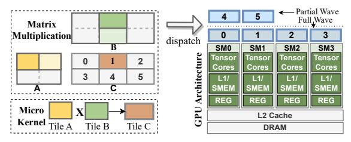
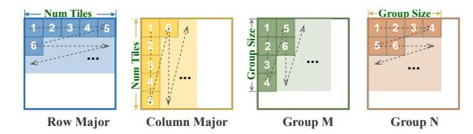
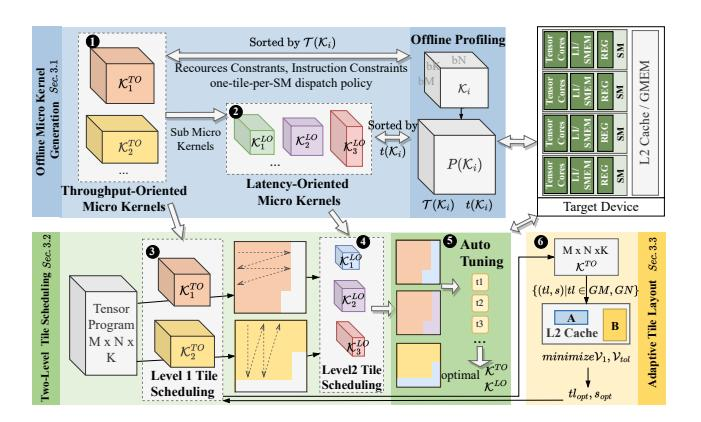
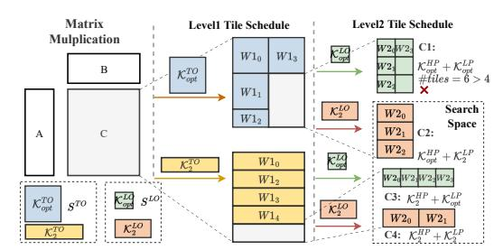

# 1 Introduction

GEMM is a fundamental operation in both deep learning and scientific applications. It serves as the computational backbone for various deep learning models, including large language models [\[18,](#page-10-0) [39,](#page-11-0) [42\]](#page-11-1), computer vision models [\[16,](#page-10-1) [52\]](#page-11-2), and plays a key role in scientific domains such as climate modeling [\[1,](#page-10-2) [7\]](#page-10-3) and quantum chemistry [\[5,](#page-10-4) [45\]](#page-11-3). Given their computational intensity, GPUs equipped with hundreds of streaming multiprocessors serve as the primary hardware accelerators for GEMM workloads. The GEMM operator is typically partitioned into numerous homogeneous tiles, which are dispatched to idle SMs in successive 'waves' [\[30,](#page-11-4) [51,](#page-11-5) [53\]](#page-11-6). Well-balanced workload and maximum processor utilization are achieved when the number of output tiles significantly exceeds the number of cores, resulting in multiple waves.

With ongoing advancements in hardware specialization, streaming multiprocessors in modern GPUs are equipped with significantly enhanced compute and memory resources, enabling the processing of larger tiles per SM. Moreover, the total number of SMs continues to grow with successive GPU architecture generations [\[10,](#page-10-5) [11\]](#page-10-6). As a result, fewer waves are required to process the same workload. However, this reduction in wave count exacerbates the wave quantization problem [\[23,](#page-11-7) [25\]](#page-11-8), which arises when the number of output tiles is not evenly divisible by the number of available SMs. In such cases, some SMs remain idle while others are still processing, resulting in hardware underutilization.

In practice, NVIDIA's cuBLAS library [\[13\]](#page-10-7), widely regarded as the standard for accelerating GEMM operations, still suffers from the wave quantization problem. As depicted in Figure [1,](#page-1-0) a slight increase in the size of the M dimension, while keeping N and K fixed, results in substantial performance drops of 36% and 21% at two critical points. This degradation is primarily attributed to a significant

∗Corresponding author.

Figure 1: Illustration of wave quantization effects when evaluating GEMM performance with varying input shapes ( $M \times 1024 \times 4096$ ) on an NVIDIA H100 GPU.

decline in SM utilization during partial waves. Theoretically, adopting finer-grained tile sizes can improve SM utilization in such cases, thereby mitigating the wave quantization issue. However, smaller tiles lead to reduced execution efficiency in full waves, as the increased ratio of memory operations to computation hampers the ability to hide memory transfer latency between global and shared memory. For example, Inductor-Triton [3] incorporates auto-tuning across approximately twenty predefined tile sizes, ranging from coarse-grained configurations (e.g.,  $128 \times 128 \times 64$ ) to fine-grained ones (e.g.,  $32 \times 32 \times 16$ ). Nevertheless, as shown in Figure 1, it still exhibits performance degradation due to wave quantization, driven by underutilization of compute resources with finer-grained tiles.

To address this issue, several studies have proposed heterogeneous work partitioning to improve workload balance across SMs. Approaches such as Split-K [2] and Stream-K [32] partition the workload more finely along the accumulation dimension, allowing the workload of the original partial wave to be distributed across a larger number of SMs. However, the communication and synchronization overheads introduced by Split-K scale with both the problem size and the splitting factor. Stream-K alleviates synchronization overhead by introducing a skewed workload partitioning scheme compared to Split-K, but it still requires extra reduction operations and additional memory to store partial results. For instance, applying Stream-K to a  $1024 \times 4096 \times 1024$  GEMM operation consumes over 70% more device memory than cuBLAS GEMM.

To simultaneously maximize throughput for full waves and minimizes latency for partial waves, while avoiding additional synchronization overhead, we propose HyTiS. HyTiS is built upon a key insight: when workloads are sufficient to saturate hardware resources during full waves, the primary objective is to maximize throughput, which typically benefits from using larger tiles and fewer waves. In contrast, partial waves operate under abundant hardware availability but limited workload, where fine-grained tiling helps reduce per-wave latency. Consequently, HyTiS is designed as a hybrid tile scheduling framework that incorporates a two-level scheduling strategy to address the wave quantization problem. The first scheduling level focuses on maximizing throughput for full waves, while the second targets at minimizing the latency of the partial wave. However, exhaustively searching across both scheduling levels leads to a prohibitively large design space. With each level offering hundreds of micro-kernel candidates, the combined space reaches an order of magnitude of 104. To reduce

the complexity of this optimization, we introduce an offline profiling stage that identifies representative throughput-oriented and latency-oriented micro-kernels. These form a significantly smaller and more tractable search space for efficient runtime scheduling. By leveraging hybrid tile scheduling, HyTiS effectively mitigates wave quantization, maintains high SM utilization, and avoids the synchronization overhead typically associated with fine-grained partitioning strategies.

In addition to tile size, which directly affects the number of required waves, we observe that the tile layout also significantly impacts the performance of GEMM operators. For instance, changing the tile layout from column-major to row-major results in a 23% performance degradation for the  $1672 \times 8192 \times 2048$  GEMM operator using Triton. On the contrary, for the  $8192 \times 1672 \times 2048$ GEMM operator, the row-major layout outperforms column-major by 17%. This behavior is consistent with expectations, as the data required by different SMs can be shared through the L2 cache, and different tile layouts lead to varying degrees of data locality within the cache, directly affecting performance. In practice, the optimal tile layout is dependent on tile sizes and problem shapes. However, existing methods typically adopt a fixed tile layout, missing opportunities to improve L2 cache affinity. For example, Pytorch Inductor with Triton backend [3] employs a group-M tile layout with a fixed group size of 8, while CUTLASS [12] supports only row-major or column-major layout. Such rigid tile layout can lead to suboptimal GEMM performance. To identify the effective tile layout with improved L2 cache affinity, we aim to minimize the volume of data fetched from global memory at the wave granularity. To achieve this, we introduce an analytical model that optimizes data reuse both within a single wave and across multiple waves. Based on this model, we propose a comprehensive tile layout strategy that integrates existing approaches and adaptively selects the optimal layout based on problem size and tile configuration.

With this holistic design incorporating hybrid scheduling of tile size and layout, HyTiS addresses the limitations of existing methods in mitigating the wave quantization problem. It offers improved L2 cache affinity and enhanced overall performance for GEMM operations. The key contributions of this work are summarized as follows:

- We propose a hierarchical two-level tile scheduling strategy that alleviates the wave quantization problem without introducing additional synchronization overhead. To efficiently determine the optimal tile configuration at each scheduling level, we perform an offline profiling stage that identifies throughputoriented and latency-oriented micro-kernels. These profiled micro-kernels form a compact and efficient runtime search space for selecting the optimal configuration.
- We conduct an in-depth analysis of the impact of tile layout on GEMM performance, and develop an analytical model that accounts for data locality both within a single wave and across multiple waves. Based on this model, we adaptively select the optimal tile layout according to the specific problem size and tile configuration.
- We implement HyTiS, a hybrid tile scheduling framework that combines two-level tile size scheduling and adaptive tile layout

Figure 2: The illustration of a simple GEMM operation on GPU and the GPU architecture.

scheduling. Evaluations across a wide range of GEMM operators on NVIDIA H100 and A100 GPUs demonstrate that HyTiS achieves significant speedups over cuBLAS, Split-K, Stream-K, and Inductor-Triton, up to 2.08×, 5.4×, 3.2×, and 2.1×, respectively. Moreover, detailed analysis confirms the effectiveness of HyTiS in improving SM workload balance and L2 cache affinity.

### 2 Background and Motivation

### 2.1 GEMM operation and GPU Architecture

GEMM is defined as the product  $C = \alpha AB + \beta C$  where  $\alpha$  and  $\beta$  are scalar values and A, B, and C are matrices. For simplicity, in this paper we assume  $\alpha = 1, \beta = 0$ . Given a GEMM operation of size  $M \times N \times K$ , the input and output tensors are partitioned into tiles, and the overall computation is decomposed into smaller computational blocks of size  $bM \times bN \times bK$ , referred to as micro-kernels [46], as illustrated on the left side of Figure 2. For each output tile, partial results from multiple micro-kernels are accumulated along the reduction dimension K. A group of micro-kernels contributing to the same output tile is typically executed by a Cooperative Thread Array (CTA) in a pipelined fashion.

To accelerate GEMM computations, GPUs, composed of multiple streaming multiprocessors, are particularly well-suited and have been widely adopted. As illustrated on the right side of Figure 2, each SM serves as a fundamental processing unit containing numerous Tensor Cores optimized for efficient matrix computations. Each SM is provisioned with private hardware resources, including L1 cache, shared memory (SMEM), and register memory (REG), enabling fast, low-latency data access. In addition, all SMs share a unified L2 cache, which serves as an intermediate caching layer between the SM-local memories and global memory (DRAM).

When executing GEMM operations on GPUs, output tiles are typically dispatched to SMs via CTA launches. These tiles are grouped into waves, which are executed concurrently across available SMs, as shown in Figure 2. In standard configurations, output tiles are uniform in size, and each tile is exclusively assigned to a single SM. This allows for balanced workload distribution when a sufficient number of full waves are present. However, in practical GEMM workloads with diverse problem dimensions, partial waves are often inevitable, giving rise to the *wave quantization* problem. As illustrated on the right side of Figure 2, tiles 0–3 form a full wave that is evenly distributed across SMs, enabling efficient resource utilization. In contrast, tiles 4 and 5 form a partial wave, which leads to underutilization of SM resources due to an insufficient number of tiles to occupy all SMs concurrently.

#### 2.2 Existing Work About Tile Scheduling

To evaluate HyTiS in comparison with existing tile scheduling approaches, we consider a hypothetical GPU architecture comprising four SMs. As illustrated in Figure 3(a), employing a large tile size with ideal intra-tile efficiency achieves only 50% SM utilization during the partial wave. A straightforward mitigation strategy is to reduce the tile size, thereby improving workload balance across SMs, as illustrated in Figure 3(b). However, finer-grained tiling increases the number of full waves while reducing the execution efficiency of each computation block. Consequently, the performance degradation within blocks often outweighs the gains from improved SM utilization in the partial wave. A more practical solution is the Split-K method, shown in Figure 3(d), which reduces the granularity of each CTA in partial waves through parallelization along the accumulation dimension. In this approach, the workload for a given output tile is divided and distributed across multiple SMs, enhancing workload balancing. Nevertheless, synchronization overhead inevitably occurs after the last computation block, restricting scalability with increasing problem sizes and splitting factors. Furthermore, Stream-K [32] mitigates synchronization overhead compared to Split-K by employing a skewed workload partitioning scheme, but still requires additional 'fixup' operations, as depicted in Figure 3(e). Furthermore, additional workspace is necessary to store the intermediate results. More recently, MikPoly [46] explored various polymerization patterns to optimize the performance of neural networks with dynamic shapes. Each pattern utilizes micro-kernels with different GEMM tile sizes. However, its GPU implementation is restricted to a horizontal split pattern, simply dividing a large GEMM into two smaller sub-GEMM operations. Consequently, the wave quantization problem persists within each sub-pattern, resulting in suboptimal performance, as illustrated in Figure 3(c).

In summary, homogeneous tile scheduling suffers from a fundamental trade-off: large tile sizes improve execution efficiency in full waves but lead to poor SM utilization in partial waves, whereas smaller tiles improve balance but reduce per-block efficiency. Furthermore, decomposition along the accumulation dimension, as seen in Split-K and Stream-K, introduces synchronization overhead that limits scalability. To overcome these limitations, we propose HyTiS, a hybrid tile scheduling approach as shown in Figure 3(f). HyTiS employs a two-level scheduling framework, where each level uses distinct micro-kernels characterized by different tile sizes. The first level aims to maximize computational throughput, while the second focuses on minimizing the latency of partial waves. Unlike MikPoly, HyTiS supports flexible workload partitioning, allowing irregular region shapes at each scheduling level.

### 2.3 Tile Layout and L2 Cache Affinity

As illustrated in Figure 2, multiple SMs share the same L2 cache, allowing other SMs to access data directly from the L2 cache if they request the same data address from global memory. Given the limited capacity of the L2 cache, data requested by different SMs within the same wave exhibit better data locality, whereas outdated data from previous waves tend to be evicted. Different tile layouts result in varying degrees of data locality of L2 cache, thus impacting overall performance.

Figure 3: Comparison of different work regarding tile scheduling on a hypothetical four-SM GPU.

Figure 4: The illustration of different tile layout strategies.

Figure 5: Performance (left y-axis) and variation in DRAM read data volume (right y-axis) for different tile layouts across various problem sizes and tile configurations (x-axis).

Existing works adopt various tile layouts, as illustrated in Figure 4. For instance, Cutlass [12] supports both column-major and row-major layouts as configurable options for GEMM operators. Triton [37] employs the group-M tile layout with a group size of 8 to enhance L2 cache efficiency. Group-N is a variant of group-M that uses the row dimension, rather than the column dimension, as the leading dimension. However, a fixed tile layout is not well-suited for diverse problem shapes and tile configurations. As illustrated in Figure 5, we conducted experiments by applying different tile layouts to the same GEMM kernel from the Triton tutorial [41], across a range of problem shapes and tile configurations. Relative performance varies between them, with the performance gap

Table 1: The Comparison of existing representative works and HyTiS("WQ": wave quantization, "AS": auto-scheduling, "TL": tile layout).

| Name          | WQ | AS | TL       | Additional Overhead |  |  |
|---------------|----|----|----------|---------------------|--|--|
| Inductor [3]  | ×  | ✓  | Fixed    | None                |  |  |
| Split-K [2]   | ✓  | ×  | Fixed    | Accumulation Sync.  |  |  |
| Stream-K [32] | ✓  | ×  | Fixed    | Accumulation Sync.  |  |  |
| MikPoly [46]  | ×  | ×  | -        | None                |  |  |
| HyTiS         | ✓  | ✓  | Adaptive | None                |  |  |

between the best and worst configurations reaching 36%, and an average difference of 16%. The discrepancy between different tile layouts underscores the need for an adaptive method for tile layout selection.

To reveal the variation in L2 cache affinity across different tile layouts, we measured the volume of data transferred from global memory to the L2 cache (denoted as  $\mathcal{V}$ ) using the Nsight Compute profiler. As shown in Figure 5, the average difference between the minimum and maximum  $\mathcal{V}$  values across tile layouts reaches 64%. Besides, we highlight the performance trend of tile layouts with the lowest  $\mathcal{V}$  using a blue line, which connects the layouts exhibiting the minimum  $\mathcal{V}$  in each case. This blue line exhibits a strong correlation with the best-performing tile layout across different problem sizes and tile configurations. Therefore, we adopt DRAM read volume  $\mathcal{V}$  as the primary metric to design an adaptive tile layout method for better L2 cache affinity.

In conclusion, we summarize the advantages of HyTiS compared to existing methods in Table 1. Unlike the PyTorch Inductor, HyTiS mitigates the wave quantization issue through hybrid tile scheduling without introducing fine-grained wave quantization. Compared with MikPoly, HyTiS employs a flexible tile scheduling method instead of relying on fixed polymerization patterns. Compared with

Figure 6: The system overview of HyTiS.

Split-K and Stream-K, HyTiS avoids the additional overhead associated with accumulation synchronization. Furthermore, HyTiS supports auto-tuning to achieve comprehensive performance improvements across varying workloads. Unlike Pytorch Inductor, which relies on predefined configurations as tuning candidates, HyTiS enables automatic tuning that dynamically adapts to both the underlying GPU architecture and workload characteristics.

#### 3 The HyTiS Design

Figure 6 provides an overview of HyTiS, comprising three components. The first is offline micro-kernel generation, which produces two sets of candidates: throughput-oriented micro-kernels ( $\P$ ),  $\mathcal{K}_i^{TO}$ , optimized for hardware-constrained throughput, and latency-oriented micro-kernels ( $\P$ ),  $\mathcal{K}_i^{LO}$ , optimized to minimize partial wave latency. The other two components, two-level tile scheduling and adaptive tile layout, enable runtime tuning for a given GEMM operator. The first scheduling level targets full waves using throughput-oriented micro-kernels ( $\P$ ), while the second handles partial waves with latency-oriented micro-kernels ( $\P$ ). Together, these scheduling decisions define the search space for the auto-tuning process ( $\P$ ). Furthermore, to adaptively optimize tile layout across different tile sizes and problem shapes, we introduce an analytical model that guides the minimization of DRAM-to-L2 data traffic at the wave level ( $\P$ ), as detailed in Section 3.3.

#### 3.1 Offline Micro-kernel Generation

Given the fundamental differences in hardware utilization between full and partial wave tile scheduling, our hybrid tile scheduling strategy is guided by the following two principles:

- Throughput-oriented scheduling for full waves: When\nexecuting full waves, the workload is sufficient to saturate all
  available hardware resources. In this scenario, the primary
  objective is to maximize throughput by fully leveraging the
  compute capacity of the GPU.
- Latency-oriented scheduling for the partial wave: In contrast, partial waves involve a residual workload that cannot fully utilize the hardware. Therefore, the focus shifts to minimizing execution latency through fine-grained scheduling and efficient resource usage.

However, with hundreds of tile configuration candidates per scheduling level, the total number of possible combinations can exceed ten thousand, resulting in an intractably large search space. Fortunately, due to the architectural independence of SMs on modern GPUs, the performance characteristics of a micro-kernel executed on an SM remain relatively stable across diverse problem shapes [46]. Therefore, we characterize the behavior of micro-kernels offline and construct two dedicated sets of micro-kernels, each aligned with the aforementioned throughput- and latency-oriented scheduling principles. This strategy significantly reduces the search space from  $O(10^4)$  to  $O(10^1)$ , as demonstrated in Section 5.6, while preserving scheduling effectiveness.

3.1.1 Prerequisite. Consider a target GPU consisting of  $N_{SM}$  SMs, each equipped with the register memory of size  $REG_0$  and the shared memory of size  $SMEM_0$ . Given a micro-kernel  $\mathcal{K}_i$ , characterized by the computation block size  $bM_i \times bN_i \times bK_i$ . To profile the performance of each  $\mathcal{K}_i$ , we define a representative GEMM operator  $P(\mathcal{K}_i)$ , composed of  $n_0$  waves  $^1$  to sufficiently stress the kernel during evaluation. Based on empirical tuning, the input problem size for  $P(\mathcal{K}_i)$  is set to  $M_i \times N_i \times K_0$ , where  $M_i = bM \times 4$ ,  $N_i = N_{SM} \times n_0/4$ , and  $K_0$  is fixed at 1024. During profiling, we collect three key performance metrics: shared memory usage per block  $SMEM(\mathcal{K}_i)$ , spilled register file usage per thread  $REG_{Spill}(\mathcal{K}_i)$ , and execution latency  $t(P(\mathcal{K}_i))$ , abbreviated as  $t(\mathcal{K}_i)$ . Notably, both shared memory and register file usage are determined solely by the micro-kernel configuration and remain invariant with respect to the problem size.

3.1.2 Throughput-Oriented Micro-Kernels. The throughput-oriented (TO) micro-kernel set is constructed based on empirical throughput profiling. Given that the K-dimension of the problem shape remains fixed during profiling, the throughput metric  $\mathcal{T}$  is defined as the computational workload of the output tensor per unit time along dimensions M and N, as formulated in Equation (1).

Rather than conducting an exhaustive search over the entire space of micro-kernel candidates, we apply three categories of constraints to significantly reduce the search space. The first is a resource constraint. Each candidate micro-kernel must satisfy the hardware resource limits, specifically that shared memory usage does not exceed the available shared memory and that no register spilling occurs. These conditions are formalized in Equation (2). Additionally, we utilize prior profiling data to prune the search space by discarding tile sizes that exceed those associated with known outof-resource configurations. The second is an instruction constraint. Certain GPU architectures impose instruction-level requirements on tile dimensions. For example, on NVIDIA's H100 GPU, tensor core operations via the wgmma instruction necessitate tile sizes aligned to a minimum multiple, such as bM%64 == 0. Thus, only tile sizes compatible with these instruction constraints are considered. Additionally, to enhance data locality and improve the compute-tomemory ratio, we enforce a one-tile-per-SM dispatch policy, where each SM processes a single output tile at a time. This approach permits the use of larger tile sizes, thereby maximizing shared memory utilization. As expressed in Equation (3), micro-kernels that fail to

 $^{1}n_{0}$  is set to 1 to eliminate the influence of tile layout.

Figure 7: Illustration on the bybrid two-level tile scheduling.

effectively utilize the shared memory (i.e., their usage remains significantly below SMEM0 even after tile size increases) are excluded. A similar constraint is also applied to register file utilization. After applying these constraints and completing the profiling process. we identify the optimal throughput-oriented micro-kernel, denoted as  $\mathcal{K}_{opt}^{TO}$ , based on maximum observed throughput (Equation (4)). Finally, we retain a subset of throughput-oriented candidates whose throughput degradation, relative to  $\mathcal{K}_{opt}^{TO}$ , falls within an acceptable threshold  $l_1$ , as defined in Equation (5).

$$\mathcal{T}(\mathcal{K}_i) = (M_i \times N_i) / (n_0 \times t(\mathcal{K}_i)) \tag{1}$$

$$SMEM(\mathcal{K}^{TO}) \le SMEM_0, REG_{spill}(\mathcal{K}^{TO}) == 0$$
 (2)

$$\nexists \mathcal{K}'|_{\mathcal{K}',x \geq \mathcal{K},x,x \in \{bM,bN,bK\},\mathcal{K}' \neq \mathcal{K}^{TO}}, SMEM(\mathcal{K}') \leq SMEM_0$$

$$\mathcal{K}_{opt}^{TO} = \underset{\mathcal{K}_{i}}{argmax}(\mathcal{T}(\mathcal{K}_{i})) \tag{4}$$

$$S^{TO} = \{ \mathcal{K}_i^{TO} | diff(\mathcal{T}(\mathcal{K}_i^{TO}), \mathcal{T}(\mathcal{K}_{opt}^{TO}) < l_1 \}$$
 (5)

3.1.3 latency-oriented Micro-Kernels. For partial waves, compute resources are typically underutilized; hence, the optimization objective shifts from maximizing throughput to minimizing latency per wave. Latency-oriented (LO) micro-kernel candidates are selected based on their per-wave execution latency, defined as  $t(Ki)/n_0$ , where t(Ki) denotes the total execution time and  $n_0$  is the number of waves. After identifying the throughput-oriented micro-kernels, we derive the set of latency-oriented candidates by sampling smaller tile configurations from the throughput-oriented set  $S^{TO}$ . The optimal latency-oriented micro-kernel, denoted  $\mathcal{K}^{LO}_{opt}$ , is selected as the kernel with the minimum per-wave latency (Equation (6). Subsequently, we retain micro-kernels whose latency deviation from  $t(\mathcal{K}^{LO}_{opt})$  remains within a predefined threshold  $l_2$ , as formalized in Equation (7). Compared to their throughput-oriented counterparts, latency-oriented candidates generally utilize smaller tile sizes, which inherently satisfy hardware resource constraints such as shared memory and register usage. Furthermore,  $\mathcal{K}^{LO}$  must comply with the same instruction-level constraints imposed on  $\mathcal{K}^{TO}$ ; however, these constraints are omitted here for brevity.

$$\mathcal{K}_{opt}^{LO} = \underset{\mathcal{K}_{i}}{argmin}(t(\mathcal{K}_{i})/n_{0}) \tag{6}$$

$$S^{LO} = \{\mathcal{K}_{i}^{LO}|diff(t(\mathcal{K}_{i}^{LO}), t(\mathcal{K}_{opt}^{LO})) < l_{2}\}$$
(7)

$$S^{LO} = \{ \mathcal{K}_i^{LO} | diff(t(\mathcal{K}_i^{LO}), t(\mathcal{K}_{opt}^{LO})) < l_2 \}$$
 (7)

## Two-Level Tile Scheduling and Auto-Tuning

Throughput-oriented micro-kernels generally employ large tile sizes, which enhance full-wave efficiency by increasing the compute-to-memory access ratio. However, these large tiles often result in poor SM utilization during partial waves, thereby intensifying the wave quantization problem. In contrast, latency-oriented micro-kernels achieve lower per-wave latency by using smaller tiles, but suffer from diminished performance in full-wave scenarios due to a larger number of required waves and reduced intra-tile execution efficiency. To leverage the complementary strengths of both micro-kernel types, we propose a two-level tile scheduling framework that simultaneously optimizes throughput for full waves and minimizes latency for partial waves. Given the interdependence of scheduling decisions across these levels, we adopt a hierarchical approach that integrates both throughput- and latency-oriented strategies into a unified, end-to-end scheduling framework.

3.2.1 Hierarchical Tile Scheduling. The hierarchical tile scheduling process is illustrated in Figure 7. For simplicity, consider a scenario with two candidate micro-kernels in both the throughput-oriented set  $S^{TO}$  and the latency-oriented set  $S^{LO}$ . At the first level of scheduling, each TO micro-kernel is applied to the full waves. Assuming a column-major tile layout, the residual workload corresponding to the partial wave is computed for each TO candidate. At the second level, the LO micro-kernel candidates are evaluated to schedule this remaining workload. If the number of tiles required to cover the partial wave exceeds the number of available SMs, the corresponding scheduling plan is deemed invalid, illustrated by case C1. Only valid TO-LO micro-kernel combinations, such as cases C2-C4 are retained. These combinations collectively define the reduced search space for the subsequent auto-tuning procedure.

A more straightforward alternative to hierarchical scheduling is a greedy strategy that independently selects  $\mathcal{K}_{opt}^{TO}$  for full waves and  $\mathcal{K}_{opt}^{LO}$  for the partial wave. However, this approach can be suboptimal for two key reasons. First, the performance of micro-kernels at runtime may diverge from their offline profiling behavior due to variations in problem shapes and runtime conditions. As a result, a micro-kernel identified as optimal during offline profiling may not retain its optimality across all execution scenarios. Second, greedy selection often leads to locally optimal solutions that fail to yield globally optimal performance. For example, as illustrated in Figure 7, directly selecting  $\mathcal{K}^{TO}_{opt}$  and  $\mathcal{K}^{LO}_{opt}$  can lead to surplus tiles of the partial wave in the second-level scheduling phase, which degrades performance with increasing partial waves. Furthermore,  $\mathcal{K}_{opt}^{TO}$  may not be the best choice for first-level scheduling when considered in combination with available latency-oriented kernels. In such cases, a non-optimal throughput-oriented kernel, such as the one used in candidate C3, may result in better overall performance when paired with  $\mathcal{K}_{opt}^{LO}$ , outperforming candidate C2, which uses  $\mathcal{K}_{opt}^{TO}$  with a suboptimal LO kernel. Specifically, there are two special cases where two-level scheduling becomes unnecessary. (1) TO-only Scheduling: This occurs when no feasible LO micro-kernel candidate is available. In this case, partial waves are processed using the selected TO micro-kernel. This scenario typically arises when the SM utilization is already high, and there is little room for further optimization through LO scheduling. (2) LO-only Scheduling: This case arises when the problem size is too small to form even a single full wave. The scheduling process relies solely on LO micro-kernels, as there are no full waves to process.

Figure 8: Illustration of adaptive tile layout selection and memory access patterns through the L2 cache for each wave.

3.2.2 Auto Tuning. In contrast to PyTorch Inductor, which relies on a fixed auto-tuning search space, the search space in HyTiS is adaptively determined based on GPU architecture and workload characteristics. By performing a one-time offline profiling of the GEMM operator for a specific data layout on the target GPU, the selected micro-kernels are tailored to the GPU architecture with slight overhead. Additionally, the hyperparameters  $l_1$  and  $l_2$  allow for dynamic adjustment of the search space in response to varying problem sizes. Specifically, when the problem size is small,  $l_1$  can be set to a larger value to account for greater performance variability. As the problem size increases,  $l_1$  can be reduced, as the performance of  $\mathcal{K}_{opt}^{TO}$  becomes more stable, enabling consistently high performance. This dynamic adjustment will be further explored in the experimental section (Section 5.5).

