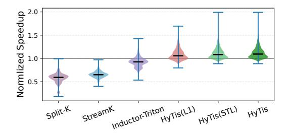
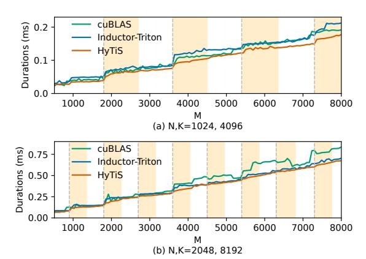
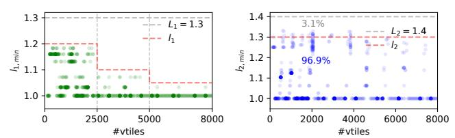

# 5.2 Overall Performance

H100. As shown in Figure [9\(a\),](#page-8-0) HyTiS achieves an average speedup of 1.12× over cuBLAS across both data layouts, with a maximum speedup of up to 1.95×. It outperforms cuBLAS in over 90% of the cases, demonstrating the effectiveness of the HyTiS approach. Compared to Split-K and Stream-K, HyTiS delivers average speedups of 1.98× and 1.73×, respectively, and consistently outperforms them in nearly all tested cases. The significantly poor performance of Split-K and Stream-K on H100 is attributed to the cuTLASS implementation not yet being optimized for the Hopper architecture. Compared to Inductor-Triton, HyTiS achieves an average speedup of 1.22×, demonstrating the effectiveness of its hybrid auto-tuning methods. Compared with HyTiS (L1), HyTiS achieves an average speedup of 1.06× in 41% of the cases. Against HyTiS (STL), it delivers up to a 1.32× speedup, with an average of 1.04×

Table 3: Breakdown analysis on the H100. The results are divided into three regions based on metrics normalized to cuBLAS: the low region (0-0.98), mid region (0.98-1.02), and high region  $(1.02-\infty)$ . Each value pair in the low, mid, and high categories represents the average metric value and the corresponding percentage of cases.

|      |            | Speedup     |                   |          |                   | SM Balance  |                   |          |                   | DRAM READ   |                   |          |                    |
|------|------------|-------------|-------------------|----------|-------------------|-------------|-------------------|----------|-------------------|-------------|-------------------|----------|--------------------|
|      |            | avg         | low               | mid      | high              | avg         | low               | mid      | high              | avg         | low               | mid      | high               |
| H100 | HyTiS(L1)  | 1.08        | 0.95,16%          | 1.00,23% | 1.15,61%          | 2.4         | 0.69,42%          | 1.00,12% | 4.43,46%          | 0.97        | 0.82,46%          | 1.01,40% | 1.36,14%           |
|      | HyTiS(STL) | 1.11        | 0.96,3%           | 1.00,20% | 1.15,77%          | <b>3.3</b>  | 0.71,31% ↓        | 1.00,10% | <b>5.15,59%</b> ↑ | 0.97        | 0.83,46%          | 1.00,39% | 1.36,15%           |
|      | HyTiS      | <b>1.12</b> | <b>0.96,2%</b> ↓  | 1.00,17% | <b>1.15,81%</b> ↑ | 3.2         | 0.72,32%          | 1.00,10% | 5.13,58%          | <b>1.07</b> | <b>0.87,20%</b> ↓ | 1.00,52% | <b>1.35,28</b> % ↑ |
| A100 | HyTiS(L1)  | 0.96        | 0.87,51%          | 1.00,28% | 1.11,21%          | 0.94        | 0.58,68%          | 1.00,14% | 2.31,18%          | 0.96        | 0.81,42%          | 1.00,39% | 1.25,19%           |
|      | HyTiS(STL) | 1.05        | 0.93,26%          | 1.00,30% | 1.16,44%          | 1.28        | 0.66,52%↓         | 1.00,15% | 2.54,33% ↑        | 0.99        | 0.83,37%          | 1.00,41% | 1.26,22%           |
|      | HyTiS      | <b>1.06</b> | <b>0.93,23</b> %↓ | 1.00,30% | <b>1.17,47</b> %↑ | <b>1.30</b> | <b>0.67,52</b> %↓ | 1.00,15% | 2.57,33% ↑        | <b>1.07</b> | <b>0.82,20</b> %↓ | 1.00,40% | <b>1.27,40</b> %↑  |

(a) Performance on H100.

(b) Performance on A100.

Figure 9: Overall Performance of HyTiS. All results report execution latency normalized to that of cuBLAS.

in 15% of the cases. These results demonstrate the effectiveness of hybrid tile scheduling and adaptive tile layout tuning on Hopper architecture.

A100. As shown in Figure 9(b), HyTiS achieves an average speedup of  $1.06\times$  over cuBLAS, with a maximum speedup of  $2.08\times$  and an average of  $1.13\times$  in 63% of the cases. When ensembling HyTiS with cuBLAS, the combined approach yields an average speedup of  $1.08\times$ . Compared to Split-K and Stream-K, HyTiS delivers average speedups of  $1.34\times$  and  $1.18\times$ , respectively. HyTiS performs worse than Split-K and Stream-K in no more than 1% and 9% of the cases, respectively, primarily when the K dimension is significantly larger than M and N, e.g.,  $512\times512\times8192$ . This limitation can be addressed by integrating HyTiS with Stream-K, which we plan to explore in future work. Compared to Inductor-Triton, HyTiS achieves an average speedup of  $1.21\times$ . When compared to HyTiS (L1), HyTiS achieves an average speedup of  $1.1\times$  (up to  $1.41\times$ ). Against HyTiS (STL), it delivers up to a  $1.25\times$  speedup, with

an average of  $1.04\times$  in 13% of the cases. These results demonstrate the effectiveness of hybrid tile scheduling and adaptive tile layout tuning on the Ampere architecture.

#### 5.3 Breakdown Analysis

To evaluate the ablated contributions of HyTiS (L1), HyTiS (STL), and the full HyTiS system, we conduct a breakdown analysis as shown in Table 3. The analysis includes three metrics: execution speedup, SM balance, and DRAM read data volume. All metrics are normalized against cuBLAS and categorized into three regions: low, mid, and high. For the low region, a smaller percentage is better (with the best result marked by  $\downarrow$ ), while for the high region, a larger percentage is preferred (with the best result marked by  $\uparrow$ ).

Speedup. On the H100, HyTiS (L1) falls into the high region in 61% of cases and into the low region in 16% of cases. By adopting two-level tile scheduling instead of a single-level approach, HyTiS (STL) significantly reduces the low region to 3% and increases the high region to 77%. Although the full HyTiS only improves the average performance over HyTiS (STL) by 1%, it further increases the high region by 4%. These results demonstrate the added benefit of hybrid scheduling and adaptive tile layout. The results on A100 are similar to that on H100, where HyTiS acheives an average speedup of  $1.17\times$  in 47% cases.

SM Balance. To assess workload balance across SMs, we collect three metrics by NSight Compute [14]:  $sm\_cycles\_active.avg$ ,  $sm\_cycles\_active.max$ , and  $sm\_cycles\_active.min$ . For simplicity, we define a composite metric  $\mathcal{B} = (max - min)/avg$  to represent SM workload balance. As shown in Table 3, on H100, HyTiS (L1) exhibits 42% of cases in the low balance region. HyTiS (STL) significantly reduces this to 31%, achieving an average balance improvement of 3.3× compared to cuBLAS. The full HyTiS introduces only a negligible reduction in SM balance, which is less than 1% on average. On the A100, HyTiS and HyTiS (STL) achieve the best results, with an average SM balance improvement of 1.30× compared to cuBLAS.

DRAM Read. To evaluate the contribution of the adaptive tile layout scheduling method in HyTiS, we use the dram\_bytes\_read.sum metric from the NSight Compute profiler to measure the volume of data transferred from DRAM to the L2 cache. As shown in Table 3, HyTiS achieves an average reduction of 1.07× compared to cuBLAS on H100. Furthermore, compared to HyTiS (STL), HyTiS reduces the low region ratio from 46% to 20%

Figure 10: Execution time of GEMM operators on H100 with varying M dimension sizes.

Figure 11: Analysis of hyperparameters  $l_1$  (left) and  $l_2$  (right).

and increases the high region from 15% to 28% on H100. On A100, HyTiS reduces the low region ratio from 37% to 20% and increases the high region from 22% to 40%, demonstrating its effectiveness in improving L2 cache affinity.

#### 5.4 Effectiveness for Wave Quantization

To demonstrate the effectiveness of HyTiS in addressing the wave quantization problem, we compare its performance with cuBLAS and Inductor-Triton in experiments that vary M while keeping Nand K fixed. As shown in Figure 10, the experiments are conducted on an H100 GPU using the NT data layout, covering two cases. The results are divided into two regions: the quantization-prominent region (highlighted in orange) and the non-quantization-prominent region. In Figure 10(a), HyTiS achieves average speedups of 1.10× and 1.19× in the quantization-prominent region, and 1.07× and 1.15× in the non-quantization-prominent region, over cuBLAS and Inductor-Triton, respectively. In Figure 10(b), HyTiS achieves average speedups of 1.16× and 1.09× in the quantization-prominent region, and 1.11× and 1.06× in the non-quantization-prominent region, compared to cuBLAS and Inductor-Triton, respectively. The dominant performance in the quantization-prominent region validates the effectiveness of HyTiS in mitigating the wave quantization issue.

#### 5.5 Analysis of Hyperparameters

As discussed in Section 3.2, the auto-tuning space in HyTiS is determined by the level-1 threshold  $l_1$  and level-2 threshold  $l_2$ . To analyze the impact of these two hyperparameters, we conduct experiments with  $L_1=1.3$  and  $L_2=1.4$  across a diverse set of 1,000 GEMM operators randomly sampled from Table 2. For each operator, we could

obtain the minimal threshold that achieves the optimal result by comparing the runtime-optimized micro-kernels against the offline-optimal counterparts, for instance,  $l_{1,min} = \mathcal{T}(K_{opt}^{TO})/\mathcal{T}(K^{TO})$ . As shown in Figure 11, the x-axis represents the number of 'vtiles', defined as the number of output tensor tiles divided by the virtual tile size  $64\times64$ . As the number of vtiles increases, the performance ratio between  $\mathcal{K}^{TO}$  and  $\mathcal{K}^{TO}_{opt}$  tends to converge toward 1. Based on this observation, we define  $l_1$  as a piecewise function: it is set to 1.2, 1.1, and 1.05 when the number of vtiles is less than 2500, between 2500 and 5000, and greater than 5000, respectively. In contrast, for  $\mathcal{K}^{LO}_{opt}$ , there is no strong correlation between its deviation from  $\mathcal{K}^{LO}_{opt}$  and the number of vtiles. Therefore, we fix  $l_2$  to a constant value of 1.3. As shown in the right subfigure of Figure 11, the proportion of cases which do not satisfy  $l_{2,min} \leq 1.3$  is only 3.1%.

## 5.6 Overhead Analysis

The overhead of HyTiS comprises two primary components: offline profiling and auto-tuning. Offline profiling incurs a one-time cost per device and data layout, taking approximately 19 minutes on the NVIDIA H100 and 36 minutes on the A100. Since this process is performed only once for each device configuration, the cost can be amortized over subsequent uses. The auto-tuning overhead is proportional to the size of the candidate search space. Compared to Inductor-Triton, which uses a fixed search space of 19 candidates, HyTiS has an average search space size of 14 on H100, reaching up to 66 across diverse runtime workloads, and an average of 16 on A100, with a maximum of 77. This overhead is considered affordable given the substantial performance gains. Similar to Inductor-Triton, HyTiS caches tuning results in memory and on disk to avoid redundant tuning. Notably, the overhead on A100 is significantly higher than on H100. This is because H100 utilizes the wgmma instruction, which requires the block size bM to be a multiple of 64 rather than 16, thereby significantly reducing the search space.

#### 6 Related Work

GEMM is the fundamental build in deep learning models, such as CNN, transformers, which are widely adopted in computer vision [20, 38, 52], large language models [6, 18, 29, 47, 48], etc. Besides, it plays an important role in high-performance modeling and simulation applications like climate simulation [1, 7], quantum chemistry [5, 45], and other scientific applications. To accelerate GEMM operators, various hand-tuned libraries [13, 15, 21] and code generation compilers [8, 9, 24, 30, 31, 36, 49, 50] have been developed to exploit GPU capabilities for better performance. Beyond traditional auto-tuning approaches, tackling wave quantization and cache optimization is crucial for further improving the performance.

Wave Quantization. Several studies advocate for heterogeneous tiling strategies to address the wave quantization problem [32, 44, 46]. AutoGEMM [44] proposes a dynamic tiling scheme that generates balanced tile shapes tailored for Arm architectures. MikPoly [46] utilizes polymerization patterns with different microkernels to enhance workload balancing across SMs. However, its horizontal-split pattern suffers from fine-grained wave quantization within each polymerization pattern. Split-K and Stream-K [32]

approaches divide tiles into smaller segments along the accumulation dimension but introduce synchronization overhead and additional workspace requirements. Except reducing wave quantization within single kernels, several studies have explored alleviating this issue through kernel fusion [25, 28, 33, 43]. Elastic Kernels [33] allows concurrent execution of multiple kernels under resource restrictions. HFuse [28] fuses operations in horizontal manner and provides source-to-source compilation tools for kernel fusion. POD-Attention [25] maximizes compute and memory bandwidth utilization by concurrently dispatching prefill and decode operations onto the same multiprocessor. However, these methods rely on specific scenarios in which fusable kernels exist. In future work, we will explore combining HyTiS with kernel fusion techniques.

GPU Cache Optimization. Locality-aware CTA schedulers [4, 17, 19, 22, 27, 40] aim to reduce cache misses and enhance data locality by grouping neighboring CTAs and assigning them to the same SM. CCDS [17] employs a predictor to estimate whether the required cache block exists in another SM, thereby reducing L1 cache read misses by accessing data through peer SMs. SMILE [19] expands the effective shared memory by managing part of the last-level cache, helping to alleviate low thread occupancy. Adnan Hoque et al. [2] improve L2 data locality for MoE kernels by adopting a column-major tile layout. HyTiS generalizes CTA scheduling to tile scheduling and further exploits L2 cache data locality at the wave granularity. Combined with our hierarchical tile scheduling strategy, HyTiS significantly improves L2 cache data locality.

#### 7 Conclusion

In this paper, we present HyTiS, a hybrid tile scheduling framework designed to address the wave quantization problem and enhance L2 cache affinity for GEMM operations on modern GPUs. HyTiS integrates two-level tile scheduling to achieve throughput maximization in full waves and latency minimization in partial waves. In addition to tile scheduling, HyTiS improves L2 cache data locality through adaptive tile layout selection. Extensive evaluations on NVIDIA H100 and A100 GPUs show that HyTiS consistently outperforms state-of-the-art libraries, including cuBLAS, Inductor-Triton, Split-K, and Stream-K. Specifically, HyTiS demonstrates robust performance across a wide range of GEMM workloads, all while incurring only modest tuning overhead.

Looking forward, we plan to extend HyTiS to support a broader range of operators, such as self-attention and operator fusion. We also aim to expand support for additional data formats, including FP8, to further improve the versatility and applicability of HyTiS in next-generation deep learning and scientific computing workloads.

## Acknowledgments

This work was supported by National Key Research and Development Program of China (2023YFE0205700), the National Natural Science Foundation of China (62341410) and Science and Technology Development Fund, Macao S.A.R (FDCT) projects 0078/2023/AMJ and 001/2024/SKL.

#### References

 Sameh Abdulah, Allison H Baker, George Bosilca, Qinglei Cao, Stefano Castruccio, Marc G Genton, David E Keyes, Zubair Khalid, Hatem Ltaief, Yan Song, et al. 2024.

- Boosting earth system model outputs and saving petabytes in their storage using exascale climate emulators. In SC24: International Conference for High Performance Computing, Networking, Storage and Analysis (SC). IEEE, Atlanta, GA, USA, 1–12. doi:10.1109/SC41406.2024.00008
- [2] Hoque Adnan, Wright Less, Martin Antoni, Virós, and Yang Chih-Chieh. 2024. Accelerating MoE model inference with Locality-Aware Kernel Design. https://pytorch.org/blog/accelerating-moe-model
- [3] Jason Ansel, Edward Yang, Horace He, Natalia Gimelshein, Animesh Jain, Michael Voznesensky, Bin Bao, Peter Bell, David Berard, Evgeni Burovski, et al. 2024. Pytorch 2: Faster machine learning through dynamic python bytecode transformation and graph compilation. In Proceedings of the ACM International Conference on Architectural Support for Programming Languages and Operating Systems (AS-PLOS). ACM, La Jolla, CA, USA, 929–947. doi:10.1145/3620665.3640366
- [4] Rachata Ausavarungnirun, Vance Miller, Joshua Landgraf, Saugata Ghose, Jayneel Gandhi, Adwait Jog, Christopher J. Rossbach, and Onur Mutlu. 2018. MASK: Redesigning the GPU Memory Hierarchy to Support Multi-Application Concurrency. In Proceedings of the Twenty-Third International Conference on Architectural Support for Programming Languages and Operating Systems, (ASPLOS). ACM, Williamsburg, VA, USA, 503–518. doi:10.1145/3173162.3173169
- [5] Jiri Brabec, Jan Brandejs, Karol Kowalski, Sotiris Xantheas, Örs Legeza, and Libor Veis. 2021. Massively parallel quantum chemical density matrix renormalization group method. *Journal of Computational Chemistry* 42, 8 (2021), 534–544. doi:10. 1002/TCC.26476
- [6] Tom Brown, Benjamin Mann, Nick Ryder, Melanie Subbiah, Jared D Kaplan, Prafulla Dhariwal, Arvind Neelakantan, Pranav Shyam, Girish Sastry, Amanda Askell, et al. 2020. Language models are few-shot learners. Advances in neural information processing systems (NeurIPS) (2020).
- [7] Stefano Castruccio, David J McInerney, Michael L Stein, Feifei Liu Crouch, Robert L Jacob, and Elisabeth J Moyer. 2014. Statistical emulation of climate model projections based on precomputed GCM runs. *Journal of Climate* 27, 5 (2014), 1829–1844.
- [8] Tianqi Chen, Thierry Moreau, Ziheng Jiang, Lianmin Zheng, Eddie Yan, Haichen Shen, Meghan Cowan, Leyuan Wang, Yuwei Hu, Luis Ceze, et al. 2018. TVM: An automated End-to-End optimizing compiler for deep learning. In Proceedings of the USENIX Symposium on Operating Systems Design and Implementation (OSDI). USENIX Association, Carlsbad, CA, USA, 578-594.
- [9] Tianqi Chen, Lianmin Zheng, Eddie Yan, Ziheng Jiang, Thierry Moreau, Luis Ceze, Carlos Guestrin, and Arvind Krishnamurthy. 2018. Learning to optimize tensor programs. Advances in Neural Information Processing Systems (NeurIPS) 31 (2018).
- [10] Jack Choquette. 2023. Nvidia hopper h100 gpu: Scaling performance. IEEE Micro 43, 3 (2023), 9–17. doi:10.1109/MM.2023.3256796
- [11] Jack Choquette and Wish Gandhi. 2020. Nvidia a100 gpu: Performance & innovation for gpu computing. In 2020 IEEE Hot Chips 32 Symposium (HCS). IEEE Computer Society, IEEE, Palo Alto, CA, USA, 1–43. doi:10.1109/HCS49909.2020.9220622
- [12] NVIDIA Corporation. [n. d.]. CUTLASS. Retrieved March 1, 2025 from https://github.com/NVIDIA/cutlass
- [13] NVIDIA Corporation. 2024. cuBLAS: Basic Linear Algebra on NVIDIA GPUs. Retrieved March 1, 2025 from https://developer.nvidia.com/cublas
- [14] NVIDIA Corporation. 2024. NSight Compute Metrics Guide. Retrieved March 1, 2025 from https://docs.nvidia.com/nsight-compute/ProfilingGuide/index.html# metrics-guide
- [15] NVIDIA Corporation. 2024. NVIDIA cuDNN. Retrieved March 1, 2025 from https://developer.nvidia.com/cudnn
- [16] Alexey Dosovitskiy, Lucas Beyer, Alexander Kolesnikov, Dirk Weissenborn, Xiaohua Zhai, Thomas Unterthiner, Mostafa Dehghani, Matthias Minderer, Georg Heigold, Sylvain Gelly, Jakob Uszkoreit, and Neil Houlsby. 2021. An Image is Worth 16x16 Words: Transformers for Image Recognition at Scale. In 9th International Conference on Learning Representations (ICLR). Austria.
- [17] Hajar Falahati, Mohammad Sadrosadati, Qiumin Xu, Juan Gómez-Luna, Banaf-sheh Saber Latibari, Hyeran Jeon, Shaahin Hesaabi, Hamid Sarbazi-Azad, Onur Mutlu, Murali Annavaram, et al. 2024. Cross-core data sharing for energy-efficient gpus. ACM Transactions on Architecture and Code Optimization (TACO) 21, 3 (2024), 42:1–42:32. doi:10.1145/3653019
- [18] Daya Guo, Dejian Yang, Haowei Zhang, Junxiao Song, Ruoyu Zhang, Runxin Xu, Qihao Zhu, Shirong Ma, Peiyi Wang, Xiao Bi, et al. 2025. Deepseek-r1: Incentivizing reasoning capability in llms via reinforcement learning. arXiv preprint arXiv:2501.12948 (2025).
- [19] Tianyu Guo, Xuanteng Huang, Kan Wu, Xianwei Zhang, and Nong Xiao. 2024. SMILE: LLC-based Shared Memory Expansion to Improve GPU Thread Level Parallelism. In Proceedings of the 61st ACM/IEEE Design Automation Conference (DAC). ACM, San Francisco, CA, USA, 1–6. doi:10.1145/3649329.3655906
- [20] Kaiming He, Xiangyu Zhang, Shaoqing Ren, and Jian Sun. 2016. Deep Residual Learning for Image Recognition. In 2016 IEEE Conference on Computer Vision and Pattern Recognition, CVPR. IEEE Computer Society, Las Vegas, NV, USA, 770–778. doi:10.1109/CVPR.2016.90

- [21] Wang Hulin, Donglin Yang, Yaqi Xia, Zheng Zhang, Qigang Wang, Jianping Fan, Xiaobo Zhou, and Dazhao Cheng. 2024. Raptor-T: A Fused and Memory-Efficient Sparse Transformer for Long and Variable-Length Sequences. *IEEE Trans. Comput.* 73 (2024), 1852–1865.
- [22] Mohamed Assem Ibrahim, Onur Kayiran, Yasuko Eckert, Gabriel H Loh, and Adwait Jog. 2020. Analyzing and leveraging shared L1 caches in GPUs. In Proceedings of the ACM International Conference on Parallel Architectures and Compilation Techniques (PACT). ACM, GA, USA, 161–173. doi:10.1145/3410463. 3414623
- [23] Abhinav Jangda, Saeed Maleki, Maryam Mehri Dehnavi, Madan Musuvathi, and Olli Saarikivi. 2024. A framework for fine-grained synchronization of dependent GPU kernels. In 2024 IEEE/ACM International Symposium on Code Generation and Optimization (CGO). IEEE, Edinburgh, United Kingdom, 93–105. doi:10.1109/ CGO57630.2024.10444873
- [24] Zhihao Jia, Oded Padon, James Thomas, Todd Warszawski, Matei Zaharia, and Alex Aiken. 2019. TASO: optimizing deep learning computation with automatic generation of graph substitutions. In Proceedings of the ACM Symposium on Operating Systems Principles (SOSP). ACM, Huntsville, ON, Canada. doi:10.1145/ 3341301.3359630
- [25] Aditya K. Kamath, Ramya Prabhu, Jayashree Mohan, Simon Peter, Ramachandran Ramjee, and Ashish Panwar. 2025. POD-Attention: Unlocking Full Prefill-Decode Overlap for Faster LLM Inference. In Proceedings of the 30th ACM International Conference on Architectural Support for Programming Languages and Operating Systems (ASPLOS). ACM, Rotterdam, Netherlands, 897–912. doi:10.1145/3676641. 3715996
- [26] Jacob Devlin Ming-Wei Chang Kenton and Lee Kristina Toutanova. 2019. BERT: Pre-training of Deep Bidirectional Transformers for Language Understanding. In Proceedings of NAACL-HLT. 4171–4186.
- [27] Minseok Lee, Seokwoo Song, Joosik Moon, John Kim, Woong Seo, Yeongon Cho, and Soojung Ryu. 2014. Improving GPGPU resource utilization through alternative thread block scheduling. In 2014 IEEE 20th international symposium on high performance computer architecture (HPCA). IEEE Computer Society, Orlando, FL. USA. 260–271. doi:10.1109/HPCA.2014.6835937
- [28] Ao Li, Bojian Zheng, Gennady Pekhimenko, and Fan Long. 2022. Automatic horizontal fusion for GPU kernels. In 2022 IEEE/ACM International Symposium on Code Generation and Optimization (CGO). IEEE, Seoul, Korea, 14–27. doi:10. 1109/CGO53902.2022.9741270
- [29] Yinhan Liu, Myle Ott, Naman Goyal, Jingfei Du, Mandar Joshi, Danqi Chen, Omer Levy, Mike Lewis, Luke Zettlemoyer, and Veselin Stoyanov. 2019. Roberta: A robustly optimized bert pretraining approach. arXiv preprint arXiv:1907.11692 (2019).
- [30] Lingxiao Ma, Zhiqiang Xie, Zhi Yang, Jilong Xue, Youshan Miao, Wei Cui, Wenxiang Hu, Fan Yang, Lintao Zhang, and Lidong Zhou. 2020. Rammer: Enabling Holistic Deep Learning Compiler Optimizations with rTasks. In Proceedings of the USENIX Symposium on Operating Systems Design and Implementation (OSDI). USENIX Association.
- [31] Wei Niu, Jiexiong Guan, Yanzhi Wang, Gagan Agrawal, and Bin Ren. 2021. DNN-Fusion: accelerating deep neural networks execution with advanced operator fusion. In Proceedings of the ACM International Conference on Programming Language Design and Implementation (PLDI). ACM, 883–898. doi:10.1145/3453483. 3454083
- [32] Muhammad Osama, Duane Merrill, Cris Cecka, Michael Garland, and John D Owens. 2023. Stream-k: Work-centric parallel decomposition for dense matrixmatrix multiplication on the gpu. In Proceedings of the 28th ACM SIGPLAN Annual Symposium on Principles and Practice of Parallel Programming (PPoPP). ACM, Montreal, QC, Canada, 429–431. doi:10.1145/3572848.3577479
- [33] Sreepathi Pai, Matthew J Thazhuthaveetil, and Ramaswamy Govindarajan. 2013. Improving GPGPU concurrency with elastic kernels. ACM SIGARCH Computer Architecture News 41, 1 (2013), 407–418. doi:10.1145/2451116.2451160
- [34] Alec Radford, Karthik Narasimhan, Tim Salimans, Ilya Sutskever, et al. 2018. Improving language understanding by generative pre-training.
- [35] Alec Radford, Jeffrey Wu, Rewon Child, David Luan, Dario Amodei, Ilya Sutskever, et al. 2019. Language models are unsupervised multitask learners. OpenAI blog 1 (2019), 9.
- [36] Muthian Sivathanu, Tapan Chugh, Sanjay S. Singapuram, and Lidong Zhou. 2019. Astra: Exploiting Predictability to Optimize Deep Learning. In Proceedings of the ACM International Conference on Architectural Support for Programming Languages and Operating Systems (ASPLOS). ACM, Providence, RI, USA, 909–923. doi:10.1145/3297858.3304072
- [37] Philippe Tillet, Hsiang-Tsung Kung, and David D. Cox. 2019. Triton: an intermediate language and compiler for tiled neural network computations. In Proceedings of the ACM SIGPLAN International Workshop on Machine Learning and Programming Languages. ACM, Phoenix, AZ, USA, 10–19. doi:10.1145/3315508.3329973
- [38] Ilya O. Tolstikhin, Neil Houlsby, Alexander Kolesnikov, Lucas Beyer, Xiaohua Zhai, Thomas Unterthiner, Jessica Yung, Andreas Steiner, Daniel Keysers, Jakob Uszkoreit, Mario Lucic, and Alexey Dosovitskiy. 2021. MLP-Mixer: An all-MLP Architecture for Vision. In Advances in Neural Information Processing Systems (NeurIPS). 24261–24272.

- [39] Hugo Touvron, Thibaut Lavril, Gautier Izacard, Xavier Martinet, Marie-Anne Lachaux, Timothée Lacroix, Baptiste Rozière, Naman Goyal, Eric Hambro, Faisal Azhar, et al. 2023. Llama: Open and efficient foundation language models. arXiv preprint arXiv:2302.13971 (2023).
- [40] Devashree Tripathy, Amirali Abdolrashidi, Laxmi Narayan Bhuyan, Liang Zhou, and Daniel Wong. 2021. Paver: Locality graph-based thread block scheduling for gpus. ACM Transactions on Architecture and Code Optimization (TACO) 18, 3 (2021), 1–26. doi:10.1145/3451164
- [41] Triton-Lang. 2025. Triton Persistent GEMM Tutorial. Retrieved March 11, 2025 from https://github.com/triton-lang/triton/blob/main/python/tutorials/09persistent-matmul.py
- [42] Ashish Vaswani, Noam Shazeer, Niki Parmar, Jakob Uszkoreit, Llion Jones, Aidan N. Gomez, Lukasz Kaiser, and Illia Polosukhin. 2017. Attention is All you Need. In Advances in Neural Information Processing Systems (NeurIPS). 5998– 6008
- [43] Bo Wu, Guoyang Chen, Dong Li, Xipeng Shen, and Jeffrey Vetter. 2015. Enabling and exploiting flexible task assignment on GPU through SM-centric program transformations. In Proceedings of the 29th ACM on International Conference on Supercomputing (ICS). ACM, CA, USA, 119–130. doi:10.1145/2751205.2751213
- [44] Du Wu, Jintao Meng, Wenxi Zhu, Minwen Deng, Xiao Wang, Tao Luo, Mohamed Wahib, and Yanjie Wei. 2024. autoGEMM: Pushing the Limits of Irregular Matrix Multiplication on Arm Architectures. In SC24: International Conference for High Performance Computing, Networking, Storage and Analysis. IEEE, Atlanta, GA, USA, 1–15. doi:10.1109/SC41406.2024.00027
- [45] Yangjun Wu, Chu Guo, Yi Fan, Pengyu Zhou, and Honghui Shang. 2023. NNQS-transformer: an efficient and scalable neural network quantum states approach for ab initio quantum chemistry. In Proceedings of the International Conference for High Performance Computing, Networking, Storage and Analysis (SC). ACM, Denver, CO, USA, 1–13. https://doi.org/10.1145/3581784.3607061
- [46] Feng Yu, Guangli Li, Jiacheng Zhao, Huimin Cui, Xiaobing Feng, and Jingling Xue. 2024. Optimizing Dynamic-Shape Neural Networks on Accelerators via On-the-Fly Micro-Kernel Polymerization. In Proceedings of the ACM International Conference on Architectural Support for Programming Languages and Operating Systems (ASPLOS). 797–812.
- [47] Zheng Zhang, Yaqi Xia, Hulin Wang, Donglin Yang, Chuang Hu, Xiaobo Zhou, and Dazhao Cheng. 2024. MPMoE: Memory Efficient MoE for Pre-Trained Models With Adaptive Pipeline Parallelism. IEEE Transactions on Parallel and Distributed Systems 35, 6 (2024), 843–856. doi:10.1109/TPDS.2024.3385639
- [48] Zheng Zhang, Donglin Yang, Yaqi Xia, Liang Ding, Dacheng Tao, Xiaobo Zhou, and Dazhao Cheng. 2023. MPipeMoE: Memory Efficient MoE for Pre-trained Models with Adaptive Pipeline Parallelism. In 2023 IEEE International Parallel and Distributed Processing Symposium (IPDPS). 167–177.
- [49] Zheng Zhang, Donglin Yang, Xiaobo Zhou, and Dazhao Cheng. 2024. MCFuser: High-Performance and Rapid Fusion of Memory-Bound Compute-Intensive Operators. In SC24: International Conference for High Performance Computing, Networking, Storage and Analysis. IEEE, 1–15.
- [50] Lianmin Zheng, Chengfan Jia, Minmin Sun, Zhao Wu, Cody Hao Yu, Ameer Haj-Ali, Yida Wang, Jun Yang, Danyang Zhuo, Koushik Sen, Joseph E. Gonzalez, and Ion Stoica. 2020. Ansor: Generating High-Performance Tensor Programs for Deep Learning. In Proceedings of the USENIX Symposium on Operating Systems Design and Implementation (OSDI). USENIX Association, 863–879.
- [51] Size Zheng, Siyuan Chen, Siyuan Gao, Liancheng Jia, Guangyu Sun, Runsheng Wang, and Yun Liang. 2023. Tileflow: A framework for modeling fusion dataflow via tree-based analysis. In Proceedings of the 56th Annual IEEE/ACM International Symposium on Microarchitecture. ACM, Toronto, ON, Canada, 1271–1288. doi:10.1145/3613424.3623792
- [52] Daquan Zhou, Bingyi Kang, Xiaojie Jin, Linjie Yang, Xiaochen Lian, Qibin Hou, and Jiashi Feng. 2021. DeepViT: Towards Deeper Vision Transformer. CoRR abs/2103.11886 (2021).
- [53] Hongyu Zhu, Ruofan Wu, Yijia Diao, Shanbin Ke, Haoyu Li, Chen Zhang, Jilong Xue, Lingxiao Ma, Yuqing Xia, Wei Cui, Fan Yang, Mao Yang, Lidong Zhou, Asaf Cidon, and Gennady Pekhimenko. 2022. ROLLER: Fast and Efficient Tensor Compilation for Deep Learning. In Proceedings of the USENIX Symposium on Operating Systems Design and Implementation (OSDI). USENIX Association, Carlsbad, CA, USA, 233–248.

