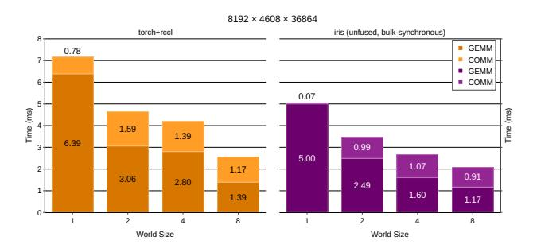
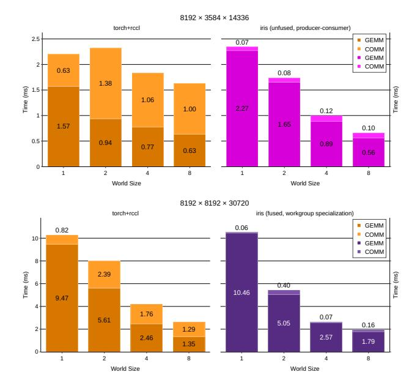
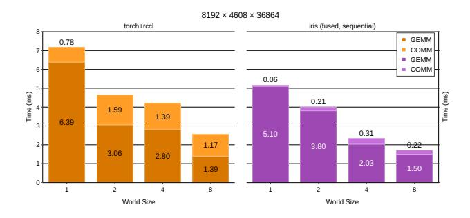

# 5.2 Evaluating Fused, Unfused Patterns Taxonomy

To evaluate Iris' in a real-world application, we continue our case-study from Section 4. We implemented many of the fused and unfused patterns described in the Figure 3 and Listings 3, 4 and 5 to capture the versatility of the abstraction and APIs. In this section, we cover a deep-dive of these patterns using PyTorch's torch.matmul and RCCL's All-Gather as a functionally equivalent baseline. Figure 8 shows the complete performance landscape across six different problem shapes and sizes with varying N and K-dimensions (and M=8192) for different number of GPUs (world size).

We first establish Iris' baseline using the "Unfused, Bulk-synchronous" schedule, which as a schedule is equivalent

Figure 7: All load/all store benchmark results where all GPUs participate in all load/store operations across all links. As buffer size increases, performance approaches peak bandwidth utilization as expected.

Figure 8: Complete performance comparison between Iris fused GEMM + All-Scatter and RCCL GEMM + AllGather kernels across different problem sizes and world sizes.

PyTorch and RCCL. We observe that Iris competes with state-of-theart GEMM and All-Gather implementation — this further validates that Iris' abstraction isn't resulting in any discernible overheads. In some cases, such as  $8192 \times 4608 \times 36864$ , Iris is 20% faster using 8 GPUs. This is largely attributed to difference in heuristics for the PyTorch and RCCL's heuristics selecting a suboptimal configuration (see Figure 9).

Iris also allows to break the rigid bulk-synchronous programming model by using the device-side APIs and moving the synchronization at a fine grained tile-level granularity. "Unfused, producer-consumer", "fused, workgroup-specialization" and "fused, sequential" all follow this model. Unfused, producer-consumer approach gives up-to  $2.5\times$  speedup for problem shape of  $8192\times3584\times14336$ 

Figure 9: Deep-dive: Shows breakdown of GEMM (darker region) and Communication (lighter region) for Iris compared to PyTorch and RCCL for 8192×4608×36864 matrix size. Note the slight speedups in both GEMM and communication due to Iris' flexibility to be able to cater to a specific problem shape and size. Tile-based abstraction allows for users to simply adjust the needed tile-size at compile-time per a problem/kernel granularity.

on 8 GPUs. The nature of the problem (small-N after being split 8 ways, and large-K) allows producer-consumer-style model (unfused or fused using workgroup-specialization) to completely hide the communication operation behind the GEMM operation, this is illustrated in Figure [10.](#page-12-1) The difference between the fused and unfused variants of producer-consumer approach is that using unfused two kernels (one producer and one consumer), we avoid worst-case resource allocation[4](#page-12-2) (typically bounded by GEMMs) and promotes better occupancy at the cost of kernel launch latency and less control over the scheduling of operations. Whereas in a fused variant, we only launch one kernel and do not have to pay an additional cost to launch the kernel, it allows for more scheduling control and re-purposing/reusing resources and data when relevant, however, requires worst-case resource allocation and limits the occupancy for one of the operator.

A fused, sequential schedule is the simplest of them all — essentially appending the communication operation at the end of the main-loop of the GEMM operation. This required a few lines of code changes as shown in Listing [4,](#page-9-1) and works well for problems that need more resources for GEMM (such as small N and massive large-K.) However, as the name suggest, this sort of schedule creates a sequential dependency between the GEMM operation and All-Scatter operation, and increases the tail latency of the entire problem. Potentially creating large bubbles in the last timestep of the problem (also illustrated in Figure [5.](#page-8-1)) With this schedule, Iris outperforms the baseline PyTorch and RCCL implementation by 1.8× for 4 GPUs and 1.5× for 8 GPUs on 8192×4608×36864 problem size (see Figure [11\)](#page-12-3).

Across all tested configurations, Iris achieves an average speedup of 1.21× over PyTorch and RCCL, with speedups ranging from 0.93× to 1.79×, highlighting the consistent performance benefits of Iris's design. These speedups are largely attributed to the flexibility of Iris' design to be able to implement a fused kernel with tile-granularity synchronization (and the resultant compute and communication

Figure 10: Deep-dive: Shows breakdown of GEMM (darker region) and Communication (lighter region) for Iris compared to PyTorch and RCCL for 8192×3584×14336 matrix size. These two problems are specifically of interest for producerconsumer and workgroup specialization based schedules as they show the approach mostly hides the overhead of communication behind the GEMM (darker region) by splitting the available GPU's compute units between GEMM and communication.

Figure 11: Deep-dive: Shows breakdown of GEMM (darker region) and Communication (lighter region) for Iris compared to PyTorch and RCCL for 8192 × 4608 × 36864 matrix size. This shape illustrates when fused sequential approach benefits when the added communication is an overall small overhead (smaller output tile and really large K) and more resources can simply be allocated to processing GEMM.

overlap) versus a rigid, bulk-synchronous programming model of PyTorch's GEMM and RCCL's AllGather kernels.

4Worst-case resource allocation: Size of the allocated shared-memory, number of VGPRs or number of threads launched is not bounded by the worst-case operation.

## 6 Conclusion and Future Work

Iris's ability to match or exceed the performance of heavily-optimized HIP/CUDA-based libraries like RCCL despite its pure Triton implementation demonstrates that low-level native implementations are not a fundamental requirement for multi-GPU programming. The 1.79× peak speedup reflects a qualitatively different programming model where synchronization granularity shifts from kernel boundaries to tiles. Perhaps more significant is what Iris makes tractable: our taxonomy demonstrates that diverse overlap patterns—from bulk-synchronous to fused sequential to producer-consumer to workgroup specialization—can be implemented with minimal code changes, often requiring only a few additional lines within the same Triton kernel. Patterns that would demand substantial engineering effort with traditional CCLs (separate kernel implementations, complex host-side coordination, manual resource partitioning) emerge naturally in Iris using the same primitives Triton developers already use for single-GPU work.

This suggests that the real barrier to fine-grained overlap has been abstraction mismatch, not hardware capability. When communication primitives live in the same semantic space as computation (tile-based Triton), overlap patterns become straightforward extensions rather than heroic engineering efforts. Future work will focus on extending Iris to multi-node settings with RDMA, exploring additional fused patterns such as wave-specialization in Gluon and work queues, and investigating opportunities to offload Iris operations to the compiler itself, leveraging Triton's ability to optimize across the entire computation-communication pipeline.

## Acknowledgments

This work was supported in part by Advanced Micro Devices, Inc. under the AMD AI & HPC Cluster Program. The authors would like to thank Karl Schulz, Lei Zhang, Ziyad AlBanoby, Octavian-Alexandru Trifan, David Sidler, Xiaohu Guo, Karthik Sangaiah, Lixun Zhang, Vinayak Gokhale, Panagiotis Mylonas, Eric Eaton, Aditya Nandakumar, Ahmed Eltantawy, Dimple Prajapati, Mike Chu, Mike Schulte, Ganesh Dasika, Brad Beckmann, Ralph Wittig, and Peng Sun for their continuous feedback, support and suggestions. AMD, the AMD Arrow logo, AMD CDNA™, AMD Instinct™, AMD ROCm™, AMD Infinity Cache™, AMD Infinity Fabric™, and combinations thereof are trademarks of Advanced Micro Devices, Inc. Other product names used in this publication are for identification purposes only and may be trademarks of their respective companies.

## References

- [1] Advanced Micro Devices, Inc. 2025. HIP Documentation (ROCm Software Future Release). [https://rocm.docs.amd.com/projects/HIP/en/docs-develop/index.html.](https://rocm.docs.amd.com/projects/HIP/en/docs-develop/index.html) [Online; accessed 6-August-2025].
- [2] Advanced Micro Devices, Inc. 2025. Introducing AMD CDNA™ 3 Architecture. Technical Report. Advanced Micro Devices, Inc. [Online; accessed 6-August-2025].
- [3] Advanced Micro Devices, Inc. 2025. ROCm OpenSHMEM (rocSHMEM). [https:](https://github.com/ROCm/rocSHMEM) [//github.com/ROCm/rocSHMEM.](https://github.com/ROCm/rocSHMEM) [Online; accessed 6-August-2025].
- [4] AMD. 2025. RCCL: ROCm Communication Collectives Library. [https://github.](https://github.com/ROCm/rccl) [com/ROCm/rccl](https://github.com/ROCm/rccl) [Online; accessed 27-October-2025].
- [5] Muhammad Awad, Muhammad Osama, and Brandon Potter. 2025. Iris: First-Class Multi-GPU Programming Experience in Triton. [https://doi.org/10.5281/zenodo.](https://doi.org/10.5281/zenodo.17382307) [17382307](https://doi.org/10.5281/zenodo.17382307)
- [6] Li-Wen Chang, Wenlei Bao, Qi Hou, Chengquan Jiang, Ningxin Zheng, Yinmin Zhong, Xuanrun Zhang, Zuquan Song, Chengji Yao, Ziheng Jiang, Haibin Lin,

- Xin Jin, and Xin Liu. 2024. FLUX: Fast Software-Based Communication Overlap on GPUs Through Kernel Fusion.<https://doi.org/10.48550/arXiv.2406.06858> arXiv[:2406.06858](https://arxiv.org/abs/2406.06858) [cs.LG]
- [7] Tianqi Chen, Thierry Moreau, Ziheng Jiang, Lianmin Zheng, Eddie Yan, Meghan Cowan, Haichen Shen, Leyuan Wang, Yuwei Hu, Luis Ceze, Carlos Guestrin, and Arvind Krishnamurthy. 2018. TVM: An Automated End-to-End Optimizing Compiler for Deep Learning.<https://doi.org/10.48550/arXiv.1802.04799> arXiv[:1802.04799](https://arxiv.org/abs/1802.04799) [cs.LG]
- [8] DeepSeek-AI, Aixin Liu, Bei Feng, Bing Xue, Bingxuan Wang, Bochao Wu, Chengda Lu, Chenggang Zhao, Chengqi Deng, Chenyu Zhang, Chong Ruan, Damai Dai, Daya Guo, Dejian Yang, Deli Chen, Dongjie Ji, Erhang Li, Fangyun Lin, Fucong Dai, Fuli Luo, Guangbo Hao, Guanting Chen, Guowei Li, H. Zhang, Han Bao, Hanwei Xu, Haocheng Wang, Haowei Zhang, Honghui Ding, Huajian Xin, Huazuo Gao, Hui Li, Hui Qu, J. L. Cai, Jian Liang, Jianzhong Guo, Jiaqi Ni, Jiashi Li, Jiawei Wang, Jin Chen, Jingchang Chen, Jingyang Yuan, Junjie Qiu, Junlong Li, Junxiao Song, Kai Dong, Kai Hu, Kaige Gao, Kang Guan, Kexin Huang, Kuai Yu, Lean Wang, Lecong Zhang, Lei Xu, Leyi Xia, Liang Zhao, Litong Wang, Liyue Zhang, Meng Li, Miaojun Wang, Mingchuan Zhang, Minghua Zhang, Minghui Tang, Mingming Li, Ning Tian, Panpan Huang, Peiyi Wang, Peng Zhang, Qiancheng Wang, Qihao Zhu, Qinyu Chen, Qiushi Du, R. J. Chen, R. L. Jin, Ruiqi Ge, Ruisong Zhang, Ruizhe Pan, Runji Wang, Runxin Xu, Ruoyu Zhang, Ruyi Chen, S. S. Li, Shanghao Lu, Shangyan Zhou, Shanhuang Chen, Shaoqing Wu, Shengfeng Ye, Shirong Ma, Shiyu Wang, Shuang Zhou, Shuiping Yu, Shunfeng Zhou, Shuting Pan, T. Wang, Tao Yun, Tian Pei, Tianyu Sun, W. L. Xiao, Wangding Zeng, Wanjia Zhao, Wei An, Wen Liu, Wenfeng Liang, Wenjun Gao, Wenqin Yu, Wentao Zhang, X. Q. Li, Xiangyue Jin, Xianzu Wang, Xiao Bi, Xiaodong Liu, Xiaohan Wang, Xiaojin Shen, Xiaokang Chen, Xiaokang Zhang, Xiaosha Chen, Xiaotao Nie, Xiaowen Sun, Xiaoxiang Wang, Xin Cheng, Xin Liu, Xin Xie, Xingchao Liu, Xingkai Yu, Xinnan Song, Xinxia Shan, Xinyi Zhou, Xinyu Yang, Xinyuan Li, Xuecheng Su, Xuheng Lin, Y. K. Li, Y. Q. Wang, Y. X. Wei, Y. X. Zhu, Yang Zhang, Yanhong Xu, Yanping Huang, Yao Li, Yao Zhao, Yaofeng Sun, Yaohui Li, Yaohui Wang, Yi Yu, Yi Zheng, Yichao Zhang, Yifan Shi, Yiliang Xiong, Ying He, Ying Tang, Yishi Piao, Yisong Wang, Yixuan Tan, Yiyang Ma, Yiyuan Liu, Yongqiang Guo, Yu Wu, Yuan Ou, Yuchen Zhu, Yuduan Wang, Yue Gong, Yuheng Zou, Yujia He, Yukun Zha, Yunfan Xiong, Yunxian Ma, Yuting Yan, Yuxiang Luo, Yuxiang You, Yuxuan Liu, Yuyang Zhou, Z. F. Wu, Z. Z. Ren, Zehui Ren, Zhangli Sha, Zhe Fu, Zhean Xu, Zhen Huang, Zhen Zhang, Zhenda Xie, Zhengyan Zhang, Zhewen Hao, Zhibin Gou, Zhicheng Ma, Zhigang Yan, Zhihong Shao, Zhipeng Xu, Zhiyu Wu, Zhongyu Zhang, Zhuoshu Li, Zihui Gu, Zijia Zhu, Zijun Liu, Zilin Li, Ziwei Xie, Ziyang Song, Ziyi Gao, and Zizheng Pan. 2025. DeepSeek-V3 Technical Report.<https://doi.org/10.48550/arXiv.2412.19437> arXiv[:2412.19437](https://arxiv.org/abs/2412.19437) [cs.CL]
- [9] HSA Foundation. 2018. HSA Platform System Architecture Specification. [https:](https://hsafoundation.com/wp-content/uploads/2021/02/HSA-SysArch-1.2.pdf) [//hsafoundation.com/wp-content/uploads/2021/02/HSA-SysArch-1.2.pdf.](https://hsafoundation.com/wp-content/uploads/2021/02/HSA-SysArch-1.2.pdf) [Online; accessed 2-November-2025].
- [10] Andrew Kerr, Duane Merrill, Julien Demouth, and John Tran. 2017. CUTLASS: Fast Linear Algebra in CUDA C++. [https://devblogs.nvidia.com/cutlass-linear](https://devblogs.nvidia.com/cutlass-linear-algebra-cuda/)[algebra-cuda/](https://devblogs.nvidia.com/cutlass-linear-algebra-cuda/)
- [11] Wanchao Liang, Tianyu Liu, Less Wright, Will Constable, Andrew Gu, Chien-Chin Huang, Iris Zhang, Wei Feng, Howard Huang, Junjie Wang, Sanket Purandare, Gokul Nadathur, and Stratos Idreos. 2025. TorchTitan: One-stop PyTorch Native Solution for Production Ready LLM Pre-training. [https:](https://doi.org/10.48550/arXiv.2410.06511) [//doi.org/10.48550/arXiv.2410.06511](https://doi.org/10.48550/arXiv.2410.06511) arXiv[:2410.06511](https://arxiv.org/abs/2410.06511) [cs.CL]
- [12] LLVM Project. 2025. User Guide for the AMDGPU Backend: Memory Model. [https://llvm.org/docs/AMDGPUUsage.html#memory-model.](https://llvm.org/docs/AMDGPUUsage.html#memory-model) [Online; accessed 6-August-2025].
- [13] NVIDIA. 2025. NCCL: Optimized Primitives for Collective Multi-GPU Communication.<https://github.com/NVIDIA/nccl> [Online; accessed 27-October-2025].
- [14] NVIDIA Corporation. 2024. CUTLASS: CUDA Templates and Python DSLs for High-Performance Linear Algebra. [https://github.com/NVIDIA/cutlass.](https://github.com/NVIDIA/cutlass) Version 4.3.0. [Online; accessed 2-November-2025].
- [15] NVIDIA Corporation. 2025. CUDA C++ Programming Guide. [https://docs.nvidia.](https://docs.nvidia.com/cuda/cuda-c-programming-guide/) [com/cuda/cuda-c-programming-guide/.](https://docs.nvidia.com/cuda/cuda-c-programming-guide/) [Online; accessed 7-August-2025].
- [16] NVIDIA Corporation. 2025. NVSHMEM: OpenSHMEM-Based Parallel Programming Interface for NVIDIA GPUs. [https://github.com/NVIDIA/nvshmem.](https://github.com/NVIDIA/nvshmem) [Online; accessed 6-November-2025].
- [17] OpenSHMEM. 2012. OpenSHMEM Specification. [http://openshmem.org/site/](http://openshmem.org/site/specification/) [specification/.](http://openshmem.org/site/specification/) [Online; accessed 6-August-2025].
- [18] OpenXLA Project. 2025. XLA: Accelerated Linear Algebra Compiler for GPUs, CPUs, and ML Accelerators. [https://github.com/openxla/xla.](https://github.com/openxla/xla) [Online; accessed 6-November-2025].
- [19] Muhammad Osama, Robert Swann, Krishnan Sangaiah, Saurabh Singh, Ganesh Dasika, and Rakesh Bhardwaj. 2025. Deep Dive into the MI300 Compute and Memory Partition Modes. [https://rocm.blogs.amd.com/software-tools](https://rocm.blogs.amd.com/software-tools-optimization/compute-memory-modes/README.html)[optimization/compute-memory-modes/README.html.](https://rocm.blogs.amd.com/software-tools-optimization/compute-memory-modes/README.html) Accessed: 2025-08-10.
- [20] PyTorch Foundation. 2025. PyTorch 2.9 Release Blog. [https://pytorch.org/blog/](https://pytorch.org/blog/pytorch-2.9-release/) [pytorch-2.9-release/.](https://pytorch.org/blog/pytorch-2.9-release/) [Online; accessed 6-November-2025].

- [21] Ben Sander. 2025. Understanding Peak, Max-Achievable & Delivered FLOPs, Part 1. [https://rocm.blogs.amd.com/software-tools-optimization/Understanding\\_](https://rocm.blogs.amd.com/software-tools-optimization/Understanding_Peak_and_Max-Achievable_FLOPS/README.html) [Peak\\_and\\_Max-Achievable\\_FLOPS/README.html.](https://rocm.blogs.amd.com/software-tools-optimization/Understanding_Peak_and_Max-Achievable_FLOPS/README.html)
- [22] Ben Sander, Evan Masters, Babak Poursartip, and Henry Ho. 2025. Measuring Max-Achievable FLOPs – Part 2. [https://rocm.blogs.amd.com/software-tools](https://rocm.blogs.amd.com/software-tools-optimization/measuring-max-achievable-flops-part2/README.html)[optimization/measuring-max-achievable-flops-part2/README.html.](https://rocm.blogs.amd.com/software-tools-optimization/measuring-max-achievable-flops-part2/README.html)
- [23] Benjamin Spector, Jordan Juravsky, Stuart Sul, Owen Dugan, Dylan Lim, Dan Fu, Simran Arora, and Chris Ré. 2025. Look Ma, No Bubbles! Designing a Low-Latency Megakernel for Llama-1B. [https://hazyresearch.stanford.edu/blog/2025-](https://hazyresearch.stanford.edu/blog/2025-05-27-no-bubbles) [05-27-no-bubbles.](https://hazyresearch.stanford.edu/blog/2025-05-27-no-bubbles) [Online; accessed 10-August-2025].
- [24] Benjamin F. Spector, Simran Arora, Aaryan Singhal, Daniel Y. Fu, and Christopher Ré. 2024. ThunderKittens: Simple, Fast, and Adorable AI Kernels. [https:](https://doi.org/10.48550/arXiv.2410.20399) [//doi.org/10.48550/arXiv.2410.20399](https://doi.org/10.48550/arXiv.2410.20399) arXiv[:2410.20399](https://arxiv.org/abs/2410.20399) [cs.LG]
- [25] Benjamin F. Spector, Simran Arora, Aaryan Singhal, Daniel Y. Fu, and Christopher Ré. 2024. ThunderKittens: Simple, Fast, and Adorable AI Kernels. arXiv[:2410.20399](https://arxiv.org/abs/2410.20399) [cs.LG]<https://arxiv.org/abs/2410.20399>
- [26] Philippe Tillet, H. T. Kung, and David Cox. 2019. Triton: An Intermediate Language and Compiler for Tiled Neural Network Computations. In Proceedings of the 3rd ACM SIGPLAN International Workshop on Machine Learning and Programming Languages (MAPL '19) (MAPL 2019). 1–10. [https://doi.org/10.1145/3315508.](https://doi.org/10.1145/3315508.3329973) [3329973](https://doi.org/10.1145/3315508.3329973)
- [27] Octavian Alexandru Trifan, Karthik Sangaiah, Muhammad Awad, Muhammad Osama, Sumanth Gudaparthi, Alexandru Nicolau, Alexander Veidenbaum, and Ganesh Dasika. 2025. Eliminating Multi-GPU Performance Taxes: A Systems Approach to Efficient Distributed LLMs. [https://doi.org/10.48550/arXiv.2511.](https://doi.org/10.48550/arXiv.2511.02168) [02168](https://doi.org/10.48550/arXiv.2511.02168) arXiv[:2511.02168](https://arxiv.org/abs/2511.02168) [cs.DC]
- [28] Size Zheng, Wenlei Bao, Qi Hou, Xuegui Zheng, Jin Fang, Chenhui Huang, Tianqi Li, Haojie Duanmu, Renze Chen, Ruifan Xu, Yifan Guo, Ningxin Zheng, Ziheng Jiang, Xinyi Di, Dongyang Wang, Jianxi Ye, Haibin Lin, Li-Wen Chang, Liqiang Lu, Yun Liang, Jidong Zhai, and Xin Liu. 2025. Triton-Distributed: Programming Overlapping Kernels on Distributed AI Systems with the Triton Compiler.<https://doi.org/10.48550/arXiv.2504.19442> arXiv[:2504.19442](https://arxiv.org/abs/2504.19442) [cs.DC]