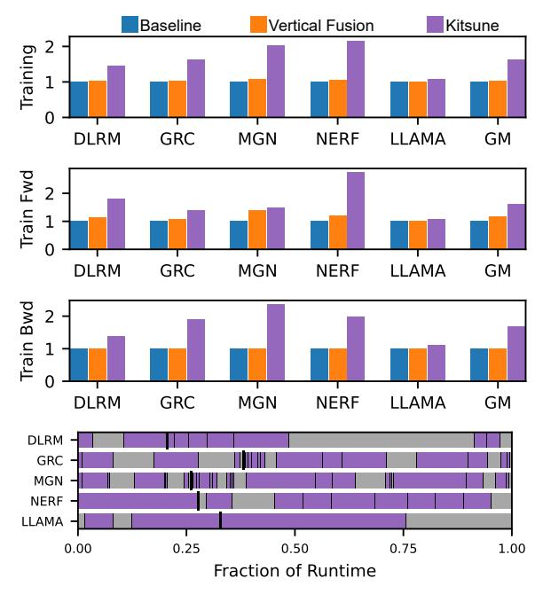

# 7 Related Work

DL Operator Mapping. Pipeline design for Kitsune is related to the problem of "operator mapping". This has largely been looked at in the context of spatially exposed hardware for single operators including works such as TimeLoop [\[37\]](#page-18-22), MAESTRO [\[17\]](#page-18-23), AMOS [\[60\]](#page-19-13), and CoSA [\[10\]](#page-17-8), which treat an operator as a transformable loop-nest, and TVM [\[4\]](#page-17-9) which lowers semantics expressed with einsums to low-level code.

DL Operator Fusion. Traditional GPU kernel fusion focuses on fusing memory-intensive kernels together [\[41,](#page-18-24) [42,](#page-19-14) [52,](#page-19-15) [55\]](#page-19-16), and modern DL compilers often support simple operator fusion at the register level [\[23,](#page-18-25) [28,](#page-18-26) [59\]](#page-19-17) or for improving data reuse for identical and related operators [\[14,](#page-18-27) [46,](#page-19-18) [53\]](#page-19-19). Building on single-operator mapping, many recent academic works address vertical fusion including ALCOP [\[9\]](#page-17-0), Apollo [\[58\]](#page-19-5), AStitch [\[62\]](#page-19-3), Chimera [\[61\]](#page-19-6), Deepcuts [\[15\]](#page-18-1), GraphTurbo [\[57\]](#page-19-4), and Welder [\[45\]](#page-19-2). We discuss the capability of AStitch, Welder, and state of art vertical fusion in Section [3.](#page-3-1) AStitch, Welder and GraphTurbo all use some notion of an anchor-and-propa-gate scheme to handle streaming compatibility

Fig. 13. Application runtime spent in different combinations of SM and DRAM utilization as reported by our model. Low utilization means less than 33% of peak.

Fig. 14. Training End-to-end Speedup over Bulk-Sync.

between fused layers. Kitsune is more composable and general than all of these, being able to fuse many more operators into co-resident GPU kernels. Other drawbacks and limitations of vertical fusion have been discussed at length in Section 3.

**GPU Multitasking**. HFuse [20] presents a methodology for horizontal fusion which can leverage overlap of heterogeneous work but is restricted to only fusing pairs of nodes with no data dependencies. Works such as ISPA [56] and SMK [54] provide a pure software, and hardware-codesign solutions (respectively) for achieving fine-grained multitasking on GPUs. SMK uses hardware mechanisms to enable preemption of CTAs on the SM for "partial context switching" – the goal of which is achieve higher overall utilization of SM resources with heterogeneous CTAs. ISPA uses

a pure software approach for co-scheduling pairs of Tensor-heavy and SIMT-heavy kernels. It uses several software techniques to promote efficiency of co-occupancy, but ultimately relies on the existing GPU thread scheduler to make CTA placement decisions. All these approaches focus on co-scheduling just two kernels with no data dependence. Kitsune enables any number of kernels to co-execute in spatial pipelines with data-dependencies supported by our queues and relying on a modified CTA scheduler to make smart decisions about placement of CTAs to best utilize SM resources.

Data-Triggered Execution. WorkGraphs [\[25\]](#page-18-29) is a recent development in the graphics space to afford data triggered execution on GPUs. However, it does not address on-chip data-orchestration to maintain cache residency of intermediates. Additionally, it operates on a level of granularity much smaller than Kitsune, using individual records and shader invocations as the unit of work. Kitsune in contrast is designed to orchestrate producer-consumer communication on-chip at a granularity of tensor tiles of around 64KB payloads. Finally, WorkGraphs doesn't support join operations with different input record types, vastly reducing the generality and applicability beyond shader pipelines.

## 8 Conclusion

We observe that the GPU BSP model limits its effectiveness for various important DL workloads, with state-of-art vertical fusion still leaving performance opportunities untapped. We design and implement Kitsune which enables synchronous dataflow execution for modern GPUs, leveraging existing support for synchronization and integrating into both CUDA and PyTorch. It's only hardware modification is extension of the GPU grid scheduler to be aware of affinity of CTAs to the SIMT vs TensorCore units. Kitsune reduces both main memory traffic and end-to-end runtime across DL networks on GPUs for both inference and training.

