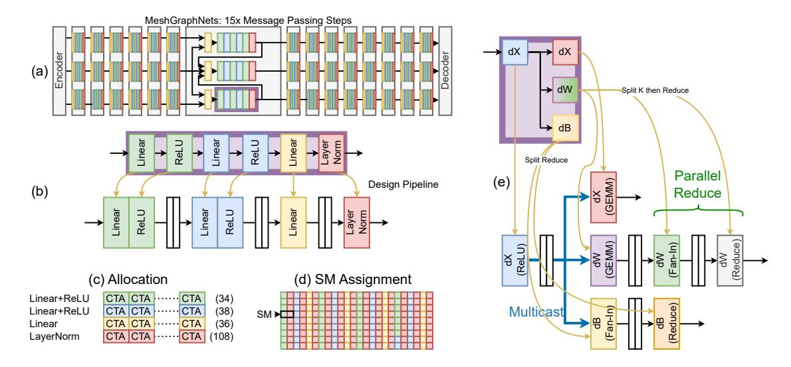
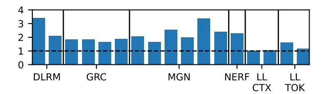

# <span id="page-10-0"></span>5.3 Load Balance

Load balancing in Kitsune involves the logical allocation of # CTAs to each node in an sf-node. Its output is an allocation as shown in Figure [8\(](#page-11-0)c). This needs to be done cognizant of overlapped execution of dissimilar CTAs on the same SM.

We use a zero-latency performance model to estimate the throughput of a spatially-fused subgraph based on an allocation of CTAs to each stage. We then formulate the allocation problem as an integer linear program (ILP) which can be used with standard solvers to produce an optimal assignment which maximizes throughput of the subgraph. We

<span id="page-11-0"></span>

Fig. 8. Running example of two subgraphs selected from (a) MeshGraphNets. (b) shows an MLP selected from the full application graph forward pass and its pipeline design. (c) and (d) show the allocation and assignment. (e) shows a subgraph from the backward pass for a Linear+ReLU and its pipeline design. We omit allocation / assignment for space. White rectangles in (b) and (e) represent queues.

augment our ILP formulation to enable over-subscribing CTAs onto SMs to enable overlapping dissimilar behavior – specifically, we consider two classes of operations: SIMT-heavy, and TensorCore-heavy, and assume an SM can simultaneously execute one of each with no performance degradation. We discuss in §4.2 low level details of how this overlap can be leveraged on modern GPU hardware.

Algorithm 2 shows our ILP formulation. We model throughput as the minimum throughput pipeline stage in the fused subgraph additionally constrained by memory bandwidth and aggregate L2 bandwidth based on analytic evaluation of the total number of bytes read/written from DRAM (DRAM Bytes), and L2 (L2 Bytes). For the  $i^{th}$  of n operators in a spatial pipeline, we estimate the performance by combining a measured BSP throughput ( $t_i$ ) with an estimate of how the performance will scale (speedup or slowdown) based on how many CTAs it is assigned ( $r_i$  =ResourceScale( $a_i$ )) and an estimate of speedup afforded by operating where some number of its operands are now resident in on-chip storage instead of DRAM ( $s_i$  =Speedup( $a_i$ )). In practice, we define Speedup( $a_i$ ) to be 1/u where u is the maximum resource utilization of the SIMT or TensorCore pipelines. We allow the number of SIMT and Tensor stages to independently be assigned SMs to exploit overlapping these dynamic resources. In practical deployment terms, we require either a two-pass compiler, run-time optimization pass, or a dictionary of kernel characteristics to get  $u_i$  to guide the ILP. Since DL models generally run in a curated environment (TensorRT for example), any of those approaches are practical, and don't introduce any application slowdowns.

#### 6 Evaluation

We now examine the effectiveness of Kitsune across our applications and GPU models. We guide our evaluation with the following questions: i) How well does Kitsune support composing arbitrary operations across DL applications? ii) What is the end-to-end performance of applications running with Kitsune and what are the reasons for variation across

#### Algorithm 2: ILP formulation for load balancing.

```
maximize ℎ
subject to ℎ <  ∗  ∗  ( = 1, . . . , )
          ℎ ∗ (DRAM Bytes) < DRAM
          ℎ ∗ (L2 Bytes) < L2
           = Bulk-Sync Thrpt. for Op 
           = ResourceScale( )
           = Speedup( )
          1 ≤  ≤ # SMs
          ∑︁
          =1
             IsSimt ∗  = # SMs
          ∑︁
          =1
             IsTensor ∗  = # SMs
```

<span id="page-12-0"></span>applications and modes of operation? iii) What is the sensitivity of our performance and gains to machine parameters including on-chip compute (number of SMs), off-chip DRAM bandwidth, and L2 and crossbar bandwidth?

#### 6.1 Methodology

Our evaluation is based on running our 5 applications in a validated GPU simulator emulating an A100 GPU which takes as input the compiled versions of our applications. We built our compiler and a queue library ([§4.1\)](#page-7-1) (characterized and run on silicon). Because we need our grid scheduler modifications to allow the overlap afforded by Kitsune ([§4.2\)](#page-7-0), we evaluate Kitsune using a modified version of NVIDIA's NVArchSim (NVAS), a hybrid trace- and execution-driven GPU simulator [\[51\]](#page-19-12) that has been validated against NVIDIA's Ampere GPU. This also allows us to study sensitivity to individual hardware features, instead of being restricted to particular SKUs.

Our baseline for speedup results is unmodified PyTorch execution. We use our compiler and modeling flow based on NVAS to present speedups afforded by both vertical fusion and Kitsune. Figure [9](#page-13-0) shows the fusions that are chosen by our compiler: thick orange boxes on the left side show the fusions we select based on vertical fusion techniques, while thick purple boxes show the fusions made possible with Kitsune. Note: our model of vertical fusion combines the techniques and mechanisms from state-of-art industry and academic approaches of TensorRT [\[49\]](#page-19-1), AStitch [\[62\]](#page-19-3) and Welder [\[45\]](#page-19-2).

We first describe the quantitative scope of the opportunity that Kitsune provides. We then discuss inference and training separately. For Kitsune, we present results for both the subgraphs of the applications as well as the speedup for the entire application.

#### 6.2 DL Application Operator Coverage

Table [2](#page-13-1) provides a characterization of the applications at the DL operator level denoting the number of operators that are grouped into pipelines. The top half of rows are for inference and the bottom half are training. Note this data is for operator count (we discuss time below). For the majority of our applications, >70% of operators are candidates for grouping, with higher coverage for inference. We note that vertical fusion covers only the forward pass operators for training[2](#page-12-1) and it's coverage is typically lower. The last two columns show memory traffic savings both for Vertical Fusion

<span id="page-12-1"></span><sup>2</sup>We note that none of the academic work or TensorRT have demonstrated execution of training yet - our results are thus optimistic for vertical fusion.

<span id="page-13-0"></span>

Fig. 9. Depiction of applications and the fusions we apply.

Table 2. Summary of fusions and traffic reductions.

<span id="page-13-1"></span>

|           |       | Fusion (  | Coverage  | Traffic Red. |         |  |  |
|-----------|-------|-----------|-----------|--------------|---------|--|--|
| App       | # Ops | Vertical  | Kitsune   | Vert.        | Kitsu.  |  |  |
| Inference |       |           |           |              |         |  |  |
| DLRM      | 21    | 17 (81%)  | 17 (81%)  | 22.53 %      | 44.27 % |  |  |
| GRC       | 35    | 21 (60%)  | 29 (83%)  | 23.98 %      | 57.20 % |  |  |
| MGN       | 51    | 36 (71%)  | 41 (80%)  | 56.54 %      | 57.76 % |  |  |
| NERF      | 24    | 18 (75%)  | 24 (100%) | 40.19 %      | 98.58 % |  |  |
| LL-CTX    | 27    | 10 (37 %) | 19 (70 %) | 10.04~%      | 49.07 % |  |  |
| LL-TOK    | 27    | 10 (37 %) | 19 (70 %) | 0.01 %       | 0.07 %  |  |  |
| Training  |       |           |           |              |         |  |  |
| DLRM      | 59    | 18 (31%)  | 46 (78%)  | 7.86 %       | 25.07 % |  |  |
| GRC       | 101   | 20 (20%)  | 76 (75%)  | 9.06 %       | 40.06~% |  |  |
| MGN       | 148   | 36 (24%)  | 108 (73%) | 21.76 %      | 40.26 % |  |  |
| NERF      | 69    | 18 (26%)  | 56 (81%)  | 14.13 %      | 45.47 % |  |  |
| LLAMA     | 88    | 10 (11 %) | 34 (39 %) | 2.85 %       | 45.16 % |  |  |

and Kitsune. Traffic savings is useful in itself, as it results in energy/power savings (by downclocking the memory frequency to sustain the lower bandwidth needs). O'Connor et al. [36] and others [8, 16] have argued that GPUs are becoming memory power limited.

#### 6.3 Inference Performance

Figure 10 shows the speedup Kitsune provides for each of the subgraphs in each of the applications. Figure 11's timeline show the time contributed to overall execution by each of the subgraphs, and in gray we show the time the application spends in kernels/operators that run in bulk-synchronous mode. Figure 11's bar-charts show full application speedup.

Overall, sub-graphs speedup range from 1.04×-3.4× across the applications, with a geomean of 1.9×. The least speedups are for the subgraphs of Llama-Ctx because they are already achieving >50% of machine peak compute and so do not benefit a lot from operating in spatial mode. NeRF is an example where large speedup is achieved (2.3×), highlighting many of Kitsune's benefits: all the nodes of NeRF's forward pass are spatially fused, allowing most layers to pull intermediates from a queue instead of main-memory; and the concat operations are free to occupy the SIMT

<span id="page-14-0"></span>

<span id="page-14-1"></span>Fig. 10. Inference subgraph speedups including sensitivity to hardware resources.


Fig. 11. Inference End-to-end Speedup over Bulk-Sync.

<span id="page-14-3"></span>

Fig. 12. Training subgraph speedups including sensitivity. Dashed lines separate forward and backward passes.

units of the SMs while the GEMMs use the TensorCores. Due to the intermediate sizes, vertical fusion cannot fuse NeRF's linear layers[3](#page-14-2) .

When looking at full application performance, we observe two phenomenon: large portions of time are spent in the sub-graphs (typically > 50%), and a single application has few subgraphs (the black lines in Figure [11](#page-14-1) indicate end of a sub-graph). For end-to-end performance, we see geomean 1.5× speedup. Llama-Ctx shows the least speedups because its subgraphs' speedup is modest (4% - 8%), despite its sub-graph coverage in time is 84%.

Takeaway: We find Kitsune provides substantial performance opportunity for DL inference with this generally scaling with number of fused operations. We observe DRAM traffic is substantially reduced, suggesting higher performance could be possible without increasing bandwidth.

## 6.4 Training Performance

Figures [12](#page-14-3) and [14](#page-16-0) show the corresponding results for training, with training broken down further in terms of the forward and backward pass. The forward pass is similar to inference, with the added issue of intermediate activations being stored to main-memory for computing gradients. The backward pass then uses these to compute gradients for parameters.

<span id="page-14-2"></span><sup>3</sup>We use the original NERF configuration which uses hidden dim = 256.

Considering end-to-end speedup, we see two trends. As expected, the backward pass takes about 2× the time of the forward pass. Less fractional time of the backward pass is spent in spatial mode, especially for DLRM, where the backward pass for the feature interaction which is not spatially fused takes substantial runtime, causing an Amdahl's law effect on training back-backpropagation. End-to-end speedups range from only 1.1× to as high as 2.2×.

Takeaway: Kitsune still enables performance gains for Deep Learning training, with lower improvements due to smaller fusions in the backward pass compared to forward. Because of Kitsune's ability to parallelize reductions, training benefits more from spatial fusion compared to the parallelism-limited bulk-synchronous baseline.

#### 6.5 Comparing to Vertical Fusion

Due to the limitations outlined in [§3,](#page-3-1) effectiveness of Vertical Fusion is substantially lower than Kitsune for inference, with MeshGraphNets showing the best speedup (1.4×) with geo-mean 1.14× (Figure [11\)](#page-14-1). Since it only applies for the forward pass, training speedups are even lower (Figure [14\)](#page-16-0). Related works like Welder, for inference, have reached similar findings: when applied to production settings of running with TensorCore and meaningful batch-size (like 32 or larger), speedups over un-optimized PyTorch (worse than our baseline) is 30% or so, with no speedup over TensorRT on Nvidia V100 [\[45\]](#page-19-2). Those works target additional scenarios like FP32 based computation (thus eliding our overlap opportunity) and edge-case scenarios like batch-size=1, which are less important in production data-center deployment. Philosophically they target improvements through software in the configuration space where GPUs are inefficient (bs=1, fp32 mode etc). We focus on production scenarios: batched training and inference using TensorCores to address inefficiencies.

#### 6.6 Comparing SM and DRAM Utilization

Figure [13](#page-16-1) shows a breakdown of application runtime spent with different resource utilization when running with Kitsune. For inference, comparing to our data in Figure [3,](#page-6-0) we see 26% and 15% of runtime is spent with both low utilization for BSP and Kitsune, respectively. For training, we observe on average, Kitsune only spends 18% of runtime in low utilization compared to 44% for bulk-synchronous. In addition, Kitsune on average spends much more runtime with just low DRAM utilization for training: 50% vs 23%. This difference is less pronounced for training compared to inference because training requires more DRAM traffic to save intermediate activations for back-propagation.

Takeaway: We find Kitsune is able to capitalize on the under-utilized resources of the GPU, reducing runtime spent with low resource utilization for tmost of our applications.

