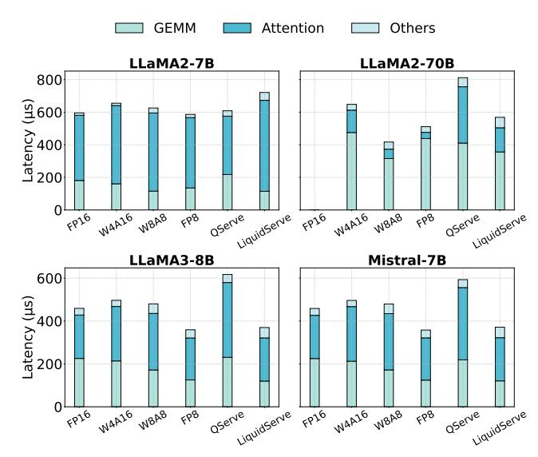
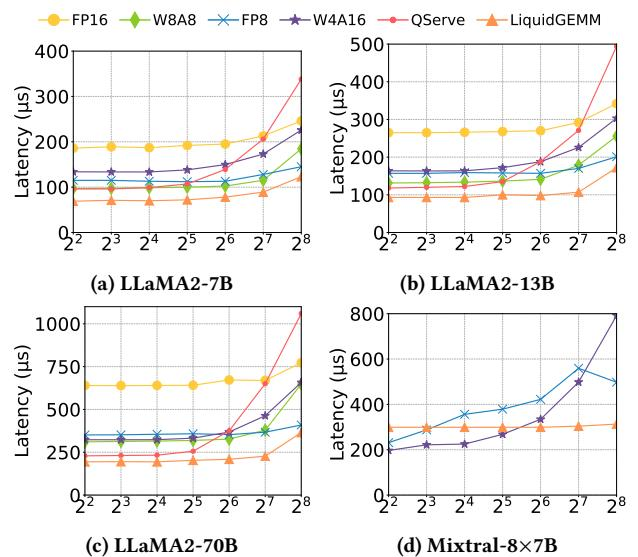
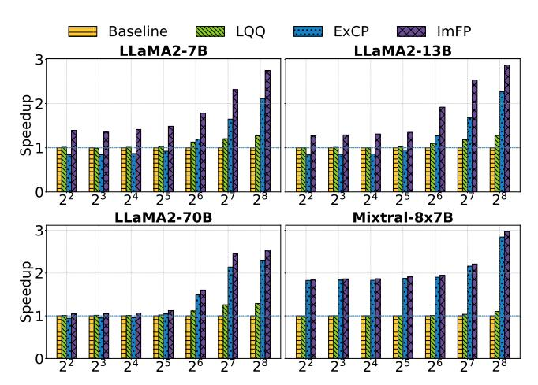

# 7.1 Experimental Setup

Systems Under Study. Our W4A8 kernel, LiquidGEMM, is implemented using CUDA and PTX. We refer to the full LLM serving system described in Section 6 as LiquidServe. By default, weights are quantized using group-wise quantization with a group size of 64, and the KV cache is quantized to INT8 using per-channel static quantization. We compare LiquidServe against two baseline systems. The first is **QServe** [15], a state-of-the-art W4A8 LLM serving system featuring an efficient W4A8 GEMM implementation. QServe uses group-wise weight quantization with a group size of 128 by default and quantizes the KV cache to 4-bit. We use the publicly available implementation from GitHub1. The second baseline is TensorRT-LLM [20], an LLM inference framework provided by NVIDIA. We use version 0.16.0 of the implementation2. We include it for comparison under several common precision settings: FP16 (denoted as TRT-FP16), W4A16 (TRT-W4A16), W8A8 (TRT-W8A8), and FP8 (TRT-FP8). The KV caches are quantized per-channel to FP8 for W4A16, FP8, and FP16 configurations, and to INT8 for W8A8.

**Testbed.** We conduct experiments on a Linux server equipped with an Intel Xeon Platinum 8457C CPU, 2.9 TB RAM, and an NVIDIA H800 GPU with 80 GB memory, via cloud access. All system-level evaluations are run under PyTorch 2.4.0 and CUDA 12.4. To isolate and fairly compare GEMM kernel performance, we extract the GEMM kernels from each system and benchmark them using a unified CUDA-based framework3. This framework supports flexible matrix shape configuration to simulate various model scenarios.

**Experiment Roadmap.** Our evaluation consists of two parts. First, we measure system-level throughput and latency to understand the end-to-end impact of quantization on LLM serving. While our focus

is on accelerating W4A8 GEMM, this step provides context on how GEMM efficiency translates to overall system performance. However, system-level performance is also influenced by other factors such as attention computation and KV cache management, which differ across implementations and are outside the scope of this paper. Therefore, we complement this with a second set of experiments that directly benchmark the GEMM kernels in isolation using our unified framework. This enables fair, accurate comparisons under consistent and controlled conditions.

Although our LQQ quantization algorithm is designed to improve efficiency, we also evaluate its impact on model accuracy. We test on LLaMA [9, 25, 26], Mistral-7B [10], Mixtral-8×7B [11], and Yi-34B [31], using perplexity on WikiText2 [19] and zero-shot accuracy on PIQA [2], ARC [5], HellaSwag [33], and WinoGrande [21]. Results show that LQQ preserves accuracy. Due to space constraints, detailed results will be released in a full-version technical report.

## 7.2 Efficiency Comparison of LLM Serving

Throughput Under Memory Constraint. We compare the maximum achievable throughput of all systems under the same memory budget (80 GB on an H800 GPU). Following prior work [15], we fix the input and output sequence lengths to 1024 and 512, respectively. We vary the batch size from 1 to 256 (or until the system runs out of memory) to identify the optimal configuration, and report the peak throughput achieved by each system.

Table 1 summarizes the peak throughput across all systems. QServe typically reaches peak performance at batch sizes of 64 or 128, whereas LiquidServe continues to scale with increasing batch size. As a result, QServe outperforms TRT on LLaMA-30B and LLaMA2-13B due to its use of low-bit KV cache, which allows for larger batch sizes, but performs significantly worse on other models. LiquidServe performs slightly below TRT-FP8 on LLaMA3-8B and Mistral-7B, as TRT-FP8 leverages attention kernels optimized for FP8 on H800. However, LiquidServe consistently outperforms all other systems in the remaining cases. The performance advantage is especially pronounced on larger models. For instance, on LLaMA2-70B, LiquidServe achieves a 3.16x speedup over TRT-W8A8 by supporting larger batch sizes through 4-bit weight quantization, and a 1.63x speedup over TRT-W4A16 due to its higher compute

 $^{1} {\rm https://github.com/mit-han-lab/omniserve,\ commit\ hash:\ 5106921}$ 

&lt;sup>2https://github.com/NVIDIA/TensorRT-LLM, commit hash: 42a7b09

&lt;sup>3An internal benchmarking tool used to evaluate GPU kernel performance before deployment.

Figure 10: Time breakdown for processing one decoding layer of LLaMA2-7B, LLaMA2-70B, LLaMA3-8B, and Mistral-7B at the batch sizes specified in Table 1.

throughput with INT8 MMA. These results highlight the practical efficiency gains of W4A8 quantization on the system level.

Nevertheless, as discussed, system performance is influenced by multiple factors such as attention computation and KV cache management. To isolate the contribution of our W4A8 GEMM, we replace LiquidGEMM in LiquidServe with QServe's W4A8 kernel, denoted as **LiquidServe/wo**. As shown, LiquidServe achieves a 1.13-1.98x end-to-end speedup over LiquidServe/wo, demonstrating both the critical role of GEMM and the effectiveness of LiquidGEMM.

Time Breakdown of End-to-End LLM Serving. To analyze the sources of end-to-end performance gains in Table 1, we break down the inference time of one layer into GEMM, Attention, and Others for LLaMA2-7B, LLaMA2-70B, LLaMA3-8B, and Mistral-7B at the corresponding batch sizes. Note that while larger batch sizes generally yield higher throughput, they also increase the per-layer processing workload. As shown in Figure 10, LiquidServe consistently delivers GEMM latencies that are on par with or better than all baselines, thanks to LiquidGEMM's hardware-friendly dequantization that mitigates the CUDA kernel bottleneck.

On LLaMA2-7B, LiquidServe achieves the lowest GEMM latency, 1.90x faster than QServe and up to 1.58x faster than TRT. On LLaMA2-70B, despite using larger batch sizes, it still outperforms QServe by 1.15x, though slightly slower than TRT-W8A8. For LLaMA3-8B and Mistral-7B, LiquidServe matches FP8 in GEMM latency but incurs slightly higher overhead in the "Others" category. These results highlight LiquidGEMM's effectiveness in improving overall inference efficiency.

**Throughput at Fixed Batch Sizes.** To further evaluate system performance under consistent workload settings, we compare the throughput of different systems using the same batch size, with LLaMA2-7B and LLaMA2-70B as representatives due to space constraints. Figure 11 shows the token throughput for two batch sizes: 16, which is generally memory-bound, and 128, which approaches

Figure 11: Comparison of token generation throughput across systems at the same batch size.

Figure 12: Comparison of GEMM latency on the FFN layer with batch sizes ranging from 4 to 256.

compute-bound. Missing bars indicate out-of-memory failures. LiquidServe consistently outperforms all baselines, demonstrating its efficiency advantage.

### 7.3 Efficiency Comparison of GEMM Kernel

We evaluate the efficiency of quantized GEMM kernels from all systems using a unified test framework. Specifically, we measure the compute performance on all GEMMs of a single-layer transformer across various models, including the fused QKV projection GEMM, the output projection GEMM, and the two FFN GEMMs, averaging the results over five runs.

Efficiency Comparison. Figure 12 compares GEMM latency across batch sizes from 4 to 256. On LLaMA models, QServe and LiquidGEMM generally outperform other systems on LLaMA2-13B and LLaMA2-70B at small batch sizes due to the benefits of 4-bit quantization. However, as batch size increases, QServe experiences significant performance degradation, while LiquidGEMM maintains consistently lower latency. At batch size 256, LiquidGEMM achieves speedups of 2.75x, 2.87x, and 2.90x over QServe on LLaMA2-7B, 13B, and 70B, respectively. For Mixtral-8×7B, TRT-W4A16 and TRT-FP8 outperform LiquidGEMM when the batch size is below 32, as they utilize a specialized GEMV kernel optimized for small-batch scenarios. Beyond batch size 32, LiquidGEMM delivers 1.41–1.84x

speedup over TRT-FP8 and 1.12–2.53x over TRT-W4A16, demonstrating strong scalability and robustness.

Ablation Study. Figure 13 presents the ablation results. We first enable LQQ. When the batch size is small, GEMM is memory-bound and LQQ offers limited benefit. As batch size increases and computation becomes dominant, LQQ yields up to 1.29x speedup. Enabling ExCP at small batch sizes degrades performance due to round-trip traffic and synchronization overhead. At larger batch sizes, pipeline execution becomes more effective, and ExCP begins to provide benefits. In contrast, ImFP consistently improves performance across all batch sizes. Note that both ExCP and ImFP share the same memory layout and dequantization logic. Their advantage arises from pipelined execution across grouped GEMMs, particularly for MoE models, while the baseline and LQQ-only variants lack such inter-GEMM pipelining. In summary, these results highlight the effectiveness of the LQQ algorithm and the superior performance of the ImFP pipeline strategy.

## 8 Related Work

Quantization for LLM Inference. The methods typically fall into two categories: the weight-only quantization and the weightactivation quantization. For weight-only quantization, GPTQ [8] pioneered sub-8-bit quantization by compressing weights to 3 or 4 bits using approximate second-order information. AWQ [14] further improved accuracy by incorporating activation statistics to identify and preserve critical weights. For weight-activation quantization, GPT3.int8() [7] introduced mixed-precision quantization to isolate outlier activations in separate 16-bit multiplications. SmoothQuant [29] proposed migrating quantization challenges from activations to weights via mathematically equivalent transformations, effectively smoothing activation outliers. Atom [35] employed mixed-precision fine-grained group quantization, achieving a balance between throughput and accuracy. OmniQuant [23] offered methods to automatically learn optimal quantization parameters. QServe [15] utilized a two-stage W4A8KV4 quantization approach optimized for GPU Tensor Cores, while QQQ [34] combined adaptive smoothing with Hessian-based compensation, developing a new W4A8 GEMM kernel. Other recent works, including QuaRot [1], SpinQuant [18], and DuQuant [13], applied transformations (e.g., rotations) to distribute outliers effectively. Among these, DuQuant simplified training complexity compared to SpinQuant and demonstrated superior performance over QuaRot. Different from these works, this paper focuses on the efficiency of W4A8 GEMM for efficient LLM serving.

Quantization for LLM Training. Quantization-aware training (QAT) achieves higher accuracy than post-training quantization (PTQ), but it has seen limited use due to its high computational overhead. LLM-QAT [17] introduced a data-free distillation method using generations from pre-trained models, enabling practical QAT for LLMs. EfficientQAT [4] accelerated QAT with a two-phase training strategy. Bondarenko et al. [3] proposed a lightweight, memory-efficient low-rank QAT method specifically for LLMs. EdgeQAT [24] introduced an entropy-guided approach with adaptive token importance to reduce information distortion in QAT.

**LLM Serving.** Orca [32] optimized serving performance with iteration-level scheduling and selective batching. vLLM [12] improved KV

Figure 13: Ablation study of LiquidGEMM by first enabling LQQ, followed by either the explicit coarse-grained pipeline (ExCP) or the implicit fine-grained pipeline (ImFP).

cache management efficiency through PagedAttention, inspired by virtual memory mechanisms. NVIDIA's TensorRT-LLM [20] provided an open-source library specifically optimized for accelerating LLM inference on GPUs. DistServe [36] enhanced serving performance by disaggregating prefill and decoding computations with advanced placement algorithms. COMET [16] proposed a mixed-precision inference framework incorporating novel, highly optimized kernels to maximize LLM inference performance.

#### 9 Conclusion

This paper addresses the dequantization bottleneck in W4A8 quantization for LLM serving. We first profile existing W4A8 GEMM kernels and develop a cost model to identify the critical performance factors. Guided by this analysis, we propose LiquidGEMM, a hardware-efficient W4A8 GEMM kernel that integrates two codesigned techniques: LiquidQuant, an overflow-safe dequantization algorithm; and an implicit fine-grained pipeline that maximizes parallelism across GPU subsystems. Experiments show up to 2.90x kernel speedup and 4.94x system-level speedup over prior W4A8 kernels, and 1.12–1.63x improvements over NVIDIA TensorRT-LLM. These results demonstrate that hardware-aware design makes W4A8 GEMM both efficient and scalable for high-performance LLM inference.

#### References

- Saleh Ashkboos, Amirkeivan Mohtashami, Maximilian L Croci, Bo Li, Pashmina Cameron, Martin Jaggi, Dan Alistarh, Torsten Hoefler, and James Hensman. 2024. Quarot: Outlier-free 4-bit inference in rotated llms. arXiv preprint arXiv:2404.00456 (2024).
- [2] Yonatan Bisk, Rowan Zellers, Jianfeng Gao, Yejin Choi, et al. 2020. Piqa: Reasoning about physical commonsense in natural language. In Proceedings of the AAAI conference on artificial intelligence, Vol. 34. 7432–7439.
- [3] Yelysei Bondarenko, Riccardo Del Chiaro, and Markus Nagel. 2024. Low-Rank Quantization-Aware Training for LLMs. arXiv preprint arXiv:2406.06385 (2024).
- [4] Mengzhao Chen, Wenqi Shao, Peng Xu, Jiahao Wang, Peng Gao, Kaipeng Zhang, and Ping Luo. 2024. Efficientqat: Efficient quantization-aware training for large language models. arXiv preprint arXiv:2407.11062 (2024).
- [5] Peter Clark, Isaac Cowhey, Oren Etzioni, Tushar Khot, Ashish Sabharwal, Carissa Schoenick, and Oyvind Tafjord. 2018. Think you have solved question answering? try arc, the ai2 reasoning challenge. arXiv preprint arXiv:1803.05457 (2018).
- [6] Tri Dao. 2023. Flashattention-2: Faster attention with better parallelism and work partitioning. arXiv preprint arXiv:2307.08691 (2023).

- [7] Tim Dettmers, Mike Lewis, Younes Belkada, and Luke Zettlemoyer. 2022. Gpt3. int8 (): 8-bit matrix multiplication for transformers at scale. Advances in Neural Information Processing Systems 35 (2022), 30318–30332.
- [8] Elias Frantar, Saleh Ashkboos, Torsten Hoefler, and Dan Alistarh. 2022. Gptq: Accurate post-training quantization for generative pre-trained transformers. arXiv preprint arXiv:2210.17323 (2022).
- [9] Aaron Grattafiori, Abhimanyu Dubey, Abhinav Jauhri, Abhinav Pandey, Abhishek Kadian, Ahmad Al-Dahle, Aiesha Letman, Akhil Mathur, Alan Schelten, Alex Vaughan, et al. 2024. The llama 3 herd of models. arXiv preprint arXiv:2407.21783 (2024).
- [10] Albert Q. Jiang, Alexandre Sablayrolles, Arthur Mensch, Chris Bamford, Devendra Singh Chaplot, Diego de las Casas, Florian Bressand, Gianna Lengyel, Guillaume Lample, Lucile Saulnier, Lélio Renard Lavaud, Marie-Anne Lachaux, Pierre Stock, Teven Le Scao, Thibaut Lavril, Thomas Wang, Timothée Lacroix, and William El Sayed. 2023. Mistral 7B. arXiv:2310.06825 [cs.CL] https://arxiv.org/abs/2310.06825
- [11] Albert Q Jiang, Alexandre Sablayrolles, Antoine Roux, Arthur Mensch, Blanche Savary, Chris Bamford, Devendra Singh Chaplot, Diego de las Casas, Emma Bou Hanna, Florian Bressand, et al. 2024. Mixtral of experts. arXiv preprint arXiv:2401.04088 (2024).
- [12] Woosuk Kwon, Zhuohan Li, Siyuan Zhuang, Ying Sheng, Lianmin Zheng, Cody Hao Yu, Joseph Gonzalez, Hao Zhang, and Ion Stoica. 2023. Efficient memory management for large language model serving with pagedattention. In Proceedings of the 29th Symposium on Operating Systems Principles. 611–626.
- [13] Haokun Lin, Haobo Xu, Yichen Wu, Jingzhi Cui, Yingtao Zhang, Linzhan Mou, Linqi Song, Zhenan Sun, and Ying Wei. 2025. Duquant: Distributing outliers via dual transformation makes stronger quantized llms. Advances in Neural Information Processing Systems 37 (2025), 87766–87800.
- [14] Ji Lin, Jiaming Tang, Haotian Tang, Shang Yang, Wei-Ming Chen, Wei-Chen Wang, Guangxuan Xiao, Xingyu Dang, Chuang Gan, and Song Han. 2024. AWO: Activation-aware Weight Quantization for On-Device LLM Compression and Acceleration. Proceedings of Machine Learning and Systems 6 (2024), 87–100.
- [15] Yujun Lin, Haotian Tang, Shang Yang, Zhekai Zhang, Guangxuan Xiao, Chuang Gan, and Song Han. 2024. Qserve: W4a8kv4 quantization and system co-design for efficient llm serving. arXiv preprint arXiv:2405.04532 (2024).
- [16] Lian Liu, Haimeng Ren, Long Cheng, Zhaohui Xu, Yudong Pan, Mengdi Wang, Xiaowei Li, Yinhe Han, and Ying Wang. 2024. COMET: Towards Partical W4A4KV4 LLMs Serving. arXiv preprint arXiv:2410.12168 (2024).
- Zechun Liu, Barlas Oguz, Changsheng Zhao, Ernie Chang, Pierre Stock, Yashar Mehdad, Yangyang Shi, Raghuraman Krishnamoorthi, and Vikas Chandra. 2023.
   Llm-qat: Data-free quantization aware training for large language models. arXiv preprint arXiv:2305.17888 (2023).
   Zechun Liu, Changsheng Zhao, Igor Fedorov, Bilge Soran, Dhruv Choudhary,
- [18] Zechun Liu, Changsheng Zhao, Igor Fedorov, Bilge Soran, Dhruv Choudhary, Raghuraman Krishnamoorthi, Vikas Chandra, Yuandong Tian, and Tijmen Blankevoort. 2024. SpinQuant–LLM quantization with learned rotations. arXiv preprint arXiv:2405.16406 (2024).
- [19] Stephen Merity, Caiming Xiong, James Bradbury, and Richard Socher. 2016. Pointer sentinel mixture models. arXiv preprint arXiv:1609.07843 (2016).
- [20] NVIDIA. 2023. TensorRT-LLM: A TensorRT Toolbox for Optimized Large Language Model Inference. https://github.com/NVIDIA/TensorRT-LLM
- [21] Keisuke Sakaguchi, Ronan Le Bras, Chandra Bhagavatula, and Yejin Choi. 2021. Winogrande: An adversarial winograd schema challenge at scale. *Commun. ACM* 64, 9 (2021), 99–106.
- [22] Jay Shah, Ganesh Bikshandi, Ying Zhang, Vijay Thakkar, Pradeep Ramani, and Tri Dao. 2024. Flashattention-3: Fast and accurate attention with asynchrony and low-precision. Advances in Neural Information Processing Systems 37 (2024), 68658–68685.
- [23] Wenqi Shao, Mengzhao Chen, Zhaoyang Zhang, Peng Xu, Lirui Zhao, Zhiqian Li, Kaipeng Zhang, Peng Gao, Yu Qiao, and Ping Luo. 2023. Omniquant: Omnidirectionally calibrated quantization for large language models. arXiv preprint arXiv:2308.13137 (2023).
- [24] Xuan Shen, Zhenglun Kong, Changdi Yang, Zhaoyang Han, Lei Lu, Peiyan Dong, Cheng Lyu, Chih-hsiang Li, Xuehang Guo, Zhihao Shu, et al. 2024. EdgeQAT: Entropy and Distribution Guided Quantization-Aware Training for the Acceleration of Lightweight LLMs on the Edge. arXiv preprint arXiv:2402.10787 (2024).
- [25] Hugo Touvron, Thibaut Lavril, Gautier Izacard, Xavier Martinet, Marie-Anne Lachaux, Timothée Lacroix, Baptiste Rozière, Naman Goyal, Eric Hambro, Faisal Azhar, et al. 2023. Llama: Open and efficient foundation language models. arXiv preprint arXiv:2302.13971 (2023).
- [26] Hugo Touvron, Louis Martin, Kevin Stone, Peter Albert, Amjad Almahairi, Yasmine Babaei, Nikolay Bashlykov, Soumya Batra, Prajjwal Bhargava, Shruti Bhosale, et al. 2023. Llama 2: Open foundation and fine-tuned chat models. arXiv preprint arXiv:2307.09288 (2023).
- [27] Hongyu Wang, Shuming Ma, Li Dong, Shaohan Huang, Huaijie Wang, Lingxiao Ma, Fan Yang, Ruiping Wang, Yi Wu, and Furu Wei. 2023. Bitnet: Scaling 1-bit transformers for large language models. arXiv preprint arXiv:2310.11453 (2023).
- [28] Xiuying Wei, Yunchen Zhang, Yuhang Li, Xiangguo Zhang, Ruihao Gong, Jinyang Guo, and Xianglong Liu. 2023. Outlier suppression+: Accurate quantization of

- large language models by equivalent and optimal shifting and scaling. arXiv preprint arXiv:2304.09145 (2023).
- [29] Guangxuan Xiao, Ji Lin, Mickael Seznec, Hao Wu, Julien Demouth, and Song Han. 2023. Smoothquant: Accurate and efficient post-training quantization for large language models. In *International Conference on Machine Learning*. PMLR, 38087–38099.
- [30] Yuzhuang Xu, Xu Han, Zonghan Yang, Shuo Wang, Qingfu Zhu, Zhiyuan Liu, Weidong Liu, and Wanxiang Che. 2024. Onebit: Towards extremely low-bit large language models. arXiv preprint arXiv:2402.11295 (2024).
- [31] Alex Young, Bei Chen, Chao Li, Chengen Huang, Ge Zhang, Guanwei Zhang, Guoyin Wang, Heng Li, Jiangcheng Zhu, Jianqun Chen, et al. 2024. Yi: Open foundation models by 01. ai. arXiv preprint arXiv:2403.04652 (2024).
- [32] Gyeong-In Yu, Joo Seong Jeong, Geon-Woo Kim, Soojeong Kim, and Byung-Gon Chun. 2022. Orca: A distributed serving system for {Transformer-Based} generative models. In 16th USENIX Symposium on Operating Systems Design and Implementation (OSDI 22), 521–538.
- [33] Rowan Zellers, Ari Holtzman, Yonatan Bisk, Ali Farhadi, and Yejin Choi. 2019. Hellaswag: Can a machine really finish your sentence? arXiv preprint arXiv:1905.07830 (2019).
- [34] Ying Zhang, Peng Zhang, Mincong Huang, Jingyang Xiang, Yujie Wang, Chao Wang, Yineng Zhang, Lei Yu, Chuan Liu, and Wei Lin. 2024. QQQ: Quality Quattuor-Bit Quantization for Large Language Models. arXiv preprint arXiv:2406.09904 (2024).
- [35] Yilong Zhao, Chien-Yu Lin, Kan Zhu, Zihao Ye, Lequn Chen, Size Zheng, Luis Ceze, Arvind Krishnamurthy, Tianqi Chen, and Baris Kasikci. 2024. Atom: Lowbit quantization for efficient and accurate llm serving. Proceedings of Machine Learning and Systems 6 (2024), 196–209.
- [36] Yinmin Zhong, Shengyu Liu, Junda Chen, Jianbo Hu, Yibo Zhu, Xuanzhe Liu, Xin Jin, and Hao Zhang. 2024. Distserve: Disaggregating prefill and decoding for goodput-optimized large language model serving. arXiv preprint arXiv:2401.09670 (2024).