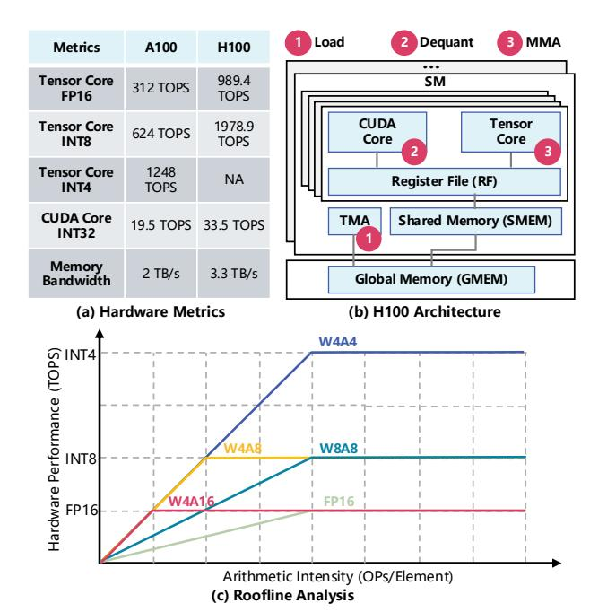
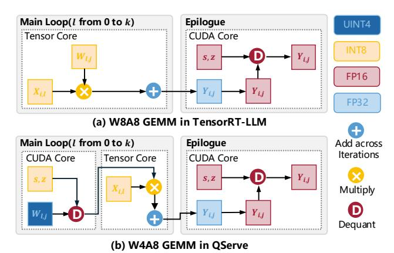
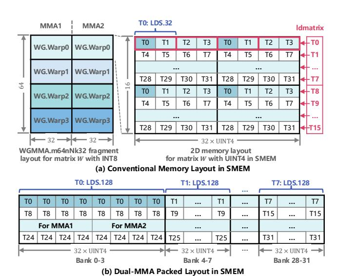

# Abstract

Quantization is a critical technique for accelerating LLM inference by reducing memory footprint and improving computational efficiency. Among various schemes, 4-bit weight and 8-bit activation quantization (W4A8) offers a strong balance between accuracy and performance. However, existing W4A8 GEMM kernels fall short in practice due to inefficient dequantization on CUDA Cores, which cannot keep pace with the high throughput of Tensor Cores. In this paper, we present LiquidGEMM, a hardware-efficient W4A8 GEMM kernel for efficient LLM serving. LiquidGEMM designs two key techniques: LiquidQuant, a hardware-efficient quantization method that enables fast, overflow-safe dequantization using just two arithmetic instructions per four elements; and an implicit finegrained pipeline that fully overlaps weight loading, dequantization, and MMA across warp groups without software synchronization or redundant memory traffic. Experimental results show that LiquidGEMM achieves up to 2.90x speedup over state-of-the-art W4A8 kernels and up to 4.94x end-to-end system-level speedup. Compared to various quantized GEMM kernels in NVIDIA TensorRT-LLM, LiquidGEMM delivers 1.12-1.63x performance gains, and achieves up to 1.63x system-level speedup.

## 1 Introduction

LLMs have transformed a wide range of applications, from natural language understanding to content generation, significantly advancing the capabilities of AI. However, their massive model size and computational intensity pose serious challenges for efficient deployment in production environments. To mitigate these issues, integer quantization [\[7,](#page-11-0) [8,](#page-11-1) [14,](#page-11-2) [27,](#page-11-3) [29,](#page-11-4) [30\]](#page-11-5) has emerged as a key technique. By

Minyi Guo Shanghai Jiao Tong University Shanghai, China guo-my@cs.sjtu.edu.cn

converting full-precision floating-point values (FP32 or FP16) into low-precision integer formats (e.g., INT4), it reduces model size, lowers memory bandwidth requirements, and accelerates inference on hardware optimized for low-precision arithmetic.

Among various quantization configurations, recent studies [\[15,](#page-11-6) [34\]](#page-11-7) highlight 4-bit weight and 8-bit activation quantization (W4A8) as a compelling trade-off between accuracy, efficiency, and memory usage. As illustrated in the roofline analysis (Figure [1\)](#page-1-0), W4A8 outperforms W4A16 by exploiting the high throughput of low-bit Tensor Core operations, delivering better performance in computebound scenarios such as large-batch inference. Compared to W8A8, W4A8 not only reduces memory footprint but also lowers memory bandwidth requirements, making it particularly advantageous in memory-bound settings like small-batch inference. Additionally, W4A8 improves arithmetic intensity, thereby reducing the batch size needed to saturate GPU compute resources. While more aggressive configurations such as W4A4 offer similar model compression, they often incur substantial accuracy degradation due to heavily quantized activations [\[15,](#page-11-6) [34\]](#page-11-7). In contrast, W4A8 maintains higher accuracy while preserving most of the efficiency benefits. Due to its advantages, W4A8 quantization is a promising solution for high-performance LLM serving in production environments.

GEMM (General Matrix Multiplication) operations are the core computational building blocks in LLM serving and critically influence inference efficiency. However, our experiments show that the state-of-the-art W4A8 GEMM implementation [\[15\]](#page-11-6) fails to meet expectations: it does not outperform higher-precision methods like W8A8 in memory-bound scenarios and is significantly slower than W8A8 and even FP16 in compute-bound regimes, e.g., on LLaMA2-7B with a batch size of 256, the existing W4A8 GEMM [\[15\]](#page-11-6)

∗Both authors contributed equally to this research.

† Shixuan Sun is the corresponding author.

Figure 1: Key performance metrics of NVIDIA A100 and H100 GPUs, with the roofline for GEMM layers in LLM serving.

is 2x slower than W8A8. This contradicts recent roofline analyses [15, 34], which suggest that W4A8 should outperform W8A8 in memory-bound cases and achieve comparable performance in compute-bound settings.

To analyze the problem, we profile the W4A8 dequantization method and develop a cost model that captures key performance factors in pipelined GEMM execution (see Section 3 for details). Our analysis shows that the core issue lies in the hardware-unaware dequantization step preceding MMA, which incurs significant overhead due to the large performance gap between CUDA Cores and Tensor Cores. As illustrated in Figure 1b, after loading weights from GMEM to RF, W4A8 GEMM must first dequantize 4-bit weights to 8-bit on CUDA Cores before executing MMA (Matrix Multiply-Accumulate) on Tensor Cores. The QoQ algorithm [15], which dequantizes multiple elements within a 32-bit register, suffers from potential overflow and requires dozens of instructions to resolve it. This imposes substantial compute pressure on the limited-capacity CUDA Cores, which cannot keep up with the high-throughput Tensor Cores (Figure 1a). In contrast, W8A8 GEMM avoids this dequantization step before MMA and can fully exploit Tensor Core performance. Consequently, although W4A8 is theoretically promising, the dequantization step becomes a performance bottleneck that limits its practical efficiency. This gap between roofline potential and actual performance underscores a fundamental limitation of current W4A8 methods.

To tackle the fundamental bottleneck in W4A8 LLM serving, we propose **LiquidGEMM**, a hardware-efficient W4A8 GEMM kernel for high-performance LLM serving. LiquidGEMM enables pipeline-parallel execution across heterogeneous GPU hardware units including TMA, CUDA Cores, and Tensor Cores to overlap dequantization with weight loading and MMA, thereby hiding its

overhead and maximizing hardware utilization. Achieving this requires addressing two key challenges. First, the quantization algorithm must be optimized to reduce the computational burden of dequantization on CUDA Cores, which have limited compute throughput compared to Tensor Cores, so that it can be effectively overlapped with other stages. Second, the execution pipeline must be co-designed to coordinate data movement and computation efficiently, feeding the beast of Tensor Cores, the primary compute engine for GEMM on modern GPUs.

To address these challenges, we first propose *LiquidQuant* (LQQ), a hardware-efficient W4A8 quantization scheme designed for native support by GPU instructions. Unlike prior methods that directly quantize INT8 to UINT4, leading to overflow issues during dequantization, LQQ applies a rotation-based transformation that shifts INT8 values into the UINT8 range before quantizing to UINT4. Paired with this rotation, we design a sweet dequantization strategy that leverages the properties of *two's complement representation* to recover the original INT8 values entirely within the UINT8 domain, without overflow. This dequantization is highly hardware-efficient, requiring only two 32-bit hardware instructions—IMAD and XOR—to process four elements, significantly reducing the computational load on CUDA Cores.

Next, we design the implicit fine-grained pipeline (ImFP) execution mechanism for LiquidGEMM. On NVIDIA Hopper GPUs, a straightforward extension to existing warp-specialized GEMM pipelines is to assign an additional warp group (WG) for dequantization, aiming to overlap weight loading, dequantization, and MMA. However, this method incurs significant overhead from round-trip data movement between RF and SMEM for WG communication and costly inter-warp synchronization, resulting in pipeline bubbles and reduced efficiency. To address the problem, our ImFP adopts a single-producer, multiple-consumer execution model. A dedicated Load WG transfers weights from GMEM to SMEM, and the GEMM workload is partitioned into fine-grained tasks that are dynamically consumed by multiple Compute WGs in a preemptive manner. Each Compute WG immediately performs MMA on the weights it has dequantized, eliminating the round-trip data movement between SMEM and RF. Overlapping of dequantization and MMA is achieved across concurrently executing Compute WGs. Notably, task scheduling is managed by hardware, thereby avoiding the overhead of software synchronization. Centered on this pipeline design, we further optimize data layout and dequantization. LiquidGEMM is currently deployed as the primary GEMM kernel in our production LLM serving infrastructure. In summary, this paper makes the following contributions.

- We provide an in-depth analysis of the W4A8 GEMM execution pipeline and identify key performance bottlenecks.
- We propose LiquidGEMM, a high-performance W4A8 GEMM kernel optimized for efficient LLM serving.
- We develop LiquidQuant, a hardware-efficient quantization algorithm that minimizes dequantization overhead on GPUs.
- We introduce an *implicit fine-grained pipeline* that maximizes hardware utilization through efficient pipeline execution.

To evaluate the efficiency of LiquidGEMM, we implement an endto-end LLM serving system built on top of open-source components

Figure 2: Overview of GEMM on GPUs, where i, j, l denote loop iterations along the M, N, K dimensions, respectively.

including FlashAttention [6] for attention computation and Page-dAttention [12] for KV cache management. Experimental results demonstrate that LiquidGEMM achieves up to 2.90x speedup over the state-of-the-art W4A8 kernel [15], and leads to up to 4.94x end-to-end system-level speedup. Compared with various quantized GEMM kernels (W4A16, W8A8, and FP8) in NVIDIA TensorRT-LLM, LiquidGEMM delivers 1.12-1.63x performance gains, and achieves up to 1.63x system-level speedup.

## 2 Preliminary

**Integer Quantization.** This is an important technique to reduce the memory footprint and computational cost of LLMs by converting high-precision floating-point values (FP32 or FP16) into low-precision integer representations (e.g., INT8 or INT4). This transformation enables more efficient model execution on GPUs that support integer arithmetic. Formally, quantization maps a floating-point tensor W to an n-bit integer tensor Q as follows:

$$Q = \left\lfloor \frac{W}{s} + z \right\rfloor, s = \frac{\max(W) - \min(W)}{\max(Q) - \min(Q)}, z = \left\lfloor \min(Q) - \frac{\min(W)}{s} \right\rfloor. \tag{1}$$

s is the scaling factor, and z is the zero-point. The operator  $\lfloor \cdot \rfloor$  denotes rounding to the nearest integer. Since Q is represented using n bits, its dynamic range is constrained to  $[0,2^n-1]$  for unsigned integers, or  $[-2^{n-1},2^{n-1}-1]$  for signed integers, depending on the quantization type. The corresponding dequantization process reconstructs an approximate floating-point value  $\widehat{W}$  from the quantized integer tensor Q:

$$\widehat{W} = (Q - z) \cdot s. \tag{2}$$

In practice, two common variants of quantization are used: asymmetric quantization, where z is nonzero to accommodate arbitrary input ranges, and symmetric quantization, where the range is centered around zero and z is set to 0. In asymmetric quantization, the integer range is given by  $\max(Q) - \min(Q) = 2^n - 1$ , while in symmetric quantization, the range becomes  $2^n - 2$  because  $|\max(Q)| = |\min(Q)|$ . Compared to symmetric quantization, asymmetric quantization can fully utilize the available value range but requires an additional subtraction operation during dequantization.

**GEMM on GPUs.** Figure 2 provides an overview of GEMM execution on GPUs. Given a GEMM operation  $Y = XW^T$ , where  $X \in \mathbb{R}^{M \times K}$  is the input tensor,  $W^T \in \mathbb{R}^{K \times N}$  is the weight matrix, and  $Y \in \mathbb{R}^{M \times N}$  is the output, the GPU partitions Y into tiles of size  $M_t \times N_t$ , each handled by a thread block. To compute its assigned

Figure 3: Comparison of W8A8 GEMM in TensorRT-LLM and W4A8 GEMM in OServe.

tile, a thread block iterates over the K dimension in steps of  $K_t$ , performing a sequence of smaller GEMMs of size  $M_t \times N_t \times K_t$ . In each iteration, it loads the corresponding slices of X and W, performs multiply-accumulate operations, and updates the output tile. This iteration over the K dimension, called  $main\ loop$ , dominates the overall computation cost of GEMM. Each output tile is further divided into fragments, with each warp computing a fragment using MMA (Matrix Multiply-Accumulate) instructions on Tensor Cores. These hardware-accelerated Tensor Cores are optimized for small matrix shapes (e.g.,  $64 \times 256 \times 32$ ), allowing high-throughput computation by processing multiple fragments in parallel. For simplicity, we use the terms tile and fragment interchangeably throughout the paper, as their distinction does not affect the core analysis.

Tensor Cores natively support operations on operands with matching symmetric precision, i.e., both weights and activations have the same data type. Based on the precision of the input matrices, GEMM can be categorized into two types: *symmetric GEMM*, where both operands share the same type, and *asymmetric GEMM*, where weights and activations differ in precision (typically, weights have lower bit-width). In asymmetric GEMM, weights must be dequantized during the main loop before being processed by Tensor Cores. Figure 3 compares W4A8, an asymmetric GEMM, with W8A8, a symmetric GEMM. In W4A8, dequantization is performed on CUDA Cores during the main loop prior to MMA on Tensor Cores. In contrast, W8A8 executes the main loop entirely on Tensor Cores, with dequantization deferred to the epilogue.

### 3 Motivation

We evaluate the practical performance of **W4A8** GEMM in LLM serving, comparing it with representative quantization methods. Specifically, we benchmark QServe [15] (**W4A8**), TRT-W4A16 (**W4A16**), TRT-W8A8 (**W8A8**), TRT-FP8 (**FP8**) and TRT-FP16 (**FP16**), where TRT refers to TensorRT-LLM [20] developed by NVIDIA. We also consider Atom [35] (**W4A4**) and QQQ [34] (**W4A8**). However, Atom performs slower on H800 GPUs, as Tensor Cores do not support INT4. QQQ also underperforms compared to QServe. Thus, we omit both Atom and QQQ from further evaluation.

Figure 4: Time breakdown of inference for input lengths 128 (left) and 1024 (right). The bar for batch size 256 at length 1024 is omitted due to out-of-memory.

Figure 5: GEMM latency on a single transformer layer with batch sizes ranging from 4 to 256.

## 3.1 Gap between Roofline Analysis and Practice

To evaluate the practical performance of these GEMM configurations, we benchmark LLM serving on LLaMA2-7B (a dense model) and Mixtral-8×7B (an MoE model) using H800 GPU, with batch sizes ranging from 4 to 256. We select W8A8 quantization for LLaMA2-7B and FP8 quantization for Mixtral-8×7B, as W8A8 quantization does not currently support Mixtral-8×7B. We consider two inputoutput length settings: 1) 1024 input tokens and 512 output tokens; and 2) 128 input tokens and 128 output tokens. Note that increasing token length does not impact the GEMM workload in the FFN and projection (PROJ) layers during decoding, but it does increase attention computation. Figure 4 shows the proportion of GEMM latency (from FFN and PROJ layers) in end-to-end inference. We observe that GEMM dominates latency at small batch sizes and still accounts for over 20% of total latency at large batch sizes with long sequences on LLaMA2-7B. For Mixtral-8×7B, GEMM remains the primary contributor to latency across all test cases due to the need to run separate GEMMs for each expert. These results highlight the fundamental role of GEMM in LLM serving performance.

Figure 5 shows the average per-layer GEMM latency during decoding. Contrary to roofline-based predictions, W4A8 performs similarly to W8A8 at small batch sizes ( $M \leq 64$ ), but becomes nearly 2x slower at larger batch sizes ( $M \geq 128$ ), where it is expected to be competitive. Notably, W4A8 even underperforms FP16 and W4A16, which involve no or partial quantization. Only results for FP8 and W4A16 are reported on Mixtral-8×7B, as other systems lack support for this model. Latency on Mixtral is also substantially higher than on LLaMA2-7B. In summary, despite theoretical expectations that W4A8 should outperform W8A8 in the memory-bound regime and match its performance in the compute-bound regime, our results show that existing W4A8 implementations consistently fall short, particularly under compute-bound conditions, highlighting a clear gap between theoretical potential and practical performance.

## 3.2 A Deep Dive into the GEMM Processing

To understand the performance gap, we first profile the overhead of W4A8 dequantization, then develop a cost model to capture the key performance factors.

**Dequantization Overhead of QServe.** We focus on the main loop of QServe, as the K dimension is typically much larger than the tile size  $K_t$  and dominates the overall GEMM cost. In each iteration, QServe dequantizes weights from UINT4 ( $Q_{u4}$ ) to INT8 ( $Q_{i8}$ ) using register-level parallelism, with each 32-bit register processing four elements. Given  $Q_{i8}$  and  $Q_{u4}$ , the scale factor  $s_{i8}$  and the zero point  $z_{i8}$  can be calculated based on Equation 1 offline. To avoid overflow during register-level arithmetic, QServe applies two techniques: 1) *Progressive Quantization:* It constrains  $Q_{i8}$  to the range [-119, 119], ensuring  $Q_{u4} \cdot s_{i8}$  remains within the valid range; and 2) *Subtraction after Multiplication:* Instead of subtracting  $z_{i8}$  before multiplication (as in Equation 2), QServe defers subtraction to avoid multiplying negative values, computing  $Q_{u4} \cdot s_{i8} - s_{i8} \cdot z_{i8}$ .

Despite these efforts, the subtraction step can still overflow. To mitigate this, QServe relies on the vadd instruction to add four 8-bit elements packed into a 32-bit register. However, vadd is not a native hardware instruction and is lowered to a dozen low-level operations, creating significant pressure on CUDA Cores. Due to the large performance gap between CUDA Cores and Tensor Cores (see Figure 1), this overhead becomes a bottleneck. NVIDIA Nsight profiling on the FFN layer of LLaMA2-7B reveals that subtraction involving vadd accounts for 21% of warp stalls, highlighting the performance cost of QServe's dequantization strategy.

**Cost Model.** We next propose a cost model to capture key performance factors of the pipelined GEMM execution with dequantization described in Section 2. Suppose the tile size is  $M_t \times N_t \times K_t$ . Then, the number of output tiles is  $m \times n$ , where  $m = \lceil \frac{M}{M_t} \rceil$ ,  $n = \lceil \frac{N}{N_t} \rceil$ , and each tile requires  $k = \lceil \frac{K}{K_t} \rceil$  iterations to complete the main loop. Each iteration of the main loop consists of two stages: *data loading* and *computation*. We first analyze the cost of a single iteration, and then extend the analysis to the full pipelined execution.

Data Loading. The per-iteration data loading time is given by Equation 3, where  $\phi_{\rm BD}^x$  denotes the block-level throughput (in elements/s) for loading data of type x, based on the effective memory bandwidth available to a thread block. In LLM serving, the activation matrix is typically small and reused from fast memory, so the cost is dominated by transferring weight from global memory.

$$T_{\rm LD} = \frac{(M_t \cdot K_t + N_t \cdot K_t)}{\phi_{\rm BD}^x} \approx \frac{N_t \cdot K_t}{\phi_{\rm BD}^x}.$$
 (3)

Computation. The computation stage includes: 1) dequantization on CUDA Cores; and 2) MMA on Tensor Cores. Hence, the computation time per iteration is given by:

$$T_{\text{COMP}} = \frac{\alpha \cdot N_t \cdot K_t}{\phi_{\text{CUDA}}} + \frac{2 \cdot \min(M_t, M) \cdot N_t \cdot K_t}{\phi_{\text{TC}}^y}, \quad (4)$$

where  $\alpha$  is the number of instructions required to dequantize one weight element,  $\phi_{\text{CUDA}}$  is the block-level CUDA-Core throughput (OPs/s), and  $\phi_{\text{TC}}^y$  is the block-level Tensor-Core throughput (OPs/s) for data type y. One MAC (multiply-accumulate) equals two operations (one multiply and one addition). After all iterations, each output tile must be written back to global memory, incurring an

epilogue cost. Since the main loop typically dominates, we omit that epilogue cost.

Single-Tile Execution. The total time  $T_t$  for a thread block to compute one output tile includes an initial pipeline fill plus repeated overlapped loading and compute. For large k, fill and drain overheads are negligible, so  $T_t$  can be approximated as Equation 5:

$$T_t = T_{\text{LD}} + T_{\text{COMP}} + (k - 1) \cdot \max(T_{\text{LD}}, T_{\text{COMP}})$$
  

$$\approx k \cdot \max(T_{\text{LD}}, T_{\text{COMP}}).$$
(5)

*GPU-Level Execution.* Assume a device with S streaming multiprocessors, each capable of running up to L thread blocks concurrently. Denote the *device-level* throughputs by  $\Phi_{\rm BD}^x$  (memory),  $\Phi_{\rm CUDA}$  (CUDA Cores), and  $\Phi_{\rm TC}^y$  (Tensor Cores). Since  $M_t, N_t, K_t$  are small, we typically have  $N\gg N_t$  and  $K\gg K_t$ ; M depends on batch size. Given  $m\times n$  total tiles, the overall execution time T is approximated by:

$$T = \frac{m \cdot n}{S \cdot L} \cdot T_{t} = m \cdot \max \left( \frac{n \cdot k}{S \cdot L} \cdot T_{\text{LD}}, \frac{n \cdot k}{S \cdot L} \cdot T_{\text{COMP}} \right)$$

$$\approx m \cdot \max \left( \frac{N \cdot K}{\phi_{BD}^{x} \cdot S \cdot L}, \frac{\alpha \cdot N \cdot K}{\phi_{\text{CUDA}} \cdot S \cdot L} + \frac{2 \cdot \min(M_{t}, M) \cdot N \cdot K}{\phi_{\text{TC}}^{y} \cdot S \cdot L} \right)$$

$$= \lceil \frac{M}{M_{t}} \rceil \cdot \max \left( \underbrace{\frac{N \cdot K}{\Phi_{\text{BD}}^{x}}}_{T_{LD}}, \underbrace{\alpha \cdot \frac{N \cdot K}{\Phi_{\text{CUDA}}}}_{T_{DQ}} + \underbrace{\min(M_{t}, M) \cdot \frac{2 \cdot N \cdot K}{\Phi_{\text{TC}}^{y}}}_{T_{MMA}} \right), \tag{6}$$

where  $T_{LD}$ ,  $T_{DQ}$  and  $T_{MMA}$  denote the time of data load, dequantization and MMA, respectively. For brevity, we use the same notation  $T_{LD}$  to denote the data loading time per iteration. We define the effective output height as  $\min(M_t, M)$  to account for cases where the batch size is smaller than the tile size. The cost model highlights how GEMM performance is influenced by batch size M, hardware metrics ( $\Phi_{BD}$ ,  $\Phi_{CUDA}$ , and Tensor Core throughput  $\Phi_{TC}$ ), and quantization precision (weight bit-width x and activation bit-width y).

#### 3.3 Insights from Profiling and Analysis

**Root Cause of the Gap.** According to the model, without dequantization overhead, W4A8 and W8A8 should exhibit similar performance in compute-bound scenarios since both use INT8 MMA and share the same  $T_{\rm MMA}$ . In memory-bound cases, W4A8 is expected to outperform W8A8 due to its lower memory load ( $T_{\rm LD}$ ). The transition point occurs when  $T_{\rm LD} = T_{\rm MMA}$ , corresponding to batch size thresholds of 150 for W4A8 and 300 for W8A8 on H100, based on the metrics in Figure 1. The results are consistent with prior roofline-based analyses [34, 35].

However, dequantization shifts this performance curve. The overhead  $T_{\rm DQ}$ , determined by the weight matrix size, becomes significant due to the limited compute capacity of CUDA Cores ( $\Phi_{\rm CUDA}$ ) and high per-element cost  $\alpha$  from overflow handling. As a result, W4A8 delivers similar performance to W8A8 in memory-bound cases, despite having a lower  $T_{\rm LD}$ , and performs up to 2x slower in compute-bound scenarios, as shown in Section 3.1. While one might expect to amortize  $T_{\rm DQ}$  by increasing the batch size  $M_t$ , which metic intensity is ultimately bounded by the tile size  $M_t$ , which

is constrained by shared memory. This limitation prevents  $T_{\text{DQ}}$  from being effectively hidden, resulting in a notable gap between theoretical expectations and observed performance.

Implication on Efficient GEMM Design. The cost model suggests two key design principles for efficient W4A8 GEMM. First, weight loading, dequantization, and MMA should be fully pipelined across heterogeneous hardware units (TMA, CUDA Cores, and Tensor Cores) to avoid serialization bottlenecks from dequantization. Second, dequantization must be highly hardware-efficient to enable effective overlap with other stages. In principle, to match the latency of weight loading in memory-bound scenarios ( $T_{\rm DQ} \leq T_{\rm LD}$ ), the instruction cost per dequantized element must be  $\alpha \leq 5.07$  on H100, based on metrics in Figure 1. In compute-bound settings ( $T_{\rm DQ} \leq T_{\rm MMA}$ ), this threshold becomes  $\alpha \leq 5.05$  when M=150. Additionally, CUDA Cores must perform auxiliary tasks such as address computation, further increasing the computational load. Together, these constraints underscore the challenge of achieving low-overhead dequantization on modern GPUs.

Implication on LLM Serving. We briefly discuss how hardware trends influence LLM serving. In production settings, it is desirable to reach the compute-bound regime at a small batch size to: 1) fully utilize GPU compute capacity; 2) reduce request latency; 3) support long sequences; and 4) minimize operational risks such as hardware faults. Moreover, the batch size is also limited by memory size. However, as shown in Figure 1, Tensor Core performance is improving faster than memory bandwidth, pushing the memory-to-compute transition point to higher batch sizes, 156 for W8A8 on A100 and 300 on H100, according to our model. In contrast, W4A8 cuts these thresholds in half. This highlights both the value of quantization in enabling efficient inference and the importance of high-performance W4A8 GEMM kernels.

To this end, we propose **LiquidGEMM**, a hardware-efficient W4A8 GEMM kernel for high-performance LLM serving. In the following sections, we introduce our quantization algorithm, describe the kernel pipeline design and optimization, and present the implementation of an end-to-end LLM serving system for evaluation.

#### 4 Quantization Algorithm

To address dequantization overflow issues, we propose **LiquidQuant** (LQQ), a hardware-efficient **W4A8** quantization scheme natively supported by hardware instructions.

**Quantization.** To improve low-bit quantization accuracy, LQQ adopts a group-wise quantization strategy [8, 14, 15, 34, 35] and a two-level quantization framework that converts FP16 weights to UINT4. Since the first-level dequantization occurs in the GEMM epilogue and incurs negligible overhead, our focus is on the second-level quantization. Specifically, following QServe [15], the first level quantizes W to an INT8 tensor  $Q_{i8}$  using per-channel scales, as defined in Equation 1. We also adopt the *protective quantization range* in Section 3.2, which restricts  $Q_{i8} \in [-119, 119]$  to prevent overflow during scaling in dequantization (see [15] for proof).

The second-level converts INT8 to UINT4. Our key idea is to shift the symmetric range of  $Q_{i8}$  into the unsigned domain of a UINT8 tensor  $Q_{u8}$ , and then quantize  $Q_{u8}$  to  $Q_{u4}$ . This design aligns with our dequantization method to eliminate potential overflow during inference, as we will prove at the end of this section. The

quantization process is defined in Equation 7. We omit the zero point  $z_{u8}$ , as both  $\min(Q_{u8})$  and  $\min(Q_{u4})$  are zero.

$$Q_{u8} = Q_{i8} - \min(Q_{i8}), \quad Q_{u4} = \left| \frac{Q_{u8}}{s_{u8}} \right|, \quad s_{u8} = \frac{\max(Q_{u8})}{\max(Q_{u4})}.$$
 (7)

Compared to the standard quantization in Equation 1, our method introduces a simple shift from  $Q_{i8}$  to  $Q_{u8}$ , performed entirely offline. The core optimization focuses on the online dequantization, which is crucial for efficient LLM serving.

**Dequantization.** Based on Equation 7, we dequantize the tensor from UINT4 back to INT8 during inference as follows:

$$\widehat{Q}_{i8} = \widehat{Q}_{u8} + \min(Q_{i8}) = Q_{u4} \cdot s_{u8} + \min(Q_{i8}). \tag{8}$$

To ensure no overflow, we must guarantee that this computation remains within valid numeric ranges. From Equation 7, we know the scale factor satisfies  $s_{u8} \leq \lfloor \frac{119-(-119)}{15} \rfloor = 16$ . Since  $Q_{u4} \in [0,15]$ , we have  $\widehat{Q}_{u8} = Q_{u4} \cdot s_{u8} \leq 15 \times 16 = 240$ , which stays within the UINT8 range, avoiding overflow during multiplication.

However, directly adding  $\min(Q_{i8})$ , which can be negative, can lead to wraparound issues. We illustrate this with an example. Suppose  $Q_{u4}=15$ ,  $\max(Q_{i8})=119$ , and  $\min(Q_{i8})=-104$ . Then, we have  $s_{u8}=\lfloor\frac{119-(-104)}{15}\rceil=\lfloor\frac{223}{15}\rceil=15$ , and the expected result is:  $\widehat{Q}_{i8}=Q_{u4}\cdot s_{u8}+\min(Q_{i8})=15\times 15+(-104)=225-104=121$ . In binary,  $Q_{u8}=225$  is represented as 1110 0001, and  $\min(Q_{i8})=-104$  is represented as 1001 1000 in two's complement form. If the addition is performed at the bit level without type promotion, 1110 0001 + 1001 1000 = 1 0111 1001, which is overflow. Alternatively, casting  $Q_{u8}$  to INT8 before the addition is also invalid, since 1110 0001 represents -31 in INT8, not 225. This example highlights that the addition step requires careful handling beyond standard hardware instructions.

LQQ introduces a sweet dequantization method, combined with the shifted quantization, to eliminate overflow by using properties of two's complement representation: an INT8 value i and a UINT8 value j share the same binary representation if  $i \equiv j \pmod{2^8}$ . For example,  $-3 \equiv 253 \pmod{2^8}$ , and both are represented as 1111 1101. Using this property, we rewrite Equation 8 as:

$$\widehat{Q}_{i8} \equiv Q_{u4} \cdot s_{u8} + \min(Q_{i8}) + x \cdot 2^8 \pmod{2^8}$$

$$\equiv Q_{u4} \cdot s_{u8} + (2^7 + \min(Q_{i8})) + (2x - 1) \cdot 2^7 \pmod{2^8}, \tag{9}$$

where x is an integer. We next prove that the computation in Equation 9 avoids overflow, i.e., all intermediate results remain within the UINT8 range, by properly controlling the value of x.

PROOF. Let  $q_i$  be an element in  $Q_{i8}$  after the first-level quantization, and let  $q_u = q_i - \min(Q_{i8})$  be the corresponding element in  $Q_{u8}$ . According to Equation 9, the dequantized computation process can be expressed as:

$$\widehat{q}_{i} \equiv \underbrace{\left[\frac{q_{u}}{s_{u8}}\right] \cdot s_{u8}}_{\widehat{q}_{u} \in [0,255]} + \underbrace{(2^{7} + \min(Q_{i8}))}_{a \in [0,255]} + \underbrace{(2x - 1) \cdot 2^{7}}_{b} \pmod{2^{8}}.$$
(10)

(b) Implicit Fine-grained Pipeline (ImFP)

Figure 6: Comparison of Explicit Coarse-Grained Pipeline (ExCP) and Implicit Fine-Grained Pipeline (ImFP) designs.

We first show that  $\widehat{q}_u + a$  is bounded within UINT8. Since  $s_{u8} \le 16$  and  $q_u \le \max(Q_{i8}) - \min(Q_{i8}) = 238$ , we have:

$$\widehat{q}_{u} + a = \lfloor \frac{q_{u}}{s_{u8}} \rfloor \cdot s_{u8} + a \leq q_{u} + \frac{s_{u8}}{2} + a$$

$$\leq (\max(Q_{i8}) - \min(Q_{i8})) + 8 + (2^{7} + \min(Q_{i8}))$$

$$= \max(Q_{i8}) + 8 + 2^{7} \leq 119 + 8 + 128 = 255.$$
(11)

Next, to ensure the final result  $\widehat{q}_u + a + b$  also stays within [0, 255], we control the value of x as follows: if  $\widehat{q}_u + a \ge 128$ , set x = 0 so b = -128; otherwise, set x = 1 so b = 128. This guarantees that the computation in Equation 10 is overflow-free within UINT8.

**Hardware-Efficient Computation.** Checking  $\widehat{q}_u + a$  and determining x at runtime can introduce significant overhead in the main-loop of GEMM. Upon analysis, we observe that adding b is equivalent to flipping the *most significant bit* of  $\widehat{q}_u + a$ . Therefore, dequantization can be performed as:

$$\widehat{Q}_{i8} = (Q_{u4} \cdot s_{u8} + a) \oplus 0x80, \tag{12}$$

where  $a=2^7+\min(Q_{i8})$  is precomputed offline and  $\oplus$  denotes the XOR operation. This formulation keeps all intermediate values within the UINT8 range, avoids overflow, and enables efficient hardware execution (see Section 5.3). For the first-level dequantization, LQQ follows the standard process in Equation 2.

## 5 High Performance W4A8 GEMM Kernel

Building on LiquidQuant (LQQ), we propose LiquidGEMM, a high-performance **W4A8** GEMM kernel featuring an asynchronous computation pipeline. We use the current cloud workhorse GPU, the H800, to illustrate the kernel. To optimize execution, we compute  $Y = (WX^T)^T$  instead of  $Y = XW^T$ , as explained in Section 5.4.

### 5.1 Design of Async Computation Pipeline

**Explicit Coarse-Grained Pipeline (ExCP).** High-performance GEMM libraries such as CUTLASS use *warp specialization* to overlap weight loading and computation. In this model, warps within a

thread block are divided into specialized roles, such as *Load Warps* and *MMA Warps*, which operate asynchronously in a producer-consumer fashion. On H800, warps are grouped into *warp groups* (WGs), with each group consisting of four warps (128 threads) that work collectively. A straightforward idea in dequantization context is to apply it to W4A8 computation. Specifically, as shown in Figure 6, we design a three-stage pipeline in which three WGs are assigned to load weights, perform dequantization, and execute MMA, respectively. Each stage is mapped to a distinct hardware unit: weight loading via TMA, dequantization via CUDA Cores, and MMA via Tensor Cores. These stages operate concurrently, enabling overlap of  $T_{\rm LD}$ ,  $T_{\rm DQ}$ , and  $T_{\rm MMA}$ . We refer to this approach as the *explicit coarse-grained pipeline* (ExCP).

However, ExCP can introduce pipeline bubbles that degrade GEMM efficiency due to its coarse-grained execution and explicit scheduling of warp groups. In particular, the Dequant WG loads weights from SMEM, previously loaded by the Load WG from GMEM, into RF for dequantization on CUDA Cores. After dequantization, it writes the weights back to SMEM and signals the MMA WG to begin execution. This round-trip data movement between RF and SMEM incurs non-trivial overhead and increases the workload of the Dequant WG, creating pipeline stalls. Moreover, software-based synchronization between the Dequant and MMA WGs adds further overhead.

Implicit Fine-Grained Pipeline (ImFP). To address the inefficiencies of ExCP, we propose the implicit fine-grained pipeline (ImFP). Unlike ExCP, which assigns separate WGs for dequantization and MMA, ImFP uses a unified *Compute WG* responsible for both tasks. This eliminates the need to write dequantized results from RF back to SMEM, reducing data movement overhead (Figure 6). To overlap dequantization and MMA, we leverage pipeline stages across different Compute WGs. Specifically, ImFP adopts a fine-grained pipeline using a single-producer, multiple-consumer model. The Load WG acts as the producer, loading weights from GMEM to SMEM and splitting them into fine-grained tasks, each of which is a fragment of the weight matrix. These tasks are then dynamically fetched and processed by multiple Compute WGs, each performing both dequantization and MMA. Since different computation WGs operate on different tasks, dequantization in one WG naturally overlaps with MMA in another, achieving implicit parallelism without explicit synchronization. In our implementation, each thread block consists of one Load WG and two Compute WGs, which effectively balances hardware utilization and task throughput. Experimental results show that ImFP significantly outperforms the coarse-grained ExCP design. Next, we introduce the data loading and computation in detail.

### 5.2 Memory Layout and Data Loading

In each main-loop iteration, the required weight tile is loaded from GMEM to SMEM by the Load WG, and then into RF for dequantization and MMA by the Compute WGs. MMA on Tensor Cores requires a structured data layout across threads to comply with hardware intrinsic requirements. To meet this demand, the memory layout of the weight matrix is crucial, as it directly affects the efficiency of data loading.

Figure 7: Comparison of conventional memory layout and our Dual-MMA packed layout.

Conventional Approach. Modern GPUs support MMA operations on fixed matrix shapes defined by hardware. For INT8 inputs, the H800 provides instructions like WGMMA.m64nNk32 and WGMMA.m64nNk64, with N ranging from 8 to 256. As illustrated in Figure 7a, WGMMA.m64nNk32 performs a  $64 \times N \times 32$  MMA on Tensor Cores, requiring a  $64 \times 32$  fragment from matrix W. Each warp in a WG loads a 16×32 segment, with every thread fetching 16 elements into registers using a strided layout: four contiguous elements per group, spaced to match the intrinsic's tiling pattern. The elements accessed by thread T0 are shown in dark blue in Figure 7a. To load from SMEM to RF, H800 offers the ldmatrix instruction. Each thread loads 16 contiguous bytes in one transaction and scatters every 4-byte group to the appropriate thread—assuming each element is 1 byte. This assumption fails for W4A8, where elements are compressed to 4 bits. As a result, ldmatrix incorrectly scatters data, e.g., elements meant for T2 and T3 may be delivered to T1, as shown in Figure 7a. One alternative is to use the LDS. 32 instruction, which loads 32 bits from a specified address. However, each thread needs only four 4-bit values, meaning half the data is unused, cutting effective bandwidth. Moreover, this approach requires more load instructions and additional address calculations, increasing arithmetic overhead and placing extra burden on CUDA Cores [15].

**Dual-MMA Packed Layout.** Inspired by the compute-aware weight reordering in QServe [15], we propose the *dual-MMA packed layout* to solve the problem. In a single MMA operation, each thread requires 16 UINT4 elements, whereas the coarse-grained LDS. 128 instruction loads 32 elements per transaction. To exploit this gap, we pack the data required for two consecutive MMA operations per thread and store them contiguously, as shown in Figure 7b. This enables each thread to load all 32 UINT4 elements using a single LDS. 128 instruction. To satisfy the WGMMA fragment layout, we reorder the weights so that the elements required by each thread across two MMAs are adjacent in memory. Different from QServe storing weights in 2D layout, we arrange these elements in a 1D layout to eliminate shared memory bank conflicts and remove the need for swizzling or complex data packing. This layout supports

Figure 8: Dequantization process using bitwise and IMAD instructions, natively supported by hardware.  $s = s_{u8}$  and z = a are calculated offline based on Equation 12.

eight simultaneous LDS. 128 operations across threads, fully leveraging the shared memory bandwidth. Moreover, the dual-MMA packed layout significantly reduces the number of load instructions and minimizes address computation overhead on CUDA Cores. The weight matrix in GMEM follows the same layout as in SMEM, enabling efficient transfers using LDG. 128, the most coarse-grained load instruction available per warp. Since the layout transformation is applied offline, it introduces no runtime overhead.

