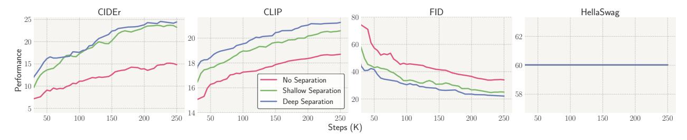
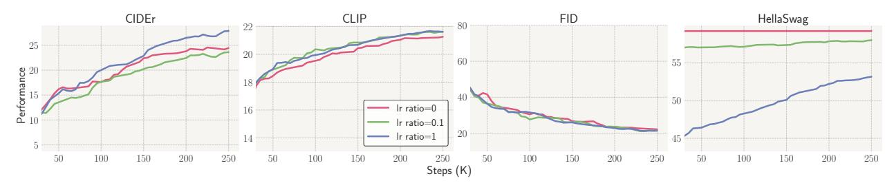

# 5 Analysis

Central to LMFusion is our modality separation techniques, which employs the design of modality-specific modules and decoupled learning rates for language and image modules. Our architectural ablation (§5.1) demonstrates the importance of the design for maintaining model performance across both modalities. Additionally, we showcase LMFusion's ability to generalize to image-to-image generation through image editing tasks, which require simultaneous understanding of both input images and textual prompts (§5.2). We further showcase that this recipe could be used for adapting

### 5.1 Architecture Ablations

#### 5.1.1 Experimental Design

To evaluate different design choices, we conduct ablation studies using small-scale variants of LMFusion. Our analysis focuses on the impact of modality separation by comparing three designs: (1) no separation (a single dense model), (2) shallow separation (using modality-specific FFNs only), and (3) deep separation (using both modality-specific FFNs and attention mechanisms, our final LMFusion).

No separation (dense model) We begin our experiments with the dense Llama-3 8B model trained using the Transfusion recipe. This dense model maintains a unified structure where most components are shared across modalities (a single set of QKV, O and FFN process both texts and images), with the exception of U-Net upsampler and downsampler. For training, we use a text learning rate ( $\eta_{\text{text}}$ ) for the components initialized from the text-only LLM {Projtext, QKV, O, FFN, LM-Headtext}, and an image learning rate  $\eta_{\text{img}}$ 

Figure 5 Performance of no separation (dense model), shallow separation (modality-specific FFNs only), and deep separation (modality-specific FFNs and attention) when text modules are frozen. Deep modality separation outperforms shallow separation and no separation.

Figure 6 Performance of deep modality separation with varying Ir ratios  $\frac{\eta_{\text{text}}}{\eta_{\text{image}}}$ . When the text modules are frozen (lr ratio = 0), deep separation preserves language capabilities and performs strongly on both image understanding and generation, unlike the dense models.

for {UNet-Downimg, UNet-Upimg}. To investigate the impact of learning rate decoupling, we experiment with various learning rate ratios  $\frac{\eta_{\text{text}}}{\eta_{\text{image}}} \in \{0, 0.1, 1\}$ , with a constant image learning rate  $\eta_{\text{image}} = 1 \times 10^{-4}$ , the same as the main experiments. A ratio of 1 represents standard continual pretraining where all components share the same learning rate, while a ratio of 0 indicates a complete freezing of text-related components.

Shallow separation (modality-specific FFNs only) We explore a simplified variant of LMFusion that separates only FFNs into text-specific and image-specific modules—a common approach in mixture-of-experts architectures (Lin et al., 2024b; Muennighoff et al., 2024). In this setup, we use a single shared attention mechanism (QKV , O) for processing both image and text data. For training, we employ separate learning rates:  $\eta_{\text{text}}$  for text-related components { Projtext, QKV, O, FFNtext, LM-Headtext } and  $\eta_{\text{img}}$  for image-related components { Unet-Downimg, FFNimg, Unet-Upimg}. We experiment with various learning rate ratios  $\frac{\eta_{\text{text}}}{\eta_{\text{image}}} \in \{0, 0.1, 1\}$ .

Deep separation (modality-specific FFNs and attention) Our LMFusion, as described in section 3, represents a deep separation design where both FFNs and attention mechanisms are modality-specific. While our primary configuration freezes text modules during training, we also analyze the impact of different learning dynamics by varying the learning rate ratio  $\frac{\eta_{\text{text}}}{\eta_{\text{image}}}$  across  $\{0, 0.1, 1\}$ .

In the ablation study, all models are trained for 250K training steps with a sequence length of 4,096 tokens and a batch size of 250K tokens. The training data comprised 0.03T text-only tokens and 0.03T image-caption tokens. All other hyperparameters remained consistent with those employed in our main experiments.

#### 5.1.2 Results

Naive finetuning of dense pretrained LLMs for multimodal generation compromises their original language capabilities. When directly finetuning Llama-8B (no separation) using the Transfusion recipe, we observe significant performance trade-offs between image and text capabilities (Figure 4). With equal learning rates for text and image components ( $\frac{\eta_{\text{text}}}{\eta_{\text{image}}} = 1$ ), the model shows continuous improvement in image understanding and generation. However, this comes at a substantial cost to language capabilities, with performance on HellaSwag dropping by 15% initially. While language performance improves during training, it never recovers to the original Llama-3 model's level, maintaining a persistent 7% gap.

Add a soda can in the back.

Let there be a painting instead of a sign.

#### Figure 7 Edited images from a finetuned LMFusion model.

To mitigate this issue, we explore setting  $\frac{\eta_{\text{text}}}{\eta_{\text{image}}} < 1$ , which allows us to train image-specific modules (U-Nets) with a regular learning rate while preserving text capabilities using a smaller learning rate for the general Transformer components. Figure 4 shows this improves language-only benchmark performance, reducing the gap from 7% to 2% when the ratio is 0.1. However, for dense models, this improvement comes at the cost of consistently reduced image capabilities. Overall, while learning rate decoupling offers some mitigation to the text performance drop, training dense pretrained LLMs without modality separation remains suboptimal.

Deep Modality Separation Outperforms Shallow Separation. In Figure 5, we compare three architectures: no separation (dense), shallow separation (modality-specific FFNs only), and deep separation (modality-specific FFNs and attention). We set  $\frac{\eta_{\text{text}}}{\eta_{\text{image}}} = 0$  (freezing the text module) across all models to maintain Llama-3's text performance. Both separation approaches significantly outperform the dense model on all image benchmarks. While shallow separation performs slightly worse on image understanding, the performance gap widens notably in image generation tasks.

Additionally, deep separation with  $\frac{\eta_{\text{text}}}{\eta_{\text{image}}} = 0$  has the same amount of *tunable* parameters as no separation with  $\frac{\eta_{\text{text}}}{\eta_{\text{image}}} = 1$ . Despite the intrinsic advantage of modality separation for text-only tasks, for image understanding and generation, we still observe that deep separation (blue curve in Figure 5) are better than no separation (blue curve in Figure 4). These results demonstrate that modality separation is crucial for effectively adapting pretrained language-only LLMs for multimodal generation.

Analyzing learning rate decoupling strategy w.r.t. modality separation. The impact of freezing text modules varies dramatically between architectures. In dense models (Figure 4), freezing text components ( $\frac{\eta_{\text{text}}}{\eta_{\text{image}}} = 0$ ) significantly impairs both image understanding and generation compared to full fine-tuning. However, in the deep modality separation setting shown in Figure 6, freezing the text module not only maintains the original text performance but achieves strong performance on image understanding and generation, unlike the dense models.

### 5.2 Image editing

LMFusion, our unified multimodal generative model, is naturally well-suited for tasks involving interleaved data types, such as image editing. Following Transfusion, we finetune LMFusion on the same dataset of 8K image editing examples, each consisting of an original input image, a prompt detailing the desired edit, and a resulting image that reflects the specified changes. In Figure 7, we apply the finetuned LMFusion to input images and editing prompts from the MagicBrush (Zhang et al., 2024) test set. Qualitative results demonstrate that LMFusion performs effectively in these image-editing scenarios, complementing its strong capabilities in text-only, image understanding, and image generation tasks.

#### 5.3 LLaVAFusion: extending LMFusion to vision-language models

LMFusion continues training the language-only pretrained LLM Llama with the Transfusion recipe. Can this recipe be extended to on vision-language models (VLMs) such as LLaVA (Liu et al., 2024d,c) and Qwen-VL (Bai et al., 2023) as well? In this section, we extend the recipe of LMFusion to VLMs, preserving their multimodal understanding capabilities while introducing image generation abilities. Specifically, we build on LLaVA-NeXT (Liu et al., 2024c), freezing its transformer parameters and integrating a dedicated,

image-specific transformer module trained in parallel. We use the same data and model settings as LMFusion. We refer to this new model as LLaVAFusion and demonstrate its image understanding performance on MMMU [\(Yue et al.,](#page-14-4) [2024\)](#page-14-4), MME-Perception [\(Fu et al.,](#page-11-10) [2024\)](#page-11-10), ChartQA [\(Masry et al.,](#page-12-10) [2022\)](#page-12-10), and RealWorldQA[5](#page-10-0) , as well as its image generation results. For baselines, we compare LLaVAFusion against EMU-3 [\(Wang](#page-13-10) [et al.,](#page-13-10) [2024\)](#page-13-10), Show-O [\(Xie et al.,](#page-14-5) [2024b\)](#page-14-5), Janus [\(Wu et al.,](#page-13-11) [2024a\)](#page-13-11), Chameleon [\(Team,](#page-13-12) [2024a\)](#page-13-12), MetaMorph [\(Tong et al.,](#page-13-13) [2024\)](#page-13-13), and Transfusion [\(Zhou et al.,](#page-14-0) [2024\)](#page-14-0). As shown in [Table 2,](#page-6-4) LLaVAFusion LLaVAFusion demonstrates strong performance in both image understanding and generation when compared to other unified multimodal LMs. This demonstrates that LMFusion is promising as an extension not only to language-only LLMs but also to VLMs, enhancing the multimodal generation capabilities in both cases.

