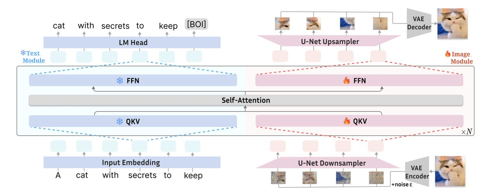
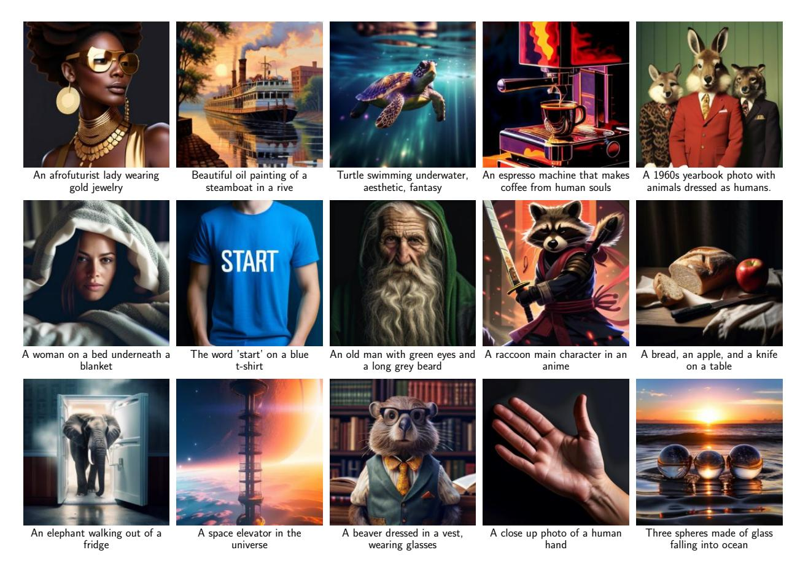

# LMFusion: Adapting Pretrained Language Models for Multimodal Generation

Weijia Shi1,∗ , Xiaochuang Han 1,∗ , Chunting Zhou, Weixin Liang3 , Xi Victoria Lin2 , Luke Zettlemoyer1,2 , Lili Yu2

We present LMFusion, a framework for empowering pretrained text-only large language models (LLMs) with multimodal generative capabilities, enabling them to understand and generate both text and images in arbitrary sequences. LMFusion leverages existing Llama-3's weights for processing texts autoregressively while introducing additional and parallel transformer modules for processing images with diffusion. During training, the data from each modality is routed to its dedicated modules: modality-specific feedforward layers, query-key-value projections, and normalization layers process each modality independently, while the shared self-attention layers allow interactions across text and image features. By freezing the text-specific modules and only training the image-specific modules, LMFusion preserves the language capabilities of text-only LLMs while developing strong visual understanding and generation abilities. Compared to methods that pretrain multimodal generative models from scratch, our experiments demonstrate that, LMFusion improves image understanding by 20% and image generation by 3.6% using only 50% of the FLOPs while maintaining Llama-3's language capabilities. We also demonstrate that this framework can adapt existing vision-language models with multimodal generation ability. Overall, this framework not only leverages existing computational investments in text-only LLMs but also enables the parallel development of language and vision capabilities, presenting a promising direction for efficient multimodal model development.

Correspondence: Weijia Shi [swj0419@uw.edu](mailto:swj0419@uw.edu), Xiaochuang Han [xhan77@uw.edu](mailto:xhan77@uw.edu), Lili Yu [liliyu@meta.com](mailto:liliyu@meta.com) Date: February 6, 2025

Figure 1 Overview of LMFusion. It uses modality-specific FFNs and QKV projections to process text and image data separately: the text "A cat with secrets to keep" goes to the text module , while the image patches of the cat goes to the image module . In the self-attention layer, text and image representations can attend to all previous contexts across the modality boundaries. Both modules are initialized from Llama-3, with the text module frozen to preserve language capabilities while the image module trained on image data. Layer normalization and residual connections are folded into the QKV and FFN modules. A special BOI token separates different modalities in the sequence.

1University of Washington, 2FAIR at Meta, 3Stanford University

∗ Joint first author. Order randomly determined. Work done while at Meta.

Figure 2 Generated images from LMFusion fine-tuned on aesthetically appealing images for improved quality.

