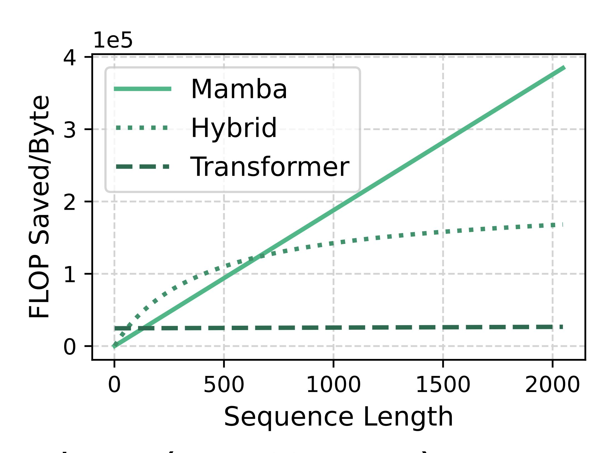

# **Different memory-compute savings tradeoffs**

- Unlike KVs, SSM states have fixed size regardless of sequence length or compute savings
- **FLOP efficiency**: compute savings per unit of memory of reusing a state

Total FLOPs across layers (Attn, SSM, MLP)

FLOP efficiency = Memory consumption of all states (KVs, SSM States)

# **Different memory-compute savings tradeoffs**

• Models with more SSM layers have more FLOP-efficient states

FLOP efficiency = Total FLOPs across layers (Attn, SSM, MLP) Memory consumption of all states (KVs, SSM States)

#### **FLOP-aware eviction policy**

• Existing systems: recency-focused (i.e., evict using LRU)

Utility = recency

#### **FLOP-aware eviction policy**

- Existing systems: recency-focused (i.e., evict using LRU)
- Marconi: also considers the potential compute savings

Utility = recency

#### **FLOP-aware eviction policy**

- Existing systems: recency-focused (i.e., evict using LRU)
- Marconi: also considers the potential compute savings
- Utility score: balances recency and FLOP efficiency

Utility = recency + *α* ⋅ flop\_efficiency

#### **Evaluation**

- NVIDIA Mamba2-Hybrid-7B with {4, 24, 28} {Attention, SSM, MLP} layers
- Workloads: conversational (LMSys, ShareGPT) and agentic (SWEBench)
- Metrics: token hit rate (%), Time To First Token (ms)
- Large sweep of experiments with varying cache size and request arrival patterns

