# **Marconi: Prefix Caching for the Era of Hybrid LLMs**

**Rui Pan**, Zhuang Wang, Zhen Jia, Can Karakus, Luca Zancato, Tri Dao, Yida Wang, Ravi Netravali

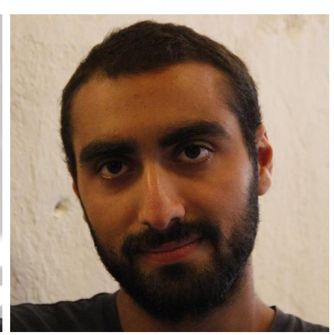

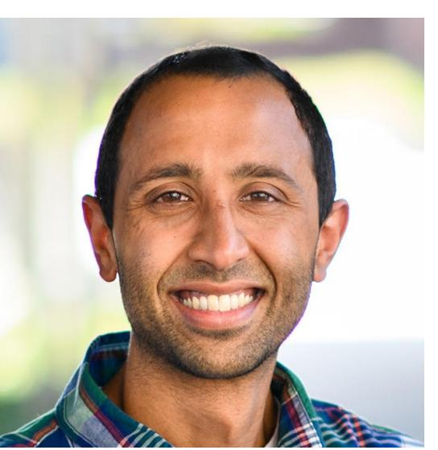

MLSys 2025, Santa Clara, CA

**Outstanding Paper Honorable Mention!**

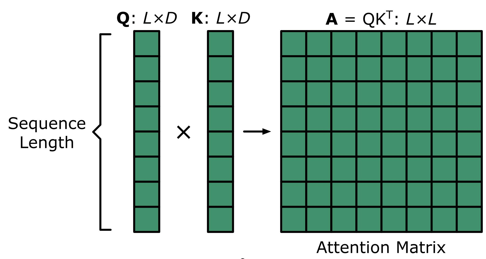

• Quadratic compute complexity

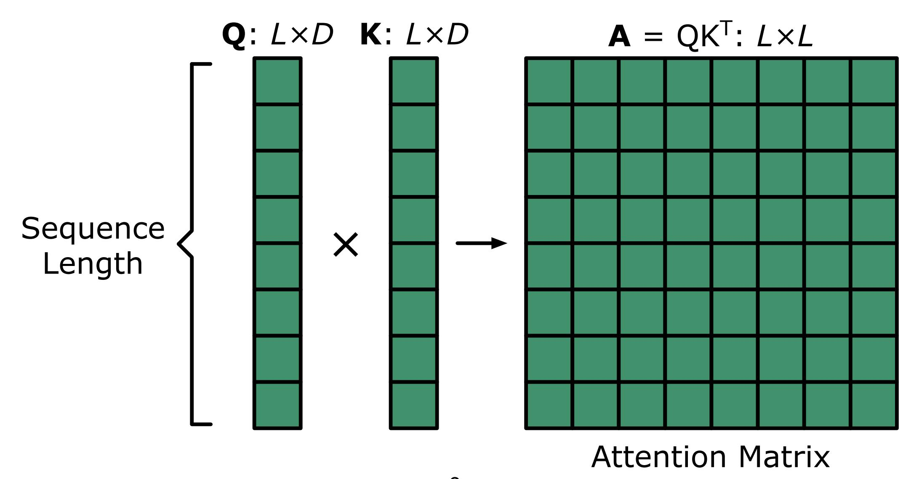

- Quadratic compute complexity
- Huge KV cache sizes (linear to sequence length)

|                             | Attention |
|-----------------------------|-----------|
| Computational Complexity | O(L2)     |
| Inference-Time Memory    | O(L)      |

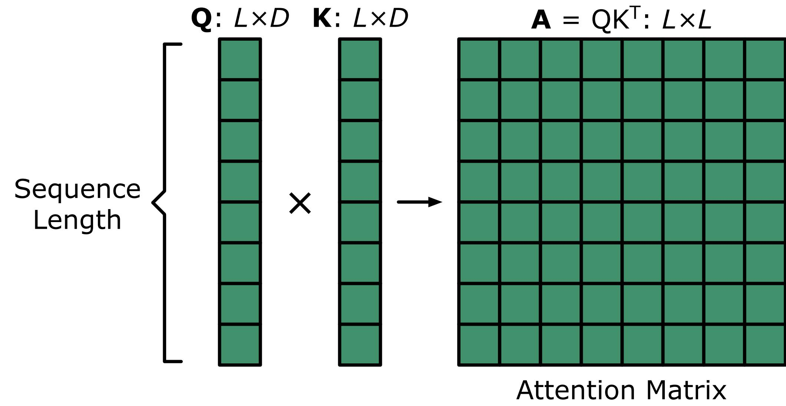

- Compress prior context into a state
- Update states recurrently in-place

|                             | Attention          |
|-----------------------------|--------------------|
| Computational Complexity | O(L 2 ) |
| Inference-Time Memory    | O(L)               |

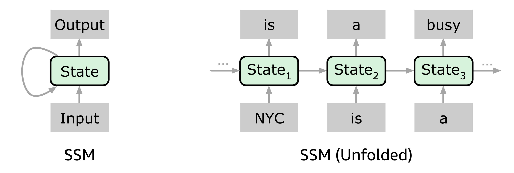

- Compress prior context into a state
- Update states recurrently in-place

|                          | Attention          | SSM  |
|--------------------------|--------------------|------|
| Computational Complexity | O(L 2 ) | O(L) |
| Inference-Time Memory | O(L)               | O(1) |

|                             | Attention | SSM  |
|-----------------------------|-----------|------|
| Computational Complexity | O(L2)     | O(L) |
| Inference-Time Memory    | O(L)      | O(1) |

- Memory consumption:
  - Fixed-sized regardless of num tokens

|                             | Attention | SSM  |
|-----------------------------|-----------|------|
| Computational Complexity | O(L2)     | O(L) |
| Inference-Time Memory    | O(L)      | O(1) |

- Memory consumption:
  - Fixed-sized regardless of num tokens
  - Generally smaller than **whole sequences**' KVs

|                             | Attention | SSM  |
|-----------------------------|-----------|------|
| Computational Complexity | O(L2)     | O(L) |
| Inference-Time Memory    | O(L)      | O(1) |

- Memory consumption:
  - Fixed-sized regardless of num tokens
  - Generally smaller than **whole sequences**' KVs
  - Orders of magnitude larger than a **single token**'s KVs

|                             | Attention | SSM  |
|-----------------------------|-----------|------|
| Computational Complexity | O(L2)     | O(L) |
| Inference-Time Memory    | O(L)      | O(1) |

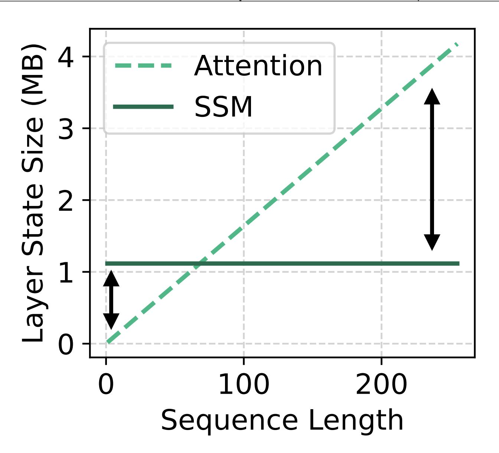

- A few Attention layers + many SSM layers
- Balances efficiency and language modeling capability Attention SSM

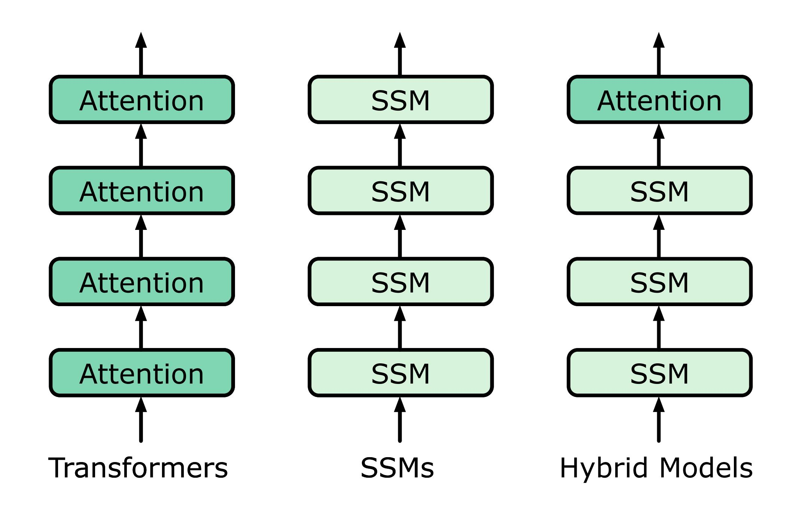

- A few Attention layers + many SSM layers
- Balances efficiency and language modeling capability Attention SSM

#### **Execution Runtimes**

"Models == Transformers"

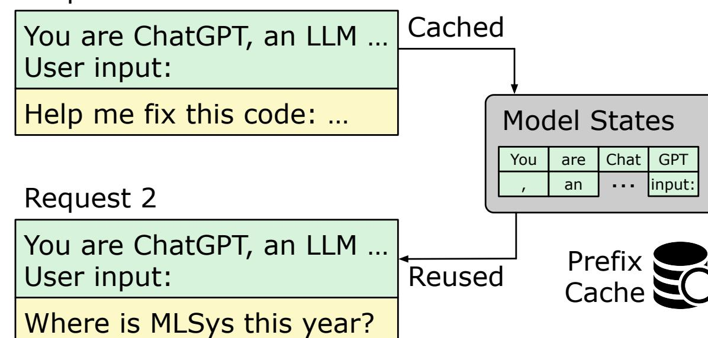

#### Background: prefix caching

- Reuses model states (KVs, SSM states) of common prefixes across requests
- Reduces Time To First Token (TTFT)

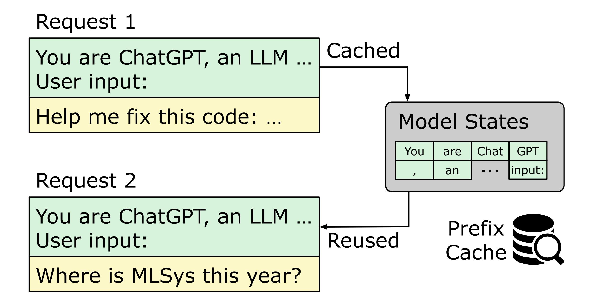

• Prefix caching is challenging for SSMs: states can't be rolled back to represent a prefix

• Prefix caching is challenging for SSMs: states can't be rolled back to represent a prefix

KV Cache

• Prefix caching is challenging for SSMs: states can't be rolled back to represent a prefix

KV Cache

NYC is a busy city

• Prefix caching is challenging for SSMs: states can't be rolled back to represent a prefix

KV Cache

NYC is a

 Prefix caching is challenging for SSMs: states can't be rolled back to represent a prefix
SSM States

 Prefix caching is challenging for SSMs: states can't be rolled back to represent a prefix

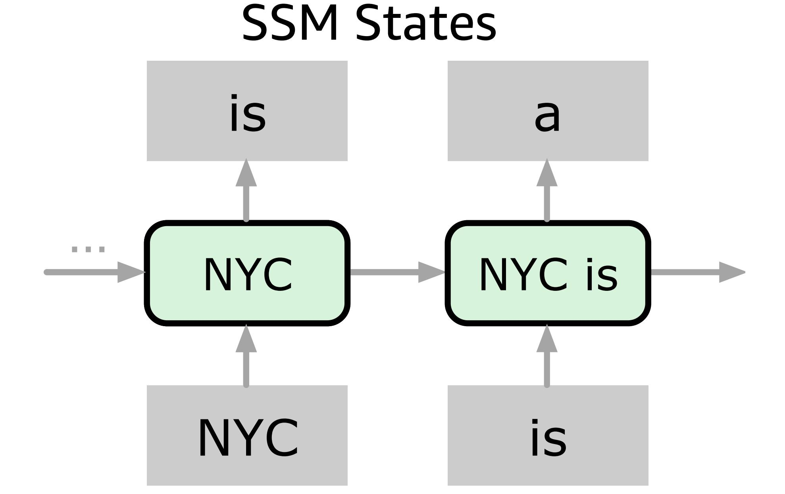

 Prefix caching is challenging for SSMs: states can't be rolled back to represent a prefix
SSM States

 Prefix caching is challenging for SSMs: states can't be rolled back to represent a prefix
SSM States

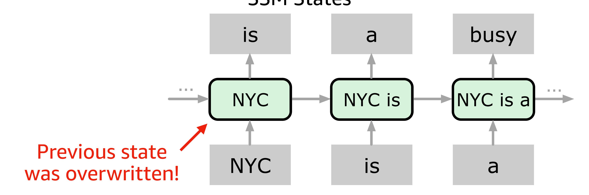

SSM's modeling win complicates their systems win!

• Naive solution: checkpoint an SSM state every x tokens

- Naive solution: checkpoint an SSM state every x tokens
- Catch 1: cache entries are sparsely-hit

- Naive solution: checkpoint an SSM state every x tokens
- Catch 1: cache entries are sparsely-hit
- Catch 2: cache entries are huge

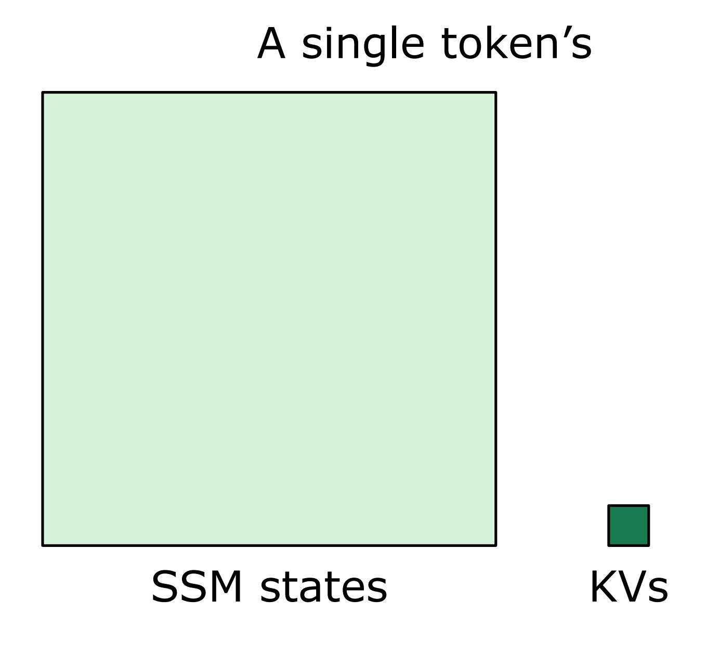

- Naive solution: checkpoint an SSM state every x tokens
- Catch 1: cache entries are sparsely-hit
- Catch 2: cache entries are huge
- Frequent cache thrashing & low hit rate

