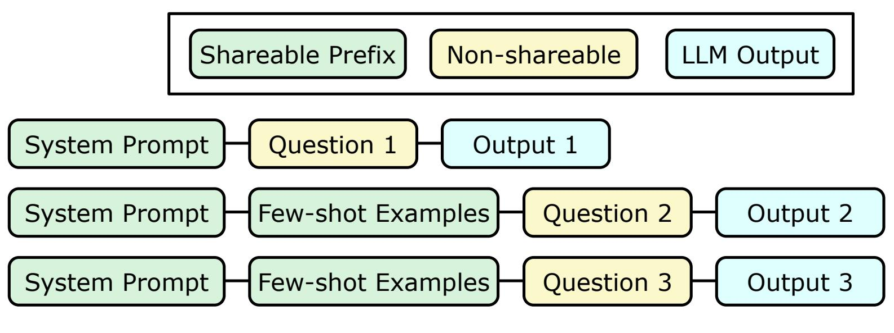
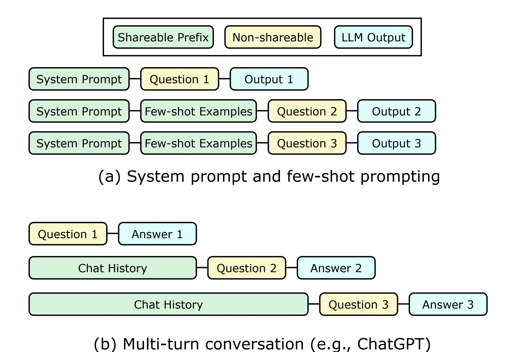
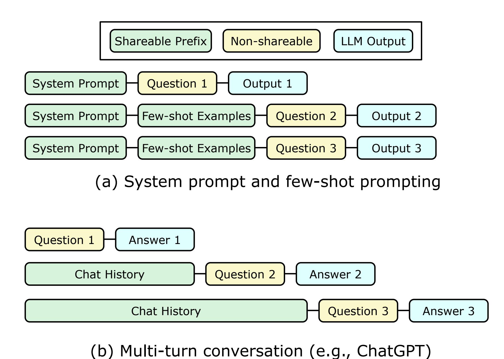
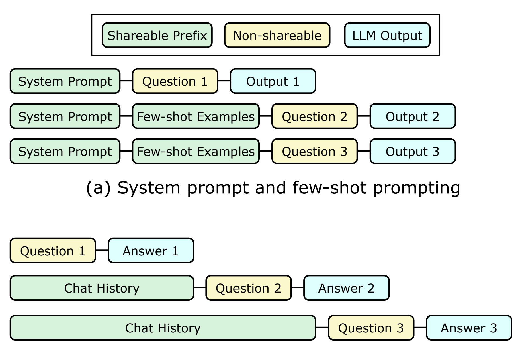
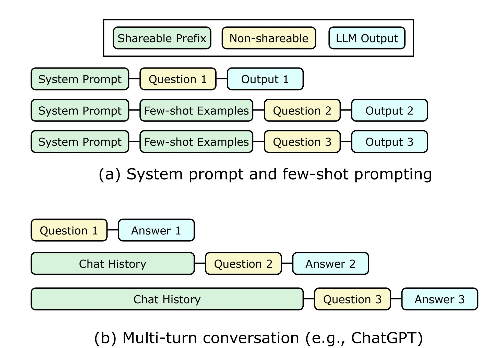
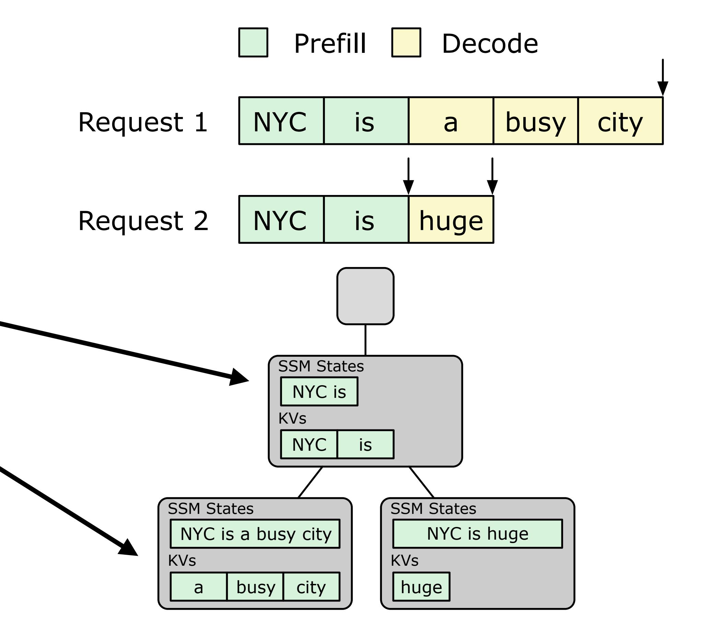

# **Taxonomy of prefix reusing patterns**

- Composition of all reused prefixes:
  - 1. **Purely input**: part of the input sequence from a prior request
    - E.g., system prompts, few-shot examples

(a) System prompt and few-shot prompting

# **Taxonomy of prefix reusing patterns**

- Composition of all reused prefixes:
  - 1. **Purely input**: part of the input sequence from a prior request
    - E.g., system prompts, few-shot examples
  - 2. **Input and output**: input+output sequence of a prior request
    - E.g., conversation history for chatbots, past environment interactions for agents

#### **Different mechanisms for different cases**

#### **Different mechanisms for different cases**

#### **• Purely input**

- Prefix shared by many requests
- Can be observed by bookkeeping and comparing previous requests

(b) Multi-turn conversation (e.g., ChatGPT)

#### **Different mechanisms for different cases**

#### **• Purely input**

- Prefix shared by many requests
- Can be observed by bookkeeping and comparing previous requests

#### **• Input and output**

• Conversations usually append to the last decoded token

- Use a radix tree to represent past requests
- Nodes naturally represent high reuse likelihood:

- Use a radix tree to represent past requests
- Nodes naturally represent high reuse likelihood:

- Use a radix tree to represent past requests
- Nodes naturally represent high reuse likelihood:
  - Intermediates: purely-input prefixes

- Use a radix tree to represent past requests
- Nodes naturally represent high reuse likelihood:
  - Intermediates: purely-input prefixes
  - Leaves: input-and-output prefixes

#### Aside from recency:

