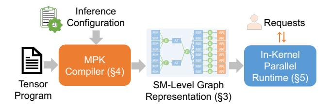

# 1 Introduction

Enabling high-performance inference of ML models on GPUs is critical for modern AI applications, as inference latency directly affects usability and cost. Today's ML systems generally express model computation as a tensor program represented as a directed acyclic graph (DAG), whose nodes denote tensor algebra operators (e.g., matrix multiplication) and edges represent tensors, i.e., *n*-dimensional arrays consumed and produced by these operators.

Most existing systems execute each operator using a dedicated GPU kernel, which may be hand-optimized by domain experts [\[17,](#page-13-0) [35\]](#page-14-0) or generated automatically by ML compilers [\[15,](#page-13-1) [29,](#page-13-2) [33\]](#page-14-1). However, this *kernel-per-operator* execution

model limits several key cross-operator GPU optimizations.

First, modern GPUs implicitly insert a *kernel barrier* between consecutive launches on the same stream to ensure that all threads from the previous kernel complete before any thread from the next kernel begins. While this mechanism enforces data dependencies, it prevents *cross-operator software pipelining*, forcing dependent operators to execute strictly sequentially. NVIDIA recently introduced *programmatic dependent launch* (PDL) [\[11\]](#page-12-0), which allows partial overlap between kernels on the same stream. However, adopting PDL requires significant engineering effort, as it fundamentally alters kernel structure and control flow.

Second, the kernel-per-operator approach prevents finegrained compute-communication overlap. Because dependencies are captured only at the coarse operator granularity, the runtime must enforce full-operator completion before launching dependent communication or computation. For example, when a matrix multiplication is followed by an all-reduce in separate kernels, the all-reduce must wait for the entire multiplication to complete, even though each piece of all-reduce depends only on a subset of the multiplication. Exploiting such opportunities requires representing and enforcing data dependencies at a granularity finer than individual kernels.

Finally, the kernel-per-operator approach requires launching hundreds to thousands of kernels for each inference iteration. To mitigate launch overhead, current systems rely heavily on *CUDA Graphs*, which capture a sequence of GPU operations and launch them with minimal overhead. However, CUDA Graphs are largely static: any changes to control flow, tensor shapes, or data dependencies require re-instantiation or modification of the captured graph, limiting flexibility for dynamic workloads commonly seen in model inference.

A promising approach to overcoming these limitations is to fuse all computation and communication into a single *megakernel* (also known as a *persistent kernel*). In this design, the system launches one GPU kernel to execute the entire model, from layer computations to inter-GPU communication, without interruption.

Mega-kernels address the limitations of the kernel-per-

∗Equal contribution.

Figure 1: An overview of MPK.

operator approach in several ways. First, they eliminate kernel launch overhead by avoiding repeated invocations. Second, by fusing all operator computations into a single kernel, they enable cross-operator software pipelining, allowing data for the next operator to be prefetched while computations for the current operator are still in progress. Third, they support fine-grained overlap of computation and inter-GPU communication, enabling simultaneous execution that more effectively hides communication latency.

Despite these benefits, automatically transforming an ML model into a high-performance mega-kernel remains challenging. Existing ML systems—such as PyTorch [\[25\]](#page-13-3), Triton [\[29\]](#page-13-2), and TVM [\[15\]](#page-13-1)—do not support end-to-end mega-kernel generation. Moreover, these systems rely on a fragmented ecosystem of specialized libraries: NCCL [\[4\]](#page-12-1) or NVSHMEM [\[10\]](#page-12-2) for communication, FlashInfer [\[35\]](#page-14-0) or FlashAttention [\[17\]](#page-13-0) for attention, and CUDA or Triton for custom computation. This fragmentation makes it difficult to unify the entire inference pipeline into a single kernel.

We present *Mirage Persistent Kernel* (MPK), the first compiler and runtime system that automatically transforms multi-GPU model inference into a high-performance mega-kernel. MPK enables end-to-end kernel fusion with minimal developer effort—users can mega-kernelize a PyTorch model with only a few lines of code, achieving significant performance improvement compared to running the model in vanilla PyTorch with CUDA Graphs and torch.compile. MPK combines the performance benefits of mega-kernels with the usability of existing ML frameworks.

A key idea in MPK is to represent computation and inter-GPU communication at the granularity of individual streaming multiprocessors (SMs) instead of an entire GPU. MPK introduces an *SM-level graph representation*, called *t*Graph, whose nodes denote *tasks* running on individual SMs and whose edges encode fine-grained dependencies between tasks. This representation exposes additional parallelism and enables optimizations such as cross-operator software pipelining and fine-grained kernel overlap, all of which are infeasible in the existing kernel-per-operator approach. MPK realizes this idea using two key components shown in Figure [1.](#page-1-0)

The MPK compiler. The MPK compiler takes a tensor program and an inference configuration as input and automatically transforms the computation graph of the tensor program into a highly optimized SM-level *t*Graph tailored to the given inference configuration and GPU architecture. The compiler introduces a diversity of optimizations, including event fusion, graph normalization, and graph linearization, to reduce synchronization overhead and maximize the performance of generated *t*Graphs. In addition, MPK also automatically generates high-performance CUDA implementations for each task using existing superoptimization techniques [\[33\]](#page-14-1), ensuring efficient SM-level execution.

In-kernel parallel runtime. MPK executes the SM-level *t*Graph using an in-kernel parallel runtime embedded entirely within a mega-kernel, allowing for fine-grained control over task execution and scheduling *without* any kernel launches during model execution. To achieve this goal, the runtime partitions a GPU's SMs into *workers*, which maintains a dedicated task queue and executes all assigned tasks in a first-infirst-out order, and *schedulers*, which maintain dependency across tasks and assign tasks when their prerequisites are satisfied. The MPK runtime uses an *event-driven, fully asynchronous* execution model to ensure that GPUs are maximally utilized. Finally, the MPK runtime uses a *hybrid task-launch strategy* that combines just-in-time and ahead-of-time dispatch to minimize runtime overhead while preserving dynamic load balance across SMs.

Evaluation results. We implement MPK as a PyTorch kernel backend: a PyTorch program can be compiled into a MPK mega-kernel with only a few lines of code changes. We evaluate MPK on five widely used models across three generations of NVIDIA GPUs: A100, H100, and B200. Even for workloads that are widely deployed and heavily optimized by existing kernel-per-operator systems, such as SGLang and vLLM for LLM serving, MPK still outperforms current systems by 1.0-1.7× on both single- and multi-GPU deployments, pushing LLM inference performance close to hardware limits.

