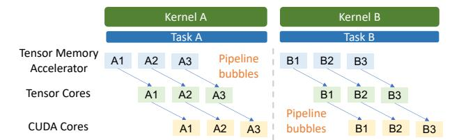
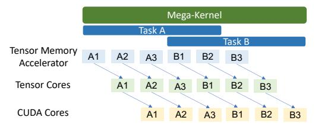

# 2.1 GPU Programming Model

On GPUs, computations are organized as *kernels*, each representing a function executed concurrently across many cores in a single-program, multiple-data (SPMD) fashion. A kernel consists of a grid of *thread blocks*, where each block is assigned to a streaming multiprocessor (SM) and contains multiple *threads* that operate on individual data elements.

(a) Kernel barriers prevent cross-task pipelining.

(b) MPK enables both intra- and cross-task pipelining.

Figure 2: Comparing how MPK and existing approaches support intra- and cross-task pipelining.

Each thread has a private register file, while threads within the same block cooperate through low-latency *shared memory* for data exchange and collective operations. All kernel inputs and outputs are stored in GPU *device memory*.

The CUDA programming model does not support direct synchronization across thread blocks within a kernel, as modern GPU architectures lack hardware mechanisms for such coordination. As a result, cross-operator dependencies (e.g., a matrix multiplication that must complete before another begins) are enforced through *kernel barriers*, which are automatically inserted by the GPU runtime between consecutive kernels launched on the same stream.

While kernel barriers simplify dependency management, they also prevent key GPU optimizations such as cross-kernel software pipelining and fine-grained kernel overlap.

Software pipelining. GPU architectures are increasingly *heterogeneous*, integrating specialized accelerators such as tensor cores and tensor memory accelerators (TMAs). Since TMA load and store instructions execute asynchronously, data movement can proceed while tensor cores and CUDA cores perform computation. Fully exploiting these accelerators requires *software pipelining*—a technique that interleaves independent stages of computation and data movement across multiple iterations of tasks to maximize hardware utilization.

Existing systems implement *intra-task* pipelining, as shown in Figure [2a,](#page-2-1) where a single task is decomposed into multiple iterations. In this model, TMAs, tensor cores, and CUDA cores can simultaneously perform data transfer, matrix computation, and auxiliary operations for different iterations in a pipeline. However, kernel barriers restrict pipelining to within a single task, preventing inter-task pipelining and introducing pipeline bubbles that leave hardware resources underutilized.

(a) Kernel barriers prevent overlapping MatMul and AllGather.

(b) MPK enables fine-grained overlap of MatMul and AllGather.

Figure 3: Comparing how MPK and existing approaches support fine-grained kernel overlap between tasks. Data dependencies (black arrows in Figure [3b\)](#page-2-2) ensure correctness.

Fine-grained kernel overlap. Kernel barriers also preclude opportunities to overlap kernels that utilize different hardware resources (e.g., compute and communication), as they enforce dependencies at the granularity of entire kernels rather than individual data units. Figure [3a](#page-2-3) illustrates a common pattern in large language models (LLMs), where a MatMul operator is followed by an AllGather operator. Existing systems generally launch these as two separate kernels, requiring all thread blocks of the AllGather kernel to wait until all thread blocks of the preceding MatMul kernel complete.

In practice, the data dependency between AllGather and MatMul is much finer-grained: since AllGather performs element-wise operation, each of its thread blocks only depends on the output of a single MatMul thread block. This dependency structure enables *fine-grained kernel overlap*, where different SMs can execute MatMul and AllGather in parallel, as long as fine-grained data dependencies are preserved. Such overlap allows the system to simultaneously utilize both compute and communication bandwidth on modern GPUs, as identified in prior work [\[41\]](#page-14-2). Achieving this overlap, however, requires proper synchronization between SMs at sub-kernel granularity, as shown in Figure [3b,](#page-2-2) which is not supported by conventional kernel barriers.

