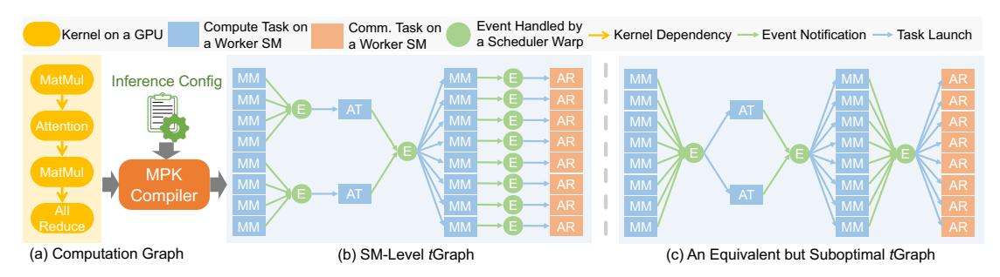
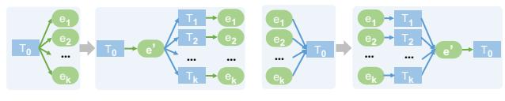

# <span id="page-2-0"></span>2.2 Kernel Fusion

Kernel fusion eliminates kernel barriers by combining multiple GPU kernels that execute sequentially on the same data into a single, semantically equivalent kernel. Kernel fusion improves performance by avoiding instantiating intermediate results, reducing device memory access, and eliminating kernel launch overheads.

Kernel fusion has been widely adopted in tensor program compilers. Frameworks such as PyTorch, JAX, and TVM employ rule-based heuristics to fuse adjacent kernels [\[14,](#page-13-4) [15,](#page-13-1) [25\]](#page-13-3), while systems such as Mirage and TASO automatically discover fusion rules through compiler super-

<span id="page-3-1"></span><span id="page-3-0"></span>

Figure 4: The MPK compiler transforms a kernel-level computation graph into an optimized SM-level *t*Graph. MM, AT, and AR denote MatMul, Attention, and AllReduce tasks, respectively.

optimization [22,33]. However, existing compilers can only fuse small groups of local operators, as generating a single kernel that faithfully implements complex tensor programs is computationally difficult and often infeasible.

The *mega-kernel* paradigm pushes kernel fusion to the extreme by fusing all computation and communication of a tensor program into one persistent kernel, using device-memory synchronization primitives to coordinate execution across SMs. Despite its performance benefits, current ML compilers such as PyTorch, Triton, JAX, and TVM do not support mega-kernel compilation. Existing mega-kernels are handcrafted by GPU experts for specific models. For example, FlashDMoE fuses mixture-of-experts computation and inter-GPU communication into a single kernel [13], while Spector et al. manually designed and implemented a low-latency mega-kernel for LLAMA-1B [9,30].

These manual approaches require substantial engineering effort and deep GPU expertise to mega-kernelize a tensor program. In contrast, MPK adopts a compiler-based approach that automatically transforms a tensor program into an optimized mega-kernel, eliminating the need for manual effort.

### 3 SM-Level Graph Representation

This section introduces *tGraph*, a representation that expresses the computation of a tensor program at the granularity of individual streaming multiprocessors (SMs). This fine-grained representation exposes additional parallelism and enables optimizations such as cross-operator software pipelining and fine-grained kernel overlap, both of which cannot be supported in existing kernel-per-operator execution model.

Figure 4 illustrates an example *t*Graph, where each node represents either a *task* or an *event*. Each task—shown as a blue (or orange) rectangle—denotes a unit of computation or communication executed on a single SM. Each event—shown as a green circle—represents synchronization across tasks. Tasks and events alternate in the graph: every task only has outgoing edges to *triggering events* and incoming edges from *dependent events*. A task is ready for execution when its dependent events are all *activated* and notifies its triggering event upon completion. An event is activated once it has

received notifications from all tasks associated with it.

This structure captures dependencies at a much finer granularity than traditional computation graphs. For example, multi-GPU LLM serving often involves a MatMul operator followed by an AllReduce operator (Figure 4a). Existing systems generally execute these operators sequentially due to coarse-grained kernel barriers that synchronize entire kernels. In contrast, SM-level task graphs can represent precise task-level dependencies: since AllReduce performs element-wise communication, each of its tasks depends only on one corresponding MatMul task. By inserting fine-grained events between dependent task pairs, MPK can overlap compute-intensive MatMul tasks with communication-intensive AllReduce tasks, maximizing overall GPU utilization.

Multiple *t*Graphs may represent the same computation graph. Figure 4c shows an alternative but suboptimal *t*Graph where events capture only operator-level dependencies, analogous to traditional kernel barriers. § 4 describes how MPK generates high-performance task graphs by inferring *precise* data dependencies to maximize concurrency and minimize synchronization overheads.

Comparison with CUDA Graphs. *t*Graphs can be viewed as a lower-level extension of CUDA Graphs, sharing several structural similarities. Like CUDA Graphs, *t*Graphs are statically instantiated and encode explicit dependencies among operations. However, while CUDA Graphs capture dependencies only at the kernel level, *t*Graphs operate at the granularity of individual SM tasks and sub-kernel events. CUDA Graphs primarily describe kernel launch order and rely on stream semantics for synchronization, which confines overlap and fusion to kernel boundaries. In contrast, *t*Graphs explicitly model both intra- and cross-operator dependencies, enabling fine-grained synchronization across SMs and overlapping of computation and communication within a single kernel. This design allows MPK to exploit parallelism that is inaccessible to CUDA Graphs or kernel-level execution models.

### <span id="page-4-0"></span>4 The MPK Compiler

This section presents the MPK compiler, which takes a computation graph and an associated inference configuration as input and generates an optimized *t*Graph specialized for both the target configuration and underlying GPU architecture. Figure 5 outlines the end-to-end compilation workflow.

### 4.1 *t*Graph Generation

**Operator decomposition.** The MPK compiler decomposes each operator of the input computation graph into a set of tasks by *partitioning* the operator's output tensors such that all tasks compute *disjoint* subsets of the output and can therefore execute in parallel across SMs. Most tensor algebra operators can be partitioned across multiple output dimensions; for example, the output tensor of a matrix multiplication can be tiled along both the row and column dimensions to expose parallelization opportunities.

The performance of a partitioning strategy depends on both the problem shape and the target GPU architecture. To discover an effective strategy, MPK selects a partitioning strategy that minimizes data loading from device memory to shared memory, since accessing device memory is significantly more expensive than accessing shared memory or performing computation on CUDA cores or tensor cores. By default, MPK generates a number of tasks proportional to the number of SMs to promote load balance across SMs during execution. MPK also provides an interface for users to easily specify custom partitioning strategy by setting the desired parallelization degree along each output dimension.

**Dependency analysis.** MPK uses *events* to capture dependencies between tasks. For any two operators that share a tensor, MPK enumerates all pairs of tasks from the two operators and introduces an event e for a task pair  $(t_1,t_2)$  if and only if the output region produced by task  $t_1$  overlaps with the input region consumed by task  $t_2$ . The event serves as a synchronization point indicating that  $t_2$  cannot begin execution until  $t_1$  has completed producing the required data. Accordingly, MPK inserts two edges  $(t_1,e)$  and  $(e,t_2)$  into the resulting tGraph. This fine-grained dependency analysis preserves all producer-consumer dependencies while exposing maximal parallelism across independent tasks.

**Event fusion.** MPK applies two complementary forms of event fusion—successor-set and predecessor-set fusion—to eliminate redundant synchronization points and simplify the constructed tGraph. For an event e, we define two functions: InTasks(e), the set of tasks that trigger e, and OutTasks(e), the set of tasks that depend on e. These functions allow us to characterize when multiple events exhibit identical dependency structure and can therefore be fused.

First, *successor-set fusion* merges events that serve as prerequisites for the same set of consumer tasks. Because these tasks cannot begin execution until all such events are activated, representing them separately provides no additional scheduling flexibility.

**Definition 4.1** (Successor-set fusion). For any two events  $e_1$  and  $e_2$  of a tGraph, successor-set fusion applies if and only if  $OutTasks(e_1) = OutTasks(e_2)$ . MPK removes events  $e_1$  and  $e_2$  from  $\mathcal{T}$  and introduces a fused event e' with  $InTasks(e') = InTasks(e_1) \cup InTasks(e_2)$  and  $OutTasks(e') = OutTasks(e_1)$ .

As an example, successor-set event fusion fuses events  $e_10$  and  $e_{14}$  in Figure 5(b) into a new event (i.e.,  $e_4$  in Figure 5(c)) since they are both prerequisites for task  $O_1$ .

Second, *predecessor-set fusion* merges events that depend on an identical set of producer tasks. Because such events are triggered simultaneously, maintaining them as separate synchronization nodes introduces unnecessary graph complexity.

**Definition 4.2** (Predecessor-set fusion). For any two events  $e_1$  and  $e_2$  in a tGraph  $\mathcal{T}$ , predecessor-set fusion applies if and only if  $InTasks(e_1) = InTasks(e_2)$ . MPK removes events  $e_1$  and  $e_2$  from  $\mathcal{T}$  and introduces a fused event e' with  $InTasks(e') = InTasks(e_1)$  and  $OutTasks(e') = OutTasks(e_1) \cup OutTasks(e_2)$ .

As an example, predecessor-set fusion fuses events  $e_4$ ,  $e_5$ ,  $e_6$ , and  $e_7$  in Figure 5(c) into a single new event ( $e_4$  in the new tGraph) as all these events depend on tasks  $A_1$  and  $A_2$ .

A core challenge MPK must address is representing dependencies between tasks and events. Because MPK executes tasks and updates events in parallel across SMs, the runtime requires a *uniform* and *cheap* representation that avoids costly indirect indexing. Two challenges arise. First, a task may depend on and trigger an arbitrary number of events. A straightforward approach to representing tasks is reserving space for the maximum number of dependent and triggering events per task. However, this approach leads to significant memory overhead. Second, after event fusion, an event may trigger an arbitrary number of tasks. Representing these outgoing edges by allocating space for the maximum fan-out per event is also expensive. MPK introduces two techniques to address these challenges: *t*Graph normalization and linearization.

tGraph normalization. MPK addresses the first challenge through tGraph normalization, which transforms an input tGraph into functionally a equivalent form where each task has at most *one* dependent event and *one* triggering event. tGraph normalization is achieved by performing two types of transformations to reduce the maximum fan-in and fan-out of each task to at most one. First, when a task  $T_0$  triggers multiple events  $e_1, ..., e_k$  in an input tGraph, MPK transforms the tGraph by introducing a new event e' and k empty new tasks  $T_1, ..., T_k$ , each performing no computation and depending on

<span id="page-5-0"></span>

Figure 5: The MPK compiler workflow. In (b), Q, K, V, A, O, and R denote the set of tasks produced by decomposing the query projection, key projection, value projection, attention, output projection, and RMSNorm operators, respectively.  $D_1$  and  $D_2$  in (e) are dummy tasks inserted during tGraph normalization to guarantee that each task has exactly one triggering event. Finally, (f) shows how MPK linearizes the tGraph and stores the resulting structure in GPU memory, where both tasks and events follow a uniform, canonical representation.

<span id="page-5-1"></span>

(a) A transformation reducing fan-out of a task to one.

<span id="page-5-2"></span>(b) A transformation reducing fan-in of a task to one.

Figure 6: MPK performs graph transformations to normalize an arbitrary *t*Graph, ensuring that every task has at most one dependent event and one triggering event.

e'. After this transformation, task  $t_0$  triggers only e', and each newly introduced task  $T_i$  triggers exactly one of the original event  $e_i$ , as shown in Figure 6a. This transformation ensures that every task has exactly one *triggering* event. Figure 5(e) shows how MPK applies this transformation to reduce the number of triggering events for  $A_1$  and  $A_2$  to one.

Second, when a task  $T_0$  depends on multiple events  $e_1, ..., e_k$  in an input tGraph, MPK transforms the tGraph by introducing a new event e' and k empty new tasks  $T_1, ..., T_k$ , each performing no computation and triggering e'. After this transformation, task  $T_0$  and each newly introduced task  $T_i$  depends on exactly one event, as shown in Figure 6b.

*t*Graph normalization introduces an overhead of adding additional tasks and events to normalize a *t*Graph when it has tasks with multiple fan-in and fan-out events. This generally only happens when the original computation graph has oper-

ators that can execute in parallel. For example, tasks  $A_1$  and  $A_2$  in Figure 5(d) have two fan-out events because RMSNorm and output projection operators in the original computation graph both depend on attention and can run in parallel. In practice, we observe negligible normalization overhead (i.e., always less than 1% in our evaluation) as real-world models are "deep" (many sequential operators) instead of "wide" (many parallelizable operators).

<span id="page-5-5"></span>**Algorithm 1** MPK's tGraph linearization algorithm. It is guaranteed that each task is enqueued into T once and that each event is enqueued into E once. Lines 5-7 ensure that all tasks depending on an event are consecutive in T.

```
Input: A normalized tGraph G
Output: A list of tasks T such that for each event e \in G, the set of tasks e
    launches are consecutive in T.
2: E \leftarrow \{e \in G | e.\text{counts} = 0\} \triangleright \text{Enqueue all events with no dependent tasks}
3: while E is not empty do
     e \leftarrow E.\text{dequeue}()
5:
     for all task t \in \mathcal{G} do
6:
       if t.dependent_event = e then
7:
         T.enqueue(t)
8:
         e' \leftarrow t.\text{trigger\_event}
9:
         if all tasks triggering e' are in T then
10:
          E.enqueue(e')
11:
12: return T
```

<span id="page-6-2"></span>*t*Graph linearization. *t*Graph normalization alone cannot address the second challenge: after fusion, an event may still need to trigger a large number of tasks (e.g., event *e*<sup>5</sup> in Figure [5\(](#page-5-0)e) triggers four tasks), requiring additional storage to record their indices. MPK resolves this issue using a *breadthfirst search* (BFS)-based algorithm (see Algorithm [1\)](#page-5-5) to linearize a *t*Graph. The linearization ensures that all tasks triggered by the same event are assigned contiguous indices in the final task ordering. As a result, the fan-out of an event can be encoded compactly using only the first and last task indices, eliminating the need to store an explicit list of dependent tasks while preserving all dependency semantics.

Figure [5\(](#page-5-0)f) illustrates how MPK stores the linearized *t*Graph in GPU device memory. For each task, MPK records only the indices of its dependent and triggering events. For each event, MPK stores the number of triggers required for the event to be activated; once activated, the runtime launches all tasks whose indices fall within the event's first and last task indices.

