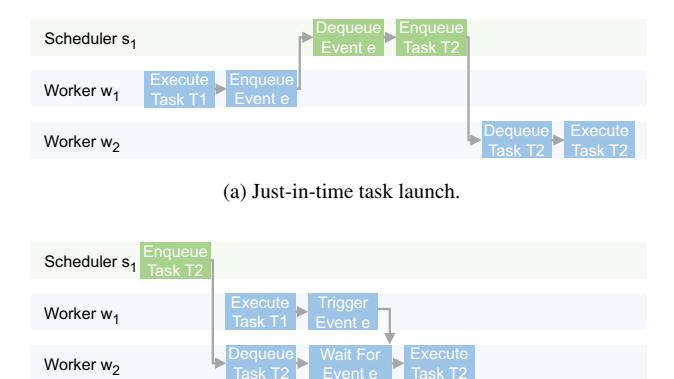

# 5.1 Event-Driven Execution

MPK executes a *t*Graph using an *event-driven* model. Each *t*Graph begins with a designated *start* event (e.g., *e*0 in Figure [7\)](#page-6-1) that has no prerequisites. This event is initially enqueued into a scheduler's event queue. Upon dequeuing the event, the scheduler (e.g., *s*1) launches all tasks that depend on it (e.g., *AT*1,...,*AT*4). Each launched task is dispatched to a worker, which executes the task and, upon completion, notifies the triggering event associated with that task.

An event becomes *activated* once all of its prerequisites have completed and thus have collectively triggered the event

(b) Ahead-of-time task launch.

Figure 8: Comparing JIT and AOT task launches.

the required number of times. When an event is activated, it is enqueued into a scheduler's event queue, allowing the runtime to continue propagating execution through the *t*Graph. In this way, events serve as the mechanism for driving task execution, enabling fine-grained, asynchronous execution.

