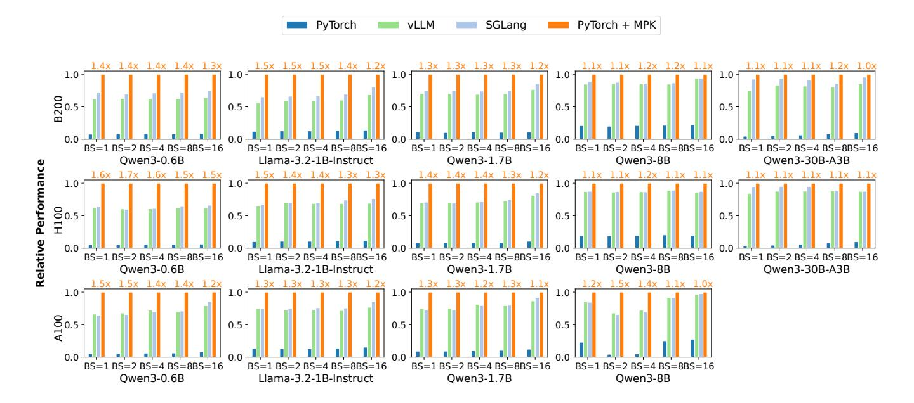
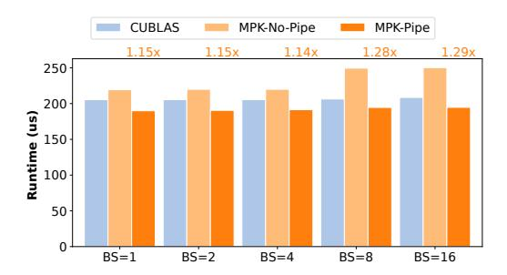

# 6.1 Implementation Details

We implement MPK as a kernel backend for PyTorch. A Py-Torch program can be compiled into a MPK mega-kernel via PyTorch's compilation interface by specifying MPK as the backend, i.e., torch.compile(backend=MPK). This call invokes the MPK compiler, which generates a mega-kernel and returns it as a callable PyTorch function. Executing this function issues a single launch of the generated mega-kernel. The current MPK implementation consists of approximately 40K lines of C++, 84K lines of CUDA, and 10K lines of Python. The in-kernel parallel runtime is written in CUDA and uses semaphores in device memory to coordinate workers and schedulers. The MPK compiler, implemented in C++ and Python, automatically transforms an input tensor program into an optimized *t*Graph tailored to specific GPU types. For compute tasks, the compiler integrates the Mirage superoptimizer [\[33\]](#page-14-1) to automatically generate optimized CUDA implementations and uses NVSHMEM [\[10\]](#page-12-2) to support in-kernel inter-GPU communication.

Our implementation also includes several key optimizations to minimize runtime overhead and efficiently support dynamic workloads.

Task-launch overhead. Because MPK decomposes computation into tasks that are substantially finer-grained than traditional GPU kernels, minimizing per-task overhead is essential for performance. MPK employs several techniques to keep task-launch costs low. First, the runtime uses extremely lightweight workers and schedulers: event and task queues are implemented as circular buffers in GPU device memory, and enqueue/dequeue operations rely solely on low-cost atomicAdd instructions. Second, MPK adopts a decentralized scheduling strategy in which each scheduler assigns tasks using only local state. This design avoids global coordination and eliminates the communication and synchronization overheads inherent to globally coordinated scheduling.

While MPK currently uses decentralized scheduling, the runtime is designed to support alternative strategies, including globally coordinated scheduling, with only minor code modifications. Exploring these designs and their performance trade-offs is an interesting direction for future work.

Supporting runtime dynamism. To demonstrate MPK 's ability to support highly dynamic workloads, we extend the

Figure 9: Comparing MPK with existing systems for five models on A100, H100, and B200 GPUs. All performance numbers are normalized to MPK (higher is better). The values above each MPK bar denote its speedup over the best-performing existing system. Results for Qwen3-30B-A3B on A100 are omitted because the model exceeds the memory capacity of a single A100.

Table 1: MPK configuration in our evaluation.

| GPU                  | # SMs | # Workers | # Schedulers |
|----------------------|-------|-----------|--------------|
| A100                 | 108   | 104       | 16           |
| H100                 | 132   | 128       | 16           |
| A100 H100 B200 | 148   | 144       | 16           |

system with mechanisms required for LLM serving, including continuous batching [36] and paged attention [23]. When processing the start event of a task graph, the scheduler prepares a new decoding iteration by (1) removing completed requests from the previous iteration, (2) admitting newly arrived requests, and (3) updating per-request KV-cache metadata. All of this logic executes within a single task, and the KV-cache metadata is stored in device memory for direct use by paged-attention tasks.

To handle the dynamic batch sizes intrinsic to LLM serving, MPK generates multiple *t*Graphs specialized for representative batch sizes (powers of two up to the maximum batch). At runtime, the scheduler selects the appropriate graph based on the current batch size. This approach allows the compiler to produce *t*Graphs optimized for specific batch sizes while still preserving flexibility for highly dynamic workloads.

### **6.2** Experimental Setup

We evaluate MPK across five widely deployed LLMs that span a range of parameter scales and architectural families, as well as three generations of NVIDIA GPUs: A100, H100, and B200. Table 1 summarizes the MPK configuration for each GPU type. For all experiments, we reserve four SMs for schedulers, allocating a total of 16 scheduler warps (each SM accommodates up to four concurrently active warps). The remaining SMs are allocated to workers. We fix the shared-memory page size to 32KB on all GPUs. This configuration yields 5, 7, and 7 shared-memory pages per SM on A100, H100, and B200, respectively. Figure 9 shows the LLMs used in our evaluation, which include both dense and mixture-of-experts (MoE) models and span multiple model sizes.

To control for variability in request-arrival patterns, all experiments are conducted under an *offline*, batched-inference setup, with varying maximum batch sizes. All requests use a fixed prompt length of 64 and decode 1024 tokens. This methodology eliminates server-side stalls caused by insufficient request concurrency and enables a clean comparison of system-level performance attributable to MPK rather than artifacts arising from workload-level effects.

#### 6.3 End-to-end Results

We first compare the end-to-end serving performance of MPK with SGLang and vLLM, two state-of-the-art LLM serving systems. Both SGLang and vLLM use the kernel-per-operator approach and rely on a diverse set of specialized kernel libraries, including FlashInfer [35] and FlashAttention [7] for optimized attention, cuBLAS and cuTLASS [2] for matrix multiplication, and CUDA or Triton [29] for remaining operators. All systems load model architectures from Hugging-

Face Transformers [6], use the bfloat16 precision format, and enable paged attention [23] and continuous batching [36]. The key architectural distinction is that MPK integrates both page allocation and request scheduling directly inside the mega-kernel. In contrast, SGLang and vLLM perform these operations on the CPU, incurring additional host–device synchronization and dispatch overheads.

For each model, we evaluate all three systems on B200, H100, and A100 GPUs across maximum batch sizes ranging from 1 to 16, and we report the resulting serving throughput. We omit Qwen3-30B-A3B on A100, as the model exceeds the memory capacity of a single A100 GPU.

Figure 9 shows the end-to-end throughput results. For single-batch inference, MPK improves serving performance by 1.0–1.7× across models and hardware. The improvements are most significant for smaller models and newer GPU generations. This trend arises from three factors: (1) kernel-peroperator approaches involve higher kernel-launch overheads, even when using CUDA Graphs; (2) these systems suffer from pipeline bubbles because the kernel abstraction prevents cross-task pipelining (Figure 2); and (3) SGLang and vLLM perform page allocation and request scheduling on the CPU, adding CPU–GPU synchronization delays. These overheads become increasingly significant relative to computation as model sizes shrink and hardware improves. § 6.6 conducts an ablation study to evaluate the impact of these optimizations.

The results show that MPK is well-suited for latency-optimized scenarios such as single-batch, low-latency model serving, and can drive LLM inference latency closer to hardware limits. For example, on Qwen3-8B running on an A100 GPU, MPK reduces per-token decoding latency from 14.5 ms—already achieved by highly optimized systems such as vLLM and SGLang—to 12.5 ms, approaching the theoretical lower bound of roughly 10 ms (estimated from loading 16 GB of model parameters over a 1.6 TB/s memory bandwidth).

In addition to performance improvement, another key advantage of MPK over vLLM and SGLang is ease of use. Both vLLM and SGLang require substantial engineering effort to hand-optimize new models and integrate specialized kernels, while MPK takes a compiler approach that automatically mega-kernelizes a PyTorch model with only a few lines of code changes. This design enables MPK to achieve both high performance and high programmability, achieving more than  $10\times$  speedup over native PyTorch while preserving the familiar PyTorch development workflow.

### 6.4 Case Study: Mixture-of-Experts

To efficiently serve dynamic workloads such as mixture-ofexperts (MoE) models, MPK includes two MoE-specific optimizations: (1) a *hybrid workload balancer* and (2) a *fused gather–GEMM* implementation.

Figure 10: Comparing MPK with existing systems for Qwen3-30B-A3B on B200. Each value represents the actual MoE runtime in microseconds of each approach (lower is better), and the numbers above the bars indicate the speedup achieved by MPK-Hybrid-MoE over SGLang-MoE.

Hybrid workload balancer. Because the number of tokens routed to each expert is known only at runtime, predetermining an effective workload partition is challenging. A naive static approach assigns a fixed group of SMs to a predesignated subset of experts. However, when token routing is highly skewed, this strategy leads to severe load imbalance: some SM groups become oversubscribed while others remain underutilized. At the opposite extreme, a fully dynamic approach based on persistent Grouped-GEMM [8] can balance work across SMs, but introduces significant fine-grained synchronization overheads.

MPK introduces a *hybrid* strategy that combines the strengths of both approaches. At compile time, the compiler statically partitions the work into expert-specific tasks. At runtime, each task receives a meta-tensor produced by the topk-softmax kernel containing global MoE information: specifically, the number of activated experts and the number of tokens assigned to each expert. Using this global metadata, tasks dynamically refine their workload allocation, splitting work uniformly while avoiding the synchronization overheads associated with fully dynamic scheduling. As shown in Figure 10, the hybrid approach consistently outperforms purely static partitioning across all batch sizes.

**Fused gather-GEMM.** To leverage tensor memory accelerators (TMAs) on Hopper and Blackwell GPUs, current MoE implementations perform a gather step to pack tokens routed to the same expert into a contiguous memory layout. In the case of Qwen3-30B-A3B with batch size 1 on SGLang, this preprocessing step can account for up to 11% of total MoE execution time. Moreover, in MPK, introducing additional preprocessing tasks would further increase scheduling overhead.

To address these issues, MPK replaces the TMA-based gather with an asynchronous token-level copy integrated directly into the data-loading phase of the GEMM tasks. This fusion eliminates the standalone gather kernel and avoids additional scheduling points while still enabling efficient mem-

Figure 11: Comparing MPK with existing systems for Qwen3-1.7B inference across multiple H100 GPUs under tensor parallelism. The performance of all systems is normalized by MPK (higher is better).

ory movement. As a result, MPK with fused gather–GEMM achieves consistent speedups over SGLang's implementation.

#### 6.5 Multi-GPU Results

We further evaluate MPK's scalability across multiple GPUs on an NVIDIA H100 DGX instance. As with competing baselines, we adopt *tensor model parallelism* as introduced in Megatron-LM [27]. Users can easily specify tensor-parallel execution by inserting AllReduce layers after attention and gated MLP blocks; MPK then automatically compiles these collective operators into (1) inter-GPU data-transfer tasks (implemented using NVSH-MEM's nvshmem\_signal\_wait\_until) and (2) local reduction tasks. This decomposition transforms synchronous collective communication into fully asynchronous tasks, allowing it to integrate with MPK's task-based, event-driven runtime.

Figure 11 shows the performance results. Compared to Py-Torch, which uses a combination of hand-optimized kernels, CUDA Graphs, and torch.compile, MPK 's mega-kernel execution improves throughput by up to 10×. Compared to highly optimized serving systems such as SGLang and vLLM, MPK achieves 1.1–1.4× speedups when scaling to 8 H100 GPUs. These gains arise from three key optimizations missing in kernel-per-operator baselines: (1) MPK integrates page allocation and request scheduling directly inside the mega-kernel, eliminating CPU-side dispatch overheads; (2) MPK 's asynchronous execution model overlaps compute tasks with collective communication; and (3) MPK eliminates kernel barriers and enables cross-task software pipelining. § 6.6 analyzes the impact of the latter two optimizations in detail.

### **6.6** Ablation Study

This section evaluates the impact of two key optimizations enabled by MPK: cross-task pipelining and compute-communication overlap.

**Cross-task pipelining.** As described in § 5.3, MPK enables cross-task pipelining by preloading chunks of input tensors

Figure 12: Ablation study on cross-task pipelining. We measure the performance of the final linear layer in Qwen3-8B on an NVIDIA B200 GPU and report the actual runtime in microseconds (lower is better), and the number shows the relative speed-up of MPK-Pipe over MPK-No-Pipe.

Figure 13: Ablation study on compute–communication overlap. We measure per-iteration run time of Qwen3-1.7B on 4 H100 GPUs under tensor parallelism (lower is better), comparing performance with and without compute-communication overlap.

for the next task in parallel with the computation of the current task. Figure 12 shows an ablation study to evaluate the impact of cross-task pipelining on the final linear layer in Qwen3-8B. Cross-task pipelining reduces the task runtime by  $1.2-1.3 \times 1.2-1.3 \times 1.2-1.3 \times 1.2-1.3 \times 1.2-1.3 \times 1.2-1.3 \times 1.2-1.3 \times 1.2-1.3 \times 1.2-1.3 \times 1.2-1.3 \times 1.2-1.3 \times 1.2-1.3 \times 1.2-1.3 \times 1.2-1.3 \times 1.2-1.3 \times 1.2-1.3 \times 1.2-1.3 \times 1.2-1.3 \times 1.2-1.3 \times 1.2-1.3 \times 1.2-1.3 \times 1.2-1.3 \times 1.2-1.3 \times 1.2-1.3 \times 1.2-1.3 \times 1.2-1.3 \times 1.2-1.3 \times 1.2-1.3 \times 1.2-1.3 \times 1.2-1.3 \times 1.2-1.3 \times 1.2-1.3 \times 1.2-1.3 \times 1.2-1.3 \times 1.2-1.3 \times 1.2-1.3 \times 1.2-1.3 \times 1.2-1.3 \times 1.2-1.3 \times 1.2-1.3 \times 1.2-1.3 \times 1.2-1.3 \times 1.2-1.3 \times 1.2-1.3 \times 1.2-1.3 \times 1.2-1.3 \times 1.2-1.3 \times 1.2-1.3 \times 1.2-1.3 \times 1.2-1.3 \times 1.2-1.3 \times 1.2-1.3 \times 1.2-1.3 \times 1.2-1.3 \times 1.2-1.3 \times 1.2-1.3 \times 1.2-1.3 \times 1.2-1.3 \times 1.2-1.3 \times 1.2-1.3 \times 1.2-1.3 \times 1.2-1.3 \times 1.2-1.3 \times 1.2-1.3 \times 1.2-1.3 \times 1.2-1.3 \times 1.2-1.3 \times 1.2-1.3 \times 1.2-1.3 \times 1.2-1.3 \times 1.2-1.3 \times 1.2-1.3 \times 1.2-1.3 \times 1.2-1.3 \times 1.2-1.3 \times 1.2-1.3 \times 1.2-1.3 \times 1.2-1.3 \times 1.2-1.3 \times 1.2-1.3 \times 1.2-1.3 \times 1.2-1.3 \times 1.2-1.3 \times 1.2-1.3 \times 1.2-1.3 \times 1.2-1.3 \times 1.2-1.3 \times 1.2-1.3 \times 1.2-1.3 \times 1.2-1.3 \times 1.2-1.3 \times 1.2-1.3 \times 1.2-1.3 \times 1.2-1.3 \times 1.2-1.3 \times 1.2-1.3 \times 1.2-1.3 \times 1.2-1.3 \times 1.2-1.3 \times 1.2-1.3 \times 1.2-1.3 \times 1.2-1.3 \times 1.2-1.3 \times 1.2-1.3 \times 1.2-1.3 \times 1.2-1.3 \times 1.2-1.3 \times 1.2-1.3 \times 1.2-1.3 \times 1.2-1.3 \times 1.2-1.3 \times 1.2-1.3 \times 1.2-1.3 \times 1.2-1.3 \times 1.2-1.3 \times 1.2-1.3 \times 1.2-1.3 \times 1.2-1.3 \times 1.2-1.3 \times 1.2-1.3 \times 1.2-1.3 \times 1.2-1.3 \times 1.2-1.3 \times 1.2-1.3 \times 1.2-1.3 \times 1.2-1.3 \times 1.2-1.3 \times 1.2-1.3 \times 1.2-1.3 \times 1.2-1.3 \times 1.2-1.3 \times 1.2-1.3 \times 1.2-1.3 \times 1.2-1.3 \times 1.2-1.3 \times 1.2-1.3 \times 1.2-1.3 \times 1.2-1.3 \times 1.2-1.3 \times 1.2-1.3 \times 1.2-1.3 \times 1.2-1.3 \times 1.2-1.3 \times 1.2-1.3 \times 1.2-1.3 \times 1.2-1.3 \times 1.2-1.3 \times 1.2-1.3 \times 1.2-1.3 \times 1.2-1.3 \times 1.2-1.3 \times 1.2-1.3 \times 1.2-1.3 \times 1.2-1.3 \times 1.2-1.3 \times 1.2-1.3 \times 1.2-1.3 \times 1.2-1.3 \times 1.2-1.3 \times 1.2-1.3 \times 1.2-1.3 \times 1.2-1.3 \times 1.2-1.3 \times 1.2-1.3 \times 1.2-1.3 \times 1.2-1.3 \times 1.2-1.3 \times 1.2-1.3 \times 1.2-1.3 \times 1.2-1.3 \times 1.2-1.3 \times 1.2-1.3 \times 1.2-1.3 \times 1.2-1.3 \times 1.2-1.3 \times 1.2-1.3 \times 1.2-1.3 \times 1.2-1.3 \times 1.2-1.3 \times 1.2-1.3 \times 1$ 

Compute-communication overlap. MPK captures fine-grained dependency between tasks (see Figure 5), allowing the MPK runtime to opportunistically overlap compute and communication tasks. Figure 13 shows an ablation study to evaluate the impact of such overlap. Specifically, we can disable such overlap by only capturing coarse-grained dependency between collective operators (e.g., AllReduce) and previous tasks using a single event (as shown in Figure 5c). Figure 13 shows the results. Enabling compute—communication overlap reduces per-iteration latency by  $1.1 \times$ .

#### 7 Related Work

**Manually designed kernels.** Existing ML frameworks such as TensorFlow XLA [1,12], PyTorch [25], and TensorRT [28] adopt a kernel-per-operator approach and rely on GPU experts

to manually design and implement kernels for individual operators. For attention alone, various specialized kernels have been developed, including FlashAttention [\[5,](#page-12-10) [17,](#page-13-0) [20\]](#page-13-11), Faster-Transformer [\[3\]](#page-12-11), and FlashInfer [\[35\]](#page-14-0), each targeting specific architectural features or usage scenarios. Current systems rely on a fragmented ecosystem of specialized kernel libraries, making it difficult to unify the entire inference pipeline within a single, holistic mega-kernel.

ML compilers. A large body of work has explored *compiler-based* generation of high-performance kernels for tensor programs. Systems such as TVM [\[15,](#page-13-1) [16\]](#page-13-12), Ansor [\[37\]](#page-14-5), and Triton [\[29\]](#page-13-2), alongside others [\[18,](#page-13-13) [19,](#page-13-14) [21,](#page-13-15) [40\]](#page-14-6), build on the algorithm–schedule separation introduced in Halide [\[24,](#page-13-16) [26\]](#page-13-17). Another line of work employs *superoptimization* techniques to automatically search for efficient kernel implementations from high-level specifications [\[22,](#page-13-5) [31,](#page-14-7) [32,](#page-14-8) [34,](#page-14-9) [39\]](#page-14-10). However, these compilers are fundamentally designed around operatorlevel optimization and do not support generating a unified mega-kernel or coordinating cross-operator execution.

Mega-kernels. Prior efforts on mega-kernels largely rely on manual design. For example, FlashDMoE fuses mixtureof-experts computation with inter-GPU communication into a single handcrafted mega-kernel [\[13\]](#page-13-6). As another example, Spector et al. manually developed a low-latency mega-kernel for LLaMA-1B [\[9,](#page-12-3) [30\]](#page-13-7). These approaches require extensive engineering effort and deep GPU expertise, and they do not generalize across models or GPUs. In contrast, MPK provides a compiler-based solution that automatically transforms a tensor program into a highly optimized mega-kernel, eliminating the need for manual fusion or hand-written mega-kernel implementations.

