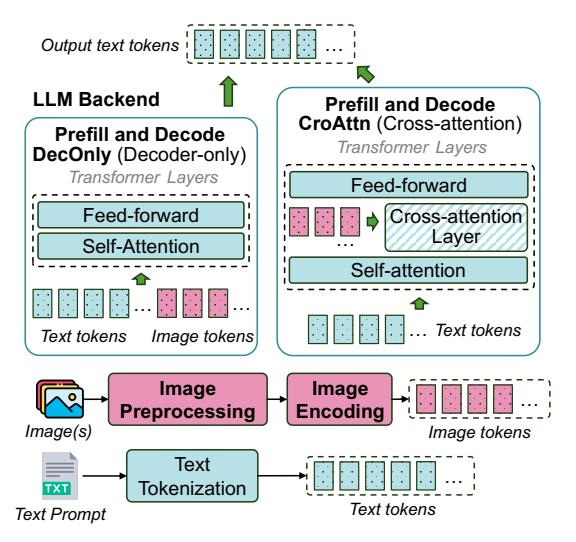

# 1 Introduction

The rapid advancement in generative AI has led to the development of large multimodal models (LMMs) capable of processing inputs across various modalities such as text, image, video, and audio. These models have demonstrated remarkable capabilities in tasks like image captioning [\[6,](#page-11-0) [21,](#page-12-0) [40\]](#page-12-1), visual question answering [\[51,](#page-12-2) [52\]](#page-12-3), multimodal dialogue systems [\[9,](#page-12-4) [30,](#page-12-5) [58\]](#page-13-0), and voice assistant [\[18\]](#page-12-6). This has led to a rapid adoption of LMMs in production services, including online user-facing applications where latency servicelevel objectives (SLOs) are critical.

Unlike traditional large language models (LLMs) that process purely textual inputs using a single component, a decoder-based

Figure 1: Impact of image/video workload on LMM inference TTFT for state-of-the-art implementation of Llama3.2-11B on vLLM vs. ModServe with an 8-A100 GPU server. The "Monolith" setup deploys the full model using 8 GPUs while the "Decoupled" setup deploys the LLM backend on 4 GPUs and four image encoders on the other 4 GPUs.

transformer architecture [\[61\]](#page-13-1), LMMs handle fundamentally different types of inputs, each requiring distinct processing approaches. This heterogeneity introduces unique serving complexities that demand novel analysis and serving strategies. For Image-Text-to-Text models [\[25\]](#page-12-7), the inference pipeline consists of multiple specialized stages: image preprocessing to transform raw images into tensor representations, image encoding to convert these tensors into image tokens, and a language model backend that combines text prompts with image tokens to generate text outputs. Currently, these stages are typically served as a monolithic system [\[5,](#page-11-1) [27,](#page-12-8) [62\]](#page-13-2), where all components are integrated within a single serving instance and scaled together as a unified entity. While recent LLM serving systems adopt prefill-decode (PD) disaggregation [\[46,](#page-12-9) [65\]](#page-13-3) to reduce the performance interference at the LLM backend, these optimizations remain text-centric and overlook the upstream stages of multimodal preprocessing and encoding, which are still tightly coupled within a monolithic serving instance.

This lack of modality-aware decoupling limits the efficiency and scalability of existing monolithic inference serving systems when serving workloads beyond text. These systems struggle to meet

1

time-to-first-token (TTFT) SLOs because multimodal input preprocessing and encoding are in the critical path. Figure 1 illustrates the challenges faced by a monolithic deployment in scaling as the number of images per request increases (a common scenario in multi-image or video workloads), resulting in sharp TTFT degradation. As a result, image-heavy requests can result in head-of-line (HoL) blocking, reducing system responsiveness and causing resource overprovisioning.

**Our Work.** In this paper, we present the first comprehensive systems analysis of two leading LMM architectures: cross-attention (*CroAttn*) and decoder-only (*DecOnly*), on both open-source LMMs and novel production LMM inference traces in Azure datacenters. We analyze their multi-stage inference pipelines, performance-resource tradeoffs, and production workload patterns, including variable request rates, diverse multimodal inputs, and bursty traffic. To advance research in this area, we release the *first open-source multimodal trace* from our production clusters, enabling the community to study real-world deployment patterns.

Our analysis identifies three key insights for optimizing LMM inference. First, different LMM inference stages exhibit diverse performance characteristics and varying sensitivity to resource and model configurations (e.g., batching and model sharding), necessitating decoupled execution. Second, image encoding is a major bottleneck for TTFT, requiring efficient encoder parallelization to reduce both latency and HoL blocking. Finally, production multimodal traffic exhibits distinct bursty patterns driven by increased images per request, highlighting the need for modality-aware routing strategies to manage bursts and mitigate tail latency spikes.

Based on these insights, we propose Modserve, a novel *modular architecture* for scalable and resource-efficient LMM serving which directly addresses the challenges identified in our analysis. Take Image-Text-to-Text tasks as an example, Modserve separates image- and text-specific inference stages into distinct instances for decoupled execution. In Modserve, *Image Instances* handle image preprocessing and encoding, while *Text Instances* manage LLM prefill and decoding (Figure 1). Text-only requests are served by *Text Instances*, whereas image-text requests go through *Image Instances* where images are converted to tokens before being forwarded to *Text Instances* for text generation.

ModServe's modular architecture unlocks stage-specific optimizations. ModServe manages *Image* and *Text Instances* independently with stage-aware autoscaling, model sharding, and batching. By autoscaling the stages separately, it minimizes resource overprovisioning. For example, during image-driven bursts observed in production traffic, *Image Instances* can scale out independently, making ModServe more resource-efficient than monolithic inference systems. To navigate the image encoding bottleneck, ModServe parallelizes encoding of a single request across multiple *Image Instances* (Figure 1), leveraging our finding that the images within a request do not attend to each other during encoding, and hence the requests can be parallelized at the image level.

Further, to manage image-driven bursts, ModServe implements modality-aware request routing for *Image and Text Instances*. For example, images from image-text requests are routed to *Image Instances* with the fewest pending image tokens to encode, reducing HoL blocking and tail latency spikes.

We implement ModServe on top of a high-performance inference system, vLLM [27], and demonstrate the effectiveness of ModServe through extensive evaluations on a 16-server (128 GPUs) cluster running production LMM inference traces from Azure. Compared to state-of-the-art baselines, ModServe achieves 3.3–5.5× higher throughput under static allocation and reduces LMM serving cost by 25–41.3% while meeting the P99 TTFT SLOs.

While existing techniques like PD disaggregation have shown promise for optimizing LLM inference by separating prefill and decode phases [46, 65], they fall short for multimodal workloads. The unique nature of bursty and heterogeneous multimodal traffic observed in production makes it nontrivial to extend PD disaggregation studied in the context of text-centric LLM inference; modality-specific optimizations such as parallelizing encoding, modality-aware routing, and stage autoscaling are crucial to meet SLOs while maintaining resource efficiency. Additionally, the choice of selecting PD disaggregation or colocation for the LLM backend depends on the workload conditions and optimization targets [65]. We show in Section 5 that Modserve is composable with both colocated LLM backends (mixed PD batching) as well as PD disaggregation for the text nodes, and improves serving latency with the proposed modality-aware techniques in both LLM backend configurations.

We focus on Image-Text-to-Text and Video-Text-to-Text (where videos are processed as image frame sequences [31]), but our insights extend to other multimodal scenarios, such as Audio-Text-to-Text tasks [23], which share similar model architectures and inference stages with the models we study.

**Summary.** This paper makes the following contributions:

- The first open-source dataset containing large-scale production LMM inference traces from Azure [16].
- A comprehensive system characterization on LMM serving, examining performance profiles and resource utilization patterns across diverse multimodal workloads in both open-source LMM deployments and production environments.
- Design and implementation of ModServe, a modular architecture for scalable and resource-efficient LMM serving.
- A thorough evaluation of ModServe in a 128-GPU cluster using large-scale production traces.

#### 2 Large Multimodal Models Background

LMMs extend text-centric LLMs by integrating multimodal understanding capabilities for tasks like visual question answering [52] and computer-using agents [42, 45]. Figure 2 shows the typical pipeline of LMM inference in visual understanding tasks [25], which consists of three key stages: (1) *image preprocessing*, where raw images are transformed into uniform-sized tiles; (2) *image encoding*, where an encoder extracts visual features and produces a sequence of image tokens; and (3) *text generation*, where an LLM backend processes the image and text tokens to generate output text tokens. There are two dominant LMM architectures that differ in how the LLM backend handles image tokens and text tokens: (1) *decoder-only* (DecOnly), used in models like DeepSeek's Janus [7], LLaVA-OneVision [31], InternVL [9], and NVLM-D [12]; and (2) *cross-attention-based* (CroAttn), found in Llama-3.2 Vision [11],

Figure 2: Model architecture for decoder-only and cross-attention-based LMMs in Image-Text-to-Text tasks [25].

NVLM-X [12], and Flamingo [3]. In this work, we analyze six open-source LMMs (listed in Table 1) across these architectures, varying image encoder sizes (400M–6B) and LLM scales (7B–72B).

**Image Preprocessing.** LMMs typically follow three preprocessing steps on CPU: (1) resize, rescale, pad, and normalize the raw image, (2) segment it into tiles [9, 11, 12] or patches [31], and (3) apply tile/patch-level transformations and sampling. The number of tiles varies, with higher image dimensions resulting in more tiles, which ultimately increases the number of image tokens. For example, an image with 896×896 pixels generates 4, 5, or 10 tiles of different sizes after preprocessing for six open-source LMMs (Table 1).

**Image Encoding.** The image encoder takes processed image tiles as input and produces image tokens that are then passed to the language model backend. Today's image encoders predominantly use the vision transformer architecture [4] to extract visual features from images. Table 1 shows that different LMMs use different encoders [4, 9, 31, 64], leading to variations in the number of image tokens when running image encoders on the same ShareGPT-40 dataset [8] (Figure 3). This is due to differences in the number of tiles and image tokens generated per tile by each encoder.

**Text Generation.** Image and text prompt tokens are combined and passed through LLM prefill and decode to generate output tokens, typically using one of two architectures:

Decoder-Only (DecOnly) LMMs. An unmodified LLM backend is reused in DecOnly LMMs (e.g., LLaVA-OV reuses Qwen2 LLM [31]), processing text and image tokens uniformly (shown as the "DecOnly" box in Figure 2). This works by attaching a connector [66] or modality-alignment module (e.g., MLP) that maps the image encoder output into the LLM's token space. While valued for their simplicity and unified modality handling, DecOnly models often require long sequences for high-resolution images, resulting in computational inefficiencies during inference.

Cross-Attention (CroAttn) LMMs. Unlike DecOnly LMMs, which leave the LLM backend unchanged, CroAttn-based models (e.g., Llama-3.2 Vision) integrate cross-attention layers to process image

Figure 3: Distribution of image token count (per request) for open-source LMMs on ShareGPT-40 dataset [8]. Different LMMs (e.g., LLaVA-OV 7B and 72B) can share the same image encoder so the number of image tokens is the same.

tokens, treating visual inputs like a "foreign language" in the LLM backend. While more complex to train, they improve inference efficiency by avoiding full image token unrolling in the LLM decoder, making them ideal for high-resolution inputs. Self-attention operates on text tokens, while the cross-attention layer attends to both text and image tokens ("CroAttn" box in Figure 2).

SLO Metrics for LMM Inference. Production LMM serving systems need to satisfy SLOs defined on tail latency (e.g., P99) for worst-case performance. These SLO metrics include *Time to First Token (TTFT)* and *Time Between Tokens (TBT)*. TTFT measures the latency from query (text/images) to the first response token, critical for interactive applications. In contrast to text-centric LLM serving, LMM TTFT includes the following stages of LMMs inference pipeline: (1) image preprocessing, (2) encoding, and (3) language model prefill time. TBT captures the delay between consecutive token generations during decoding, affecting output fluency. As multimodal preprocessing and encoding primarily influence TTFT, in this work, we focus on TTFT while leveraging state-of-the-art techniques [1, 46] to optimize TBT. An ideal LMM-serving system should meet TTFT/TBT SLOs while maximizing request throughput (i.e., goodput) and compute *utilization* (GPU cost).

LMM Deployments Today. State-of-the-art serving frameworks [5, 27, 62] deploy LMMs as monolithic systems to meet latency SLOs. In this setup, all inference components (i.e., image preprocessor, image encoder, and LLM backend) are co-located on the same hardware server as a single unit. While PD disaggregation can be applied within this monolithic setup to decouple prefill from decode phases and reduce interference during text generation, it still couples multimodal components with the prefill instances [27], preventing independent optimization of each component based on their distinct resource requirements and performance characteristics. These tightly coupled components share uniform batching and model parallelism strategies across the pipeline. Table 1 details the default model parallelism for our open-source LMMs. While this monolithic design is straightforward to implement and common in opensource LMM serving, it limits flexibility and suffers from sharp TTFT degradation under image-heavy workloads (Figure 1).

#### 3 Motivation and LMM Characterization

To further understand the limitations of monolithic deployments and explore unique characteristics that distinguish LMM serving from text-centric LLM serving, we characterize open-source LMMs

| LMM Model Name            | Abbreviation | Architecture    | Tile Size | 0               | Total Image Token Size   (#Tiles × #TokensPerTile) | LLM Backend (#Params) | Tensor Parallelism | Avgerage Accuracy (Open VLM Benchmark [15]) |
|---------------------------|--------------|-----------------|-----------|-----------------|-------------------------------------------------------|--------------------------|-----------------------|------------------------------------------------|
| Llama 3.2 Vision 11B [37] | Llama3.2-11B | Cross-attention | 560×560   | ViT-H/14 (630M) | 4 × 1601 × 1 = 6404                                   | Llama 3.1 (8B)           | TP-4                  | 57.8%                                          |
| Llama 3.2 Vision 90B [38] | Llama3.2-90B | Cross-attention | 560×560   | ViT-H/14 (630M) | 4 × 1601 × 1 = 6404                                   | Llama 3.1 (70B)          | TP-8                  | 63.4%                                          |
| LLaVA-OneVision 7B [34]   | LLaVA-OV-7B  | Decoder-only    | 384×384   | SigLIP (400M)   | $10 \times 729 \times 1 = 7290$                       | Qwen2 (7B)               | TP-4                  | 60.1%                                          |
| LLaVA-OneVision 72B [33]  | LLaVA-OV-72B | Decoder-only    | 384×384   | SigLIP (400M)   | $10 \times 729 \times 1 = 7290$                       | Qwen2 (72B)              | TP-8                  | 68%                                            |
| InternVL-2.5 26B [10]     | InternVL-26B | Decoder-only    | 448×448   | InternViT (6B)  | 5 × 256 = 1280                                        | InternLM (20B)           | TP-8                  | 71.6%                                          |
| NVLM-D 72B [13]           | NVLM-D-72B   | Decoder-only    | 448×448   | InternViT (6B)  | 5 × 256 = 1280                                        | Qwen2-Instruct (72B)     | TP-8                  | 67.6%                                          |

Table 1: Model configurations for six representative open-source LMMs with an example input image of 896 × 896 pixels.

Figure 4: Image dimension distribution and text prompt length distribution of ShareGPT-40 Image dataset [8].

in the *Image-Text-to-Text* category [25]. We evaluate the performance and resource characteristics of heterogeneous inference stages under varying image inputs and model configurations (Section 3.1). Moreover, to understand multimodal traffic patterns at scale, we analyze sample production traces from one production LMM inference cluster at Azure (Section 3.2).

#### **Characterization Setup.** The following is our setup:

Models. We use six representative open-source LMMs across two different architectures (DecOnly and CroAttn) as listed in Table 1. We deploy the models on vLLM [27] in BF16 with the default, stable PD colocated mode because the experimental PD disaggregated mode of vLLM has limited support for multimodality, and no support for cross-attention models. However, we later show in Section 5.4 that PD disaggregation is an optimization that is trivially composable with our design in ModServe.

*Dataset.* We use the open-source ShareGPT-40 dataset [8], which includes 50K images of varying resolutions and text prompts from multimodal GPT-40 as shown in Figure 4.

Hardware. Our setup features a DGX-A100 server with 8 NVIDIA A100 GPUs (80GB each) connected via NVLINK [39]. It has 96 AMD Epyc™ 7V12 CPU cores and 1900 GiB DRAM.

