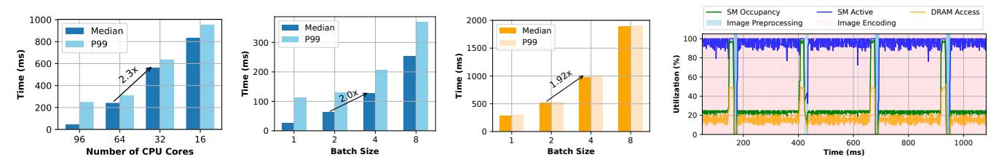
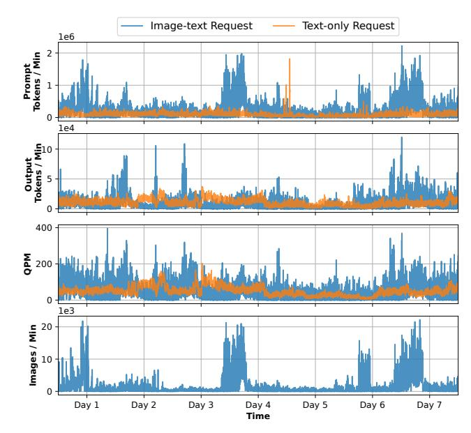
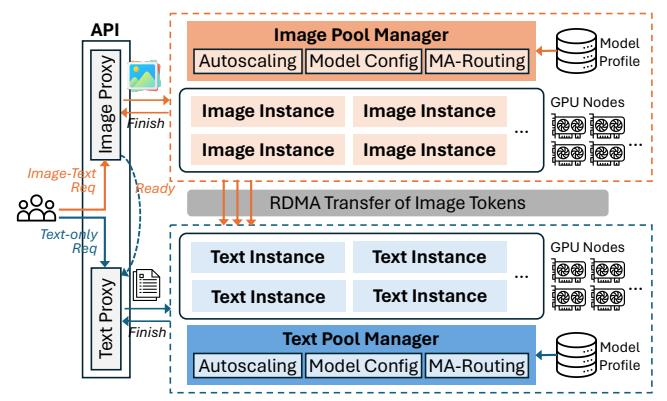

# 3.1 Characterization on Open-Source LMMs

We characterize open-source LMMs to understand how different inference stages impact performance and resource efficiency. Additionally, we compare DecOnly and CroAttn models to highlight the need for model-specific optimization.

**Per-stage Latency Breakdown.** Figure 5 plots the split-up of TTFT across the three stages that comprise it; image preprocessing, image encoding, and LLM prefill. There are three key takeaways. First, image preprocessing, which occurs on the CPU, contributes minimally to the overall TTFT, while image encoding time contributes to a major portion in TTFT (especially for CroAttn models). For

instance, 79% and 65% of TTFT in Llama3.2-11B and Llama3.2-90B are from image encoding. For DecOnly models such as InternVL-26B and NVLM-D-72B, image encoding latency accounts for 25% and 54% of TTFT. Second, the image encoding time depends on the encoder model size. For instance, scaling from SigLIP-400M (in LLaVA-OV-7B) to InternViT-6B (in InternVL-26B), the median image encoding time increases by  $10\times$ . Since connectors [66] are extremely small (e.g., < 0.1% of total parameters in InternVL-26B), they contribute negligible latency (< 0.4% of TTFT). Finally, prefill computation is more efficient in CroAttn models because image tokens are attended to only in the CroAttn layers while the majority of LLM backends are self-attention layers, as described in Section 2.

Taken together, these results underline why image encoding emerges as a major bottleneck in multimodal model serving. First, the number of images per request can be substantial, especially in video understanding or multi-image tasks. Second, CroAttn models shift the computational load to the image encoder by reducing image-text interaction in the LLM. This lowers the computational load from LLM and keeps it in encoding.

<u>Insight 1:</u> A major portion of the TTFT is spent on image encoding, particularly for CroAttn models, making image encoding optimization critical to meet TTFT SLOs.

Compute Characteristics of LMM Stages. Image preprocessing on CPU and image encoding on GPU are compute-intensive processes. Figure 6a plots the impact of varying the number of CPU cores on preprocessing latency. Preprocessing is CPU-intensive and benefits from trivially parallelizing across cores. Both stages exhibit linear latency scaling with batch size, saturating compute without significant throughput gains from increased batching as shown in Figures 6b and 6c, respectively. Figure 6d further plots the GPU utilization metrics for a request batch size of one during image preprocessing and image encoding. We observe a consistent SM core activity near 100% during image encoding, with average DRAM utilization below 30%. Image encoding is, therefore, typically compute-bound, resembling the language model's prefill phase [26]. Moreover, when a request has multiple images in the input prompt (e.g., video workloads), there is typically no compute dependency between the images during image encoding; hence, image tiles can be parallelized across multiple encoders.

<u>Insight 2:</u> Image preprocessing and encoding are both computeintensive similar to LLM prefill stage. The independence of image computations in a multimodal request enables parallelization of image preprocessing and encoding across multiple instances.

4

Figure 5: Per-stage request latency breakdown analysis across representative open-source LMMs deployed using default tensor parallelism (TP) as described in Table 1. TTFT (dashed line) is the sum of the latency from each inference stage.

(a) Image preprocessing time (b) Image preprocessing time (c) Image encoding time varyvarying CPU allocation. varying batch size. ing batch sizes. (d) GPU utilization during image preprocessing and encoding.

Figure 6: Compute characteristics of image preprocessing and encoding. Both stages are compute-bound.

Figure 7: LMM accuracy vs. prefill/TTFT efficiency.

Compute characteristics of prefill and decode phases of the LLM backend have been well studied; the prefill phase is typically compute-bound, while the decode phase is memory-bound [1, 26, 46]. However, Figure 5 shows that LLM prefill is more efficient in CroAttn models than in DecOnly models, resulting in reduced compute intensity and an interesting tradeoff we describe below.

Latency-Accuracy Profiles across LMMs. Figure 7 shows the accuracy versus prefill/TTFT efficiency for different models. When comparing models with similar language model backend sizes across both architectures (*e.g.*, Llama3.2-11B vs. LLaVA-OV-7B and Llama3.2-90B vs. LLaVA-OV-72B vs. NVLM-D-72B), we observe that CroAttn models typically have up to an order of magnitude lower LLM prefill time, leading to lower TTFT. However, the CroAttn models usually achieve 5 points lower accuracy compared to their DecOnly counterparts on the Open VLM leaderboard [15]. For example, Llama3.2-90B scores 63.4, while the similarly sized LLaVA-OV-72B scores 68, but with significantly higher prefill latency and TTFT than Llama3.2-90B.

Figure 8: Median latency vs. batch size per LMM stage on GPUs. Latency is normalized to that at batch size one.

<u>Insight 3:</u> DecOnly models exhibit 10× worse LLM prefill latency than similar-sized CroAttn models, leading to less TTFT SLO headroom for the image encoding and thus necessitating higher scalability for image workloads.

**Impact of Batching.** In today's monolithic deployments, a single batch size is applied across all stages of the LMM on the GPU, which does not strike a balance between latency and throughput given heterogeneous compute characteristics observed across different stages. Figure 8 shows how the batch size affects the median latency of each LMM stage across architectures. As the batch size increases, the latency grows at varying rates, reflecting each stage's differing sensitivity to batch size and compute intensity.

Compute-intensive stages like image encoding and LLM prefill (in DecOnly models with longer image token inputs) show limited throughput gains and rising latency beyond small batch sizes. In contrast, the memory-bound decode stage benefits from linear throughput scaling. Due to their low text token count, CroAttn models uniquely gain from prefill batching, diverging from traditional LLM trends where prefill saturates compute even at a batch

Figure 9: Impact of the tensor parallelism (TP) degree on the median latency of each stage for CroAttn-based and DecOnly LMMs. Latency is normalized to that of TP-8.

size of one. Notably, DecOnly model NVLM-D with fewer image tokens also exhibits certain benefits in batching.

<u>Insight 4:</u> The effectiveness of batching varies for each LMM component and is model-specific. LMM request batching should thus be tailored to each stage.

Impact of Parallelism. Monolith deployments also limit the flexibility of model sharding within a GPU server which is typically done through tensor parallelism (TP) [59]. Figure 9 shows how increasing TP degrees affects latency across LMM stages. In Llama3.2-11B, the lowest LLM prefill latency occurs at TP-8, image encoding at TP-4, and TBT at TP-1. At TP-8, encoding latency rises due to the tradeoff between compute intensity and inter-GPU communication, making it inefficient to split a 630M-sized encoder across 8 devices.

In contrast, NVLM-D-72B, with a larger 6B image encoder, sees a 1.3× latency reduction when increasing TP from 4 to 8. However, this comes with diminishing returns relative to resource cost. To balance throughput and latency, operators can deploy two TP-4 encoders for higher throughput or one TP-8 encoder for lower latency, both using eight GPUs.

<u>Insight 5:</u> Treating the image encoder and LLM backend as a monolith limits parallelism flexibility and degrades performance. Decoupling them enables independent scaling and optimized efficiency through pipelining.

## 3.2 Production LMM Trace Analysis

Building on the insights from open-source LMM characterization, we further analyze multimodal traffic patterns at scale, leveraging production traces from one of Azure's LMM inference clusters. The traces capture a sample of multi-tenant traffic, including both text-only and image-text requests. Our study focuses on (1) temporal and burstiness patterns and (2) heterogeneity of multimodal requests. We have released these multimodal inference traces at https://github.com/Azure/AzurePublicDataset.

**Temporal Patterns and Burstiness.** Figure 10 shows the traffic of text-only and image-text requests separately to understand their dynamic behavior and overall impact on the system. The traces are collected over a span of one week. To understand the traffic patterns, we report the timeline of prompt (input) token rate, output token rate, request arrival rate, and input image rate. Our analysis reveals two key characteristics in production LMM inference:

Figure 10: Aggregated prompt/out token rate, request arrival rates in queries per minute (QPM), and image rate for a production LMM inference cluster in one week.

(a) Total prompt length. (b) #Images per request. Figure 11: LMM input characterization in production.

- Diverse Arrival Patterns. Image-text requests show up to 5× higher prompt token rates than text-only requests. In addition, their peak and trough occurrences are largely independent, showing minimal correlation.
- *Image-Driven Bursts*. Image-text requests experience significant burstiness, not only due to higher request arrival rates but also increased images per request (*e.g.*, video workloads). As a result, existing LLM traffic prediction methods [56] (which work well for LLM workloads with diurnal patterns) have a high average prediction error rate of 79%.

**Request Heterogeneity.** Figure 11a shows that prompt lengths vary significantly across modalities. Both image-text and text-only requests follow a heavy-tailed power-law distribution ( $\alpha$ =4.4 and 2.9, respectively) where a higher  $\alpha$  means a heavier tail with more extreme events occurring more frequently. In addition, image-text requests have longer median prompts due to image tokens but shorter tails than text-only requests. Figure 11b shows that the number of images per request also varies significantly with a heavy tail. In addition, among the top three services issuing text-image requests, we observe high inter-service variability. Some services (e.g., video) process 16× more images per request than others.

6

Figure 12: Llama3.2-11B (CroAttn) TTFT breakdown (left) and LLM prefill time breakdown (right) under various image-to-text token ratios in a request.

Comparing the image dimension distribution in our production traces with that of ShareGPT-40 image dataset [8], we observe similar distributions, with median image width and height around 500 pixels and P95 exceeding 1000 pixels.

<u>Insight 6:</u> Production LMM image traffic exhibits bursty behavior independent of the traffic patterns of text requests due to the nature of different services. Serving systems must dynamically scale resources to handle modality-specific bursts efficiently.

Impact of Mixed Modality. Given LMM requests' input heterogeneity, Figure 12 shows how varying image token percentages within a single request affects TTFT and LLM prefill time in a CroAttn model Llama3.2-11B, with detailed latency breakdowns. DecOnly models have no prefill time variation with varying token ratios as image and text tokens are treated in the same manner. We fix the total context length of each request at 16K tokens while varying the percentage of image tokens by adjusting the number of images (0–10 images in each case with 1601 tokens per image).

TTFT increases with the percentage of image tokens in a request due to the increased image encoding computation, resulting in a 1.5× TTFT degradation when transitioning from text-only to image-only inputs. However, this latency gain is significantly lower than DecOnly models because CroAttn models attend to image tokens only within the CroAttn layers, resulting in reduced LLM prefill time (shown in green) and partially offsetting the overhead from image encoding. The right figure in Figure 12 further illustrates this by breaking down the layer-wise LLM prefill time, highlighting a reduction in self-attention compute (*i.e.*, "Attn Layer" and "MLP Layer") as the proportion of image tokens increases. Although the cross-attention computation peaks at the 50% image tokens (due to the dependency on both image and text tokens), it contributes much less than self-attention computation because there are only 4 CroAttn layers (out of 40 layers).

<u>Insight 7:</u> DecOnly models maintain consistent prefill times regardless of token modality, making total token count the key factor for request routing. In contrast, CroAttn models experience reduced prefill latency as the image token percentage increases, requiring a modality-aware request routing strategy that balances both text and image token load in multimodal traffic.

Figure 13: Overview of the ModServe architecture.

## 4 ModServe Design and Implementation

Based on our insights from the characterization study of opensource LMM benchmarks and production LMM workloads, we propose ModServe, a novel decoupled architecture for scalable and resource-efficient LMM serving.

The key idea in ModServe is to separate image- and text-specific inference stages into distinct instances, given the need to optimize each stage separately (Insight 1 and 3) and enable seamless interaction between stages. Unlike monolithic infrastructures, ModServe enables independent optimization of each stage, improving resource efficiency while meeting performance SLOs. This decoupling also enables modality-aware request serving, addressing tail latency, heterogeneous bursts, and resource contention.

**Overview.** Figure 13 shows ModServe's design. A pool of *Image Instances* handles image preprocessing and encoding of image-text requests. The resulting image tokens are passed to a pool of *Text Instances*, which performs LLM prefill and decode operations to generate outputs. Text-only requests bypass the image components and are queued directly at the *Text Instances*. Two pools are managed by the *Image and Text Pool Managers*.

Modserve adopts a hierarchical architecture inspired by DynamoLLM [56]. Onboarding any new LMMs (e.g., Llama3.2-11B) starts with an offline profiling phase to build model-stage profiles that capture how model configurations and load impact performance (Section 4.1). Modserve uses these profiles to guide model configuration and instance scaling. After model deployment, Modserve then reconfigures resources periodically to adapt to workload patterns, scaling for increased image-text requests (or vice versa) (Section 4.2). For each request, Modserve selects the optimal LMM Text or Image Instances for execution (Section 4.3).

#### 4.1 Offline LMM Profile Generation

When onboarding a new LMM, ModServe generates resource-performance profiles by characterizing the image encoder and LLM backend independently. This profiling runs controlled inference workloads with varying model parallelisms (e.g., TP-2 and TP-8), batch sizes, and load (i.e., image tokens per second for image encoders and prompt tokens per second for LLM backends) to capture per-stage performance characteristics. To efficiently model performance across different load conditions, ModServe profiles a set of

representative load levels (up to the maximum throughput) and extrapolates the behavior for intermediate loads. The resulting profiles take load, parallelism, and batch size as inputs to predict key performance metrics, including encoding latency for *Image Instances* and prefill time and TBT for *Text Instances*. The *Pool Managers* use these profiles to guide model-specific or architecture-specific operational decisions (Section 4.2): (1) pool autoscaling to meet latency SLOs without overprovisioning, (2) model sharding that selects the optimal TP degree, and (3) maximum batch sizing for each stage.

Since multiple LMMs may share the same image encoder or LLM backend, ModServe minimizes overhead by reusing model profiles across deployments. These profiles are cached in cluster-local storage and synchronized via a global repository, enabling efficient sharing across clusters.

## 4.2 Decoupled Resource Management

ModServe's decoupled approach to resource management stems from our insights on stage-specific performance disparities in batching (Insight 4), independent scaling benefits (Insight 5), and modality-specific traffic patterns (Insight 6). Specifically, ModServe periodically reconfigures resources (*i.e.*, every five minutes to match the autoscaling overhead) to align with workload demands.

The *Image Pool Manager* maintains a pool of *Image Instances*, which preprocess images on CPU and encode image workloads on GPU for image-text requests. Meanwhile, the *Text Pool Manager* manages a pool of *Text Instances* responsible for the prefill and decode stages of both image-text and text-only requests. Based on model profiles (Section 4.1), each manager independently optimizes pool autoscaling, model sharding, and max batch sizing to minimize costs while meeting performance SLOs. Since connectors are extremely small in size and contribute negligible latency (< 0.4% of TTFT), dedicating separate GPUs to them would underutilize resources. Instead, ModServe colocates connectors with the LLM backend, which accommodates cases where the connector consumes features from multiple encoders [66].

Before their online operation, the initial number of Image Instances  $(N_i)$  is determined using the median image QPS multiplied by the median image encoding latency. The number of Text Instances  $(N_t)$  is set as  $N_i$  divided by the median number of images per request, based on historical LMM inference traces. If no history is available, Modserve initially overprovisions resources to both Text/Image Instances to ensure reliability.

**Token-Aware Pool Autoscaling.** The *Pool Managers* dynamically scale the number of *Image and Text Instances* based on real-time workload demands. For example, a surge in image-heavy requests leads to more image preprocessors and encoders, while an increase in text requests or requests' prompt lengths triggers the *Text Pool Manager* to scale LLM replicas to handle variations in prefill.

The number of replicas per stage is computed as  $\lceil \frac{ML}{MC} \rceil$  where ML is the modality-specific load (e.g., prompt tokens/sec for Text Instances, image tokens/sec for Image Instances) and MC is the maximum capacity each stage can handle without violating SLOs, based on the offline LMM profiling data. Unlike traditional web service autoscaling, which reacts to request rates, ModServe optimizes scaling based on token throughput (tokens/s), capturing variations in both request rates and request sizes (Insight 6 and Figure 11a).

For *Image Instances*, image token counts are precomputed based on the static mapping from image dimensions to the number of tokens per image (Figure 3). Autoscaling of *Text Instances* is based on text token load in CroAttn models but total tokens in DecOnly models due to homogeneous self-attention across modalities. Advanced autoscaling hysteresis prevention techniques [67] can be employed to avoid excessive scaling actions caused by transient workload fluctuations but are not covered in this paper.

Model Sharding. The *Pool Managers* also determine instance sharding for optimal tensor parallelism (TP) for image encoders and LLM backends. Our characterization (Section 3.1) shows image encoders achieve peak throughput with lower TP than LLMs. Therefore, the model sharding degree for each instance is configured separately for maximum throughput while ensuring SLO attainment on TTFT and TBT. By decoupling the components, ModServe ensures independent sharding, optimizing parallelism without unnecessary synchronization overhead.

When scaling beyond a single GPU server, ModServe prioritizes autoscaling over pipeline parallelism (PP) [53] to maximize throughput while avoiding communication overhead, seamlessly transitioning to batch-level optimizations as needed.

**Identifying Max Batch Size.** For each stage, the maximum batch size is configured to maximize throughput while meeting latency SLOs. Batch sizing decisions are guided by the offline model-stage profiles, which predict their impact on encoding and decoding latencies. *Image Instances* may forgo batching as small max batch sizes often achieve optimal GPU utilization (Insight 3). In contrast, *Text Instances* batch requests when beneficial, optimizing token throughput during prefill/decode based on TTFT and TBT SLOs, particularly for CroAttn LMMs (Insight 4).

## 4.3 Modality-Aware LMM Request Serving

For each incoming LMM request, ModServe dynamically routes and schedules workloads to balance load across *Image and Text Instances*. The *Pool Managers* optimize this process to minimize queueing delays and improve TTFT latency.

Request Routing Across Instances. To mitigate tail TTFT latency surges caused by modality-specific bursts and queuing delays, Modern Serve employs a modality-aware routing strategy that balances image and text workloads independently. Traditional request-level LLM load balancing (e.g., round-robin, memory-based [57]) overlooks the computational intensity of image encoding (Insight 2), making them vulnerable to load imbalances during image bursts (Insight 6), leading to high tail latencies.

Instead, ModServe routes requests by input modality. Image-text requests are assigned to *Image Instances* with the least image-token load. Large requests (*i.e.*, those with more images) are consequently distributed across multiple *Image Instances* for parallel processing and encoding (Insight 2), preventing degraded batching performance that would occur if all images were routed to a single instance. This effectively enables a form of request chunking [1], where images in a large request can be processed in an interleaved manner with other requests, reducing HoL blocking and improving scheduling flexibility.

To route traffic between Text Instances, text-only requests and image-text requests with completed image tokens are directed to the *Text Instance* with the least total pending tokens (text+image) for DecOnly models and the least total pending text tokens for CroAttn models because of the attention mechanism difference between the two model architectures (Insight 7). Modality-aware routing enables parallel image encoding and dynamically adapts to image or text traffic bursts, reducing queueing delays and improving TTFT, particularly at the tail.

Instance Request Scheduling. At the instance level, Modserve minimizes resource contention between image-text and text-only requests with priority scheduling based on modality and prompt size. While decoupling isolates image and text processing, contention can still arise in *Text Instances*, where both request types share prefill processing. This issue is particularly pronounced in DecOnly LMMs, which exhibits lower efficiency during the prefill stage (Figure 8). Performance degradation occurs from increased batching latency for all requests, while non-batched processing introduces HoL blocking and high queueing delays at tails due to request heterogeneity (Figure 11).

To address these challenges, Modserve replaces traditional FIFO scheduling—which may exacerbate HoL blocking [47, 50]—with an SLO-driven scheduling strategy that can prioritize shorter requests (e.g., text-only queries or small image-text requests with tight SLOs) to maintain low latency.

Pool Managers continuously monitor SLO attainment and trigger pool autoscaling when the rate falls below a predefined threshold (default 0.99 with a sensitivity study in Section 5.3), ensuring adaptive resource allocation under dynamic workloads (especially in cases of unpredictable traffic). ModServe can work with state-of-the-art batch scheduling techniques [1, 46] to optimize TBT during the decode stage, which we leave to future work as we do not observe TBT degradation in LMM characterization (Insight 4).

Image Token Transfer. Once image encoding is complete, Mod-Serve transfers image tokens from *Image Instances* to *Text Instances* via a pull-based RDMA mechanism. Push-based approaches immediately transmit image tokens as they are generated, requiring premature decisions about which *Text Instance* should receive them (and all subsequent tokens). This design increases synchronization overhead and risks suboptimal routing, as the system operates with incomplete information about token counts and runtime load.

In contrast, our pull-based design defers transfer until all image tokens for a request are ready. This many-to-one aggregation enables the scheduler to select the target *Text Instance* with full information, considering factors such as queue size, prefix caching, and payloads. Once the routing decision is made, the request carries RDMA addresses of the producing *Image Instances*, from which the chosen *Text Instance* pulls the image tokens.

ModServe colocates *Image and Text Instances* in the same server when each *Text Instance* is not taking up all GPUs on a server to avoid image transfer overhead and unallocated idle GPUs. For example, it may place one TP-4 Text Instance and two TP-2 Image Instances within the same 8-GPU server. Unlike monolithic deployments, colocated instances remain independently configurable and can serve corresponding stages of different requests independently.

## 4.4 Implementation

We implement ModServe using 5,000 lines of Python code. We base the *Text Instance* on vLLM [27] (v0.7.2), a state-of-the-art generative model inference platform, and build the *Image Instance* on HuggingFace Transformers [24]. The modular architecture of ModServe enables easy integration with other serving engines (e.g., TensorRT [43] and DeepSpeed [5]). We use numact1 to restrict CPU and memory usage of image preprocessing to a single NUMA node, which reduces memory access latency and performance variation. To ensure efficient GPU-to-GPU memory transfer of image tokens, we use PyTorch's distributed communication with the NCCL backend and GPU Direct RDMA.

We implement the *Image and Text Pool Managers* as lightweight gRPC servers (hosted on dedicated VMs) with low memory and compute requirements, drawing inspiration from DynamoLLM [56]. For failure detection and recovery, the *Pool Managers* use a simple heartbeat-based membership management protocol [17]. However, MODSERVE can be easily extended to adopt more robust leader election (*e.g.*, Raft [44]) and fault-tolerance algorithms [60].

#### 5 Evaluation

## 5.1 Experimental Setup

Models and Workloads. We use two representative multimodal models, Llama3.2-11B and InternVL-26B, for CroAttn and DecOnly LMMs, respectively. To ensure realistic workload distribution, we adopt the inter-arrival timestamps of requests and the number of images associated with each request (ranges from 0 to 16) from the production LMM inference trace (Section 3.2) and reuse the LMM text-image dataset from Section 3.1.

Hardware. We evaluate ModServe on a cluster with 16 DGX-A100 servers [39] (128 GPUs). Each server has the same configuration as the server used in our characterization study (Section 3.1). The GPUs within a server are connected with NVLINK 3.0 while cross-server connection is via InfiniBand.

Baselines and Systems. We compare ModServe against the state-of-the-art generative model inference serving system, vLLM [27], which supports LMM inference as a monolithic setup. We also evaluate ModServe with a few variants of ModServe implemented on top of vLLM: (1) vLLM with decoupled Image/Text Instances (i.e., ModServe-Decoup), (2) ModServe-Decoup plus modality-aware scheduling (i.e., ModServe-Sched), and (3) ModServe-Sched plus modality-aware routing (i.e., ModServe), for ablation study.

**SLO Definition.** We define the SLO metrics for LMM inference based on the TTFT/TBT during the isolated run of a single text-only request and text-image request (with one image) on the monolith baseline setup. Then, we scale the SLO metrics with a constant factor (*i.e.*, SLO factor) to evaluate how Modserve performs under tight/relaxed SLOs (Section 5.3). The SLOs are defined on P99 tail latency across requests over time.

