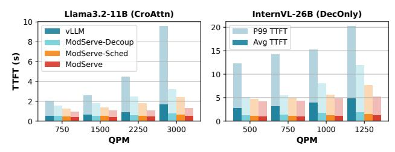
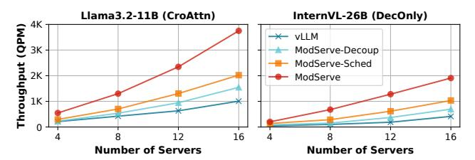
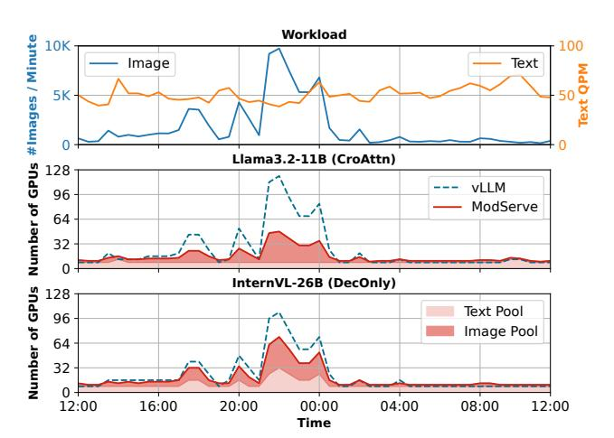

# 5.2 End-to-end Performance

**Static Resource Allocation.** We begin by evaluating ModServe under a static resource allocation setup, where a fixed number of servers remain active at all times without autoscaling. This setup

Figure 14: TTFT comparison with fixed 16 servers (128 GPUs) without autoscaling.

Figure 15: Maximum load meeting SLO

isolates the benefits of decoupling, modality-aware request scheduling, and routing from pool autoscaling (which we explore independently). Figure 14 shows the average and tail (P99) TTFT achieved by Modserve and the baselines when serving different input loads over fixed resources (16 servers with 128 GPUs in total). In this setup, vLLM (monolith) deploys 32 instances (each with TP-4) while the other approaches (decoupled) deploy 20 Text Instances (TP-4) and 48 Image Instances (TP-1).

Compared to vLLM, statically decoupling (ModServe-Decoup) improves the average and P99 TTFT by 27% and 42% (for Llama3.2), 46% and 47% (for InternVL). This is because monolithic deployments process all modalities on shared GPU resources, leading to contention and inefficient utilization under imbalanced modality traffic. In addition, ModServe-Decoup with the same number of GPUs can deploy 16 extra Image Instances and enables image encoding parallelization that reduces TTFT significantly compared to the monolithic deployment on vLLM.

ModServe shows a more pronounced TTFT improvement over the monolith baseline when serving InternVL. This is because the monolith deployment faces resource contention with DecOnly models due to their high prefill latency (Insight 3), which contends with image encoding. Additionally, InternVL's image encoder has higher batching performance degradation (Insight 4) and thus benefits more from parallelization. Adding modality-aware request scheduling (ModServe-Sched) further reduces the average and P99 TTFT by 12% and 25%, modality-aware routing (ModServe) reduces the average and P99 TTFT by 14% and 32%, as it reduces HoL blocking and mitigates tail latency spikes.

Overall, Modserve achieves the lowest TTFT across all load levels, demonstrating the effectiveness of modular inference pipelines. We observe similar TBT performance in all approaches due to its compute insensitivity (as indicated by Figure 8). Figure 15 further evaluates the maximum throughput under the TTFT and TBT SLO when varying the static resource allocation from 4 to 16 servers. Modserve achieves a 3.3× and 5.5× throughput improvement over

Figure 16: GPU allocation with autoscaling (up to 16 servers) during a one-day interval on the production traces.

vLLM (monolith) for Llama3.2 and InternVL, respectively, which confirms that DecOnly models benefit more from decoupling.

Resource Allocation with Autoscaling. We now assess how Modserve and vLLM (monolith) baseline handle image-driven bursts seen in the production trace (Figure 10). Fundamentally, to serve traffic bursts, a system needs to scale up the resources to meet the workload demand while scaling down to avoid overprovisioning. Therefore, we enable autoscaling in both Modserve and vLLM and evaluate them on a one-day interval of the production trace that contains an image-driven burst. For a fair comparison, both Modserve and vLLM (monolith) use similar SLO-driven autoscaling heuristics based on offline model profiling (Section 4.2).

Figure 16 compares the number of GPUs used by ModServe and vLLM (monolith) to serve the image-driven burst in the production trace. ModServe takes 41.3% and 25% fewer GPUs compared to vLLM to serve Llama-3.2 (CroAttn) and InternVL (DecOnly) models respectively while meeting the tail latency SLOs. ModServe's cost reduction is higher for Llama-3.2 (CroAttn) model because the increase in image tokens caused by image-driven traffic bursts does not overwhelm the LLM backends in CroAttn models as observed in its latency profile (Figure 12). However, in InternVL (DecOnly), the LLM backend's latency increases with the increase in image tokens due to homogeneous self-attention. Therefore, to meet SLOs, ModServe scales up the number of Text Instances for InternVL more than for Llama-3.2 during image-driven bursts (light pink in Figure 16). Overall, ModServe's stage-aware autoscaling prevents unnecessarily scaling up LLM backends (done by vLLM due to monolith deployment) during image-driven bursts and prevents resource over-provisioning.

