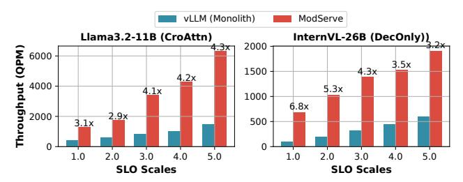
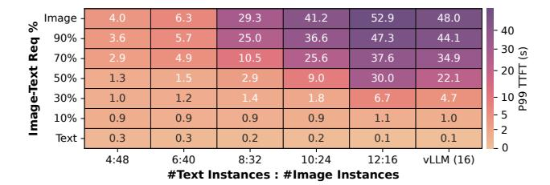
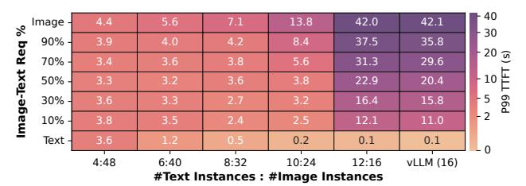

# 5.3 Sensitivity Study

**Impact of SLO Scale.** Figure 17 shows the maximum throughput ModServe can achieve when changing the SLO scale (higher values refer to more relaxed SLOs). As the SLO scale increases, ModServe consistently outperforms the vLLM, achieving up to 4.3× higher throughput for Llama-3.2 and 6.8× for InternVL. This

Figure 17: Throughput impact varying the SLO scale.

#### (a) Llama 3.2-11B CroAttn LMM.

(b) InternVL-26B DecOnly LMM.

Figure 18: Impact of image request percentage (Y-axis) and instance allocation (X-axis), i.e., #Text Instances (TP4): #Image Instances (TP1) on 8 servers (64 GPUs).

trend highlights that ModServe better utilizes resources under the same latency requirements.

Impact of Image-to-Text Instance Ratio. Figure 18 shows the effect of varying the ratio of Image and Text Instances on 64 GPUs (8 servers) along the *X*-axis, in comparison to vLLM monolith with 16 instances. For instance, "4:48" denotes a configuration with 4 Text Instances (TP-4) and 48 Image Instances (TP-1). As the ratio of Text Instances increases, we observe that MODSERVE consistently achieves superior TTFT performance compared to vLLM (monolith) until the ratio reaches 10:24. However, at 12:16, the decoupled configuration contains the same number of image encoders but 4 fewer LLM backends, resulting in inferior performance. Moreover, reducing image encoders below the monolith baseline contradicts the core goal of decoupling to scale up/out the image encoders independently for multimodal processing.

Impact of Image:Text Request Ratio. Figure 18 also shows the impact of varying image-text request percentages in the workload (*Y*-axis). As this percentage increases from 10% to 90% (more image-heavy), TTFT for Llama-3.2 (CroAttn) increases. InternVL (DecOnly) follows a similar trend, except at lower *Text Instance* ratios (*e.g.*, 4:48), where P99 TTFT decreases from 3.8 to 3.3 seconds due to reduced text load. This stems from DecOnly models' poor prefill efficiency. For the same reason, at low image-text request

Figure 19: TTFT improvement with ModServe from a prefill-decode disaggregated setup for InternVL-26B (DecOnly).

percentages (*e.g.*, 10%), InternVL sees a lower P99 TTFT as more *Text Instances* help distribute the text-heavy load.

On the other hand, across all image-text request percentages, increasing the number of *Text Instances* raises P99 TTFT in Llama3.2 due to a reduced number of *Image Instances*, leading to longer image encoding times. However, regardless of distribution, ModServe outperforms the monolith baseline (by up to 18.4× for Llama3.2 and 9.2× for InternVL) when Image:Text Instance ratio exceeds 2.4, demonstrating its efficiency handling multimodal workloads.

Model Architectures. Our evaluation on open-source LMMs includes models up to 90B parameters, while production deployments may involve even larger model sizes affecting image encoding ratios in TTFT, which we defer to future work. We focus on visual LMMs but audio-based multimodal models [23] share similar architectures and parameter scales with vision multimodal models. We also note that hybrid multimodal architectures have been proposed [12], though no open-source hybrid models are currently available.

#### 5.4 Prefill-Decode Disaggregation Support

Modserve is complementary to existing techniques for LLM backend optimization, including prefill/decode (PD) disaggregation [46, 65], which splits LLM inference into two execution phases: prefill and decode (token-by-token generation). Our design fully supports PD disaggregation, which leads to a full EPD disaggregation.

To demonstrate this, we compare two deployment configurations under varying load, both incorporate PD disaggregation, deploy the InternVL-26B model, and use the same number of decode instances to match TBT latency (orthogonal to Modserve's contributions). The main difference between the two configurations comes in the LLM prefill instances: (1) PD-Monolith: 4 prefill instances are deployed, where each instance is distributed across 8 GPUs. Each prefill instance also hosts an image encoder for image preprocessing and encoding. (2) PD-Modserve: 3 prefill instances are deployed, each across 8 GPUs. Image encoders are fully decoupled from the LLM backends and run as 8 independent processes on the remaining GPU server. Both configurations use a total of 32 GPUs for image encoding and LLM prefill combined.

This setup allows us to isolate the benefits of stage-level decoupling in ModServe from PD disaggregation. Figure 19 demonstrates that ModServe (blue) provides additional TTFT reduction (up to 2.8× in average TTFT and 3.2× in P90 TTFT for InternVL-26B) beyond what PD disaggregation alone can offer (red). The TTFT improvement (for both mean and P90) becomes more pronounced when load increases as ModServe reduces resource contention

Figure 20: Image token transfer latency across token sizes

between the image encoding and LLM prefill stages and leverages encoder parallelization to reduce encoding latency (Insight 2).

#### 5.5 Token Transfer Overhead

Figure 20 shows the image token transfer overhead for varying-sized image embeddings, comparing different communication media of using Infiniband and Ethernet. With RDMA on Infiniband, we observed the P99 transfer latency of image tokens per image request is 5 ms, which corresponds to <0.5% and <0.3% TTFT for CroAttn and DecOnly models, respectively. TCP over Ethernet incurs significantly higher overheads, with a P50 of 100 ms and a P99 of 180 ms. ModServe supports both communication media. When evaluated over TCP, ModServe achieves a 35% TTFT reduction at high load for InternVL-26B and an 8.4% reduction at low load compared to the monolithic baselines (with Infiniband, the reduction is 46% and 13%, respectively, as mentioned in Section 5.2).

## 6 Related Work

**LMM Characterization.** Lee *et al.* [28] provides a comprehensive characterization of multimodal *generation* models at Meta, while we focus on LMMs with multimodal input (*e.g.*, visual understanding models). Hou *et al.* [19] focus on traditional multimodal models employing small-scale convolutional neural networks. In contrast, our work presents a detailed analysis of multimodal input workloads on both open-source LMM models and production traces, highlighting their unique execution and workload patterns.

LMM Serving Optimization. Recent research has introduced several techniques to optimize LMM serving by addressing key inefficiencies in inference computation and memory usage. Inf-MLLM [41] employs token caching strategies and attention bias to maintain performance with long contexts while reducing KV cache memory consumption. Elastic Cache [36] utilizes an importancedriven cache merging strategy to prune KV caches efficiently during inference. Dynamic-LLaVA [22], VTW [35], and QueCC [32] present various vision token sparsification and compression techniques to dynamically reduce redundancy in vision tokens, especially for video workloads. These optimizations primarily operate at the model level, trading off computational overhead with output quality (i.e., accuracy). They are orthogonal to our proposed system-level design for inference efficiency that does not impact model accuracy, which can further benefit from such model-level advancements, e.g., faster image encoding with subsampling [29].

To optimize LMM inference, concurrent works adopt a similar stage decoupling idea (e.g., EPD [54] and HydraInfer [14]) and parallel encoding (e.g., IRP [54]). In contrast, our work extends beyond

stage decoupling by incorporating stage-aware model configuration, modality-aware routing, and autoscaling, rooted in insights from a comprehensive systems analysis of production LMM inference workloads. In addition, our characterization and evaluation take a closer look at two representative LMM architectures, rather than being limited to decoder-only models.

**Text-Centric LLM Serving.** Recent studies have delved into disaggregating LLM prefill and decode phases for text-only LLM serving. Examples include Splitwise [46], DistServe [65], Mooncake [48], and MemServe [20]. Other optimizations for LLM serving include key-value cache management [27], continuous batching [63], request scheduling [1, 2, 47, 50, 57], and energy optimization [49, 55, 56]. While these optimizations can be applied in ModServe to enhance LLM backend prefill and decode efficiency, our work focuses on the unique characteristics of multimodal models.

#### 7 Conclusion

We present the first comprehensive systems analysis of LMMs on both open-source models and production LMM inference traces. Our insights lead to the design of ModServe, a scalable and resource-efficient LMM-serving framework that decouples inference stages for dynamic reconfiguration, adaptive scaling, and modality-aware scheduling. Evaluations show that ModServe achieves 25–41% cost savings compared to the state-of-the-art while efficiently serving production-scale LMM inference workloads.

