# Mordal: Automated Pretrained Model Selection for Vision Language Models

#### Shiqi He <sup>1</sup> Insu Jang <sup>1</sup> Mosharaf Chowdhury <sup>1</sup>

## Abstract

Incorporating multiple modalities into large language models (LLMs) is a powerful way to enhance their understanding of non-textual data, enabling them to perform multimodal tasks. Vision language models (VLMs) form the fastest growing category of multimodal models because of their many practical use cases, including in healthcare, robotics, and accessibility. Unfortunately, even though different VLMs in the literature demonstrate impressive visual capabilities in different benchmarks, they are handcrafted by human experts; there is no automated framework to create task-specific multimodal models.

We introduce Mordal, an automated multimodal model search framework that efficiently finds the best VLM for a user-defined task without manual intervention. Mordal achieves this both by reducing the number of candidates to consider during the search process and by minimizing the time required to evaluate each remaining candidate. Our evaluation shows that Mordal can find the best VLM for a given problem using up to 8.9×–11.6× lower GPU hours than grid search. In the process of our evaluation, we have also discovered new VLMs that outperform their stateof-the-art counterparts.

### 1 Introduction

Vision Language Models (VLMs) bridge the gap between visual and language understanding, rising as the dominant approach to solving visual information-based tasks. Notably, GPT-4V [\(OpenAI, 2023\)](#page-9-0), a large-scale multimodal language model, demonstrates impressive vision reasoning capabilities by taking images as input and generating

<span id="page-0-0"></span>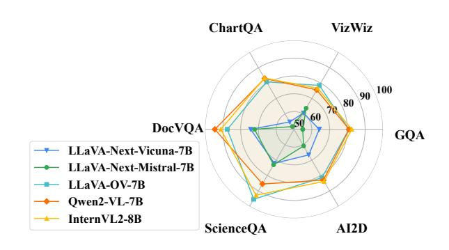

Figure 1. Benchmark performance of five latest *open-source* VLMs on six multimodal tasks.

detailed natural language descriptions. Although the technical details behind GPT-4V remain undisclosed, researchers have proposed a number of publicly available VLMs (e.g., MiniGPT-4 [\(Chen et al., 2023\)](#page-8-0), LLaVA [\(Liu et al., 2023a\)](#page-9-1) and Qwen-VL [\(Bai et al., 2023\)](#page-8-1)) that aim to match GPT-4's capabilities. Many of these open-source VLMs share a similar architecture, in which a feature projector converts the image embeddings generated by a vision encoder and feeds it to a large language model (LLM) along with the text embeddings.

To construct and train a VLM, the common approach starts from selecting an appropriate *pretrained* vision encoder and language model. Thanks to the ever-growing ecosystem like HuggingFace [\(Face, 2025\)](#page-8-2), developers are able to choose from countless pretrained models for their own VLMs. Unfortunately, despite the great number of available models, it is difficult to determine which pretrained models (i.e., vision encoders and language models) are the most appropriate ones. Given a user-specific downstream task, it is unclear which pretrained models can form the VLM that will meet the user's needs most effectively. Unfortunately, as shown in Figure [1,](#page-0-0) no single VLM consistently outperforms the others in accuracy across all dimensions. Their capabilities vary significantly depending on their pretrained components [\(Liu et al., 2023c;](#page-9-2) [Xu et al., 2023\)](#page-10-0).

With significant constraints on available time and computation cost, it is unrealistic to try every pretrained model combination and train corresponding VLM candidates. Training a single VLM with vision-text alignment data could take

<sup>1</sup>Computer Science and Engineering, University of Michigan. Correspondence to: Shiqi He <shiqihe@umich.edu>, Mosharaf Chowdhury <mosharaf@umich.edu>.

more than 100 GPU hours [\(Liu et al., 2023a;](#page-9-1) [Karamcheti](#page-9-3) [et al., 2024\)](#page-9-3). It is also unreliable and unpredictable to rely on human "intuitions" to select pretrained models for the given downstream task, such as selecting the latest one or the most well-known one [\(Liu et al., 2023c\)](#page-9-2). In addition, existing model selection methods [\(Brown et al., 2020;](#page-8-3) [You](#page-10-1) [et al., 2021;](#page-10-1) [Lin et al., 2024\)](#page-9-4), like evaluating the highest zero-shot performance, will fail in VLM scenario since they were designed for vision-only and LLM-only tasks. With an untrained feature projector, the LLM will not understand the image embeddings and can produce random outputs. This motivates the key question of this work: *How to effectively find the best pretrained models in a VLM given a downstream task?*

To address this question, we formulate the *pretrained model selection problem for VLMs* for the first time and model it as a resource-constrained task to predict the *alignment* performance of a VLM; i.e., the performance on the downstream task after training the feature projector with the vision-text alignment data. We empirically show that existing VLMs fail to dominate all downstream tasks and a naive approach like grid search is infeasible in practice.

We present Mordal, a novel pretrained model selection framework, which automatically and efficiently explores different pretrained model combinations in VLM. Mordal builds on our observation that efficiently solving this problem needs jointly considering two optimization directions: (1) minimizing the number of VLM candidates, where each candidate has different pretrained vision encoders and LLMs; and (2) reducing the evaluation time for each candidate. Overall, we make the following contributions in this work:

- We introduce and define the pretrained model selection problem in the context of VLMs for the first time and demonstrate that off-the-shelf VLMs often do not contain the best pretrained components for a given downstream task.
- We propose Mordal, an efficient pretrained model search framework, to find the best VLM for a given downstream task. Mordal clusters VLM candidates by their representation similarities while employing an early stopping mechanism and an observational scaling law to reduce evaluation time.
- We implement Mordal and provide a flexible interface. Our extensive evaluations show that Mordal efficiently finds near-optimal VLMs with 8.9×–11.6× less computation time than grid search for a wide range of tasks.

### 2 Background and Motivation

We start by outlining the architecture of typical VLMs. Following this, we highlight the challenges in pretrained model

selection for VLMs and show that existing VLMs often do not pick ideal pretrained models for downstream tasks. Based on these observations, we present the limitations of potential solutions like grid search, which motivate Mordal's design.

#### 2.1 Vision Language Model

VLMs are compound AI models with three key components:

- *Vision Encoder (VE).* The vision encoder is responsible for processing input images and extracting relevant features. Potential encoder options are CLIP [\(Radford](#page-9-5) [et al., 2021\)](#page-9-5), SigLIP [\(Zhai et al., 2023\)](#page-10-2), InternViT [\(Chen](#page-8-4) [et al., 2024\)](#page-8-4) and DINOv2 [\(Oquab et al., 2023\)](#page-9-6), etc.
- *Feature Projector (FP).* The vision-language crossmodal feature projector aims to align the encoded image features to the text token embedding space. The feature projector can be achieved directly by a Linear Projector or Multi-Layer Perceptron (MLP), i.e., several linear projectors interleaved with non-linear activation functions [\(Liu et al., 2023b\)](#page-9-7).
- *Language Model (LM).* The language model processes mixed embeddings generated from both user instructions in text as well as image inputs. The commonly used LMs in VLMs are decoder-only LLMs, which include Llama [\(Touvron et al., 2023a\)](#page-9-8), Vicuna [\(Chiang et al., 2023\)](#page-8-5) and Mistral [\(Jiang et al., 2023\)](#page-8-6).

When serving a request, a VLM first processes an input image with an image processor and passes it to a vision encoder. The vision encoder outputs a sequence of raw vision embeddings (or patches). The feature projector will then map the raw vision embeddings to aligned vision embeddings, which will append to text prompt embedding and feed into the LM decoder to generate output text.

### 2.2 Pretrained Model Selection: No Silver Bullet

VLMs are versatile and powerful because most vision tasks can be formulated as next-token prediction. To train a VLM for a specific downstream task, developers usually *cherrypick* pretrained vision encoders and language models for alignment. However, different pretrained models have varying capacities, which affect VLM performance. To investigate the impact of different pretrained models, we conduct grid search on 49 VLM candidates (i.e., seven vision encoders and seven language models) and train each candidate with *the same alignment data*. While complete evaluation is described in Section [4,](#page-5-0) we present the performance of four representative VLM candidates on six datasets, across three dimensions: Visual QA (GQA [\(Hudson & Man](#page-8-7)[ning, 2019\)](#page-8-7) and VizWiz [\(Gurari et al., 2018\)](#page-8-8)), Doc QA (ChartQA [\(Masry et al., 2022\)](#page-9-9) and DocVQA [\(Mathew et al.,](#page-9-10) [2021\)](#page-9-10)) and Knowledge (ScienceQA [\(Lu et al., 2022\)](#page-9-11) and

<span id="page-2-0"></span>Table 1. Evaluation results of capability on tasks of Visual QA, Doc QA, and Knowledge for four VLMs with different pretrained models. CLIP-Vicuna has the same pretrained models and mode structure as LLaVA-1.5-7B [\(Liu et al., 2023a\)](#page-9-1). The best result for each scenario is in bold text. There is no silver bullet.

| Model                   | Vision Encoder        | Language Model | Visual QA |        | Doc QA  |        | Knowledge |      |
|-------------------------|-----------------------|----------------|-----------|--------|---------|--------|-----------|------|
|                         |                       |                | GQA       | VizWiz | ChartQA | DocVQA | ScienceQA | AI2D |
| CLIP-Vicuna (LLaVA-1.5) | CLIP-ViT-L/14         | Vicuna-1.5-7B  | 61.5      | 41.2   | 18.2    | 27.6   | 70.4      | 54.8 |
| SigLIP-Vicuna           | SigLIP-so400m-patch14 | Vicuna-1.5-7B  | 66.4      | 44.8   | 18.4    | 24.1   | 68.5      | 53.0 |
| CLIP-Llama              | CLIP-ViT-L/14         | Llama-3-8B     | 55.8      | 37.9   | 13.3    | 17.3   | 75.7      | 58.2 |
| SigLIP-Llama            | SigLIP-so400m-patch14 | Llama-3-8B     | 56.4      | 38.1   | 13.4    | 17.4   | 78.5      | 60.1 |

AI2D [\(Kembhavi et al., 2016\)](#page-9-12)). As shown in Table [1,](#page-2-0) both pretrained vision encoders and language models have a significant impact on VLM performance. At the same time, these improvements are use case-specific. Overall, *there is no silver bullet pretrained model or model combination that reigns supreme for all tasks*.

Given these observations, one may naturally ask: *how can we select the best combination of pretrained models for a specific task?* In this paper, we address the pretrained model selection problem in the context of VLMs. Given an alignment dataset and a target task, we aim to find the combination of a pretrained vision encoder and a language model that achieves the best performance on the target task after alignment.

#### 2.3 Exhaustive Search is Prohibitively Expensive

Solving the pretrained model selection problem by relying on empirical experiences or intuitions, such as choosing the newest, largest or most well-known model, is unstable and unpredictable. For example, in Table [1,](#page-2-0) a VLM candidate with Llama-3-8B does not have a better performance than a VLM candidate with Vicuna-1.5-7B. Additionally, since the VLM is not aligned, it is impossible to directly evaluate its zero-shot performance [\(Brown et al., 2020\)](#page-8-3). Most existing model selection methods are designed for classification, regression, or LLM-only generation tasks, and do not account for the vision encoder and the alignment process [\(Vu](#page-10-3) [et al., 2020;](#page-10-3) [You et al., 2021;](#page-10-1) [Lin et al., 2024\)](#page-9-4). This makes the selection problem particularly challenging, especially in resource-constrained environments.

While an exhaustive search strategy is feasible within a limited search space, it becomes impractical when dealing with a large number of pretrained models – for reference, there are more than 150,000 LLMs on the HuggingFace platform as of Jan 2025. Each candidate requires training the projector and potentially finetuning pretrained components, making it unrealistic to train all candidates before making a selection.

Even using a pretrained 7B LLM as the backbone, training a single VLM can take over 100 GPU hours with the LLaVA-1.5 dataset. Indeed, manually generating suitable results for

Table [1](#page-2-0) cost us 1000+ GPU hours (many inferior combinations are not shown for brevity). Furthermore, researchers are continuously developing new neural architectures and improving datasets to enhance VLM performance. This means that whenever a new encoder or LLM is released, developers must manually re-train VLMs with the new components to evaluate performance.

To address the inefficiencies of exhaustive search in pretrained model selection, we must reduce the search cost along two key dimensions: (1) reducing the number of candidates and (2) minimizing the time required to evaluate each candidate. By optimizing these two dimensions, the exhaustive search process can be replaced with a more efficient pipeline that balances time consumption and selection accuracy.

### 3 Mordal Design

This section details the core components of Mordal's design. The exhaustive search is expensive because it (1) needs to evaluate every candidate (large search space), and (2) needs to train each candidate with a full dataset to see its performance (high evaluation cost). Mordal reduces search space by clustering the candidates based on their similarity and by introducing a two-step inter- and intra-cluster evaluation ([§3.1\)](#page-2-1), and reduces evaluation cost of each candidate with an early stopping mechanism and observational scaling laws ([§3.2\)](#page-4-0).

#### <span id="page-2-1"></span>3.1 Candidate Clustering

With the rapid increase in the number of pretrained models in popular model zoos (e.g., HuggingFace [\(Face, 2025\)](#page-8-2)), evaluating every candidate combination is expensive. Based on prior observations that similar models tend to have similar performance [\(Hu et al., 2023;](#page-8-9) [Yu et al., 2024;](#page-10-4) [Lai et al.,](#page-9-13) [2023\)](#page-9-13), Mordal clusters candidates and evaluates them in two steps: inter-cluster and intra-cluster, to reduce the search space.

Measuring similarity. Measuring the similarity of VLM candidates – without training projectors between vision encoders and language models – is challenging. Parameter similarity [\(Lai et al., 2023\)](#page-9-13), which has been used to measure

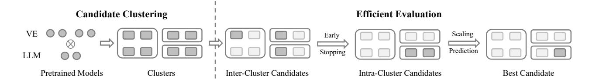

Figure 2. An overview figure for Mordal. Gray circles and blocks represent pretrained models and VLM candidates, respectively. White blocks represent inactive or eliminated candidates. Mordal first groups similar candidates into clusters, where each candidate consists of one VE and one LLM. During efficient evaluation, every cluster picks one candidate (i.e., inter-cluster) and Mordal evaluates them. Poor-performed clusters are eliminated. For each candidate in the remaining clusters (i.e., intra-cluster), Mordal fits a linear regression model and predicts its performance to select the best candidate.

similarity between model architectures, does not fully consider the data distribution pattern in the target task. Models with high parameter similarity could still show different performance on different tasks. Therefore, in Mordal, we consider *representation similarity* between VLM candidates, which depends on the target task.

Mordal employs centered kernel alignment (CKA) (Kornblith et al., 2019) to evaluate the similarity of representations between two VLM model structures. CKA has been proven to be an effective tool for understanding and comparing the information encoded across different layers of neural networks. Formally, CKA operates on two datasets by analyzing their corresponding activation matrices. The CKA score is defined as:

$$CKA(K, L) = \frac{HSIC(K, L)}{\sqrt{HSIC(K, K) \cdot HSIC(L, L)}}$$
(1)

where K and L are the kernel matrices of activations of two models. HSIC is the Hilbert-Schmidt Independence Criterion (HSIC) defined as:

$$HSIC(K, L) = Tr(KHLH)$$
 (2)

where Tr() is the trace of a matrix and H is the centering matrix  $H = I - \frac{1}{n} \mathbf{1} \mathbf{1}^{\top}$ . CKA is particularly useful in this context for two reasons. First, CKA can compare representations with differing shapes generated by different pretrained models, a task where traditional metrics such as cosine similarity fail. Second, as vision representations are commonly projected through MLP layers, this transformation does not compromise CKA's properties, making it robust and well-suited for such evaluations.

**Two-step clustering.** Computing the CKA score between each pair of candidates can be expensive, since K and L are activations from batched data input. To reduce the amount of pair-wise CKA computation, Mordal introduces a two-step VLM clustering strategy: (1) clustering vision encoders, (2) clustering language models based on a fixed vision representation. We detail the clustering process as follows:

Vision encoder clustering. Mordal computes the representation similarity between vision encoders using

<span id="page-3-0"></span>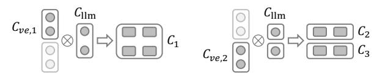

(a) Clustering based on  $C_{ve,1}$  (b) Clustering based on  $C_{ve,2}$ 

Figure 3. An example showing language model clustering process with four VEs and two LLMs. Different VE clusters will lead to different LLM clusters.

CKA. A distance matrix  $Dist_{ve}$  is then constructed based on the dissimilarity values. The clustering function will take an input threshold  $t_{ve}$  and output the vision encoder clusters  $C_{ve}$ .

Language model clustering. As shown in Figure 3,
 Mordal constructs different language model clusters
 based on each vision encoder cluster. Using the medoid
 vision encoder from each cluster, Mordal generates a
 fixed image embedding for the dataset and a warmed up feature projector transforms the shape of image
 embeddings to match the LLM input shape. A dis tance matrix Dist<sub>llm</sub> will record the dissimilarity and
 language models are then clustered based on an input
 threshold t<sub>llm</sub>.

For each vision encoder cluster and the corresponding language model clusters, Mordal generates the candidate clusters by conducting the Cartesian product of the two clusters. The two-step clustering process reduces the computation costs by avoiding computing the similarity between candidates that have dissimilar vision encoders, which we show in Section 4.3 that usually yield distinct performance.

**Inter- and intra-cluster evaluation.** After grouping the candidates into clusters, Mordal finds the best candidate with two-step evaluation: inter-cluster evaluation and intra-cluster evaluation. The detailed process is shown in Figure 4. Given that candidates in the same cluster have similar performance, inter-cluster evaluation first picks medoid from each cluster as the *representative candidate* and compares

<span id="page-4-1"></span>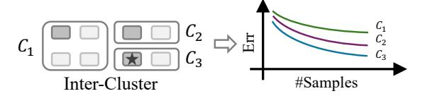

(a) *Inter-cluster evaluation: selects top-*K *clusters. When* K = 1*,* C<sup>3</sup> *is selected.*

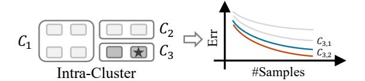

(b) *Intra-cluster evaluation: identifies the best candidate. Among the remaining two candidates,* C3,<sup>2</sup> *is selected.*

Figure 4. Inter- and intra-cluster evaluation with candidate clusters.

*performance of each cluster* to eliminate poorly performing clusters. The remaining Top-K clusters will be evaluated in the second step, where K is a user-defined parameter.

With the inter-cluster evaluation, many fewer candidates remain in consideration. Intra-cluster evaluation goes back to candidate-granularity evaluation by aggregating candidates from the remaining Top-K clusters. It trains all of them on the given alignment dataset, and returns the one with the best performance to the user.

#### <span id="page-4-0"></span>3.2 Efficient Evaluation

Section [3.1](#page-2-1) reduces the search space; however, evaluating each candidate in both stages (i.e., inter- and intra-) still requires training each candidate with a full dataset to assess its performance. Mordal introduces an early stopping mechanism that eliminates the clusters more aggressively but with high fidelity for inter-cluster exploration and an efficient scaling prediction algorithm based on an observational scaling law for intra-cluster exploration.

Early stopping mechanism. Some obviously poorperforming candidates can be eliminated at an early stage of inter-cluster evaluation to allocate resources to more promising candidates. Mordal applies a simple but efficient Successive Halving Algorithm (SHA) [\(Jamieson & Talwalkar,](#page-8-10) [2016\)](#page-8-10) to roughly filter out the candidates before observing the scaling law. It ensures that computational resources are focused on the most promising clusters.

In Figure [5a,](#page-4-2) SHA is conducted during inter-cluster evaluation, where all representative candidates are evaluated with the maximum data sample ratio R. It consists of multiple rounds, also known as *rung*. In each round, SHA allocates a budget b to each candidate, evaluates all of them, and keeps the top 1/η candidates. In the next round, SHA increases

<span id="page-4-2"></span>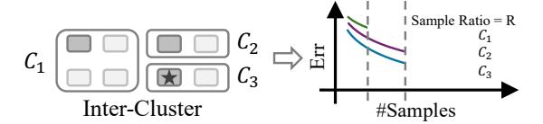

(a) *Inter-cluster evaluation with early stopping mechanism. Two candidates are early stopped and* C<sup>3</sup> *is selected.*

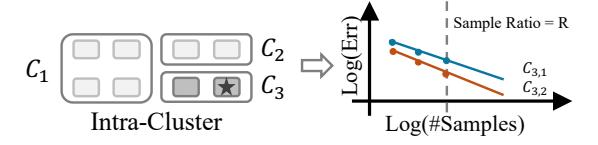

(b) *Intra-cluster evaluation with scaling prediction.* C3,<sup>2</sup> *is selected based on the predicted performance.*

Figure 5. Applying early stopping mechanism and scaling prediction to inter- and intra-cluster evaluation.

the budget to b × η per candidate. This repeats until representative candidates are converged or Top-K candidates are determined. In cases where the number of remaining candidates is large, it is also possible to apply SHA again to intra-cluster evaluation. With SHA as the early stopping mechanism, Mordal *eliminates* poor-performing candidates earlier. It optimizes evaluation time for each candidate, which is an orthogonal dimension to search space, and therefore, speeds up the evaluation process.

Observational scaling law. The scaling law has been explored in previous works [\(Lin et al., 2024;](#page-9-4) [Ruan et al.,](#page-9-15) [2024\)](#page-9-15), but limited to LLM selection. In standard scaling laws [\(Kaplan et al., 2020\)](#page-8-11), the "scale" is defined by the compute resources allocated to training LLMs, such as the number of training FLOPs C, model parameters N, and training samples D. Scaling laws are typically formulated as a power-law relationship between LLMs' cross-entropy loss L and their compute scale measures. A common functional form for transformer architecture [\(Hoffmann et al., 2022\)](#page-8-12) is shown as:

$$L(N,D) = \frac{a}{N^{\alpha}} + \frac{b}{D^{\beta}} + e \tag{3}$$

where parameters α, β, a, b, e are fitted by training LLMs across different compute scales, varying N and/or D, and measuring their loss. With this formula, a hypothesized power-law relationship between D and loss L is that they are linearly correlated under the log-log scale. In Mordal, our focus differs from previous scaling laws in our goals – existing scaling laws aim to understand the scaling properties of pretraining and finetuning LLMs. In contrast, Mordal is interested in scaling laws of VLM alignment performance for a fixed model parameter size. We find that an observational scaling law exists for VLMs and present the results in Section [4.3.](#page-6-0) By fixing model parameters N and changing training sample D, we may construct log-linear relationship

#### Algorithm 1: Scaling Prediction

```
Input: Maximum data sample ratio R, scaling ratio u,
            minimum required performance point p
  Output: Prediction result list L
1 Def ScalingPrediction(C):
2
       for c \in C do
           Initialize loss-size pair list P = []
4
           Initialize data sample ratio r = R
5
           while True do
                /* Evaluate performance*/
6
7
                Err = Evaluate(\mathcal{D}_{align}, \mathcal{D}_{task}, c, r)
8
                P.append((log(r), log(Err)))
               if |P| > p then
9
                    Fit a linear regression model f_c on P
10
                    break if f_c fitting loss > \delta
11
               end
12
                /* Reduce data samples*/
13
14
               r = r/u
15
           end
           L.append((c, f_c(1)))
16
       end
17
       Return L
18
```

for each candidate and predict its performance.

With the observational scaling law, Mordal employs a scaling prediction algorithm that automatically detects the log-linear scaling with sampled alignment dataset to conserve resources. As shown in Algorithm 1, for each candidate c in remaining candidate list C, the algorithm starts from an initial data sample ratio R (e.g.,  $\frac{1}{8}$ ). It evaluates a checkpoint trained on randomly sampled data with ratio R. The corresponding performance point (Log(r), Log(Err)) will be recorded in list P. After that, the algorithm reduces data sample ratio and repeats the above process until enough performance points (i.e., p) are collected and the log-linear relationship is observed for a given candidate c. Since data sample ratio r is decreasing, we may effectively start the evaluation of r/u from existing intermediate checkpoints to save computation costs.

For each candidate c, Mordal observes a distinct log-linear relationship and fits a linear regression model  $f_c$  based on P. It uses the fitted model f to predict the candidate performance with full data alignment (i.e., f(1)) and chooses the best candidate. Note that scaling prediction is orthogonal to the two-stage evaluation. Although it cannot be applied to inter-cluster evaluation speculatively since observing the log-linear relationship requires training the candidate with some portion of alignment data, it can be used during intracluster evaluation and save evaluation time for promising candidates.

### <span id="page-5-0"></span>4 Evaluation

We conducted extensive experiments to thoroughly evaluate Mordal's performance. These experiments assessed its effectiveness in pretrained model selection and performed an ablation study. The key findings are summarized as follows:

- Mordal identifies the optimal combination of vision encoder and LLM for the target task 8.9×-11.6× faster than the grid search baseline, as shown in Section 4.2. For each target task, the best candidate surpasses the LLaVA-1.5-7B equivalent structure in accuracy while using the same alignment dataset.
- 2. We further validate the effectiveness of model similarity computation and observational scaling law in Section 4.3. By conducting the ablation studies, we show that each component in Mordal helps reduce the total search time while ensuring that it can still identify the top-performing candidates.

#### 4.1 Experimental Setup

The experiments are conducted on six mainstream datasets across three domains with seven vision encoders and seven LLMs. We deployed Mordal on a set of VMs on a cluster with a total of 16 NVIDIA A40 GPUs. Each GPU has 48 GB GDDR6 memory. More training and hyperparameter settings are described in Appendix C.

**Dataset.** In experiments, we use LLaVA-1.5-Instruction datasets (Liu et al., 2023a) for alignment. In practice, users may have their own alignment datasets. For target datasets, we pick six representative datasets, which cover three domains: Visual QA, Doc QA and Knowledge. These datasets are commonly used as benchmarks to assess a model's performance (Zhang et al., 2024).

**Model zoo.** We select seven vision encoders and seven language models based on popularity and performance. The selected vision models include both *language-supervised models* (e.g., OpenAI CLIP) and *self-supervised models* (e.g., DinoV2). For LLMs, all models follow the decoderonly structure, and we pick the most used 7B LLMs from *HuggingFace*. The complete list of our model zoo is shown in Table 4.

**Baseline and metric.** We consider grid search as the baseline, which fully trains and evaluates every VLM candidate. We measure the total evaluation time for each method to get the top-1 model for the given task. Additionally, to provide a comprehensive assessment, we also pay attention to the rank of candidates. In grid search, candidates are ranked based on their performance, whereas in Mordal, candidates are ranked by their elimination order. Ideally, if  $T_i$  represents the rank of candidate i in grid search and  $S_i$  represents the rank of candidate i in Mordal, we expect  $S_i$  is better than  $S_i$  if  $T_i$  is better than  $T_j$ . This can be captured by Kendall's

<span id="page-6-4"></span>Table 2. Summary of improvements. Search Time (h), Top-1 Model Quality (%) and Kendall τ results for different datasets. Mordal significantly reduces the amount of training needed (i.e., GPU Saving) while successfully finding the Top-1 VLM candidate. Kendall τ represents the differences of top-performing candidates compared with the grid search baseline and *larger* τ *is better*.

| Task      |                               | CLIP-Vicuna | Grid Search | Mordal (ours)  |      |         |                   |      |
|-----------|-------------------------------|-------------|-------------|----------------|------|---------|-------------------|------|
|           | Dataset                       | (LLaVA-1.5) | Top-1 Score | Model Name     | Time | Speedup | Top-1 Score       | τ    |
| Visual QA | GQA (Hudson & Manning, 2019)  | 61.5        | 66.4        | SigLIP-Vicuna  | 483  | 11.2×   | 66.4              | 0.81 |
|           | VizWiz (Gurari et al., 2018)) | 41.2        | 46.9        | SigLIP-Mistral | 469  | 11.6×   | 46.9              | 0.88 |
| Doc QA    | ChartQA (Masry et al., 2022)  | 18.2        | 20.2        | CLIP-Qwen      | 607  | 8.9×    | 18.6 (DFN5B-Qwen) | 0.76 |
|           | DocVQA (Mathew et al., 2021)  | 27.6        | 28.5        | SigLIP-Qwen    | 593  | 9.2×    | 28.5              | 0.89 |
| Knowledge | ScienceQA (Lu et al., 2022)   | 70.4        | 78.5        | SigLIP-Llama   | 472  | 11.5×   | 78.5              | 0.96 |
|           | AI2D (Kembhavi et al., 2016)  | 54.8        | 65.2        | SigLIP-Qwen    | 496  | 10.9×   | 65.2              | 0.89 |
|           |                               |             |             |                |      |         |                   |      |

<span id="page-6-2"></span>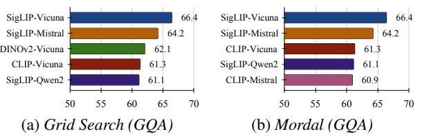

Figure 6. Top-5 candidates from grid search and Mordal on GQA.

τ coefficient defined as:

$$\tau = \frac{2}{M(M-1)} \sum_{1 \le i < j \le M} sgn(T_i - T_j) sgn(S_i - S_j)$$
 (4)

where M is the total number of candidates and sgn() is the sign function. A perfect ranking match results in τ = 1. To further focus on top-performing candidates, we adopt the weighted Kendall's coefficient τw, which is previously used in [\(You et al., 2021;](#page-10-1) [Vigna, 2015\)](#page-10-6). The details for implementing τ<sup>w</sup> can be found in SciPy [\(Virtanen et al.,](#page-10-7) [2020\)](#page-10-7).

#### <span id="page-6-1"></span>4.2 Performance Results

This section examines the total training time required by Mordal to identify the best VLM candidate compared to grid search. Using the LLaVA-1.5-Instruction dataset for alignment, we also evaluate candidate accuracy across six datasets in comparison with the VLM structure (i.e., CLIP-Vicuna) used for LLaVA-1.5-7B. Additionally, we compute Kendall's τ coefficient for Top-10 ground-truth candidates found by grid search and their order in Mordal.

Mordal is significantly faster than grid search. Table [3](#page-7-0) presents a comprehensive comparison between Mordal and grid search across six datasets. In each task, grid search exhaustively evaluates 49 candidates, requiring 5439 GPU hours. Since the same alignment dataset is used across all six tasks, the total search time for grid search remains constant. Notably, for most tasks, the best VLM candidates have different pretrained model combinations and all of them surpass the performance of the LLaVA-1.5-7B equivalent structure, highlighting the importance of pretrained model selection. Compared to grid search, Mordal identi-

<span id="page-6-3"></span>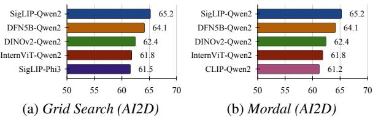

Figure 7. Top-5 candidates from grid search and Mordal on AI2D.

fies the top-performing VLM candidates significantly faster and successfully selects the best candidate for five out of six tasks. For example, on VizWiz, Mordal completes the search in just 469 training hours, identifying SigLIP-Mistral as the top-1 model with 46.9% accuracy. The search time for Mordal varies depending on factors such as the number of clusters formed and the convergence speed of candidates across tasks. Nevertheless, it consistently achieves substantial speedups ranging from 8.9× to 11.6× compared to grid search.

Mordal maintains a good performance in finding top-performing models. Beyond selecting the Top-1 model, we assess Mordal's capability to identify the Top-5 and Top-10 VLM candidates. As shown in Figure [6](#page-6-2) and Figure [7,](#page-6-3) Mordal consistently identifies four out of the Top-5 performing candidates when compared to grid search. However, some candidates (e.g., DINOv2-Vicuna) are overlooked due to two reasons: (1) these candidates belong to poorly performing clusters; or (2) they demonstrate suboptimal performance and are early stopped. In both scenarios, resources are reallocated to better-performing models. We further compute Kendall's τ values based on Top-10 candidates identified via grid search. Mordal achieves high τ values across all six datasets. For instance, Mordal achieves a τ value of 0.96 on ScienceQA, indicating that it correctly ranks eight out of ten models.

#### <span id="page-6-0"></span>4.3 Ablation Studies

In this section, we first validate the model similarity method and observational scaling law in Mordal. Then we conduct a comprehensive ablation study to evaluate the individual components of Mordal and their contributions to overall performance. Specifically, we analyze the effects of candidate

<span id="page-7-0"></span>*Table 3.* Evaluation results of VLMs with different vision encoders and the same language model (i.e., Vicuna-1.5-7B).

| Vision Encoder        | ScienceQA | VizWiz |
|-----------------------|-----------|--------|
| CLIP-ViT-L/14         | 67.6      | 41.2   |
| SigLIP-so400m-patch14 | 67.7      | 44.8   |
| DFN5B-CLIP-ViT-H/14   | 62.3      | 34.4   |
| InternViT-300M        | 56.9      | 30.7   |

<span id="page-7-1"></span>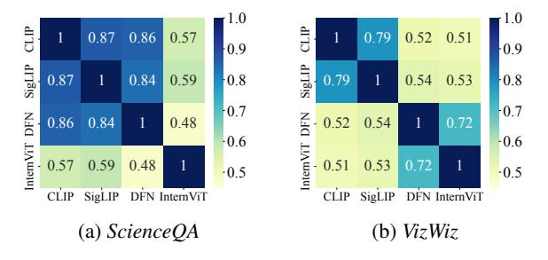

Figure 8. Similarity scores between four vision encoders on ScienceOA and VizWiz. Higher is better.

clustering, early stopping and scaling prediction.

Model similarity validation. To validate the effectiveness of CKA, we train four VLM candidates with four vision encoders and the same LLM backend Vicuna-1.5-7B. The trained VLMs are evaluated on two different datasets: ScienceQA and VizWiz. As shown in Figure 8, the image representation (i.e., outputs of projection heads) generated by different vision encoders show different levels of similarity to each other. For example, with input images from ScienceQA, CLIP, SigLIP, and DFN-CLIP generate similar representations. Meanwhile, DFN-CLIP and InternViT generate similar representations in VizWiz. From the results in Table 3, the vision encoders with similar representations will have similar performance with the same language model. Although this observation does not allow us to directly predict the target task's performance, it helps reduce the number of VLM candidates by eliminating similar pretrained models.

Observation scaling law validation. To validate the existence of scaling laws in VLM alignment, we train multiple VLM combinations with different vision encoders and the same language model background on a sampled alignment dataset. The trained VLMs are evaluated on two different datasets: GQA and AI2D. As shown in Figure 9, we observe log-linear scaling across different VLMs, which supports the design of scaling prediction. However, the log-linear scaling will only appear after a certain number of training samples, which is consistent with the conclusion in previous work (Lin et al., 2024; Ruan et al., 2024).

**Effect of candidate clustering.** Candidate clustering plays a vital role in Mordal as it enables inter- and intracluster evaluation. As illustrated in Figure 10a, inter- and

<span id="page-7-2"></span>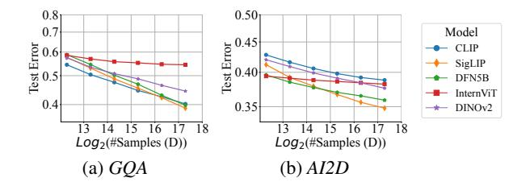

Figure 9. Observational scaling law validation for five VLMs with different vision encoders and same language model Qwen2-7B. The results are on GQA and AI2D.

<span id="page-7-3"></span>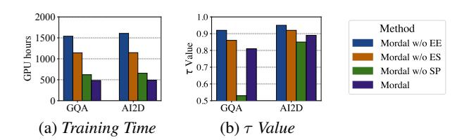

<span id="page-7-4"></span>Figure 10. Ablation study results for efficient evaluation (EE), early stopping (ES) and scaling prediction (SP) on GQA and AI2D.

intra-cluster evaluation (i.e., Mordal without efficient evaluation) significantly reduces training time while maintaining a high  $\tau$  value. By grouping candidates with similar characteristics into clusters, Mordal evaluates representative candidates from each cluster first and eliminates candidates in poor-performed clusters.

Effect of efficient exploration. Early stopping mechanism prunes candidates during the early stage of training. While it significantly reduces the search time, applying it during the entire evaluation (i.e., Mordal without scaling prediction) will eliminate some promising candidates (e.g., SigLIP-Qwen on AI2D shown in Figure 9). It evaluates candidates based on intermediate performance and leads to a low  $\tau$  value. Mordal limits the usage of early stopping and introduces scaling prediction instead to predict the performance of promising candidates. As shown in Figure 10b, this leads to a significant improvement in the  $\tau$  value while further reducing the total training time.

#### 5 Conclusion

In this work, we introduced Mordal, an automated pretrained model selection framework designed to address the challenges of efficiently identifying the best vision-language model (VLM) for a given downstream task. Mordal reduces the complexity of candidate selection by minimizing both the number of VLM candidates and the evaluation time for each candidate. Through extensive experiments, we demonstrate that Mordal achieves  $8.9 \times -11.6 \times$  reduction in search time compared to traditional grid search while achieving robust and near-optimal results.

### References

- <span id="page-8-17"></span>Abdin, M., Aneja, J., Awadalla, H., Awadallah, A., Awan, A. A., Bach, N., Bahree, A., Bakhtiari, A., Bao, J., Behl, H., et al. Phi-3 technical report: A highly capable language model locally on your phone. *arXiv preprint arXiv:2404.14219*, 2024.
- <span id="page-8-19"></span>Antol, S., Agrawal, A., Lu, J., Mitchell, M., Batra, D., Zitnick, C. L., and Parikh, D. Vqa: Visual question answering. In *Proceedings of the IEEE international conference on computer vision*, pp. 2425–2433, 2015.
- <span id="page-8-1"></span>Bai, J., Bai, S., Yang, S., Wang, S., Tan, S., Wang, P., Lin, J., Zhou, C., and Zhou, J. Qwen-vl: A frontier large visionlanguage model with versatile abilities. *arXiv preprint arXiv:2308.12966*, 2023.
- <span id="page-8-20"></span>Bao, S., He, H., Wang, F., Wu, H., and Wang, H. Plato: Pretrained dialogue generation model with discrete latent variable. *arXiv preprint arXiv:1910.07931*, 2019.
- <span id="page-8-3"></span>Brown, T., Mann, B., Ryder, N., Subbiah, M., Kaplan, J. D., Dhariwal, P., Neelakantan, A., Shyam, P., Sastry, G., Askell, A., et al. Language models are few-shot learners. *Advances in Neural Information Processing Systems*, 33: 1877–1901, 2020.
- <span id="page-8-0"></span>Chen, J., Zhu, D., Shen, X., Li, X., Liu, Z., Zhang, P., Krishnamoorthi, R., Chandra, V., Xiong, Y., and Elhoseiny, M. Minigpt-v2: large language model as a unified interface for vision-language multi-task learning. *arXiv preprint arXiv:2310.09478*, 2023.
- <span id="page-8-4"></span>Chen, Z., Wu, J., Wang, W., Su, W., Chen, G., Xing, S., Zhong, M., Zhang, Q., Zhu, X., Lu, L., et al. Internvl: Scaling up vision foundation models and aligning for generic visual-linguistic tasks. In *Proceedings of the IEEE/CVF Conference on Computer Vision and Pattern Recognition*, pp. 24185–24198, 2024.
- <span id="page-8-5"></span>Chiang, W.-L., Li, Z., Lin, Z., Sheng, Y., Wu, Z., Zhang, H., Zheng, L., Zhuang, S., Zhuang, Y., Gonzalez, J. E., Stoica, I., and Xing, E. P. Vicuna: An open-source chatbot impressing gpt-4 with 90%\* chatgpt quality, March 2023. URL [https://lmsys.org/blog/](https://lmsys.org/blog/2023-03-30-vicuna/) [2023-03-30-vicuna/](https://lmsys.org/blog/2023-03-30-vicuna/).
- <span id="page-8-14"></span>Dao, T. Flashattention-2: Faster attention with better parallelism and work partitioning. *arXiv preprint arXiv:2307.08691*, 2023.
- <span id="page-8-16"></span>Dubey, A., Jauhri, A., Pandey, A., Kadian, A., Al-Dahle, A., Letman, A., Mathur, A., Schelten, A., Yang, A., Fan, A., et al. The llama 3 herd of models. *arXiv preprint arXiv:2407.21783*, 2024.

- <span id="page-8-2"></span>Face, H. Hugging face models, 2025. URL [https://](https://huggingface.co/models?sort=downloads) [huggingface.co/models?sort=downloads](https://huggingface.co/models?sort=downloads). Accessed: 2025-01-30.
- <span id="page-8-15"></span>Fang, A., Jose, A. M., Jain, A., Schmidt, L., Toshev, A. T., and Shankar, V. Data filtering networks. In *International Conference on Learning Representations*, 2023.
- <span id="page-8-8"></span>Gurari, D., Li, Q., Stangl, A. J., Guo, A., Lin, C., Grauman, K., Luo, J., and Bigham, J. P. Vizwiz grand challenge: Answering visual questions from blind people. In *Proceedings of the IEEE Conference on Computer Vision and Pattern Recognition*, pp. 3608–3617, 2018.
- <span id="page-8-12"></span>Hoffmann, J., Borgeaud, S., Mensch, A., Buchatskaya, E., Cai, T., Rutherford, E., Casas, D. d. L., Hendricks, L. A., Welbl, J., Clark, A., et al. Training compute-optimal large language models. *arXiv preprint arXiv:2203.15556*, 2022.
- <span id="page-8-13"></span>Hu, E. J., Shen, Y., Wallis, P., Allen-Zhu, Z., Li, Y., Wang, S., Wang, L., and Chen, W. Lora: Low-rank adaptation of large language models. *arXiv preprint arXiv:2106.09685*, 2021.
- <span id="page-8-9"></span>Hu, Q., Ye, Z., Zhang, M., Chen, Q., Sun, P., Wen, Y., and Zhang, T. Hydro:{Surrogate-Based} hyperparameter tuning service in datacenters. In *USENIX Symposium on Operating Systems Design and Implementation*, pp. 757–777, 2023.
- <span id="page-8-7"></span>Hudson, D. A. and Manning, C. D. Gqa: A new dataset for real-world visual reasoning and compositional question answering. In *Proceedings of the IEEE/CVF Conference on Computer Vision and Pattern Recognition*, pp. 6700– 6709, 2019.
- <span id="page-8-18"></span>Ilharco, G., Wortsman, M., Wightman, R., Gordon, C., Carlini, N., Taori, R., Dave, A., Shankar, V., Namkoong, H., Miller, J., Hajishirzi, H., Farhadi, A., and Schmidt, L. Openclip, July 2021. URL [https://doi.org/10.](https://doi.org/10.5281/zenodo.5143773) [5281/zenodo.5143773](https://doi.org/10.5281/zenodo.5143773). If you use this software, please cite it as below.
- <span id="page-8-10"></span>Jamieson, K. and Talwalkar, A. Non-stochastic best arm identification and hyperparameter optimization. In *Artificial intelligence and statistics*, pp. 240–248. PMLR, 2016.
- <span id="page-8-6"></span>Jiang, A. Q., Sablayrolles, A., Mensch, A., Bamford, C., Chaplot, D. S., Casas, D. d. l., Bressand, F., Lengyel, G., Lample, G., Saulnier, L., et al. Mistral 7b. *arXiv preprint arXiv:2310.06825*, 2023.
- <span id="page-8-11"></span>Kaplan, J., McCandlish, S., Henighan, T., Brown, T. B., Chess, B., Child, R., Gray, S., Radford, A., Wu, J., and Amodei, D. Scaling laws for neural language models. *arXiv preprint arXiv:2001.08361*, 2020.

- <span id="page-9-3"></span>Karamcheti, S., Nair, S., Balakrishna, A., Liang, P., Kollar, T., and Sadigh, D. Prismatic vlms: Investigating the design space of visually-conditioned language models. *arXiv preprint arXiv:2402.07865*, 2024.
- <span id="page-9-12"></span>Kembhavi, A., Salvato, M., Kolve, E., Seo, M., Hajishirzi, H., and Farhadi, A. A diagram is worth a dozen images. In *Computer Vision–ECCV 2016: 14th European Conference, Amsterdam, The Netherlands, October 11–14, 2016, Proceedings, Part IV 14*, pp. 235–251. Springer, 2016.
- <span id="page-9-14"></span>Kornblith, S., Norouzi, M., Lee, H., and Hinton, G. Similarity of neural network representations revisited. In *International Conference on Machine Learning*, pp. 3519–3529. PMLR, 2019.
- <span id="page-9-13"></span>Lai, F., Dai, Y., Madhyastha, H. V., and Chowdhury, M. {ModelKeeper}: Accelerating {DNN} training via automated training warmup. In *USENIX Symposium on Networked Systems Design and Implementation*, pp. 769– 785, 2023.
- <span id="page-9-4"></span>Lin, H., Huang, B., Ye, H., Chen, Q., Wang, Z., Li, S., Ma, J., Wan, X., Zou, J., and Liang, Y. Selecting large language model to fine-tune via rectified scaling law. *arXiv preprint arXiv:2402.02314*, 2024.
- <span id="page-9-1"></span>Liu, H., Li, C., Li, Y., and Lee, Y. J. Improved baselines with visual instruction tuning. *arXiv preprint arXiv:2310.03744*, 2023a.
- <span id="page-9-7"></span>Liu, H., Li, C., Wu, Q., and Lee, Y. J. Visual instruction tuning, 2023b.
- <span id="page-9-2"></span>Liu, Y., Duan, H., Zhang, Y., Li, B., Zhang, S., Zhao, W., Yuan, Y., Wang, J., He, C., Liu, Z., Chen, K., and Lin, D. Mmbench: Is your multi-modal model an all-around player?, 2023c.
- <span id="page-9-11"></span>Lu, P., Mishra, S., Xia, T., Qiu, L., Chang, K.-W., Zhu, S.-C., Tafjord, O., Clark, P., and Kalyan, A. Learn to explain: Multimodal reasoning via thought chains for science question answering. *Advances in Neural Information Processing Systems*, 35:2507–2521, 2022.
- <span id="page-9-18"></span>Mangrulkar, S., Gugger, S., Debut, L., Belkada, Y., Paul, S., and Bossan, B. Peft: State-of-the-art parameterefficient fine-tuning methods. [https://github.](https://github.com/huggingface/peft) [com/huggingface/peft](https://github.com/huggingface/peft), 2022.
- <span id="page-9-9"></span>Masry, A., Long, D. X., Tan, J. Q., Joty, S., and Hoque, E. Chartqa: A benchmark for question answering about charts with visual and logical reasoning. *arXiv preprint arXiv:2203.10244*, 2022.
- <span id="page-9-10"></span>Mathew, M., Karatzas, D., and Jawahar, C. Docvqa: A dataset for vqa on document images. In *Proceedings of the IEEE/CVF winter conference on applications of computer vision*, pp. 2200–2209, 2021.

- <span id="page-9-16"></span>Nguyen, T., Raghu, M., and Kornblith, S. Do wide and deep networks learn the same things? uncovering how neural network representations vary with width and depth. *arXiv preprint arXiv:2010.15327*, 2020.
- <span id="page-9-0"></span>OpenAI. Gpt-4 technical report, 2023.
- <span id="page-9-6"></span>Oquab, M., Darcet, T., Moutakanni, T., Vo, H., Szafraniec, M., Khalidov, V., Fernandez, P., Haziza, D., Massa, F., El-Nouby, A., et al. Dinov2: Learning robust visual features without supervision. *arXiv preprint arXiv:2304.07193*, 2023.
- <span id="page-9-5"></span>Radford, A., Kim, J. W., Hallacy, C., Ramesh, A., Goh, G., Agarwal, S., Sastry, G., Askell, A., Mishkin, P., Clark, J., et al. Learning transferable visual models from natural language supervision. In *International Conference on Machine Learning*, pp. 8748–8763. PMLR, 2021.
- <span id="page-9-17"></span>Raghu, M., Unterthiner, T., Kornblith, S., Zhang, C., and Dosovitskiy, A. Do vision transformers see like convolutional neural networks? *Advances in Neural Information Processing Systems*, 34:12116–12128, 2021.
- <span id="page-9-15"></span>Ruan, Y., Maddison, C. J., and Hashimoto, T. Observational scaling laws and the predictability of language model performance. *arXiv preprint arXiv:2405.10938*, 2024.
- <span id="page-9-20"></span>Sun, Q., Fang, Y., Wu, L., Wang, X., and Cao, Y. Evaclip: Improved training techniques for clip at scale. *arXiv preprint arXiv:2303.15389*, 2023.
- <span id="page-9-21"></span>Team, G., Mesnard, T., Hardin, C., Dadashi, R., Bhupatiraju, S., Pathak, S., Sifre, L., Riviere, M., Kale, M. S., Love, ` J., et al. Gemma: Open models based on gemini research and technology. *arXiv preprint arXiv:2403.08295*, 2024.
- <span id="page-9-22"></span>Tong, S., Brown, E., Wu, P., Woo, S., Middepogu, M., Akula, S. C., Yang, J., Yang, S., Iyer, A., Pan, X., et al. Cambrian-1: A fully open, vision-centric exploration of multimodal llms. *arXiv preprint arXiv:2406.16860*, 2024.
- <span id="page-9-8"></span>Touvron, H., Lavril, T., Izacard, G., Martinet, X., Lachaux, M.-A., Lacroix, T., Roziere, B., Goyal, N., Hambro, E., ` Azhar, F., et al. Llama: Open and efficient foundation language models. *arXiv preprint arXiv:2302.13971*, 2023a.
- <span id="page-9-19"></span>Touvron, H., Martin, L., Stone, K., Albert, P., Almahairi, A., Babaei, Y., Bashlykov, N., Batra, S., Bhargava, P., Bhosale, S., et al. Llama 2: Open foundation and finetuned chat models. *arXiv preprint arXiv:2307.09288*, 2023b.
- <span id="page-9-23"></span>Tran, A. T., Nguyen, C. V., and Hassner, T. Transferability and hardness of supervised classification tasks. In *Proceedings of the IEEE/CVF International Conference on Computer Vision*, pp. 1395–1405, 2019.

- <span id="page-10-6"></span>Vigna, S. A weighted correlation index for rankings with ties. In *Proceedings of the 24th international conference on World Wide Web*, pp. 1166–1176, 2015.
- <span id="page-10-7"></span>Virtanen, P., Gommers, R., Oliphant, T. E., Haberland, M., Reddy, T., Cournapeau, D., Burovski, E., Peterson, P., Weckesser, W., Bright, J., van der Walt, S. J., Brett, M., Wilson, J., Millman, K. J., Mayorov, N., Nelson, A. R. J., Jones, E., Kern, R., Larson, E., Carey, C. J., Polat, ˙I., Feng, Y., Moore, E. W., VanderPlas, J., Laxalde, D., Perktold, J., Cimrman, R., Henriksen, I., Quintero, E. A., Harris, C. R., Archibald, A. M., Ribeiro, A. H., Pedregosa, F., van Mulbregt, P., and SciPy 1.0 Contributors. SciPy 1.0: Fundamental Algorithms for Scientific Computing in Python. *Nature Methods*, 17:261–272, 2020. doi: 10.1038/s41592-019-0686-2.
- <span id="page-10-3"></span>Vu, T., Wang, T., Munkhdalai, T., Sordoni, A., Trischler, A., Mattarella-Micke, A., Maji, S., and Iyyer, M. Exploring and predicting transferability across nlp tasks. *arXiv preprint arXiv:2005.00770*, 2020.
- <span id="page-10-9"></span>Wightman, R. Pytorch image models. [https://github.](https://github.com/rwightman/pytorch-image-models) [com/rwightman/pytorch-image-models](https://github.com/rwightman/pytorch-image-models), 2019.
- <span id="page-10-0"></span>Xu, P., Shao, W., Zhang, K., Gao, P., Liu, S., Lei, M., Meng, F., Huang, S., Qiao, Y., and Luo, P. Lvlm-ehub: A comprehensive evaluation benchmark for large visionlanguage models. *arXiv preprint arXiv:2306.09265*, 2023.
- <span id="page-10-8"></span>Yang, A., Yang, B., Hui, B., Zheng, B., Yu, B., Zhou, C., Li, C., Li, C., Liu, D., Huang, F., Dong, G., Wei, H., Lin, H., Tang, J., Wang, J., Yang, J., Tu, J., Zhang, J., Ma, J., Yang, J., Xu, J., Zhou, J., Bai, J., He, J., Lin, J., Dang, K., Lu, K., Chen, K., Yang, K., Li, M., Xue, M., Ni, N., Zhang, P., Wang, P., Peng, R., Men, R., Gao, R., Lin, R., Wang, S., Bai, S., Tan, S., Zhu, T., Li, T., Liu, T., Ge, W., Deng, X., Zhou, X., Ren, X., Zhang, X., Wei, X., Ren, X., Liu, X., Fan, Y., Yao, Y., Zhang, Y., Wan, Y., Chu, Y., Liu, Y., Cui, Z., Zhang, Z., Guo, Z., and Fan, Z. Qwen2 technical report. *arXiv preprint arXiv:2407.10671*, 2024.
- <span id="page-10-1"></span>You, K., Liu, Y., Wang, J., and Long, M. Logme: Practical assessment of pre-trained models for transfer learning. In *International Conference on Machine Learning*, pp. 12133–12143. PMLR, 2021.
- <span id="page-10-4"></span>Yu, L., Yu, B., Yu, H., Huang, F., and Li, Y. Language models are super mario: Absorbing abilities from homologous models as a free lunch. In *Forty-first International Conference on Machine Learning*, 2024.
- <span id="page-10-2"></span>Zhai, X., Mustafa, B., Kolesnikov, A., and Beyer, L. Sigmoid loss for language image pre-training. In *Proceedings of the IEEE/CVF International Conference on Computer Vision*, pp. 11975–11986, 2023.

<span id="page-10-5"></span>Zhang, K., Li, B., Zhang, P., Pu, F., Cahyono, J. A., Hu, K., Liu, S., Zhang, Y., Yang, J., Li, C., et al. Lmmseval: Reality check on the evaluation of large multimodal models. *arXiv preprint arXiv:2407.12772*, 2024.

### A Algorithm

#### Algorithm 2: Candidate Clustering

```
Input :Target task D, Model Zoo Mve and Mllm, clustering threshold tve and tllm
  Output :Candidate clusters Cvlm
1 Def CandidateClustering(Mve,Mllm):
2 /* Vision Encoder Clustering*/
3 for MA, MB ∈ Mve do
4 distA,B = 1 − CKA(D, MA, MB)
5 Distve[MA][MB] = Distve[MB][MA] = distA,B
6 end
7 Cve = Clustering(Distve, tve)
8 /* Candidate Clustering*/
9 for CA ∈ Cve do
10 Mmedoid = P ickMedoidModel(CA)
11 /* LLM Clustering */
12 for MA, MB ∈ Mllm do
13 distA,B = 1 − CKA(Mmedoid(D), MA, MB)
14 Distllm[MA][MB] = Distllm[MB][MA] = distA,B
15 end
16 Cllm = Clustering(Distllm, tllm)
17 Cvlm.append(CA × Cllm)
18 end
19 Return Cvlm
```

Detailed two-step clustering algorithm for candidate clustering as described in Section [3.1.](#page-2-1) We adopt the MinibatchCKA for computation efficiency, which is introduced in [\(Nguyen et al., 2020\)](#page-9-16) and later used in [\(Raghu et al., 2021\)](#page-9-17). In LLM clustering, we use the last hidden state from LLM as the sentence representation for CKA computation since it produces the best clustering performance. We leverage the hierarchical clustering from scipy.cluster.hierarchy library in SciPy [\(Virtanen et al., 2020\)](#page-10-7). It is possible to adopt other clustering methods. Overall, this approach significantly reduces the number of candidate to explore.

### B Implementation

```
1 import mordal
3 def search_with_mordal(model_zoo, alignment_data, target_task_data):
4 model = mordal.query_for_model(
5 data=alignment_data, # LLaVA-1.5-Mixture
6 task=target_task_data, # GQA
7 pretrained_ve_zoo=model_zoo['ve'],
8 pretrained_llm_zoo=model_zoo['llm'],
9 vlm_kwargs={
10 'projector': 'MLP', 'freeze_ve': True, 'freeze_llm': False,
11 },
12 mordal_kwargs={
13 'clustering': {'t_ve': 0.7, 't_llm': 0.8},
14 'exploration': {'top_k_inter': 3, 'top_k_intra': 3},
15 'early_stopping': {'R': 0.125, 'b': 0.03, 'eta': 2}
16 'scaling_prediction': {'R': 0.125, 'u': 2, 'delta': 0.01}
17 }
18 )
```

Listing 1. Mordal interface

This section describes Mordal's implementation details and configurations to ensure efficient and scalable pretrained model selection. We highlight key design choices that optimize resource utilization without compromising performance. As shown in code snippet Listing [1,](#page-11-0) to submit a job, users need to provide the alignment data and data for the target task. Users are also allowed to submit a list of available pretrained models. In vlm kwargs, users may specify the projector's architecture and whether to free pretrained components. In mordal kwargs,

When unfree pretrained components, instead of performing expensive full finetuning, we uses Low-Rank Adaptation (LoRA) [\(Hu et al., 2021\)](#page-8-13) implemented by Parameter-Efficient Fine-Tuning (PEFT) [\(Mangrulkar et al., 2022\)](#page-9-18) and manage LoRA configurations for each pretrained model. LoRA injects task-specific adaptations into the pretrained model by learning low-rank updates for certain layers while keeping the core parameters frozen. This significantly reduces computational and memory overhead, making finetuning feasible under resource-constrained settings. We incorporate Flash Attention [\(Dao,](#page-8-14) [2023\)](#page-8-14) for scalable attention computation, which is a memory-efficient implementation of scaled dot-product attention that avoids redundant operations and reduces memory overhead. All models are trained with torch bfloat16 precision, which balances computational efficiency and numerical stability. Mordal also automatically allocates idle GPU resources to candidates that are not converged to speed up the exploration process.

### <span id="page-12-1"></span><span id="page-12-0"></span>C Additional Experiments

| Vision Encoders                               | LLMs                                 |
|-----------------------------------------------|--------------------------------------|
| CLIP-ViT-L/14@336 (Radford et al., 2021)      | Vicuna-1.5-7B (Chiang et al., 2023)  |
| SigLIP-so400m-patch14@384 (Zhai et al., 2023) | Llama-2-7B (Touvron et al., 2023b)   |
| DFN-CLIP-ViT-H/14@378 (Fang et al., 2023)     | Llama-3-8B (Dubey et al., 2024)      |
| InternViT-300M/14@448 (Chen et al., 2024)     | Mistral-v0.2-7B (Jiang et al., 2023) |
| DINOv2-ViT-L/14@518 (Oquab et al., 2023)      | Qwen2-7B (Yang et al., 2024)         |
| EVA-CLIP-02-ViT-L/14@336 (Sun et al., 2023)   | Phi-3-Small-7B (Abdin et al., 2024)  |
| ConvNeXt-L/14@256 (Ilharco et al., 2021)      | Gemma-1.1-7B (Team et al., 2024)     |

Table 4. List of vision encoders and LLMs in experiments.

Model zoo and training settings. We evaluate seven vision encoders and seven language models as shown in Table [4.](#page-12-1) Most models are available on *HuggingFace* [\(Face, 2025\)](#page-8-2) while EVA-CLIP and ConvNeXt are supported by *timm* library [\(Wightman, 2019\)](#page-10-9). For ConvNeXt, we interpolate the output embeddings to 16x16 patches following Cambrian-1 [\(Tong](#page-9-22) [et al., 2024\)](#page-9-22). To make a fair comparison with LLaVA-1.5-7B equivalent structure, we train an MLP projector and finetune pretrained LLM with LoRA. The default training setting uses Adam optimizer with minibatch size 4 and initial learning rate 1e-4. We use the linear schedule to decrease the learning rate linearly from the initial value.

Mordal hyperparameter settings. For pretrained model clustering, the threshold for vision encoder and LLMs are set to tve = 0.7 and tllm = 0.8, respectively. And the warmup round for the feature projector is 10. When performing an efficient evaluation, we set both topkinter and topkintra to 3, which means that the Top-3 clusters will be selected in inter-cluster evaluation and Top-3 candidates will be selected in intra-cluster evaluation with the early stopping mechanism. We use η = 2 as the default reduction factor, which is consistent with typical SHA settings. We further set p = 3 and δ = 5e − 5 by default for scaling prediction. We will discuss the effect of hyperparameters in Appendix [C.2.](#page-13-0)

#### <span id="page-12-2"></span>C.1 Evaluation Time Breakdown

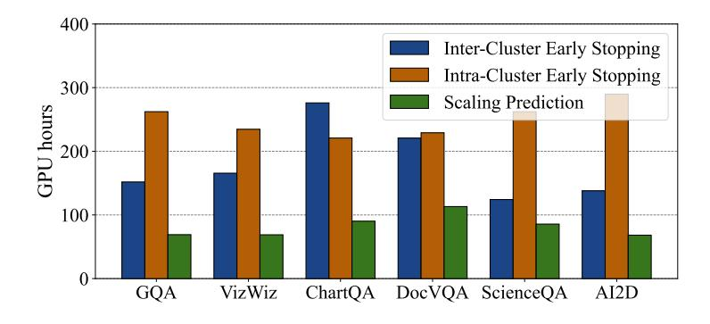

Figure 11. Total evaluation time breakdown for Mordal on six datasets.

As shown in Table [2,](#page-6-4) When evaluating Mordal on different tasks, the total evaluation time required is different. To investigate the differences in time consumption, we analyze the breakdown time for each component of Mordal and present the result in [11.](#page-12-2) As expected, the early stopping stage consists of most of the evaluation time, and the prediction only takes a small part of time. This is because the scaling prediction is only performed for the candidates left after early stopping. The time varies depending on when the model is converged and scaling is observed. The time for inter-cluster and intra-cluster early stopping depends on the number of clusters, controlled by tve and tllm. The cluster is generally less obvious for difficult tasks (e.g., ChartQA and DocVQA), leading to many clusters with only one candidate. As fewer candidates are eliminated, the total evaluation time increases.

### <span id="page-13-0"></span>C.2 Sensitivity Analysis

| Category      | Config           | Time | Top-1 Score | τ    |
|---------------|------------------|------|-------------|------|
| Mordal        | Default          | 483  | 66.4        | 0.81 |
| Candidate     | tve<br>= 0.5     | 446  | 66.4        | 0.52 |
| Clustering    | tve<br>= 0.9     | 1041 | 66.4        | 0.86 |
| Inter-Cluster | topkinter<br>= 2 | 417  | 66.4        | 0.73 |
| Evaluation    | topkinter<br>= 4 | 564  | 66.4        | 0.83 |
| Intra-Cluster | topkintra<br>= 2 | 451  | 66.4        | 0.81 |
| Evaluation    | topkintra<br>= 4 | 522  | 66.4        | 0.81 |
| Prediction    | p = 4            | 501  | 66.4        | 0.81 |
|               |                  |      |             |      |

Table 5. Summary of sensitivity analysis for GQA.

Sensitivity analysis explores how key hyperparameters affect Mordal's performance and efficiency, focusing on clustering thresholds tve and tllm, exploration parameters sinter and sintra, and scaling prediction p. Careful tuning of these parameters ensures efficient operation without compromising Mordal's ability to select top-performing models. Generally, Mordal is robust and consistently identifies the best-performing model across most hyperparameter settings.

Effect of clustering hyperparameters. The clustering threshold tve and tllm significantly affects Mordal's performance and efficiency. As shown in Table [5,](#page-13-0) a smaller threshold tve = 0.5 creates fewer, larger clusters based on the LLM's general characteristics, which will lower the τ value by missing finer distinctions and discarding strong candidates with other LLM backend. On the other hand, a larger threshold tve = 0.9 results in more, smaller clusters, capturing subtle differences and improving the τ value but increasing the number of candidates to evaluate during scaling prediction, leading to longer searching time. Balancing the threshold is crucial to ensure diverse clusters while keeping the computational cost reasonable.

Effect of inter- and intra-cluster hyperparameters. Based on Table [5,](#page-13-0) inter-cluster exploration generally has a greater impact on Mordal's performance than intra-cluster exploration. A smaller topkinter reduces the number of clusters evaluated, speeding up the search but lowering the τ value by excluding promising clusters aggressively. A larger topkinter explores more clusters, increasing search time but improving the τ value by retaining diverse clusters. Intra-cluster early stopping affects candidate selection within clusters, with smaller topkintra focusing on fewer candidates and larger topkintra exploring more candidates for scaling prediction. However, its influence is smaller, as clusters already limit diversity. Properly balancing these topkinter and topkintra ensures efficient exploration and strong performance.

Effect of scaling prediction hyperparameters. The scaling prediction parameter p has minimal impact on Mordal's overall performance but affects search time. Increasing p beyond appropriate values adds to the computational cost without improving results. In practice, p = 3 is sufficient for constructing the linear regression model used in scaling prediction.

### D Discussion

While Mordal demonstrates promising results in efficiently selecting pretrained models fo VLM with small vision encoders and 7B LLMs under a single-request, certain limitations must be addressed to extend its utility and effectiveness. Below, we discuss two key areas for improvement: scaling to different model sizes and optimizing across similar user requests.

VLM alignment. One must go through an *alignment* process to ensure that the individual components of the VLM are well integrated before using it. Developers integrate pretrained LLMs and visual encoders, training the projector from

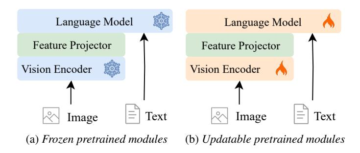

Figure 12. Alternative alignment approaches for VLM instruction tunning.

scratch using visual alignment datasets like VQA [\(Antol et al., 2015\)](#page-8-19) . During the alignment process, pretrained components may remain frozen or be further finetuned during alignment training [\(Liu et al., 2023a\)](#page-9-1). Recently, some proprietary models have employed end-to-end training without using any pretrained models [\(Bai et al., 2023\)](#page-8-1), but it is not common due to the excessive training cost. While Mordal addresses pretrained model selection in a popular VLM setting, it would be interesting to investigate its effectiveness under other VLM structures with and without pretrained components.

Extend to smaller and larger models. Mordal's design and evaluation have focused on small size (i.e., 7B) pretrained models, making it efficient and practical for scenarios with limited computational resources. However, extending Mordal to handle smaller (e.g., 1B) and larger models (e.g., 70B) introduces new challenges. For example, the computational overhead associated with larger models significantly increases, requiring more memory and longer processing times for alignment and evaluation. Mordal's current optimization strategies may not scale effectively under these conditions, necessitating further refinement to manage resource demands. Additionally, the similarity measurements and observational scaling law used to speed up evaluation could become less effective with smaller or larger models due to shifts in their feature spaces, potentially reducing the accuracy of candidate selection. To address these challenges, future iterations of Mordal must incorporate distributed computing frameworks and advanced resource allocation techniques. Adjustments to representation similarity metrics and scaling law formulations will also be essential to maintain the framework's robustness as models vary in size and complexity.

Similar requests among users. Mordal's current implementation is designed to optimize pretrained model selection for a single request at a time, which limits its efficiency in handling multiple similar tasks submitted by users. This approach overlooks opportunities to reduce redundant computations when user requests share overlapping requirements, leading to inefficient use of computational resources. By evaluating a shared set of model candidates for grouped tasks, Mordal could eliminate redundant computations and improve throughput. For example, implementing a caching mechanism to store and reuse results for previously evaluated models and tasks could further enhance resource efficiency. Addressing these limitations would enable Mordal to support multi-user environments and dynamic workloads more effectively.

### E Related Work

Model selection. Previous model selection methods typically assume that all models share identical architectures, differing only in their pretraining datasets [\(Tran et al., 2019\)](#page-9-23). Recent research focuses on similarity-based approaches, which involve finetuning a model on a target dataset and then measuring feature similarity between the finetuned model and candidate models to predict their finetuning performance [\(Vu et al., 2020\)](#page-10-3). Other methods have introduced training-free approaches to assess the transferability of pretrained features to target tasks without requiring additional finetuning [\(You et al., 2021\)](#page-10-1). Some of these methods estimate model suitability based on intrinsic feature properties, while others frame model selection as a rank or recommendation problem [\(Vu et al., 2020\)](#page-10-3). However, these techniques are primarily designed for classification and regression tasks, making them unsuitable for open-world text generation[\(Bao et al., 2019\)](#page-8-20). LLM-based selection [\(Lin](#page-9-4) [et al., 2024\)](#page-9-4) methods also fail to work in VLM since the pretrained models are not aligned with each other. Given the rapidly increasing number of open-source VLMs, there is an urgent need to develop methods specifically tailored for VLM pretrained model selection.