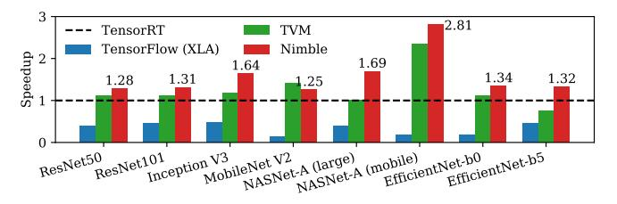
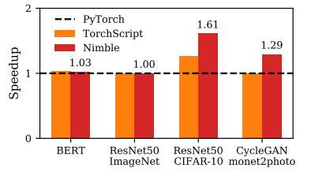
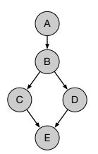

- 1 Thank you for the insightful comments and the opportunity to follow up.
- 2 R1, R2, R3: Comparing Nimble with TensorRT, TVM, TensorFlow(XLA). TensorRT and TVM employ graph optimizations (e.g., aggressive operator fusion) and kernel selection/tuning, which are orthogonal to our idea. We
- applied operator fusion (less aggressive than TensorRT's) and basic kernel selection for Conv op (use either cuDNN or
- 5 PyTorch's native implementation) to Nimble and measure its performance. Figure 1 shows that Nimble outperforms all
- cases except MobileNet V2 (TVM). The reason is that TVM spends more than a day in tuning Conv kernels of a model,
- 7 and such tuning happens to be remarkably effective on MobileNet V2, finding more efficient kernels compared to those
- 8 of cuDNN and PyTorch. Note that TensorRT and TVM do not support training for now. We will add these results in our
- revised paper, along with detailed discussions on related works including TorchScript and TFRT.

Figure 1: Speedup compared to TensorRT on inference workloads (batch size 1) using V100.

10

11

12

13

14

15

17

18

19

20

24

25

26

27

29

30

31

32

33

34

35

Figure 2: Speedup compared to Py-Torch on training using V100.

Figure 3: An example DAG.

R2: Clarifying our contributions. Nimble is the first work to automatically avoid framework overheads and aggressively parallelize GPU kernels using multiple streams for static DL models. Nimble introduces ahead-of-time (AoT) preparation to avoid framework overheads (details discussed below). This AoT preparation can be done quickly, and Nimble does not experience the overheads when executing the DL model afterwards. Furthermore, this opens up an opportunity to more efficiently utilize multiple GPU streams (as discussed in the first paragraph of §3.2). Nimble proposes a new multi-stream algorithm that maximizes parallelism and minimizes the number of synchronizations across streams. Nimble automates applying these techniques by capturing the GPU kernel call trace and running only GPU kernel calls for each execution, without redesigning the framework runtime. Nimble also uses CUDAGraph to reduce the number of GPU kernel launches. As a result, Nimble exhibits significant inference (and training) speedup on various models. Moreover, Nimble is easy to use; a user just needs to wrap a PyTorch model in a Nimble object (two additional lines), and use the Nimble object for inference or training.

Nimble's approach is different from prior approaches that identify framework overheads and remove such overheads.
Instead, Nimble captures the core DL computations (i.e., GPU kernel call trace) to run and prepares an environment for executing the captured trace for a new input.

**R2:** Sources of framework overhead. As discussed in the paper, the framework overhead is incurred not only by well-known sources like memory allocation but also by other sources such as inferring the output shape, dispatching appropriate GPU kernels, and preparing GPU kernel arguments. Existing approaches (e.g., memory preallocation) are limited to specific sources of overhead. Redesigning the framework to remove all sources is very challenging. As described above, we present a solution to avoid all overhead sources without rewriting the framework.

R1, R2: Large training workloads. Figure 2 shows Nimble's performance when training larger models. We use batch sizes of 32, 64, and 1 for BERT, ResNet50, and CycleGAN respectively. As shown in the result of BERT and ResNet50 (ImageNet), framework overhead is less pronounced when a model mostly consists of large kernels (kernels with large amounts of computation), leading to limited performance improvement in Nimble. We will include these results to show the limitations of Nimble in our revised paper. Nonetheless, there exist other important cases where the model contains small kernels. For example, training classification models on the CIFAR dataset or training typical GAN models generally involve small kernels, hence Nimble achieves training speedup on such models.

R2: Generality of Nimble. Nimble supports static DL models, and is not applicable to dynamic models. Yet, we believe that Nimble covers a wide range of models and has practical, real-world impacts; for instance, TensorRT is widely deployed in production albeit its limited applicability.

R3: Stream capture / Initialization cost / Comments on §3.2 and Proof. We capture all operations of the model at once. The mean and maximum AoT preparation time for the models in Figure 1 are 0.35 s and 1.07 s (NASNet-A (large)), respectively. We will describe the algorithm and proof more clearly in our revised paper.

**R3:** Simplifying the stream assignment algorithm. To our understanding, we cannot omit the process of constructing a bipartite graph. We describe an example in Figure 3. Since every path from A to E includes the edge (A, B), the maximum flow of graph is trivially 1, and does not give useful information for the stream assignment of the graph. We greatly appreciate the suggestions.