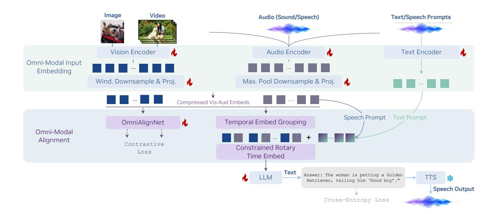

# 1. Introduction

The progress of multimodal LLMs has demonstrated appealing applications when LLMs learn to see with vision [64, 68, 2] or listen with audio [39, 20, 94]. Recent work has enabled joint video-audio alignment, further unifying their strengths towards general intelligence [80, 103, 95, 110, 1, 106]. However, training such an omni-modal system can be expensive and challenging across many dimensions, as it relies on proper choices of network architecture and data recipe.

Figure 2 | We introduce a foundation model for omni-modal understanding. Our model blends information from vision, audio, and text modalities into a unified omni-modal token sequence via the proposed omni-modal alignment mechanism.

This work presents a systematic exploration of developing omni-modal LLMs aiming to enable simultaneous understanding of vision, audio (encompassing both natural sounds and human speech), and language. We ablate and validate the design choices overseeing model architecture design, data curation, and training strategy. For model architecture, we introduce a new framework to harmonize vision and audio embeddings in a unified omni-modal embedding space, featuring three new techniques: (i) *OmniAlignNet* that learns to construct a modality-shared space to align vision and audio embeddings from the same video; (ii) *Temporal Embedding Grouping* that divides the time dimension into multiple chunks and reorganizes the vision and audio embeddings according to their timestamps to align with the corresponding chunks; (iii) *Constrained Rotary Time Embedding* to directly insert periodic temporal information into vision-audio embeddings. We observe noticeable performance improvements with these techniques, as shown later in our experiments. On the data front, we curate 24 million high-quality multimodal conversation samples that span a diverse set of tasks across audio, video, and image domains, including both modal-specific conversations and omni-modal conversations. We tackle the scarcity of omni-modal data by exploiting existing video-with-audio QA data, which implicitly encodes omni-modal signals (*implicit learning*). To further facilitate omni-modal learning, we generate synthetic conversations with explicit omni-modal labels (*explicit learning*).

Our findings enable a frontier omni-modal model, named OmniVinci. See a quick performance comparison in Figure 1 and more in our experimental section. Compared to prior art such as Qwen2.5-Omni and Gemini-2.5-Pro, OmniVinci further pushes the boundary of various multimodal understanding tasks, with gains of +2.83% on WorldSense and +19.05% on Dailyomni for joint vision-audio understanding, +1.7% on MMAR for audio understanding, and +3.9% on Video-MME for vision understanding. OmniVinci also pushes on efficiency fronts using only 0.2T training tokens, around  $6\times$  fewer than Qwen2.5-Omni's 1.2T tokens. More encouragingly, we observe the synergy between audio and video, not only for perception, but also for reasoning. Finally, we demonstrate that OmniVinci has enabled or improved a wide range of important downstream applications, including robotics, video broadcasting, medical, and smart factory use cases.

