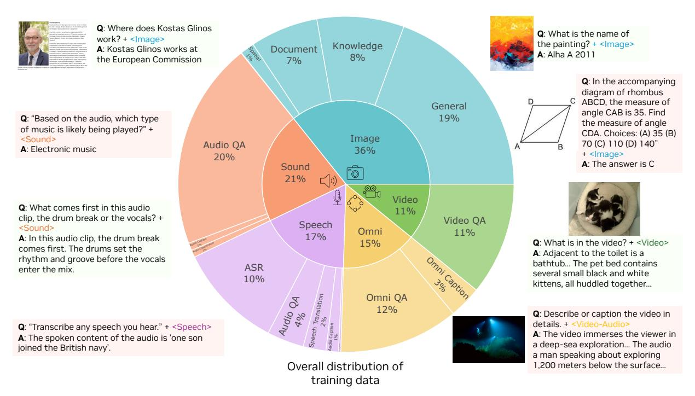

# *4.1.1. Visual-Audio Alignment Scheme*

**Baseline Setup.** To investigate the behavior of omni-modal models under various experimental conditions we gradually introduce new techniques onto a baseline model trained with 10B tokens randomly sampled subset of the full data mixture (the sampling process is weighted according to the original dataset sizes). We evaluate model performance on Worldsense [\[6\]](#page-12-2), Dailyomni [\[116\]](#page-19-1), and Omnibench [\[62\]](#page-16-2).

Figure 5 | Pie chart of overall distribution of training data across modalities, showing proportions for image (36%), non-speech sound (21%), speech (17%), omni (15%), and video (11%).

Table 1 | Ablation study for omni-modal alignment. The proposed Temporal Embedding Grouping (TEG), Constrained Rotary Time Embedding (CRTE), and OmniAlignNet consistently achieve better average performance across modalities.

| Method                         | Omni                          |                                |                               |                    |  |  |  |
|--------------------------------|-------------------------------|--------------------------------|-------------------------------|--------------------|--|--|--|
| Method                         | Worldsense $\uparrow$         | Dailyomni $\uparrow$           | Omnibench $\uparrow$          | Average $\uparrow$ |  |  |  |
| Token Concatenation – Baseline | 42.21                         | 54.55                          | 36.46                         | 45.51              |  |  |  |
| + TEG (ours)                   | $44.51_{+2.30}$               | $60.99_{+6.44}$                | $37.65_{+1.19}$               | $47.72_{+2.21}$    |  |  |  |
| ++ Learned Time Embedding      | $44.58_{+2.37}$               | $60.40_{+5.85}$                | $36.91_{+0.45}$               | $47.30_{+1.79}$    |  |  |  |
| ++ RoTE                        | $44.42_{+2.21}$               | $60.74_{\pm 6.19}$             | $38.24_{\pm 1.78}$            | $47.80_{+2.29}$    |  |  |  |
| ++ CRTE (ours)                 | $45.46_{\pm 3.25}$            | $65.66_{\pm 11.11}$            | $39.64_{+3.18}$               | $50.25_{\pm 4.74}$ |  |  |  |
| +++ OmniAlignNet (ours)        | <b>46.21</b> +4.00 | <b>65.83</b> +12.28 | <b>45.74</b> +9.28 | $52.59_{+7.08}$    |  |  |  |

**Temporal Embedding Grouping.** We observe immediate performance improvements with TEG applied to the baseline and present the results in Table 1, thanks to the enhanced temporal alignment of modality tokens.

Constrained Rotary Time Embedding. We next compare CRTE with other design choices: (i) "Learned Time Embedding" that defines a trainable embedding matrix, where each discrete timestamp in the range  $[0, T_{max}]$  is mapped to a unique vector via MLP. (ii) "RoTE" [38], a recent embedding method introduced in Section 2.1. As summarized in Table 1, the "Learned Time Embedding" method slightly degrades performance (47.30), indicating it is unsuitable for absolute timestamps. RoTE offers only marginal gains, while the proposed Constrained Rotary Time Embedding achieves the best score (50.25), clearly improving over the baseline.

**OmniAlignNet.** Finally, we impose the proposed OmniAlignNet on top of TEG and CRTE. As shown in the bottom section of Table 1, OmniAlignNet delivers significant performance boosts across all benchmarks. The average score improves from 50.25 to 52.59 (+2.34), and the model achieves considerable gains on Omnibench (+6.1), Worldsense (+0.75), and Dailyomni (+1.17).

Table 2 | Ablation study on joint visual-audio learning methods. "Visual+Audio" uses audio in video for implicit learning (IL), while "data engine" generates omni-modal data for explicit learning (EL).

| Method                            | Video              | $\mathbf{MME} \uparrow$ | VideoMME w/o sub. $\uparrow$ |                 |                    |  |  |
|-----------------------------------|--------------------|-------------------------|------------------------------|-----------------|--------------------|--|--|
|                                   | w/ subtitles       | w/o subtitles           | Short                        | Medium          | Long               |  |  |
| Visual Alone                      | 66.37              | 61.67                   | 74.22                        | 59.67           | 51.11              |  |  |
| Visual + Audio (IL)               | $66.96_{\pm 0.59}$ | $63.76_{+2.09}$         | $71.31_{-2.91}$              | $64.16_{+4.49}$ | $55.82_{\pm 4.71}$ |  |  |
| Visual + Audio + Data Engine (EL) | $68.63_{+2.26}$    | $67.37_{+5.70}$         | $76.78_{+2.56}$              | $67.56_{+7.89}$ | $57.78_{+6.67}$    |  |  |

## 4.1.2. Implicit and Explicit Learning

We next validate implicit and explicit omni-modal learning as detailed in Section 3.2. For implicit learning, we continue to finetune the above model on 270K video conversations with audio stream. Results in Table 2 show clear gains on VideoMME [33], even when subtitles are provided, highlighting the value of learning directly from audio. Further adding explicit learning data from our omni-modal data engine yields stronger improvements across benchmarks, showing the effectiveness of our data pipeline.

#### 4.2. Scaling and Evaluation

With validated design choices, we now scale up the experiments using the full post-training omni-modal dataset introduced in Section 3.2. Training details are in Appendix C.3.

Table 3 | Omni benchmarks, including video-audio datasets Worldsense and Dailyomni, as well as the image-audio dataset Omnibench.

| Model        | Worldsense $(Video-Audio\uparrow)$ | Omni Dailyomni $(Video-Audio \uparrow)$ | $\begin{array}{c} \text{Omnibench} \\ (\textit{Image-Audio} \uparrow) \end{array}$ | Avg. (†) |
|--------------|------------------------------------|-----------------------------------------|------------------------------------------------------------------------------------|----------|
| Gemini       | _                                  | 61.32 (2.0 Flash Lite)                  | 42.91 (1.5 Pro)                                                                    | -        |
| GPT-4o       | 42.60                              | _                                       | _                                                                                  | -        |
| InternVL2    | 39.10                              | _                                       | 47.55 (v2.5)                                                                       | -        |
| Qwen2-VL     | 32.40                              | =                                       | 48.60                                                                              | -        |
| Qwen2.5-Omni | 45.40                              | 47.45                                   | 56.13                                                                              | 49.66    |
| OmniVinci    | 48.23                              | 66.50                                   | 46.47                                                                              | 53.73    |

#### 4.2.1. Omni-Modal Benchmark

We first evaluate on omni-modal understanding benchmarks and show results in Table 3. OmniVinci sets a new state-of-the-art average score of 53.73, and marks a notable improvement of +4.07 compared to the next best model, Qwen2.5-Omni. On the Worldsense benchmark, our model achieves the highest score of 48.23, surpassing Qwen2.5-Omni by +2.83. The advantage is even more significant on the Dailyomni dataset, where our model attains a score of 66.50, leading by +19.05 over Qwen2.5-Omni and by +5.18 over Gemini-2.0-Flash-Lite. In the Omnibench benchmark, our model shows a solid score of 46.47, higher than Gemini 1.5 Pro-

## 4.2.2. Audio Benchmark

**Audio QA.** We assess our model on audio understanding benchmarks, MMAR [73] and MMAU [89], with results reported in Tables 4 and 6. On MMAR, OmniVinci surpasses Qwen2.5-Omni by +1.7, and on MMAU by +0.6, highlighting significant improvement in general audio understanding.

**Speech Recognition.** To assess the automatic speech recognition (ASR) capabilities of OmniVinci, we evaluate it on four widely used benchmarks: LibriSpeech [81], AMI [56], Tedlium [88], and VoxPopuli[98], comparing against leading multi-modal models. As

Table 4 | Audio QA benchmark.

| Model             | $\mathbf{MMAR}\ (\uparrow)$ |
|-------------------|-----------------------------|
| LTU               | 19.20                       |
| Audio Flamingo 2  | 21.90                       |
| Qwen-2-Audio      | 30.40                       |
| SALAMONN          | 33.20                       |
| Baichuan-Omni-1.5 | 40.70                       |
| Qwen2.5-Omni      | 56.70                       |
| OmniVinci         | 58.40                       |

Table 5 | Multi-domain speech recognition benchmarks. \*Results taken from related papers; details in Appendix [D.3.](#page-31-0)

|                  | WER (↓) |         |      |      |      |      |  |  |
|------------------|---------|---------|------|------|------|------|--|--|
| Model            | LSclean | LSother | AMI  | Ted. | Vox. | Avg. |  |  |
| Whisper-large-v3 | 1.8     | 3.6     | 16.1 | 3.9  | 10.1 | 7.1  |  |  |
| Qwen2-Audio      | 1.7     | 4.1     | 15.2 | 3.1  | 7.1  | 6.4  |  |  |
| GPT-4o-real-time | 2.5     | 5.0     | 19.3 | 4.1  | 12.1 | 8.6  |  |  |
| Gemini-2.0-Flash | 2.5     | 5.9     | 21.5 | 3.0  | 7.9  | 8.2  |  |  |
| Phi-4-MM         | 1.7     | 3.8     | 11.5 | 2.9  | 5.9  | 5.2  |  |  |
| Qwen2.5-omni     | 1.8*    | 3.4*    | 17.9 | 5.2  | 5.8* | 6.8  |  |  |
| OmniVinci        | 1.7     | 3.7     | 16.1 | 3.4  | 6.8  | 6.3  |  |  |

Table 6 | MMAU audio benchmark.

|                      |       | Music     |       | Sound     |       | Speech    | Avg   |           |  |
|----------------------|-------|-----------|-------|-----------|-------|-----------|-------|-----------|--|
| Model                | Test  | Test-mini | Test  | Test-mini | Test  | Test-mini | Test  | Test-mini |  |
| Gemini 2.5 Pro       | 68.26 | 64.77     | 70.63 | 75.08     | 72.67 | 71.47     | 71.60 | 69.36     |  |
| Gemini 2.5 Flash     | 76.58 | 69.40     | 65.57 | 69.50     | 71.80 | 68.27     | 69.57 | 67.39     |  |
| Kimi-Audio           | 62.16 | 65.93     | 66.77 | 70.70     | 56.57 | 68.20     | 64.40 | 68.20     |  |
| Phi-4-multimodal     | 61.97 | 64.37     | 62.67 | 65.47     | 63.80 | 67.27     | 62.81 | 65.70     |  |
| Audio Flamingo 2     | 44.74 | 70.20     | 68.13 | 70.96     | 44.87 | 62.40     | 61.06 | 62.40     |  |
| GPT-4o Audio         | 49.93 | 56.29     | 63.20 | 64.56     | 69.33 | 66.67     | 60.82 | 62.50     |  |
| Qwen2-Audio-Instruct | 55.26 | 55.67     | 56.29 | 61.17     | 59.60 | 55.37     | 57.40 | 59.60     |  |
| Gemma 3n 4B          | 61.26 | 53.20     | 56.89 | 50.27     | 58.00 | 62.13     | 58.00 | 55.20     |  |
| Qwen2.5-Omni         | 67.33 | 65.90     | 76.77 | 78.10     | 68.90 | 70.60     | 71.00 | 71.50     |  |
| OmniVinci            | 73.07 | 73.65     | 73.57 | 78.68     | 68.17 | 66.97     | 71.60 | 73.10     |  |

shown in Table [5,](#page-8-1) our model achieves competitive word error rates (WER) of 1.7 on LibriSpeech-clean and 3.7 on LibriSpeech-other, closely matching or surpassing the latest works.

We further investigate OmniVinci's performance under two agentic-cascaded setups: (i) incorporating ASR text history [\[47\]](#page-15-3) and (ii) leveraging retriever-based training as shown in Figure [16.](#page-32-0) These techniques help boost OmniVinci's capacity, yielding average WERs of **5.7** and **5.0**, respectively. These test-time scaling studies are provided in Appendix [D.3](#page-32-0) (Table [19\)](#page-32-1).

