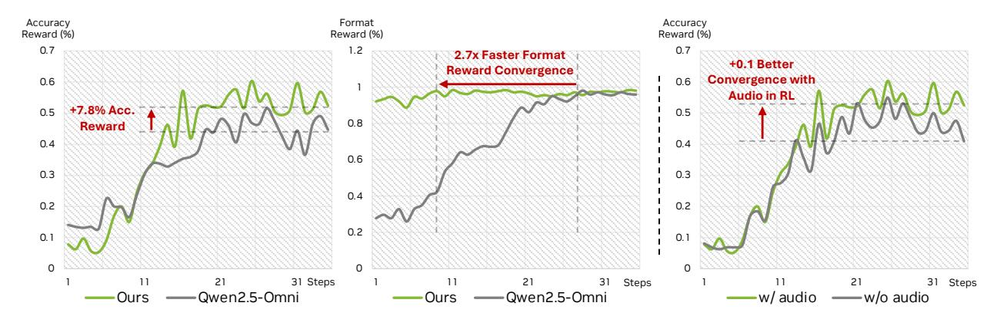

# *4.2.4. Image Benchmark*

We evaluate OmniVinci on ten image benchmarks to test its versatility. These tasks range from understanding diagrams and charts (AI2D [\[51\]](#page-15-4), ChartQA [\[75\]](#page-16-5)) to document analysis (DocVQA [\[76\]](#page-16-6)), mathematics (Math-Vista [\[72\]](#page-16-7)) and general visual question answering (VQAv2-testdev [\[43\]](#page-15-5)). As shown in Table [8,](#page-9-1) OmniVinci consistently achieves competitive scores across the board.

|  | Table 7   Video benchmarks. OmniVinci outperforms NVILA baseline. |
|--|-------------------------------------------------------------------|
|--|-------------------------------------------------------------------|

| Model            |     |      | LongVideoBench ↑ | MVBench ↑ | Video-MME ↑ |  |
|------------------|-----|------|------------------|-----------|-------------|--|
|                  |     | val  | test             | test      | w/o sub.    |  |
| GPT-4o mini      | -   | 56.5 | 58.8             | –         | 64.8        |  |
| GPT-4o           | -   | 66.7 | 66.7             | –         | 71.9        |  |
| LLaVA-NeXT-Video | 7B  | 43.5 | 43.5             | 33.7      | 46.5        |  |
| InternVL2        | 8B  | 54.6 | –                | 65.8      | 56.3        |  |
| LLaVA-OneVision  | 8B  | 56.5 | –                | 56.7      | 58.2        |  |
| LongVILA         | 7B  | 57.1 | –                | 67.1      | 60.1        |  |
| Qwen2.5-VL       | 8B  | 56.0 | -                | 69.6      | 65.1        |  |
| Qwen2.5-Omni     | 11B | -    | -                | 70.3      | 64.3        |  |
| NVILA            | 8B  | 57.7 | 58.7             | 68.1      | 64.2        |  |
| OmniVinci        | 9B  | 61.3 | 62.0             | 70.6      | 68.2        |  |

Table 8 | Image benchmarks. OmniVinci maintains comparable image understanding performance with NVILA.

|                   |     |         |      |      |      | AI2D ChartQA DocVQA InfoVQA MathVista |      | MMMU           |      | Real    |       | SEED TextVQA VQAv2 |         |
|-------------------|-----|---------|------|------|------|---------------------------------------|------|----------------|------|---------|-------|--------------------|---------|
|                   |     | test    | test | test | test | testmini                              | val  | test           | pro  | WorldQA | image | val                | testdev |
| GPT-4o            | –   | 94.2    | 85.7 | 92.8 | 79.2 | 63.8                                  | 69.1 | 64.7           | 51.9 | 75.4    | 76.2  | 77.4               | 78.7    |
| Claude 3.5 Sonnet | –   | 94.7    | 90.8 | 85.2 | 74.3 | 67.7                                  | 68.3 | 63.7           | 51.5 | 60.1    | –     | 74.1               | 70.7    |
| Gemini 1.5 Pro    | –   | 94.4    | 87.2 | 93.1 | 81.0 | 63.9                                  | 62.2 | 57.6           | 43.5 | 70.4    | –     | 78.7               | 80.2    |
| LLaVA-1.5         | 7B  | 55.5    | 17.8 | 28.1 | 25.8 | 25.6                                  | 35.7 | –              | –    | 54.8    | 66.1  | 58.2               | 78.5    |
| VILA-1.5          | 8B  | 76.6    | 52.7 | 40.6 | 25.9 | 36.7                                  | 38.6 | 32.7           | –    | 52.7    | 73.8  | 68.5               | 83.0    |
| Cambrian-1        | 8B  | 73.0    | 73.3 | 77.8 | 41.6 | 49.0                                  | 42.7 | –              | –    | 64.2    | 74.7  | 71.7               | 81.2    |
| Florence-VL       | 8B  | 74.2    | 74.7 | 84.9 | 51.7 | 55.5                                  | 43.7 | –              | –    | 64.2    | 74.9  | 74.2               | 84.7    |
| LLaVA-OneVision   | 8B  | 81.4    | 80.0 | 87.5 | 68.8 | 63.2                                  | 48.8 | 42.8           | 24.1 | 66.3    | 75.4  | 78.3               | 84.0    |
| Llama 3.2         | 11B | 91.9    | 83.4 | 88.4 | –    | 51.5                                  | 50.7 | –              | –    | –       | –     | –                  | 75.2    |
| InternVL2         | 8B  | 83.8    | 83.3 | 91.6 | 74.8 | 58.3                                  | 51.2 | 42.6           | 29.0 | 64.2    | 76.2  | 77.4               | 76.7    |
| Qwen2-VL          | 8B  | 83.0    | 83.0 | 94.5 | 76.5 | 58.2                                  |      | 54.1 46.6 30.5 |      | 70.1    | 76.0  | 84.3               | 82.9    |
| NVILA             |     | 8B 92.3 | 86.1 | 93.7 | 70.7 | 65.4                                  | 49.9 | 44.4           | 27.8 | 68.6    | 76.5  | 80.1               | 85.4    |
| OmniVinci         | 9B  | 91.5    | 84.6 | 91.5 | 69.0 | 63.5                                  | 49.7 | 44.6           | 26.4 | 67.5    | 77.1  | 83.9               | 85.4    |

## **4.3. Omni-Modal Reasoning**

Building on advances in the Group Relative Policy Optimization (GRPO) [\[90\]](#page-17-10) algorithm and prior work on multi-modal reasoning training [\[17,](#page-13-2) [31\]](#page-14-4), we next tackle omni-modal reasoning through accommodating audio tokens in addition to visual ones.

Specifically, for each given question and omni-modal input = {*, ,* } ( is textual input, is visual input, and is audio input, respectively), the sampling number is , the policy model, under the old policy , generates a set of candidate answers {1*,* 2*, ...,* } along with corresponding rewards {1*,* 2*, ...,* }, where the rewards are computed by a rule-based function that evaluates format and accuracy [\[90\]](#page-17-10). The model is then optimized by maximizing the following objective:

$$\mathcal{J}(\theta) = \mathbb{E}_{q,\{o_i\}} \left[ \frac{1}{G} \sum_{i=1}^{G} (\min(\frac{\pi_{\theta}(o_i|q_t, q_v, q_a)}{\pi_{\theta_{old}}(o_i|q_t, q_v, q_a)} A_i, \operatorname{clip}(\frac{\pi_{\theta}(o_i|q_t, q_v, q_a)}{\pi_{\theta_{old}}(o_i|q_t, q_v, q_a)}, 1 - \epsilon, 1 + \epsilon) A_i) -\beta \mathbb{D}_{KL}(\pi_{\theta}||\pi_{ref})) \right], \tag{6}$$

where and are hyper-parameters of each loss part, the sampling number is set as 8. The rewards {1*,* 2*, ...,* } are normalized to get the advantages () for updating the model:

$$A_i = \frac{r_i - \text{mean}(\{r_1, r_2, ..., r_G\})}{\text{std}(\{r_1, r_2, ..., r_G\})}.$$
(7)

Table 9 | Ablation study of GRPO post-training.

|                           |       | Omni       |                                                     |            |
|---------------------------|-------|------------|-----------------------------------------------------|------------|
| Model                     |       |            | Worldsense (↑) Dailyomni (↑) Omnibench (↑) Avg. (↑) |            |
| OmniVinci                 | 48.23 | 66.50      | 46.47                                               | 53.73      |
| OmniVinci + RL 48.70+0.47 |       | 67.08+0.58 | 47.79+1.32                                          | 54.52+0.79 |

Figure 6 | **Left:** Accuracy reward and format reward curves of OmniVinci and Qwen2.5-Omni in RL training. **Right:** Accuracy reward curve of OmniVinci with and without audio.

We apply GRPO post-training to the final OmniVinci checkpoint to enhance its performance on omnimodal understanding benchmarks. For training data, we curated a 18K omni-modal MCQ dataset using the omni-modal data engine, as detailed in the methods section. During GRPO training, we utilize the Long-RL [\[17\]](#page-13-2) as the training framework, configure the model to process up to 64 video frames, with a maximum prompt length of 1024 tokens and a maximum response length of 2048 tokens. The update batch size is set to 64, with the rollout number of 8 for each sample, ensuring robust gradient estimation. We employ a temperature of 1.0 and a top-p value of 0.99 for sampling, facilitating diverse exploration during training. These training configurations are carefully designed to optimize the model's ability to handle complex omni-modal reasoning tasks effectively and efficiently.

As shown in Table [9,](#page-10-0) we observe consistent performance gains across all benchmarks after applying RL training. Comparing convergence with Qwen2.5-Omni under the same recipe (Figure [6\)](#page-10-1), both models benefit from our multi-modal RL framework, but OmniVinci leverages stronger base performance and instructionfollowing to surpass Qwen2.5-Omni on the GRPO accuracy curve within 15 steps, while also converging faster on formatting tasks. Ablation experiments further show that including audio input boosts RL effectiveness: with audio, accuracy reward converges +0.1 higher than video-only training (Figure [6,](#page-10-1) right), highlighting the importance of audio for video learning.

**Key Insight 3.** Joint audio-visual input surpasses the visual-alone input for GRPO training, offering faster and better convergence.

