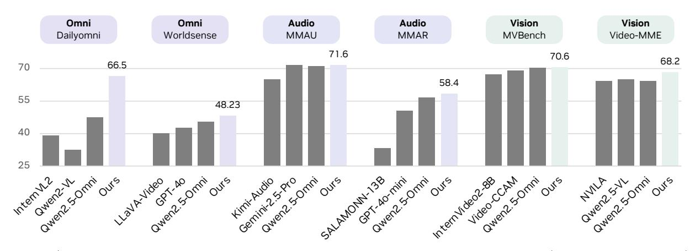

# Abstract

Advancing machine intelligence requires developing the ability to perceive across multiple modalities, much as humans sense the world. We introduce OmniVinci, an initiative to build a strong, open-source, omnimodal LLM. We carefully study the design choices across model architecture and data curation. For model architecture, we present three key innovations: (i) OmniAlignNet for strengthening alignment between vision and audio embeddings in a shared omni-modal latent space; (ii) Temporal Embedding Grouping for capturing relative temporal alignment between vision and audio signals; and (iii) Constrained Rotary Time Embedding for encoding absolute temporal information in omni-modal embeddings. We introduce a curation and synthesis pipeline that generates 24M single-modal and omni-modal conversations. We find that modalities reinforce one another in both perception and reasoning. Our model, OmniVinci, outperforms Qwen2.5-Omni with +19.05 on DailyOmni (cross-modal understanding), +1.7 on MMAR (audio), and +3.9 on Video-MME (vision), while using just 0.2T training tokens - a  $6\times$  reduction compared to Qwen2.5-Omni's 1.2T. We finally demonstrate omni-modal advantages in downstream applications spanning robotics, medical AI, and smart factory.

Figure 1 | OmniVinci demonstrates strong performance across widely used omni-modal (+19.05 on Dailyomni), audio (+1.7 on MMAR), and vision (+3.9 on Video-MME) understanding benchmarks.

