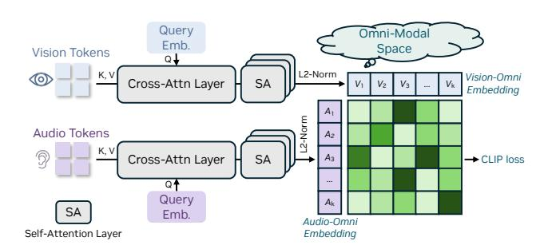

# 2.1. Omni-Modal Alignment Mechanism

We next integrate embeddings from all modalities into a unified latent space as input for LLM.

OmniAlignNet module. For a given input video, the audio and vision streams have an inherent semantic connection, providing complementary information for each other. Such a correlation provides a natural way to more effectively learn and align vision and audio embeddings in the unified latent space. To this end, we propose OmniAlignNet, which strengthens the learning of vision and audio embeddings via exploiting their complementary information. As illustrated in Figure 3, the OmniAlignNet module first maps visual and audio embedding sequences (outputs of modality-specific projectors) into a shared latent embedding space and then aligns them via contrastive learning, inspired by ImageBind [37].

Given an input video with an accompanying audio stream, we denote the sequence of visual embeddings produced by the visual projection layer as  $\mathbf{E}_v \in \mathbb{R}^{N_v \times C}$  and the sequence of audio embeddings produced by the audio projection layer as  $\mathbf{E}_a \in \mathbb{R}^{N_a \times C}$ , with  $N_v$  and  $N_a$  represent the number of visual and audio embeddings, respectively, while C denotes the latent dimensionality. To align representations, we initialize a vision query embedding  $\mathbf{Q}_v \in \mathbb{R}^{1 \times C}$  and an audio query embedding  $\mathbf{Q}_a \in \mathbb{R}^{1 \times C}$ . These queries are used to project  $\mathbf{E}_v$  and  $\mathbf{E}_a$  into fixed-size embeddings of shape  $(1 \times C)$ . Suppose each batch has K videos, the projected features are then processed through three layers of self-attention modules and L2 normalized, yielding the vision-omni embedding  $\mathbf{V} \in \mathbb{R}^{K \times C}$  and the audio-omni embedding  $\mathbf{A} \in \mathbb{R}^{K \times C}$ , respectively, in a modality-shared latent space.

With embeddings  $\mathbf{V}$  and  $\mathbf{A}$  in the shared latent space, we now apply CLIP-style contrastive loss [85] on the output embeddings to minimize intrasample cross-modal distance, while maximizing inter-sample cross-modal distance. Let  $\{\mathbf{V}_i, \mathbf{A}_i\}_{i=1}^K$  be the set of L2-normalized visual and audio embeddings for a batch of K video clips. The similarity between the i-th visual embedding and the j-th audio embedding is computed as their dot product,  $s_{ij} = \mathbf{V}_i^T \mathbf{A}_j$ . The contrastive loss is then formulated as a symmetric cross-entropy loss over the similarity score. The loss for aligning vision to audio  $(L_{v\to a})$  and audio to vision  $(L_{a\to v})$  is:

Figure 3 | Illustration of the proposed Omni Align Net module.

$$L_{v \to a} = -\frac{1}{N} \sum_{i=1}^{N} \log \frac{\exp(s_{ii})}{\sum_{j=1}^{N} \exp(s_{ij})}, L_{a \to v} = -\frac{1}{N} \sum_{i=1}^{N} \log \frac{\exp(s_{ii})}{\sum_{j=1}^{N} \exp(s_{ji})}.$$
 (1)

The final objective for the OmniAlignNet module,  $L_{\text{o-align}}$ , is the average of these two directional losses, encouraging a bidirectional alignment between the modalities:  $L_{\text{o-align}} = \frac{1}{2}(L_{v \to a} + L_{a \to v})$ .

While OmniAlignNet effectively aligns the high-level semantics of visual and audio embeddings, it falls short in modeling their temporal relationships. To overcome this limitation, we introduce two techniques: Temporal Embedding Grouping and Constrained Rotary Time Embedding, which are described in the following sections.

**Temporal Embedding Grouping (TEG).** We first impose temporal order to visual-audio embeddings by organizing them into groups based on their timestamps. The relative temporal order information is then encoded in the position of visual and audio embeddings in the input sequence.

Let the duration of each temporal group be  $T_G$ , which controls the granularity of the grouping. For simplicity, consider a case where we only sample four visual frames at timestamps  $\{t_v^1, t_v^2, t_v^3, t_v^4\}$  and four audio samples at timestamps  $\{t_u^1, t_u^2, t_u^3, t_u^4\}$ . These timestamps satisfy  $t_v^1 < t_v^2 < T_G < t_u^3 < t_v^4 < 2T_G$  and  $t_a^1 < t_a^2 < T_G < t_a^3 < t_u^4 < 2T_G$ . The corresponding set of visual embeddings is  $E_v = \{\mathbf{e}_v^{t_v}, \mathbf{e}_v^{t_v}, \mathbf{e}_v^{t_v}, \mathbf{e}_v^{t_v}, \mathbf{e}_v^{t_v}\}$ , where

each embedding  $\mathbf{e}_v \in \mathbb{R}^{(HW) \times C}$ . Here, H and W represent the height and width of the visual feature map, and C is the latent dimension. Similarly, the set of audio embeddings is  $E_a = \{\mathbf{e}_a^{t_a}, \mathbf{e}_a^{t_a}, \mathbf{e}_a^{t_a}, \mathbf{e}_a^{t_a}, \mathbf{e}_a^{t_a}, \mathbf{e}_a^{t_a}\}$ , with each  $\mathbf{e}_a \in \mathbb{R}^{1 \times C}$ . Based on their timestamps relative to the duration  $T_G$ , the embeddings for each modality are partitioned into two temporal groups:

$$G_v^1 = \{ \mathbf{e}_v^{t_v}, \mathbf{e}_v^{t_v^2} \}, G_v^2 = \{ \mathbf{e}_v^{t_v^3}, \mathbf{e}_v^{t_v^4} \}, G_a^1 = \{ \mathbf{e}_a^{t_a}, \mathbf{e}_a^{t_a} \}, G_a^2 = \{ \mathbf{e}_a^{t_a}, \mathbf{e}_a^{t_a} \}. \tag{2}$$

Then we combine the visual and audio groups based on temporal order, and obtain the omni-modal embedding sequence:

$$\mathbf{E}_{\text{group}} = \left[ G_v^1, G_a^1, G_v^2, G_a^2 \right] = \left[ \mathbf{e}_v^{t_v^1}, \mathbf{e}_v^{t_v^2}, \mathbf{e}_a^{t_a^1}, \mathbf{e}_a^{t_a^2}, \mathbf{e}_v^{t_v^3}, \mathbf{e}_v^{t_v^4}, \mathbf{e}_a^{t_a^3}, \mathbf{e}_a^{t_a^4} \right]. \tag{3}$$

This temporal organization of the embedding sequence allows the subsequent LLM backbone to better capture the temporal relationships among embeddings from different modalities. Our experiments show that this time-based grouping improves the model's ability to comprehend information from multiple modalities.

Constrained Rotary Time Embedding (CRTE). TEG incorporates relative temporal order into embeddings but still lacks the ability to encode absolute timestamp information. Prior work, RoTE [38], explored embedding rotations to inject absolute timestamps, but this method remains sensitive to minor timestamp fluctuations and struggles to capture larger temporal shifts effectively. To overcome these limitations, we introduce a constrained timestamp embedding strategy that defines a maximum time horizon,  $T_{\text{max}}$ , enabling a more balanced temporal sensitivity. Our approach comprises three stages: base frequency construction, frequency modulation, and element-wise rotary embedding, as described next.

Base Frequency Generation. We first define base frequencies as:

$$\omega_i = \frac{2\pi}{T_{\text{max}}\theta^{i/C}}, \quad \text{for} \quad i = 0, 1, \dots, C - 1, \tag{4}$$

where  $\omega_i$  is the base frequency for dimension i, C is the embedding dimension,  $\theta \geq 1$  controls frequency scaling, and  $T_{\text{max}}$  defines the coarsest temporal resolution. A smaller  $T_{\text{max}}$  increases frequency and sensitivity to fine-grained differences, while a larger one captures broader trends but may blur close timestamps, and is thus critical for balancing local and global temporal encoding.

Frequency Modulation. To adapt frequencies to actual timestamps, we scale them as:  $\Omega_{i,j} = \omega_i \cdot t_j$ , where  $\Omega_{i,j}$  is the modulated frequency at dimension i and time  $t_j$  for sample j. This step ensures that temporal differences are reflected in the rotation applied to embeddings.

Rotary Embedding Application. Similar to RoPE [93], given an embedding vector  $\mathbf{x} \in \mathbb{R}^C$  of sample j (a sampled frame for video or a sampling point for audio), we apply rotation as:

$$CRTE(\mathbf{x}, \Omega_{:,i}) = \mathbf{x} \odot \cos(\Omega_{:,i}) + RotateHalf(\mathbf{x}) \odot \sin(\Omega_{:,i}), \tag{5}$$

where  $\odot$  denotes element-wise multiplication, and RotateHalf rotates each pair of dimensions by 90°: RotateHalf( $\mathbf{x}$ ) =  $[-x_2, x_1, -x_4, x_3, \dots, -x_C, x_{C-1}]$ . The RotateHalf function effectively groups the entire C-dimensional embedding vector into C/2 independent 2D planes. Each of these 2D planes gets its own rotation, and the angle of rotation can be different for each pair. We apply rotations at varying frequencies across different pairs of dimensions for two primary reasons: it enables a rich, multi-scale representation of temporal information, and it preserves the semantic integrity of the original embedding vectors.

The base frequency in CRTE,  $\omega_i$  is designed to have a geometric progression of frequencies. For small values of i (e.g., the first pairs of dimensions), the denominator is smaller, resulting in higher frequencies ( $\omega_i$  is large). These dimensions undergo rapid rotation with respect to time. Consequently, they are highly sensitive to fine-grained temporal differences and are effective at distinguishing between timestamps that are close to one another. For large values of i (e.g., the last pairs of dimensions), the term  $\theta^{i/d}$  becomes significantly larger, resulting in lower frequencies ( $\omega_i$  is small). These dimensions rotate slowly, making them suitable for encoding coarse, long-range temporal relationships. They provide a stable signal for large time intervals without the issue of aliasing or "wrapping around" that would occur with high-frequency signals. By partitioning the embedding space into a spectrum of frequencies, the model can concurrently attend to

both local and global temporal contexts. This multi-scale approach provides a robust and comprehensive representation of absolute time.

**Final Embedding Sequence.** After CRTE, the temporally-aligned omni-modal embedding sequence is passed into the LLM backbone, allowing it to integrate both fine- and coarse-grained timing cues during downstream processing.

**Input-Output Configuration.** The final architecture perceives flexible input modality combinations with a subset or union of all modalities, *e.g.*, video with or without audio, with speech or text prompts. On the output end, the text-output based system can be connected with off-the-shelf Text-to-Speech (TTS) modules – we analyze their tradeoffs in Section [D.4.](#page-34-0) Without bells and whistles, users can generate spoken descriptions for videos, answer spoken questions, or verbally instruct robots.

