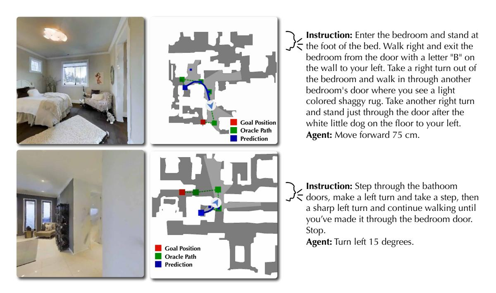
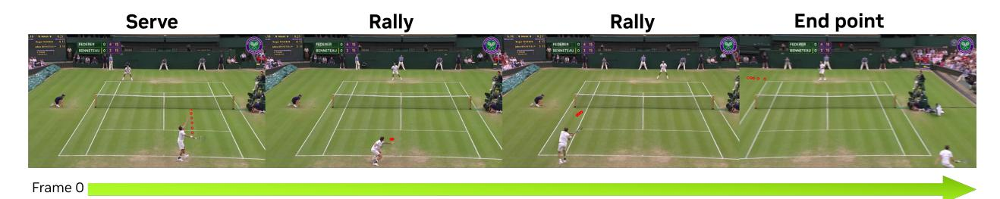

# **B.1. Robotics: Speech-Driven Vision Language Navigation**

Prior work [\[19,](#page-13-10) [114,](#page-19-5) [13\]](#page-13-11) in Vision-Language Navigation [\[3\]](#page-12-4) has predominantly relied on text-based prompts. However, this is not always practical for real-world scenarios where the most convenient and natural way to command a robot is through human speech. As a first step toward this goal, we introduce a speech-driven vision language navigation task. This task is inherently more challenging than its text-based counterpart, as interpreting the nuances of speech is more complex than processing clean text.

Table 10 | Vision Language navigation results on R2R-CE. Our speech-driven model, OmniVinci, achieves comparable performance to the text-driven NVILA, with a lower navigation error.

| Model     | Size Obs. |     | Instruction       |       | R2R Val-Unseen |      |       |  |  |  |
|-----------|--------------|-----|-------------------|-------|----------------|------|-------|--|--|--|
|           |              |     |                   | NE ↓  | OS ↑           | SR ↑ | SPL ↑ |  |  |  |
| Seq2Seq   | –            | RGB | Text              | 10.10 | 8.0            | 0.0  | 0.0   |  |  |  |
| CMA       | –            | RGB | Text              | 9.55  | 10.0           | 5.0  | 4.0   |  |  |  |
| NaVid     | 7B           | RGB | Text              | 5.47  | 49.0           | 37.0 | 35.0  |  |  |  |
| NVILA     | 8B           | RGB | Text              | 5.43  | 60.4           | 53.3 | 48.8  |  |  |  |
| OmniVinci | 9B           | RGB | Audio and/or Text | 5.67  | 60.8           | 50.6 | 45.1  |  |  |  |

Specifically, we fine-tune OmniVinci on the training split of R2R-CE [\[57\]](#page-15-13), a benchmark for Vision-and-Language Navigation in continuous environments, with speech prompts, using 8 history frames for context in line with NVILA [\[69\]](#page-16-9). As shown in the results in Table [10,](#page-21-2) OmniVinci surpasses many text-based models and achieves performance comparable to NVILA. We present qualitative examples in Figure [8](#page-22-1) that illustrate how our speech-driven vision-language-action (VLA) navigation agent functions in practice. The agent is deployed

Figure 8 | An illustration of our speech-driven navigation agent based on OmniVinci. **Left:** Agent's current visual observation. **Middle:** Top-down map indicating the goal position and the agent's past trajectory. **Right:** the input speech instruction and the agent's predicted action given the current observation.

in the Habitat simulator under the continuous environment setting. The demo provides three synchronized views: (1) the agent's current observation in RGB (left), (2) a top-down map indicating the goal location and the trajectory taken so far (middle), and (3) the spoken instruction together with the agent's predicted action, such as moving forward a certain distance or turning left or right by a specified angle (right).

## **B.2. Sport Video Understanding**

Understanding videos of complex sports scenarios requires models to capture both visual dynamics and contextual cues. To evaluate the sports understanding capability of our proposed OmniVinci, we conduct experiments on the SPORTU-video dataset [\[104\]](#page-18-10), a large-scale benchmark for fine-grained sports comprehension. As shown in Table [11,](#page-23-1) OmniVinci-9B delivers strong performance despite its compact scale of 9 billion parameters. These results confirm the effectiveness of our model design and motivate its extension to more demanding, real-world applications such as live sports broadcasting, where both accuracy and efficiency are essential.

To further assess performance in realistic broadcasting settings, we curate a tennis-specific dataset collected from 14 full matches. The dataset contains 24,078 multiple-choice questions and 20,214 open-ended questions derived from pre-clipped videos, each spanning 3–120 seconds with precisely annotated start and end points. Since sports broadcasting requires synchronizing visual actions with speech cues (*e.g.*, live commentators' narration or umpire calls) to enable professional-style commentary, tennis provides an ideal domain for multimodal evaluation.

In our tennis experiments, we evaluate tasks such as identifying the server from player characteristics, determining the point winner, and classifying the outcome type (*e.g.*, ace, forced error, unforced error). The benchmark OmniVinci processes clips at their native resolution (primarily FHD 1920 × 1080), using 128-frame segments per point. As shown in Table [12,](#page-24-2) OmniVinci substantially outperforms Qwen2.5-Omni in predicting point outcomes and rally length, demonstrating the advantages of high-resolution spatiotemporal modeling. Figure [9](#page-23-2) illustrates sample videos with action explanations, along with generated open-ended commentary styled after professional broadcasters.

For efficient deployment, we adopt the LLM-AWQ implementation of Activation-aware Weight Quan-

**System Prompt:** Federer – Roger Federer is the player in the white polo T-shirt and matching shorts. He has a white bandanna tied around his forehead and a white wristband on his right wrist. He is also wearing a pair of white shoes with white socks. Benneteau – Julien Benneteau is the player in the white polo T-shirt with black accents and matching shorts. He has a white wristband on his right wrist and a white pair of shoes with black markings on them. He has a black ankle brace on his right foot as well.

**Instruction:** What happened in this point? Provide a detailed caption.

**Agent:** Benneteau's first serve lands outside the service court, but his second attempt is successful. Federer wins the point with a lengthy rally where Benneteau hits the ball out of bounds with a forehand shot.

**Instruction:** How this point ended between Federer and Benneteau. **Agent:** The point ended when Benneteau hit the ball out of bounds.

Figure 9 | Example of tennis broadcast commentary generation. For better visualization, we added red circle highlights to the tennis ball.

Table 11 | Overall performance of MLLMs on SPORTU-video for multiple-choice questions. The best results within each category are **bolded**. Notably, our OmniVinci model achieves highly competitive accuracy compared with both closed-source and open-source models.

| Model               | (Acc., ↑) |  |  |  |  |
|---------------------|-----------|--|--|--|--|
| Close-Source Model  |           |  |  |  |  |
| Claude-3.0-Haiku    | 47.95     |  |  |  |  |
| Gemini 1.5 Pro      | 64.93     |  |  |  |  |
| Gemini 1.5 Flash    | 62.52     |  |  |  |  |
| GPT-4omini          | 58.19     |  |  |  |  |
| GPT-4o              | 68.79     |  |  |  |  |
| Open-Source Model   |           |  |  |  |  |
| ChatUniVi           | 41.89     |  |  |  |  |
| LLaVA-NeXT          | 63.72     |  |  |  |  |
| mPLUG-Owl3          | 60.80     |  |  |  |  |
| ST-LLM              | 46.39     |  |  |  |  |
| Tarsier             | 60.99     |  |  |  |  |
| Video-ChatGPT       | 34.05     |  |  |  |  |
| VideoChat2          | 61.53     |  |  |  |  |
| Qwen2.5-Omni-7B     | 60.49     |  |  |  |  |
| OmniVinci-9B (ours) | 67.30     |  |  |  |  |

tization [\[63\]](#page-16-14), which enables 4-bit quantization while preserving accuracy. Inference is executed using the TinyChat engine on NVIDIA hardware, supporting multimodal video–audio inputs. On a single NVIDIA A100, OmniVinci achieves an average latency of under 2 seconds per pre-quantized clip, delivering a 45% boost in inference speed and making it well-suited for live broadcasting scenarios. We further validate deployment on NVIDIA L40s GPUs, demonstrating the practicality of our approach in resource-constrained environments.

