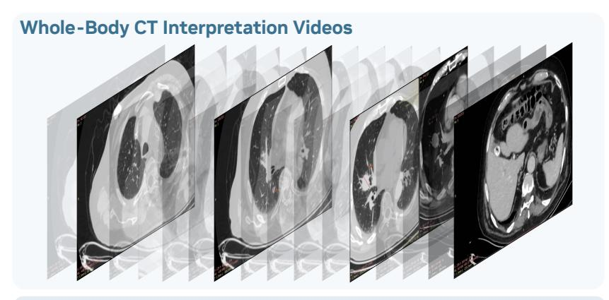

# **B.3. Speech Agent: Speech Translation**

We benchmark OmniVinci on the CoVoST2 [\[97\]](#page-18-11) speech translation task, measuring BLEU scores across multiple target languages in both EN →X and X→EN directions, after fine-tuning on related data, and show the results in Table [13.](#page-24-3) Our model delivers competitive translation quality across most directions, with particularly strong performance in X → EN for Japanese (23.2 BLEU) and Arabic (23.0 BLEU). This balance of accuracy across languages highlights the benefit of integrating speech translation corpora within our omni-modal training pipeline, enabling to perform both recognition and translation in a unified framework. The ability to handle multilingual speech understanding and cross-lingual transfer further broadens the applicability of our model in real-world communication, international dialogue systems, and cross-border

Table 12 | Comparison of video understanding accuracy (%) for tennis broadcasting. Results are evaluated with multiple-choice questions (MCQ). Inference time is measured on an NVIDIA A100, with input clips averaging around 20 seconds in duration. AWQ indicates model quantization performed with the AWQ technique [\[63\]](#page-16-14).

| Model            | Inference Time (Seconds ↓) | Server & Winner | Receiver & Winner | Point Ending | Shots Exchanged |
|------------------|-------------------------------|--------------------|----------------------|-----------------|--------------------|
| Qwen2.5-Omni     | 3.34                          | 96.2               | 90.7                 | 48.6            | 38.3               |
| OmniVinci        | 3.29                          | 100.0              | 100.0                | 85.7            | 89.3               |
| OmniVinci w/ AWQ | 1.85                          | 100.0              | 100.0                | 85.7            | 85.1               |

Table 13 | Performance comparison of different models on Covost2 speech translation tasks measured by BLEU scores. EN → X denotes translation from English to the target language, and X → EN denotes translation from the target language to English. Languages: zh = Chinese, ja = Japanese, ar = Arabic, de = German.

| Model        |      | EN → X (Acc., ↑) |      |      |      | X → EN (Acc., ↑) |      |      |      |      |
|--------------|------|------------------|------|------|------|------------------|------|------|------|------|
|              | zh   | ja               | ar   | de   | avg. | zh               | ja   | ar   | de   | avg. |
| Qwen2-audio  | 45.2 | 24.8             | 20.1 | 29.9 | 30.0 | 24.4             | 18.7 | 19.5 | 35.2 | 24.5 |
| Qwen2.5-omni | 41.4 | 26.0             | 19.7 | 30.2 | 29.3 | 29.4             | 12.1 | 19.3 | 37.7 | 24.6 |
| Phi-4-mm     | 38.0 | 31.9             | 9.9  | 35.3 | 28.9 | 24.9             | 33.3 | 5.5  | 37.9 | 25.7 |
| OmniVinci    | 39.7 | 32.6             | 23.3 | 35.5 | 32.8 | 29.9             | 33.7 | 20.1 | 32.6 | 29.1 |

information access.

## **B.4. Medical AI**

We evaluate OmniVinci's zero-shot generalization to the medical domain using 49 privacy-deidentified, radiologist-curated video clips of whole-body CT interpretations. As illustrated in Figure [10,](#page-25-2) each 2-minute recording captures a radiologist interpreting real-world clinical images with a 2D axial-plane viewer, including scrolling through slices, placing measurements and annotations, zooming, adjusting window/level, and, when relevant, comparing the same image under different window settings.

From these video–audio pairs and their transcripts, we construct 588 multiple-choice questions spanning four categories—(i) long-horizon temporal reasoning and localization, (ii) audio–visual synchronization and understanding, (iii) anti-shortcutting (resisting language priors without visual evidence), and (iv) temporal reasoning—approximately balanced across categories with three options per item. The dataset was curated with assistance from the LLama-3.1-Nemotron-Ultra-253B [\[7\]](#page-12-5), leveraging both the visual content and transcripts. We report comparative performance for OmniVinci and Qwen2.5-Omni in Table [14.](#page-24-4)

Table 14 | Performance comparison between OmniVinci and Qwen2.5-Omni on omni-modal multiple-choice QA datasets across four categories. Abbreviations: LH = long-horizon temporal reasoning & localization; AVS = audio-visual synchronization & understanding; AS = anti-shortcutting (resisting language priors without video evidence); TR = temporal reasoning.

| Method       | Acc. (LH) ↑ | Acc. (AVS) ↑ | Acc. (AS) ↑ | Acc. (TR) ↑ | Average ↑ |
|--------------|-------------|--------------|-------------|-------------|-----------|
| Qwen2.5-Omni | 0.83        | 0.75         | 0.91        | 0.70        | 0.79      |
| OmniVinci    | 0.84        | 0.76         | 0.92        | 0.76        | 0.82      |

OmniVinci consistently outperformed Qwen2.5-Omni across all four categories, yielding an overall gain of about +2.0 percentage points. Its largest margin was in temporal reasoning (TR; +6.1), highlighting stronger capabilities in event sequencing, change detection, and temporal cue modeling—often the most demanding aspects of video comprehension in clinical workflows. Stable improvements were observed in long-horizon reasoning (LH) and audio-visual synchronization (AVS) (+0.7 each), reflecting better preservation of long-range context and closer alignment between narration and visual content. The anti-shortcutting (AS) category also showed a gain of +0.7, suggesting that OmniVinci is more robust against linguistic shortcuts and leans more heavily on visual evidence. Some qualitative comparisons of test samples are presented in Figure [11.](#page-26-1)

